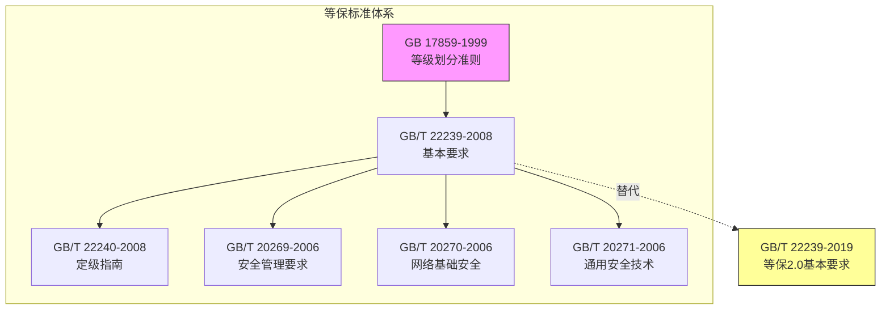

# GB/T 22239—2008 信息系统安全等级保护基本要求

> [!info] 基础信息
> - **编号**：GB/T 22239—2008
> - **类别**：推荐性国家标准
> - **发布机构**：中华人民共和国国家质量监督检验检疫总局 / 中国国家标准化管理委员会
> - **版本**：2008版
> - **生效日期**：2008-11-01
> - **ICS分类**：ICS35.040 L80
> - **状态**：已被 [[GB-T-22239-2019-信息安全技术-网络安全等级保护基本要求]] 替代

## 标准摘要

> [!abstract]
> 本标准规定了不同安全保护等级信息系统的**基本保护要求**，包括基本技术要求和基本管理要求两大类，适用于指导分等级的信息系统的安全建设和监督管理。

## 概述

### 信息系统安全保护等级

信息系统根据其在国家安全、经济建设、社会生活中的重要程度，遭到破坏后对国家安全、社会秩序、公共利益以及公民、法人和其他组织的合法权益的危害程度等，由低到高划分为**五级**：

| 等级 | 名称 | 适用系统 |
|:----:|------|----------|
| 第一级 | 自主保护级 | 一般系统 |
| 第二级 | 指导保护级 | 重要系统 |
| 第三级 | 监督保护级 | 关键基础设施 |
| 第四级 | 强制保护级 | 极端重要系统 |
| 第五级 | 专控保护级 | 国家级系统 |

### 不同等级的安全保护能力

| 等级 | 安全保护能力 |
|:----:|------------|
| 第一级 | 防护系统免受个人/小型组织恶意攻击，一般自然灾害损害，可恢复部分功能 |
| 第二级 | 防护系统免受外部小型组织攻击，发现重要安全漏洞，可在一段时间内恢复部分功能 |
| 第三级 | 防护系统免受有组织团体攻击，发现安全漏洞，可较快恢复绝大部分功能 |
| 第四级 | 防护系统免受国家级/敌对组织攻击，发现安全漏洞，可迅速恢复所有功能 |
| 第五级 | （略） |

### 安全要求分类

#### 技术类安全要求（三大类）

| 分类 | 标记 | 说明 |
|:----:|:----:|------|
| 信息安全类 | S | 保护数据在存储、传输、处理过程中不被泄漏、破坏和免受未授权修改 |
| 服务保证类 | A | 保护系统连续正常运行，免受未授权修改、破坏而导致系统不可用 |
| 通用安全保护类 | G | 通用安全保护类要求 |

#### 管理类安全要求（五大类）

1. **安全管理制度**
2. **安全管理机构**
3. **人员安全管理**
4. **系统建设管理**
5. **系统运维管理**

## 技术要求框架

### 五个技术层面

```
┌─────────────────────────────────────────────────────────────┐
│                    信息系统安全保护                          │
├─────────────────────────────────────────────────────────────┤
│  物理安全 → 网络安全 → 主机安全 → 应用安全 → 数据安全及备份恢复  │
│    ↓          ↓         ↓         ↓            ↓           │
│  机房环境    网络边界   操作系统   业务应用    重要数据     │
└─────────────────────────────────────────────────────────────┘
```

### 各等级技术要求对照

| 技术层面 | 第一级(G1/S1/A1) | 第二级(G2/S2/A2) | 第三级(G3/S3/A3) | 第四级(G4/S4/A4) |
|---------|:---:|:---:|:---:|:---:|
| 物理安全 | 基础访问控制 | 防盗报警+监控 | 分区管理+电磁屏蔽 | 双层门禁+多级访问控制 |
| 网络安全 | 基础访问控制 | 安全审计+入侵检测 | 恶意代码防范+边界完整检查 | 敏感标记+集中审计 |
| 主机安全 | 身份鉴别+最小安装 | 安全审计+资源控制 | 安全标记+剩余信息保护 | 可信路径+双因子鉴别 |
| 应用安全 | 身份鉴别+访问控制 | 通信保密性+抗抵赖 | 敏感标记+资源控制 | 可信路径+硬件加密 |
| 数据安全 | 完整性检测 | 保密性存储 | 传输加密+异地备份 | 灾难备份中心+实时备份 |

## 管理要求框架

### 五个管理领域

```
┌─────────────────────────────────────────────────────────────┐
│                    信息安全管理体系                          │
├─────────────────────────────────────────────────────────────┤
│                                                              │
│  安全管理制度 ←→ 安全管理机构 ←→ 人员安全管理              │
│        ↓                    ↓              ↓                │
│        └────────────────────┴──────────────┘                │
│                           ↓                                  │
│                   系统建设管理 ←→ 系统运维管理               │
│                                                              │
└─────────────────────────────────────────────────────────────┘
```

### 各等级管理要求对照

| 管理领域 | 第二级 | 第三级 | 第四级 |
|---------|:---:|:---:|:---:|
| 安全管理制度 | 总体方针+操作规程 | 制度体系+评审修订 | 密级管理+专人维护 |
| 安全管理机构 | 岗位设置+审核检查 | 领导小组+外部合作 | 委员会+安全顾问 |
| 人员安全管理 | 录用/离岗规范 | 考核+安全协议 | 全面审查+双人管理 |
| 系统建设管理 | 定级+方案设计 | 等级测评+系统备案 | 第三方监理+专项测评 |
| 系统运维管理 | 日常监控+应急响应 | 安全管理中心+变更管理 | 集中管理+资源预测 |

## 核心术语

| 术语 | 英文 | 定义 |
|------|------|------|
| 安全保护能力 | security protection ability | 系统能够抵御威胁、发现安全事件以及在系统遭到损害后能够恢复先前状态等的程度 |

## 与其他标准的关系



## 附录A：信息系统整体安全保护能力要求

### 五大总体性要求

1. **构建纵深的防御体系**
   - 从通信网络、局域网络边界、局域网络内部、业务应用平台等各个层次落实安全措施

2. **采取互补的安全措施**
   - 关注各个安全控制组件在层面内、层面间和功能间产生的相互关联关系

3. **保证一致的安全强度**
   - 防止某个层面安全功能的减弱导致系统整体安全保护能力消弱

4. **建立统一的支撑平台**
   - 基于密码技术的统一支撑平台，支持高强度身份鉴别、访问控制等

5. **进行集中的安全管理**
   - 建立安全管理中心，集中管理信息系统中的各个安全控制组件

## 附录B：基本安全要求的选择和使用

### 定级结果组合表

| 安全保护等级 | 信息系统定级结果的组合 |
|:---:|---|
| 第一级 | S1A1G1 |
| 第二级 | S1A2G2，S2A2G2，S2A1G2 |
| 第三级 | S1A3G3，S2A3G3，S3A3G3，S3A2G3，S3A1G3 |
| 第四级 | S1A4G4，S2A4G4，S3A4G4，S4A4G4，S4A3G4，S4A2G4，S4A1G4 |
| 第五级 | S1A5G5，S2A5G5，S3A5G5，S4A5G5，S5A4G5，S5A3G5，S5A2G5，S5A1G5 |

### 选择流程

```
定级 → 明确安全保护能力 → 选择基本安全要求
                                    ↓
                            根据定级结果调整
                                    ↓
                    ┌───────────────┴───────────────┐
                    ↓                               ↓
            按业务信息安全性等级              按系统服务保证性等级
              选择S类基本安全要求              选择A类基本安全要求
```

## 参考文献

| 编号 | 标准号 | 名称 |
|:---:|-------|------|
| 1 | GB/T 20269-2006 | 信息安全技术 信息系统安全管理要求 |
| 2 | GB/T 20270-2006 | 信息安全技术 网络基础安全技术要求 |
| 3 | GB/T 20271-2006 | 信息安全技术 信息系统通用安全技术要求 |
| 4 | GB/T 20272-2006 | 信息安全技术 操作系统安全技术要求 |
| 5 | GB/T 20273-2006 | 信息安全技术 数据库管理系统安全技术要求 |
| 6 | GB/T 20282-2006 | 信息安全技术 信息系统安全工程管理要求 |
| 7 | GB/T 18336-2000 | 信息技术 信息技术安全性评估准则 |
| 8 | GB/T 19716-2005 | 信息技术 信息安全管理实用规则 |
| 9 | NIST SP 800-53 | 联邦信息系统推荐性安全控制措施 |
| 10 | DoD 8500.1/2 | 信息保障与信息保障实施 |

---

> [!note] 元数据
> - **创建时间**：2026-04-13
> - **关联 DM2 数据组**：Guidance
> - **关联知识库**：
>   - [[DM2-REFERENCE]] - DM2 元模型总览
>   - [[安全术语词典]] - 安全术语词典（关联术语定义）
