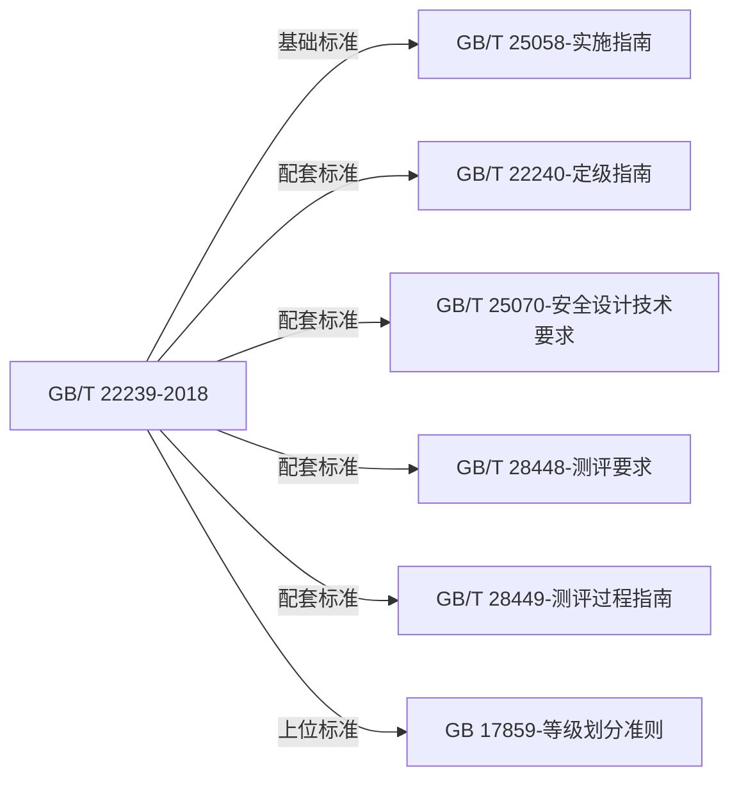

# GB/T 22239-2018 网络安全等级保护基本要求

> [!info] 基础信息
> - **编号**：GB/T 22239-2018
> - **类别**：网络安全等级保护标准
> - **发布机构**：国家市场监督管理总局 国家标准化管理委员会
> - **版本**：2018
> - **生效日期**：2019-12-01
> - **代替**：GB/T 22239-2008

## 标准摘要

> [!abstract] 一句话描述
> 本标准规定了网络安全等级保护的第一级到第四级等级保护对象的安全通用要求和安全扩展要求，是等保2.0时代的核心基础标准。

## 适用范围

- **行业范围**：全行业（通用标准）
- **主体范围**：基础信息网络、云计算平台/系统、大数据应用/平台/资源、物联网、工业控制系统、采用移动互联技术的系统
- **业务范围**：网络安全等级保护工作的安全建设和监督管理

## 与其他标准的关系

## 核心概念

### 等级保护对象
由计算机或者其他信息终端及相关设备组成的，按照一定的规则和程序对信息进行收集、存储、传输、交换、处理的系统。主要包括：
- 基础信息网络
- 云计算平台/系统
- 大数据应用/平台/资源
- 物联网
- 工业控制系统
- 采用移动互联技术的系统

### 五个安全保护等级

| 等级 | 名称 | 适用对象 | 保护能力 |
|------|------|----------|----------|
| 第一级 | 自主保护级 | 一般信息系统 | 防护免受个人、少量资源威胁源的恶意攻击、一般自然灾害 |
| 第二级 | 指导保护级 | 重要信息系统 | 防护免受外部小型组织、少量资源威胁源的恶意攻击 |
| 第三级 | 监督保护级 | 关键信息系统 | 防护免受外部有组织团体、较丰富资源威胁源的恶意攻击 |
| 第四级 | 强制保护级 | 核心信息系统 | 防护免受国家级别的、敌对组织的、丰富资源威胁源的恶意攻击 |
| 第五级 | 专控保护级 | 极端重要系统 | （略，不在本标准范围内） |

### 安全要求分类

安全要求分为**安全通用要求**和**安全扩展要求**：
- **安全通用要求**：针对共性化保护需求，无论等级保护对象以何种形式出现，必须根据安全保护等级实现相应级别的安全通用要求
- **安全扩展要求**：针对个性化保护需求，根据安全保护等级和使用的特定技术或特定的应用场景选择性实现

## 主要变化（相比GB/T 22239-2008）

1. 标准名称由"信息系统安全等级保护基本要求"变更为"网络安全等级保护基本要求"
2. 调整分类为：安全物理环境、安全通信网络、安全区域边界、安全计算环境、安全管理中心、安全管理制度、安全管理机构、安全管理人员、安全建设管理、安全运维管理
3. 调整各个级别的安全要求为安全通用要求、云计算安全扩展要求、移动互联安全扩展要求、物联网安全扩展要求和工业控制系统安全扩展要求
4. 取消了原来安全控制点的S、A、G标注

## 规范性引用文件

- GB 17859 计算机信息系统安全保护等级划分准则
- GB/T 22240 信息安全技术 信息系统安全等级保护定级指南
- GB/T 25069 信息安全技术 术语
- GB/T 31167-2014 信息安全技术 云计算服务安全指南
- GB/T 31168-2014 信息安全技术 云计算服务安全能力要求
- GB/T 32919-2016 信息安全技术 工业控制系统安全控制应用指南

## 术语和定义

| 术语 | 定义 |
|------|------|
| 网络安全 cybersecurity | 通过采取必要措施，防范对网络的攻击、侵入、干扰、破坏和非法使用以及意外事故，使网络处于稳定可靠运行的状态，以及保障网络数据的完整性、保密性、可用性的能力 |
| 安全保护能力 security protection ability | 能够抵御威胁、发现安全事件以及在遭到损害后能够恢复先前状态等的程度 |
| 云计算 cloud computing | 通过网络访问可扩展的、灵活的物理或虚拟共享资源池，并按需自助获取和管理资源的模式 |
| 云服务商 cloud service provider | 云计算服务的供应方 |
| 云服务客户 cloud service customer | 为使用云计算服务同云服务商建立业务关系的参与方 |
| 云计算平台/系统 cloud computing platform/system | 云服务商提供的云计算基础设施及其上的服务软件的集合 |
| 物联网 internet of things | 将感知节点设备通过互联网等网络连接起来构成的系统 |
| 工业控制系统 industrial control system | 包括SCADA、DCS、PLC等工业生产中使用的控制系统 |

## 缩略语

| 缩略语 | 全称 |
|--------|------|
| ICS | 工业控制系统 Industrial Control System |
| DCS | 集散控制系统 Distributed Control System |
| SCADA | 数据采集与监视控制系统 Supervisory Control And Data Acquisition system |
| PLC | 可编程逻辑控制器 Programmable Logic Controller |
| IaaS | 基础设施即服务 Infrastructure-as-a-Service |
| PaaS | 平台即服务 Platform-as-a-Service |
| SaaS | 软件即服务 Software-as-a-Service |
| IoT | 物联网 internet of things |
| TCB | 可信计算基 Trusted Computing Base |

---

# 10 各等级安全要求条款表

## 10.1 第一级安全要求

### 10.1.1 安全通用要求

#### 10.1.1.1 安全物理环境

| 章节 | 控制点 | 原文条款 |
|------|--------|----------|
| 6.1.1.1 | 物理访问控制 | 机房出入口应安排专人值守或配置电子门禁系统，控制、鉴别和记录进入的人员 |
| 6.1.1.2 | 防盗窃和防破坏 | 应将设备或主要部件进行固定，并设置明显的不易除去的标识 |
| 6.1.1.3 | 防雷击 | 应将各类机柜、设施和设备等通过接地系统安全接地 |
| 6.1.1.4 | 防火 | 机房应设置灭火设备 |
| 6.1.1.5 | 防水和防潮 | 应采取措施防止雨水通过机房窗户、屋顶和墙壁渗透 |
| 6.1.1.6 | 温湿度控制 | 应设置必要的温湿度调节设施，使机房温湿度的变化在设备运行所允许的范围之内 |
| 6.1.1.7 | 电力供应 | 应在机房供电线路上配置稳压器和过电压防护设备 |

#### 10.1.1.2 安全通信网络

| 章节 | 控制点 | 原文条款 |
|------|--------|----------|
| 6.1.2.1 | 通信传输 | 应采用校验技术保证通信过程中数据的完整性 |
| 6.1.2.2 | 可信验证 | 可基于可信根对通信设备的系统引导程序、系统程序等进行可信验证，并在检测到其可信性受到破坏后进行报警 |

#### 10.1.1.3 安全区域边界

| 章节 | 控制点 | 原文条款 |
|------|--------|----------|
| 6.1.3.1 | 边界防护 | 应保证跨越边界的访问和数据流通过边界设备提供的受控接口进行通信 |
| 6.1.3.2 | 访问控制 | 应在网络边界根据访问控制策略设置访问控制规则，默认情况下除允许通信外受控接口拒绝所有通信；应删除多余或无效的访问控制规则，优化访问控制列表，并保证访问控制规则数量最小化；应对源地址、目的地址、源端口、目的端口和协议等进行检查，以允许/拒绝数据包进出 |
| 6.1.3.3 | 可信验证 | 可基于可信根对边界设备的系统引导程序、系统程序等进行可信验证，并在检测到其可信性受到破坏后进行报警 |

#### 10.1.1.4 安全计算环境

| 章节 | 控制点 | 原文条款 |
|------|--------|----------|
| 6.1.4.1 | 身份鉴别 | 应对登录的用户进行身份标识和鉴别，身份标识具有唯一性，身份鉴别信息具有复杂度要求并定期更换；应具有登录失败处理功能，应配置并启用结束会话、限制非法登录次数和当登录连接超时自动退出等相关措施 |
| 6.1.4.2 | 访问控制 | 应对登录的用户分配账户和权限；应重命名或删除默认账户，修改默认账户的默认口令；应及时删除或停用多余的、过期的账户，避免共享账户的存在 |
| 6.1.4.3 | 入侵防范 | 应遵循最小安装的原则，仅安装需要的组件和应用程序；应关闭不需要的系统服务、默认共享和高危端口 |
| 6.1.4.4 | 恶意代码防范 | 应安装防恶意代码软件或配置具有相应功能的软件，并定期进行升级和更新防恶意代码库 |
| 6.1.4.5 | 可信验证 | 可基于可信根对计算设备的系统引导程序、系统程序等进行可信验证，并在检测到其可信性受到破坏后进行报警 |
| 6.1.4.6 | 数据完整性 | 应采用校验技术保证重要数据在传输过程中的完整性 |
| 6.1.4.7 | 数据备份恢复 | 应提供重要数据的本地数据备份与恢复功能 |

#### 10.1.1.5 安全管理制度

| 章节 | 控制点 | 原文条款 |
|------|--------|----------|
| 6.1.5.1 | 管理制度 | 应建立日常管理活动中常用的安全管理制度 |

#### 10.1.1.6 安全管理机构

| 章节 | 控制点 | 原文条款 |
|------|--------|----------|
| 6.1.6.1 | 岗位设置 | 应设立系统管理员等岗位，并定义各个工作岗位的职责 |
| 6.1.6.2 | 人员配备 | 应配备一定数量的系统管理员 |
| 6.1.6.3 | 授权和审批 | 应根据各个部门和岗位的职责明确授权审批事项、审批部门和批准人等 |

#### 10.1.1.7 安全管理人员

| 章节 | 控制点 | 原文条款 |
|------|--------|----------|
| 6.1.7.1 | 人员录用 | 应指定或授权专门的部门或人员负责人员录用 |
| 6.1.7.2 | 人员离岗 | 应及时终止离岗人员的所有访问权限，取回各种身份证件、钥匙、徽章等以及机构提供的软硬件设备 |
| 6.1.7.3 | 安全意识教育和培训 | 应对各类人员进行安全意识教育和岗位技能培训，并告知相关的安全责任和惩戒措施 |
| 6.1.7.4 | 外部人员访问管理 | 应保证在外部人员访问受控区域前得到授权或审批 |

#### 10.1.1.8 安全建设管理

| 章节 | 控制点 | 原文条款 |
|------|--------|----------|
| 6.1.8.1 | 定级和备案 | 应以书面的形式说明保护对象的安全保护等级及确定等级的方法和理由 |
| 6.1.8.2 | 安全方案设计 | 应根据安全保护等级选择基本安全措施，依据风险分析的结果补充和调整安全措施 |
| 6.1.8.3 | 产品采购和使用 | 应确保网络安全产品采购和使用符合国家的有关规定 |
| 6.1.8.4 | 工程实施 | 应指定或授权专门的部门或人员负责工程实施过程的管理 |
| 6.1.8.5 | 测试验收 | 应进行安全性测试验收 |
| 6.1.8.6 | 系统交付 | 应制定交付清单，并根据交付清单对所交接的设备、软件和文档等进行清点；应对负责运行维护的技术人员进行相应的技能培训 |
| 6.1.8.7 | 服务供应商选择 | 应确保服务供应商的选择符合国家的有关规定；应与选定的服务供应商签订与安全相关的协议，明确约定相关责任 |

#### 10.1.1.9 安全运维管理

| 章节 | 控制点 | 原文条款 |
|------|--------|----------|
| 6.1.9.1 | 环境管理 | 应指定专门的部门或人员负责机房安全，对机房出入进行管理，定期对机房供配电、空调、温湿度控制、消防等设施进行维护管理；应对机房的安全管理做出规定，包括物理访问、物品进出和环境安全等方面 |
| 6.1.9.2 | 介质管理 | 应将介质存放在安全的环境中，对各类介质进行控制和保护，实行存储环境专人管理，并根据存档介质的目录清单定期盘点 |
| 6.1.9.3 | 设备维护管理 | 应对各种设备（包括备份和冗余设备）、线路等指定专门的部门或人员定期进行维护管理 |
| 6.1.9.4 | 漏洞和风险管理 | 应采取必要的措施识别安全漏洞和隐患，对发现的安全漏洞和隐患及时进行修补或评估可能的影响后进行修补 |
| 6.1.9.5 | 网络和系统安全管理 | 应划分不同的管理员角色进行网络和系统的运维管理，明确各个角色的责任和权限；应指定专门的部门或人员进行账户管理，对申请账户、建立账户、删除账户等进行控制 |
| 6.1.9.6 | 恶意代码防范管理 | 应提高所有用户的防恶意代码意识，对外来计算机或存储设备接入系统前进行恶意代码检查等；应对恶意代码防范要求做出规定，包括防恶意代码软件的授权使用、恶意代码库升级、恶意代码的定期查杀等 |
| 6.1.9.7 | 备份与恢复管理 | 应识别需要定期备份的重要业务信息、系统数据及软件系统等；应规定备份信息的备份方式、备份频度、存储介质、保存期等 |
| 6.1.9.8 | 安全事件处置 | 应及时向安全管理部门报告所发现的安全弱点和可疑事件；应明确安全事件的报告和处置流程，规定安全事件的现场处理、事件报告和后期恢复的管理职责 |

### 10.1.2 云计算安全扩展要求

| 章节 | 控制点 | 原文条款 |
|------|--------|----------|
| 6.2.1.1 | 基础设施位置 | 应保证云计算基础设施位于中国境内 |
| 6.2.2.1 | 网络架构 | 应保证云计算平台不承载高于其安全保护等级的业务应用系统；应实现不同云服务客户虚拟网络之间的隔离 |
| 6.2.3.1 | 访问控制 | 应在虚拟化网络边界部署访问控制机制，并设置访问控制规则 |
| 6.2.4.1 | 访问控制 | 应保证当虚拟机迁移时，访问控制策略随其迁移；应允许云服务客户设置不同虚拟机之间的访问控制策略 |
| 6.2.4.2 | 数据完整性和保密性 | 应确保云服务客户数据、用户个人信息等存储于中国境内，如需出境应遵循国家相关规定 |
| 6.2.5.1 | 云服务商选择 | 应选择安全合规的云服务商，其所提供的云计算平台应为其所承载的业务应用系统提供相应等级的安全保护能力；应在服务水平协议中规定云服务的各项服务内容和具体技术指标；应在服务水平协议中规定云服务商的权限与责任，包括管理范围、职责划分、访问授权、隐私保护、行为准则、违约责任等 |
| 6.2.5.2 | 供应链管理 | 应确保供应商的选择符合国家有关规定 |

### 10.1.3 移动互联安全扩展要求

| 章节 | 控制点 | 原文条款 |
|------|--------|----------|
| 6.3.1.1 | 无线接入点的物理位置 | 应为无线接入设备的安装选择合理位置，避免过度覆盖和电磁干扰 |
| 6.3.2.1 | 边界防护 | 应保证有线网络与无线网络边界之间的访问和数据流通过无线接入安全网关设备 |
| 6.3.2.2 | 访问控制 | 无线接入设备应开启接入认证功能，并且禁止使用WEP方式进行认证，如使用口令，长度不小于8位字符 |
| 6.3.3.1 | 移动应用管控 | 应具有选择应用软件安装、运行的功能 |
| 6.3.4.1 | 移动应用软件采购 | 应保证移动终端安装、运行的应用软件来自可靠分发渠道或使用可靠证书签名 |

### 10.1.4 物联网安全扩展要求

| 章节 | 控制点 | 原文条款 |
|------|--------|----------|
| 6.4.1.1 | 感知节点设备物理防护 | 感知节点设备所处的物理环境应不对感知节点设备造成物理破坏，如挤压、强振动；感知节点设备在工作状态所处物理环境应能正确反映环境状态（如温湿度传感器不能安装在阳光直射区域） |
| 6.4.2.1 | 接入控制 | 应保证只有授权的感知节点可以接入 |
| 6.4.3.1 | 感知节点管理 | 应指定人员定期巡视感知节点设备、网关节点设备的部署环境，对可能影响感知节点设备、网关节点设备正常工作的环境异常进行记录和维护 |

### 10.1.5 工业控制系统安全扩展要求

| 章节 | 控制点 | 原文条款 |
|------|--------|----------|
| 6.5.1.1 | 室外控制设备物理防护 | 室外控制设备应放置于采用铁板或其他防火材料制作的箱体或装置中并紧固；箱体或装置具有透风、散热、防盗、防雨和防火能力等；室外控制设备放置应远离强电磁干扰、强热源等环境，如无法避免应及时做好应急处置及检修，保证设备正常运行 |
| 6.5.2.1 | 网络架构 | 工业控制系统与企业其他系统之间应划分为两个区域，区域间应采用技术隔离手段；工业控制系统内部应根据业务特点划分为不同的安全域，安全域之间应采用技术隔离手段 |
| 6.5.3.1 | 访问控制 | 应在工业控制系统与企业其他系统之间部署访问控制设备，配置访问控制策略，禁止任何穿越区域边界的E-Mail、Web、Telnet、Rlogin、FTP等通用网络服务 |
| 6.5.3.2 | 无线使用控制 | 应对所有参与无线通信的用户（人员、软件进程或者设备）提供唯一性标识和鉴别；应对无线连接的授权、监视以及执行使用进行限制 |
| 6.5.4.1 | 控制设备安全 | 控制设备自身应实现相应级别安全通用要求提出的身份鉴别、访问控制和安全审计等安全要求，如受条件限制控制设备无法实现上述要求，应由其上位控制或管理设备实现同等功能或通过管理手段控制；应在经过充分测试评估后，在不影响系统安全稳定运行的情况下对控制设备进行补丁更新、固件更新等工作 |

---

## 10.2 第二级安全要求

### 10.2.1 安全通用要求

#### 10.2.1.1 安全物理环境

| 章节 | 控制点 | 原文条款 |
|------|--------|----------|
| 7.1.1.1 | 物理位置选择 | 机房场地应选择在具有防震、防风和防雨等能力的建筑内；机房场地应避免设在建筑物的顶层或地下室，否则应加强防水和防潮措施 |
| 7.1.1.2 | 物理访问控制 | 机房出入口应安排专人值守或配置电子门禁系统，控制、鉴别和记录进入的人员 |
| 7.1.1.3 | 防盗窃和防破坏 | 应将设备或主要部件进行固定，并设置明显的不易除去的标识；应将通信线缆铺设在隐蔽安全处 |
| 7.1.1.4 | 防雷击 | 应将各类机柜、设施和设备等通过接地系统安全接地 |
| 7.1.1.5 | 防火 | 机房应设置火灾自动消防系统，能够自动检测火情、自动报警，并自动灭火；机房及相关的工作房间和辅助房应采用具有耐火等级的建筑材料 |
| 7.1.1.6 | 防水和防潮 | 应采取措施防止雨水通过机房窗户、屋顶和墙壁渗透；应采取措施防止机房内水蒸气结露和地下积水的转移与渗透 |
| 7.1.1.7 | 防静电 | 应采用防静电地板或地面并采用必要的接地防静电措施 |
| 7.1.1.8 | 温湿度控制 | 应设置温湿度自动调节设施，使机房温湿度的变化在设备运行所允许的范围之内 |
| 7.1.1.9 | 电力供应 | 应在机房供电线路上配置稳压器和过电压防护设备；应提供短期的备用电力供应，至少满足设备在断电情况下的正常运行要求 |
| 7.1.1.10 | 电磁防护 | 电源线和通信线缆应隔离铺设，避免互相干扰 |

#### 10.2.1.2 安全通信网络

| 章节 | 控制点 | 原文条款 |
|------|--------|----------|
| 7.1.2.1 | 网络架构 | 应划分不同的网络区域，并按照方便管理和控制的原则为各网络区域分配地址；应避免将重要网络区域部署在边界处，重要网络区域与其他网络区域之间应采取可靠的技术隔离手段 |
| 7.1.2.2 | 通信传输 | 应采用校验技术保证通信过程中数据的完整性 |
| 7.1.2.3 | 可信验证 | 可基于可信根对通信设备的系统引导程序、系统程序、重要配置参数和通信应用程序等进行可信验证，并在检测到其可信性受到破坏后进行报警，并将验证结果形成审计记录送至安全管理中心 |

#### 10.2.1.3 安全区域边界

| 章节 | 控制点 | 原文条款 |
|------|--------|----------|
| 7.1.3.1 | 边界防护 | 应保证跨越边界的访问和数据流通过边界设备提供的受控接口进行通信 |
| 7.1.3.2 | 访问控制 | 应在网络边界或区域之间根据访问控制策略设置访问控制规则，默认情况下除允许通信外受控接口拒绝所有通信；应删除多余或无效的访问控制规则，优化访问控制列表，并保证访问控制规则数量最小化；应对源地址、目的地址、源端口、目的端口和协议等进行检查，以允许/拒绝数据包进出；应能根据会话状态信息为进出数据流提供明确的允许/拒绝访问的能力 |
| 7.1.3.3 | 入侵防范 | 应在关键网络节点处监视网络攻击行为 |
| 7.1.3.4 | 恶意代码防范 | 应在关键网络节点处对恶意代码进行检测和清除，并维护恶意代码防护机制的升级和更新 |
| 7.1.3.5 | 安全审计 | 应在网络边界、重要网络节点进行安全审计，审计覆盖到每个用户，对重要的用户行为和重要安全事件进行审计；审计记录应包括事件的日期和时间、用户、事件类型、事件是否成功及其他与审计相关的信息；应对审计记录进行保护，定期备份，避免受到未预期的删除、修改或覆盖等 |
| 7.1.3.6 | 可信验证 | 可基于可信根对边界设备的系统引导程序、系统程序、重要配置参数和边界防护应用程序等进行可信验证，并在检测到其可信性受到破坏后进行报警，并将验证结果形成审计记录送至安全管理中心 |

#### 10.2.1.4 安全计算环境

| 章节 | 控制点 | 原文条款 |
|------|--------|----------|
| 7.1.4.1 | 身份鉴别 | 应对登录的用户进行身份标识和鉴别，身份标识具有唯一性，身份鉴别信息具有复杂度要求并定期更换；应具有登录失败处理功能，应配置并启用结束会话、限制非法登录次数和当登录连接超时自动退出等相关措施；当进行远程管理时，应采取必要措施防止鉴别信息在网络传输过程中被窃听 |
| 7.1.4.2 | 访问控制 | 应对登录的用户分配账户和权限；应重命名或删除默认账户，修改默认账户的默认口令；应及时删除或停用多余的、过期的账户，避免共享账户的存在；应授予管理用户所需的最小权限，实现管理用户的权限分离 |
| 7.1.4.3 | 安全审计 | 应启用安全审计功能，审计覆盖到每个用户，对重要的用户行为和重要安全事件进行审计；审计记录应包括事件的日期和时间、用户、事件类型、事件是否成功及其他与审计相关的信息；应对审计记录进行保护，定期备份，避免受到未预期的删除、修改或覆盖等 |
| 7.1.4.4 | 入侵防范 | 应遵循最小安装的原则，仅安装需要的组件和应用程序；应关闭不需要的系统服务、默认共享和高危端口；应通过设定终端接入方式或网络地址范围对通过网络进行管理的管理终端进行限制；应提供数据有效性检验功能，保证通过人机接口输入或通过通信接口输入的内容符合系统设定要求；应能发现可能存在的已知漏洞，并在经过充分测试评估后，及时修补漏洞 |
| 7.1.4.5 | 恶意代码防范 | 应安装防恶意代码软件或配置具有相应功能的软件，并定期进行升级和更新防恶意代码库 |
| 7.1.4.6 | 可信验证 | 可基于可信根对计算设备的系统引导程序、系统程序、重要配置参数和应用程序等进行可信验证，并在检测到其可信性受到破坏后进行报警，并将验证结果形成审计记录送至安全管理中心 |
| 7.1.4.7 | 数据完整性 | 应采用校验技术保证重要数据在传输过程中的完整性 |
| 7.1.4.8 | 数据备份恢复 | 应提供重要数据的本地数据备份与恢复功能；应提供异地数据备份功能，利用通信网络将重要数据定时批量传送至备用场地 |
| 7.1.4.9 | 剩余信息保护 | 应保证鉴别信息所在的存储空间被释放或重新分配前得到完全清除 |
| 7.1.4.10 | 个人信息保护 | 应仅采集和保存业务必需的用户个人信息；应禁止未授权访问和非法使用用户个人信息 |

#### 10.2.1.5 安全管理中心

| 章节 | 控制点 | 原文条款 |
|------|--------|----------|
| 7.1.5.1 | 系统管理 | 应对系统管理员进行身份鉴别，只允许其通过特定的命令或操作界面进行系统管理操作，并对这些操作进行审计；应通过系统管理员对系统的资源和运行进行配置、控制和管理，包括用户身份、系统资源配置、系统加载和启动、系统运行的异常处理、数据和设备的备份与恢复等 |
| 7.1.5.2 | 审计管理 | 应对审计管理员进行身份鉴别，只允许其通过特定的命令或操作界面进行安全审计操作，并对这些操作进行审计；应通过审计管理员对审计记录进行分析，并根据分析结果进行处理，包括根据安全审计策略对审计记录进行存储、管理和查询等 |

#### 10.2.1.6 安全管理制度

| 章节 | 控制点 | 原文条款 |
|------|--------|----------|
| 7.1.6.1 | 安全策略 | 应制定网络安全工作的总体方针和安全策略，阐明机构安全工作的总体目标、范围、原则和安全框架等 |
| 7.1.6.2 | 管理制度 | 应对安全管理活动中的主要管理内容建立安全管理制度；应对管理人员或操作人员执行的日常管理操作建立操作规程 |
| 7.1.6.3 | 制定和发布 | 应指定或授权专门的部门或人员负责安全管理制度的制定；安全管理制度应通过正式、有效的方式发布，并进行版本控制 |
| 7.1.6.4 | 评审和修订 | 应定期对安全管理制度的合理性和适用性进行论证和审定，对存在不足或需要改进的安全管理制度进行修订 |

#### 10.2.1.7 安全管理机构

| 章节 | 控制点 | 原文条款 |
|------|--------|----------|
| 7.1.7.1 | 岗位设置 | 应设立网络安全管理工作的职能部门，设立安全主管、安全管理各个方面的负责人岗位，并定义各负责人的职责；应设立系统管理员、审计管理员和安全管理员等岗位，并定义部门及各个工作岗位的职责 |
| 7.1.7.2 | 人员配备 | 应配备一定数量的系统管理员、审计管理员和安全管理员等 |
| 7.1.7.3 | 授权和审批 | 应根据各个部门和岗位的职责明确授权审批事项、审批部门和批准人等；应针对系统变更、重要操作、物理访问和系统接入等事项执行审批过程 |
| 7.1.7.4 | 沟通和合作 | 应加强各类管理人员、组织内部机构和网络安全管理部门之间的合作与沟通，定期召开协调会议，共同协作处理网络安全问题；应加强与网络安全职能部门、各类供应商、业界专家及安全组织的合作与沟通；应建立外联单位联系列表，包括外联单位名称、合作内容、联系人和联系方式等信息 |
| 7.1.7.5 | 审核和检查 | 应定期进行常规安全检查，检查内容包括系统日常运行、系统漏洞和数据备份等情况 |

#### 10.2.1.8 安全管理人员

| 章节 | 控制点 | 原文条款 |
|------|--------|----------|
| 7.1.8.1 | 人员录用 | 应指定或授权专门的部门或人员负责人员录用；应对被录用人员的身份、安全背景、专业资格或资质等进行审查 |
| 7.1.8.2 | 人员离岗 | 应及时终止离岗人员的所有访问权限，取回各种身份证件、钥匙、徽章等以及机构提供的软硬件设备 |
| 7.1.8.3 | 安全意识教育和培训 | 应对各类人员进行安全意识教育和岗位技能培训，并告知相关的安全责任和惩戒措施 |
| 7.1.8.4 | 外部人员访问管理 | 应在外部人员物理访问受控区域前先提出书面申请，批准后由专人全程陪同，并登记备案；应在外部人员接入受控网络访问系统前先提出书面申请，批准后由专人开设账户、分配权限，并登记备案；外部人员离场后应及时清除其所有的访问权限 |

#### 10.2.1.9 安全建设管理

| 章节 | 控制点 | 原文条款 |
|------|--------|----------|
| 7.1.9.1 | 定级和备案 | 应以书面的形式说明保护对象的安全保护等级及确定等级的方法和理由；应组织相关部门和有关安全技术专家对定级结果的合理性和正确性进行论证和审定；应保证定级结果经过相关部门的批准；应将备案材料报主管部门和相应公安机关备案 |
| 7.1.9.2 | 安全方案设计 | 应根据安全保护等级选择基本安全措施，依据风险分析的结果补充和调整安全措施；应根据保护对象的安全保护等级进行安全方案设计；应组织相关部门和有关安全专家对安全方案的合理性和正确性进行论证和审定，经过批准后才能正式实施 |
| 7.1.9.3 | 产品采购和使用 | 应确保网络安全产品采购和使用符合国家的有关规定；应确保密码产品与服务的采购和使用符合国家密码管理主管部门的要求 |
| 7.1.9.4 | 自行软件开发 | 应将开发环境与实际运行环境物理分开，测试数据和测试结果受到控制；应在软件开发过程中对安全性进行测试，在软件安装前对可能存在的恶意代码进行检测 |
| 7.1.9.5 | 外包软件开发 | 应在软件交付前检测其中可能存在的恶意代码；应保证开发单位提供软件设计文档和使用指南 |
| 7.1.9.6 | 工程实施 | 应指定或授权专门的部门或人员负责工程实施过程的管理；应制定安全工程实施方案控制工程实施过程 |
| 7.1.9.7 | 测试验收 | 应制订测试验收方案，并依据测试验收方案实施测试验收，形成测试验收报告；应进行上线前的安全性测试，并出具安全测试报告 |
| 7.1.9.8 | 系统交付 | 应制定交付清单，并根据交付清单对所交接的设备、软件和文档等进行清点；应对负责运行维护的技术人员进行相应的技能培训；应提供建设过程文档和运行维护文档 |
| 7.1.9.9 | 等级测评 | 应定期进行等级测评，发现不符合相应等级保护标准要求的及时整改；应在发生重大变更或级别发生变化时进行等级测评；应确保测评机构的选择符合国家有关规定 |
| 7.1.9.10 | 服务供应商选择 | 应确保服务供应商的选择符合国家的有关规定；应与选定的服务供应商签订相关协议，明确整个服务供应链各方需履行的网络安全相关义务 |

#### 10.2.1.10 安全运维管理

| 章节 | 控制点 | 原文条款 |
|------|--------|----------|
| 7.1.10.1 | 环境管理 | 应指定专门的部门或人员负责机房安全，对机房出入进行管理，定期对机房供配电、空调、温湿度控制、消防等设施进行维护管理；应对机房的安全管理做出规定，包括物理访问、物品进出和环境安全等；应不在重要区域接待来访人员，不随意放置含有敏感信息的纸档文件和移动介质等 |
| 7.1.10.2 | 资产管理 | 应编制并保存与保护对象相关的资产清单，包括资产责任部门、重要程度和所处位置等内容 |
| 7.1.10.3 | 介质管理 | 应将介质存放在安全的环境中，对各类介质进行控制和保护，实行存储环境专人管理，并根据存档介质的目录清单定期盘点；应对介质在物理传输过程中的人员选择、打包、交付等情况进行控制，并对介质的归档和查询等进行登记记录 |
| 7.1.10.4 | 设备维护管理 | 应对各种设备（包括备份和冗余设备）、线路等指定专门的部门或人员定期进行维护管理；应对配套设施、软硬件维护管理做出规定，包括明确维护人员的责任、维修和服务的审批、维修过程的监督控制等 |
| 7.1.10.5 | 漏洞和风险管理 | 应采取必要的措施识别安全漏洞和隐患，对发现的安全漏洞和隐患及时进行修补或评估可能的影响后进行修补 |
| 7.1.10.6 | 网络和系统安全管理 | 应划分不同的管理员角色进行网络和系统的运维管理，明确各个角色的责任和权限；应指定专门的部门或人员进行账户管理，对申请账户、建立账户、删除账户等进行控制；应建立网络和系统安全管理制度，对安全策略、账户管理、配置管理、日志管理、日常操作、升级与打补丁、口令更新周期等方面作出规定；应制定重要设备的配置和操作手册，依据手册对设备进行安全配置和优化配置等；应详细记录运维操作日志，包括日常巡检工作、运行维护记录、参数的设置和修改等内容 |
| 7.1.10.7 | 恶意代码防范管理 | 应提高所有用户的防恶意代码意识，对外来计算机或存储设备接入系统前进行恶意代码检查等；应对恶意代码防范要求做出规定，包括防恶意代码软件的授权使用、恶意代码库升级、恶意代码的定期查杀等；应定期检查恶意代码库的升级情况，对截获的恶意代码进行及时分析处理 |
| 7.1.10.8 | 配置管理 | 应记录和保存基本配置信息，包括网络拓扑结构、各个设备安装的软件组件、软件组件的版本和补丁信息、各个设备或软件组件的配置参数等 |
| 7.1.10.9 | 密码管理 | 应遵循密码相关国家标准和行业标准；应使用国家密码管理主管部门认证核准的密码技术和产品 |
| 7.1.10.10 | 变更管理 | 应明确变更需求，变更前根据变更需求制定变更方案，变更方案经过评审、审批后方可实施 |
| 7.1.10.11 | 备份与恢复管理 | 应识别需要定期备份的重要业务信息、系统数据及软件系统等；应规定备份信息的备份方式、备份频度、存储介质、保存期等 |
| 7.1.10.12 | 安全事件处置 | 应及时向安全管理部门报告所发现的安全弱点和可疑事件；应明确安全事件的报告和处置流程，规定安全事件的现场处理、事件报告和后期恢复的管理职责 |

---

## 10.3 第三级安全要求

### 10.3.1 安全通用要求

#### 10.3.1.1 安全物理环境

| 章节 | 控制点 | 原文条款 |
|------|--------|----------|
| 8.1.1.1 | 物理位置选择 | 机房场地应选择在具有防震、防风和防雨等能力的建筑内；机房场地应避免设在建筑物的顶层或地下室，否则应加强防水和防潮措施 |
| 8.1.1.2 | 物理访问控制 | 机房出入口应安排专人值守或配置电子门禁系统，控制、鉴别和记录进入的人员；应对进入机房的人员进行登记记录其进出入时间、时长等内容 |
| 8.1.1.3 | 防盗窃和防破坏 | 应将设备或主要部件进行固定，并设置明显的不易除去的标识；应将通信线缆铺设在隐蔽安全处；应在通信线缆处设置冗余线路 |
| 8.1.1.4 | 防雷击 | 应将各类机柜、设施和设备等通过接地系统安全接地；应设置防雷击 grounding装置 |
| 8.1.1.5 | 防火 | 机房应设置火灾自动消防系统，能够自动检测火情、自动报警，并自动灭火；机房及相关的工作房间和辅助房应采用具有耐火等级的建筑材料；应对机房划分区域进行管理，区域与区域之间设置隔离防火措施 |
| 8.1.1.6 | 防水和防潮 | 应采取措施防止雨水通过机房窗户、屋顶和墙壁渗透；应采取措施防止机房内水蒸气结露和地下积水的转移与渗透；应安装对水敏感检测仪表或元件，对机房进行防水检测 |
| 8.1.1.7 | 防静电 | 应采用防静电地板或地面并采用必要的接地防静电措施；应使用防静电手环等防静电措施 |
| 8.1.1.8 | 温湿度控制 | 应设置温湿度自动调节设施，使机房温湿度的变化在设备运行所允许的范围之内 |
| 8.1.1.9 | 电力供应 | 应在机房供电线路上配置稳压器和过电压防护设备；应提供短期的备用电力供应，至少满足设备在断电情况下的正常运行要求；应设置冗余或并行的电力电缆线路为计算机系统供电；应提供应急供电设施 |
| 8.1.1.10 | 电磁防护 | 电源线和通信线缆应隔离铺设，避免互相干扰；应对关键设备或关键区域实施电磁屏蔽 |

#### 10.3.1.2 安全通信网络

| 章节 | 控制点 | 原文条款 |
|------|--------|----------|
| 8.1.2.1 | 网络架构 | 应划分不同的网络区域，并按照方便管理和控制的原则为各网络区域分配地址；应避免将重要网络区域部署在边界处，重要网络区域与其他网络区域之间应采取可靠的技术隔离手段；应提供通信线路、关键网络设备和关键计算设备的硬件冗余，保证系统的可用性 |
| 8.1.2.2 | 通信传输 | 应采用密码技术保证通信过程中数据的完整性；应采用密码技术保证通信过程中数据的保密性；应建立通信线路变更审批机制 |
| 8.1.2.3 | 可信验证 | 可基于可信根对通信设备的系统引导程序、系统程序、重要配置参数和通信应用程序等进行可信验证，并在应用程序的关键执行环节进行动态可信验证，在检测到其可信性受到破坏后进行报警，并将验证结果形成审计记录送至安全管理中心 |

#### 10.3.1.3 安全区域边界

| 章节 | 控制点 | 原文条款 |
|------|--------|----------|
| 8.1.3.1 | 边界防护 | 应保证跨越边界的访问和数据流通过边界设备提供的受控接口进行通信；应能够对非授权设备私自联到内部网络的行为进行检查或限制；应限制无线网络的使用，保证无线网络通过受控的边界设备接入内部网络 |
| 8.1.3.2 | 访问控制 | 应在网络边界或区域之间根据访问控制策略设置访问控制规则，默认情况下除允许通信外受控接口拒绝所有通信；应删除多余或无效的访问控制规则，优化访问控制列表，并保证访问控制规则数量最小化；应对源地址、目的地址、源端口、目的端口和协议等进行检查，以允许/拒绝数据包进出；应在网络边界通过通信协议转换或通信协议隔离等方式进行数据交换 |
| 8.1.3.3 | 入侵防范 | 应在关键网络节点处监视网络攻击行为；应对攻击行为进行记录和分析 |
| 8.1.3.4 | 恶意代码防范 | 应在关键网络节点处对恶意代码进行检测和清除，并维护恶意代码防护机制的升级和更新 |
| 8.1.3.5 | 安全审计 | 应在网络边界、重要网络节点进行安全审计，审计覆盖到每个用户，对重要的用户行为和重要安全事件进行审计；审计记录应包括事件的日期和时间、用户、事件类型、事件是否成功及其他与审计相关的信息；应对审计记录进行保护，定期备份，避免受到未预期的删除、修改或覆盖等 |
| 8.1.3.6 | 可信验证 | 可基于可信根对边界设备的系统引导程序、系统程序、重要配置参数和边界防护应用程序等进行可信验证，并在应用程序的关键执行环节进行动态可信验证，在检测到其可信性受到破坏后进行报警，并将验证结果形成审计记录送至安全管理中心 |

#### 10.3.1.4 安全计算环境

| 章节 | 控制点 | 原文条款 |
|------|--------|----------|
| 8.1.4.1 | 身份鉴别 | 应对登录的用户进行身份标识和鉴别，身份标识具有唯一性，身份鉴别信息具有复杂度要求并定期更换；应具有登录失败处理功能，应配置并启用结束会话、限制非法登录次数和当登录连接超时自动退出等相关措施；当进行远程管理时，应采取必要措施防止鉴别信息在网络传输过程中被窃听；应采用口令、密码技术、生物技术等两种或两种以上组合的鉴别技术对用户进行身份鉴别，且其中一种鉴别技术至少应使用密码技术来实现 |
| 8.1.4.2 | 访问控制 | 应对登录的用户分配账户和权限；应重命名或删除默认账户，修改默认账户的默认口令；应及时删除或停用多余的、过期的账户，避免共享账户的存在；应授予管理用户所需的最小权限，实现管理用户的权限分离；应由授权主体配置访问控制策略，访问控制策略规定主体对客体的访问规则；访问控制的粒度应达到主体为用户级或进程级，客体为文件、数据库表级；应对重要主体和客体设置安全标记，并控制主体对有安全标记信息资源的访问 |
| 8.1.4.3 | 安全审计 | 应启用安全审计功能，审计覆盖到每个用户，对重要的用户行为和重要安全事件进行审计；审计记录应包括事件的日期和时间、用户、事件类型、事件是否成功及其他与审计相关的信息；应对审计记录进行保护，定期备份，避免受到未预期的删除、修改或覆盖等；应对审计进程进行保护，防止未经授权的中断 |
| 8.1.4.4 | 入侵防范 | 应遵循最小安装的原则，仅安装需要的组件和应用程序；应关闭不需要的系统服务、默认共享和高危端口；应通过设定终端接入方式或网络地址范围对通过网络进行管理的管理终端进行限制；应提供数据有效性检验功能，保证通过人机接口输入或通过通信接口输入的内容符合系统设定要求；应能发现可能存在的已知漏洞，并在经过充分测试评估后，及时修补漏洞；应能够检测到对重要节点进行入侵的行为，并在发生严重入侵事件时提供报警 |
| 8.1.4.5 | 恶意代码防范 | 应采用免受恶意代码攻击的技术措施或主动免疫可信验证机制及时识别入侵和病毒行为，并将其有效阻断 |
| 8.1.4.6 | 可信验证 | 可基于可信根对计算设备的系统引导程序、系统程序、重要配置参数和应用程序等进行可信验证，并在应用程序的关键执行环节进行动态可信验证，在检测到其可信性受到破坏后进行报警，并将验证结果形成审计记录送至安全管理中心 |
| 8.1.4.7 | 数据完整性 | 应采用校验技术或密码技术保证重要数据在传输过程中的完整性，包括但不限于鉴别数据、重要业务数据、重要审计数据、重要配置数据、重要视频数据和重要个人信息等；应采用校验技术或密码技术保证重要数据在存储过程中的完整性，包括但不限于鉴别数据、重要业务数据、重要审计数据、重要配置数据、重要视频数据和重要个人信息等 |
| 8.1.4.8 | 数据保密性 | 应采用密码技术保证重要数据在传输过程中的保密性，包括但不限于鉴别数据、重要业务数据和重要个人信息等；应采用密码技术保证重要数据在存储过程中的保密性，包括但不限于鉴别数据、重要业务数据和重要个人信息等 |
| 8.1.4.9 | 数据备份恢复 | 应提供重要数据的本地数据备份与恢复功能；应提供异地实时备份功能，利用通信网络将重要数据实时备份至备份场地；应提供重要数据处理系统的热冗余，保证系统的高可用性 |
| 8.1.4.10 | 剩余信息保护 | 应保证鉴别信息所在的存储空间被释放或重新分配前得到完全清除；应保证存有敏感数据的存储空间被释放或重新分配前得到完全清除 |
| 8.1.4.11 | 个人信息保护 | 应仅采集和保存业务必需的用户个人信息；应禁止未授权访问和非法使用用户个人信息 |

#### 10.3.1.5 安全管理中心

| 章节 | 控制点 | 原文条款 |
|------|--------|----------|
| 8.1.5.1 | 系统管理 | 应对系统管理员进行身份鉴别，只允许其通过特定的命令或操作界面进行系统管理操作，并对这些操作进行审计；应通过系统管理员对系统的资源和运行进行配置、控制和管理，包括用户身份、系统资源配置、系统加载和启动、系统运行的异常处理、数据和设备的备份与恢复等 |
| 8.1.5.2 | 审计管理 | 应对审计管理员进行身份鉴别，只允许其通过特定的命令或操作界面进行安全审计操作，并对这些操作进行审计；应通过审计管理员对审计记录应进行分析，并根据分析结果进行处理，包括根据安全审计策略对审计记录进行存储、管理和查询等 |
| 8.1.5.3 | 安全管理 | 应对安全管理员进行身份鉴别，只允许其通过特定的命令或操作界面进行安全管理操作，并对这些操作进行审计；应通过安全管理员对系统中的安全策略进行配置，包括安全参数的设置，主体、客体进行统一安全标记，对主体进行授权，配置可信验证策略等 |
| 8.1.5.4 | 集中管控 | 应划分出特定的管理区域，对分布在网络中的安全设备或安全组件进行管控；应能够建立一条安全的信息传输路径，对网络中的安全设备或安全组件进行管理；应对网络链路、安全设备、网络设备和服务器等的运行状况进行集中监测；应对分散在各个设备上的审计数据进行收集汇总和集中分析，并保证审计记录的留存时间符合法律法规要求；应对安全策略、恶意代码、补丁升级等安全相关事项进行集中管理；应能对网络中发生的各类安全事件进行识别、报警和分析 |

#### 10.3.1.6 安全管理制度

| 章节 | 控制点 | 原文条款 |
|------|--------|----------|
| 8.1.6.1 | 安全策略 | 应制定网络安全工作的总体方针和安全策略，阐明机构安全工作的总体目标、范围、原则和安全框架等 |
| 8.1.6.2 | 管理制度 | 应对安全管理活动中的各类管理内容建立安全管理制度；应对管理人员或操作人员执行的日常管理操作建立操作规程；应形成由安全策略、管理制度、操作规程、记录表单等构成的全面的安全管理制度体系 |
| 8.1.6.3 | 制定和发布 | 应指定或授权专门的部门或人员负责安全管理制度的制定；安全管理制度应通过正式、有效的方式发布，并进行版本控制 |
| 8.1.6.4 | 评审和修订 | 应定期对安全管理制度的合理性和适用性进行论证和审定，对存在不足或需要改进的安全管理制度进行修订 |

#### 10.3.1.7 安全管理机构

| 章节 | 控制点 | 原文条款 |
|------|--------|----------|
| 8.1.7.1 | 岗位设置 | 应成立指导和管理网络安全工作的委员会或领导小组，其最高领导由单位主管领导担任或授权；应设立网络安全管理工作的职能部门，设立安全主管、安全管理各个方面的负责人岗位，并定义各负责人的职责；应设立系统管理员、审计管理员和安全管理员等岗位，并定义部门及各个工作岗位的职责 |
| 8.1.7.2 | 人员配备 | 应配备一定数量的系统管理员、审计管理员和安全管理员等；应配备专职安全管理员，不可兼任 |
| 8.1.7.3 | 授权和审批 | 应根据各个部门和岗位的职责明确授权审批事项、审批部门和批准人等；应针对系统变更、重要操作、物理访问和系统接入等事项建立审批程序，按照审批程序执行审批过程，对重要活动建立逐级审批制度；应定期审查审批事项，及时更新需授权和审批的项目、审批部门和审批人等信息 |
| 8.1.7.4 | 沟通和合作 | 应加强各类管理人员、组织内部机构和网络安全管理部门之间的合作与沟通，定期召开协调会议，共同协作处理网络安全问题；应加强与网络安全职能部门、各类供应商、业界专家及安全组织的合作与沟通；应建立外联单位联系列表，包括外联单位名称、合作内容、联系人和联系方式等信息 |
| 8.1.7.5 | 审核和检查 | 应定期进行常规安全检查，检查内容包括系统日常运行、系统漏洞和数据备份等情况；应定期进行全面安全检查，检查内容包括现有安全技术措施的有效性、安全配置与安全策略的一致性、安全管理制度的执行情况等；应制定安全检查表格实施安全检查，汇总安全检查数据，形成安全检查报告，并对安全检查结果进行通报 |

#### 10.3.1.8 安全管理人员

| 章节 | 控制点 | 原文条款 |
|------|--------|----------|
| 8.1.8.1 | 人员录用 | 应指定或授权专门的部门或人员负责人员录用；应对被录用人员的身份、安全背景、专业资格或资质等进行审查，对其所具有的技术技能进行考核；应与被录用人员签署保密协议，与关键岗位人员签署岗位责任协议 |
| 8.1.8.2 | 人员离岗 | 应及时终止离岗人员的所有访问权限，取回各种身份证件、钥匙、徽章等以及机构提供的软硬件设备；应办理严格的调离手续，并承诺调离后的保密义务后方可离开 |
| 8.1.8.3 | 安全意识教育和培训 | 应对各类人员进行安全意识教育和岗位技能培训，并告知相关的安全责任和惩戒措施；应针对不同岗位制定不同的培训计划，对安全基础知识、岗位操作规程等进行培训；应定期对不同岗位的人员进行技能考核 |
| 8.1.8.4 | 外部人员访问管理 | 应在外部人员物理访问受控区域前先提出书面申请，批准后由专人全程陪同，并登记备案；应在外部人员接入受控网络访问系统前先提出书面申请，批准后由专人开设账户、分配权限，并登记备案；外部人员离场后应及时清除其所有的访问权限；获得系统访问授权的外部人员应签署保密协议，不得进行非授权操作，不得复制和泄露任何敏感信息 |

#### 10.3.1.9 安全建设管理

| 章节 | 控制点 | 原文条款 |
|------|--------|----------|
| 8.1.9.1 | 定级和备案 | 应以书面的形式说明保护对象的安全保护等级及确定等级的方法和理由；应组织相关部门和有关安全技术专家对定级结果的合理性和正确性进行论证和审定；应保证定级结果经过相关部门的批准；应将备案材料报主管部门和相应公安机关备案 |
| 8.1.9.2 | 安全方案设计 | 应根据安全保护等级选择基本安全措施，依据风险分析的结果补充和调整安全措施；应根据保护对象的安全保护等级及与其他级别保护对象的关系进行安全整体规划和安全方案设计，设计内容应包含密码技术相关内容，并形成配套文件；应组织相关部门和有关安全专家对安全整体规划及其配套文件的合理性和正确性进行论证和审定，经过批准后才能正式实施 |
| 8.1.9.3 | 产品采购和使用 | 应确保网络安全产品采购和使用符合国家的有关规定；应确保密码产品与服务的采购和使用符合国家密码管理主管部门的要求；应预先对产品进行选型测试，确定产品的候选范围，并定期审定和更新候选产品名单 |
| 8.1.9.4 | 自行软件开发 | 应将开发环境与实际运行环境物理分开，测试数据和测试结果受到控制；应制定软件开发管理制度，明确说明开发过程的控制方法和人员行为准则；应制定代码编写安全规范，要求开发人员参照规范编写代码；应具备软件设计的相关文档和使用指南，并对文档使用进行控制；应在软件开发过程中对安全性进行测试，在软件安装前对可能存在的恶意代码进行检测；应对程序资源库的修改、更新、发布进行授权和批准，并严格进行版本控制；应保证开发人员为专职人员，开发人员的开发活动受到控制、监视和审查 |
| 8.1.9.5 | 外包软件开发 | 应在软件交付前检测其中可能存在的恶意代码；应保证开发单位提供软件设计文档和使用指南；应保证开发单位提供软件源代码，并审查软件中可能存在的后门和隐蔽信道 |
| 8.1.9.6 | 工程实施 | 应指定或授权专门的部门或人员负责工程实施过程的管理；应制定安全工程实施方案控制工程实施过程；应通过第三方工程监理控制项目的实施过程 |
| 8.1.9.7 | 测试验收 | 应制订测试验收方案，并依据测试验收方案实施测试验收，形成测试验收报告；应进行上线前的安全性测试，并出具安全测试报告，安全测试报告应包含密码应用安全性测试相关内容 |
| 8.1.9.8 | 系统交付 | 应制定交付清单，并根据交付清单对所交接的设备、软件和文档等进行清点；应对负责运行维护的技术人员进行相应的技能培训；应提供建设过程文档和运行维护文档 |
| 8.1.9.9 | 等级测评 | 应定期进行等级测评，发现不符合相应等级保护标准要求的及时整改；应在发生重大变更或级别发生变化时进行等级测评；应确保测评机构的选择符合国家有关规定 |
| 8.1.9.10 | 服务供应商选择 | 应确保服务供应商的选择符合国家的有关规定；应与选定的服务供应商签订相关协议，明确整个服务供应链各方需履行的网络安全相关义务；应定期监督、评审和审核服务供应商提供的服务，并对其变更服务内容加以控制 |

#### 10.3.1.10 安全运维管理

| 章节 | 控制点 | 原文条款 |
|------|--------|----------|
| 8.1.10.1 | 环境管理 | 应指定专门的部门或人员负责机房安全，对机房出入进行管理，定期对机房供配电、空调、温湿度控制、消防等设施进行维护管理；应建立机房安全管理制度，对有关物理访问、物品带进出和环境安全等方面的管理作出规定；应不在重要区域接待来访人员，不随意放置含有敏感信息的纸档文件和移动介质等 |
| 8.1.10.2 | 资产管理 | 应编制并保存与保护对象相关的资产清单，包括资产责任部门、重要程度和所处位置等内容；应根据资产的重要程度对资产进行标识管理，根据资产的价值选择相应的管理措施；应对信息分类与标识方法作出规定，并对信息的使用、传输和存储等进行规范化管理 |
| 8.1.10.3 | 介质管理 | 应将介质存放在安全的环境中，对各类介质进行控制和保护，实行存储环境专人管理，并根据存档介质的目录清单定期盘点；应对介质在物理传输过程中的人员选择、打包、交付等情况进行控制，并对介质的归档和查询等进行登记记录 |
| 8.1.10.4 | 设备维护管理 | 应对各种设备（包括备份和冗余设备）、线路等指定专门的部门或人员定期进行维护管理；应建立配套设施、软硬件维护方面的管理制度，对其维护进行有效的管理，包括明确维护人员的责任、维修和服务的审批、维修过程的监督控制等；信息处理设备应经过审批才能带离机房或办公地点，含有存储介质的设备带出工作环境时其中重要数据应加密；含有存储介质的设备在报废或重用前，应进行完全清除或被安全覆盖，保证该设备上的敏感数据和授权软件无法被恢复重用 |
| 8.1.10.5 | 漏洞和风险管理 | 应采取必要的措施识别安全漏洞和隐患，对发现的安全漏洞和隐患及时进行修补或评估可能的影响后进行修补；应定期开展安全测评，形成安全测评报告，采取措施应对发现的安全问题 |
| 8.1.10.6 | 网络和系统安全管理 | 应划分不同的管理员角色进行网络和系统的运维管理，明确各个角色的责任和权限；应指定专门的部门或人员进行账户管理，对申请账户、建立账户、删除账户等进行控制；应建立网络和系统安全管理制度，对安全策略、账户管理、配置管理、日志管理、日常操作、升级与打补丁、口令更新周期等方面作出规定；应制定重要设备的配置和操作手册，依据手册对设备进行安全配置和优化配置等；应详细记录运维操作日志，包括日常巡检工作、运行维护记录、参数的设置和修改等内容；应指定专门的部门或人员对日志、监测和报警数据等进行分析、统计，及时发现可疑行为；应严格控制变更性运维，经过审批后才可改变连接、安装系统组件或调整配置参数，操作过程中应保留不可更改的审计日志，操作结束后应同步更新配置信息库；应严格控制运维工具的使用，经过审批后才可接入进行操作，操作过程中应保留不可更改的审计日志，操作结束后应删除工具中的敏感数据；应严格控制远程运维的开通，经过审批后才可开通远程运维接口或通道，操作过程中应保留不可更改的审计日志，操作结束后立即关闭接口或通道；应保证所有与外部的连接均得到授权和批准，应定期检查违反规定无线上网及其他违反网络安全策略的行为 |
| 8.1.10.7 | 恶意代码防范管理 | 应提高所有用户的防恶意代码意识，对外来计算机或存储设备接入系统前进行恶意代码检查等；应定期验证防范恶意代码攻击的技术措施的有效性 |
| 8.1.10.8 | 配置管理 | 应记录和保存基本配置信息，包括网络拓扑结构、各个设备安装的软件组件、软件组件的版本和补丁信息、各个设备或软件组件的配置参数等；应将基本配置信息改变纳入变更范畴，实施对配置信息改变的控制，并及时更新基本配置信息库 |
| 8.1.10.9 | 密码管理 | 应遵循密码相关国家标准和行业标准；应使用国家密码管理主管部门认证核准的密码技术和产品 |
| 8.1.10.10 | 变更管理 | 应明确变更需求，变更前根据变更需求制定变更方案，变更方案经过评审、审批后方可实施；应建立变更的申报和审批控制程序，依据程序控制所有的变更，记录变更实施过程；应建立中止变更并从失败变更中恢复的程序，明确过程控制方法和人员职责，必要时对恢复过程进行演练 |
| 8.1.10.11 | 备份与恢复管理 | 应识别需要定期备份的重要业务信息、系统数据及软件系统等；应规定备份信息的备份方式、备份频度、存储介质、保存期等；应根据数据的重要性和数据对系统运行的影响，制定数据的备份策略和恢复策略、备份程序和恢复程序等 |
| 8.1.10.12 | 安全事件处置 | 应及时向安全管理部门报告所发现的安全弱点和可疑事件；应明确安全事件的报告和处置流程，规定安全事件的现场处理、事件报告和后期恢复的管理职责；应建立见底应急预案并定期演练 |
| 8.1.10.13 | 应急预案管理 | 应制定网络安全应急预案，定期进行演练 |
| 8.1.10.14 | 外包运维管理 | 应确保外包运维服务商的选择符合国家有关规定；应与外包运维服务商签订安全协议，明确安全保障要求；应定期对外包运维服务商的服务质量进行监督检查 |

---

## 10.4 第四级安全要求

### 10.4.1 安全通用要求

#### 10.4.1.1 安全物理环境

| 章节 | 控制点 | 原文条款 |
|------|--------|----------|
| 9.1.1.1 | 物理位置选择 | 机房场地应选择在具有防震、防风和防雨等能力的建筑内；机房场地应避免设在建筑物的顶层或地下室，否则应加强防水和防潮措施；机房所在楼层应具备在紧急情况下及时疏散人员和确保设备安全的条件 |
| 9.1.1.2 | 物理访问控制 | 机房出入口应安排专人值守或配置电子门禁系统，控制、鉴别和记录进入的人员；应对进入机房的人员进行登记记录其进出入时间、时长等内容；应划分区域管理，重要区域应配置第二道电子门禁系统 |
| 9.1.1.3 | 防盗窃和防破坏 | 应将设备或主要部件进行固定，并设置明显的不易除去的标识；应将通信线缆铺设在隐蔽安全处；应在通信线缆处设置冗余线路；应对设备或主要部件进行定位管理，确保位置可追踪 |
| 9.1.1.4 | 防雷击 | 应将各类机柜、设施和设备等通过接地系统安全接地；应设置防雷击接地装置；应确保接地装置的可靠性，定期检测接地电阻 |
| 9.1.1.5 | 防火 | 机房应设置火灾自动消防系统，能够自动检测火情、自动报警，并自动灭火；机房及相关的工作房间和辅助房应采用具有耐火等级的建筑材料；应对机房划分区域进行管理，区域与区域之间设置隔离防火措施；应在重要设备区域配置自动灭火设备 |
| 9.1.1.6 | 防水和防潮 | 应采取措施防止雨水通过机房窗户、屋顶和墙壁渗透；应采取措施防止机房内水蒸气结露和地下积水的转移与渗透；应安装对水敏感检测仪表或元件，对机房进行防水检测；应对重要设备区域实施防水隔离措施 |
| 9.1.1.7 | 防静电 | 应采用防静电地板或地面并采用必要的接地防静电措施；应使用防静电手环等防静电措施；应采取措施防止静电的产生，例如采用静电消除器、佩戴防静电手环等 |
| 9.1.1.8 | 温湿度控制 | 应设置温湿度自动调节设施，使机房温湿度的变化在设备运行所允许的范围之内 |
| 9.1.1.9 | 电力供应 | 应在机房供电线路上配置稳压器和过电压防护设备；应提供短期的备用电力供应，至少满足设备在断电情况下的正常运行要求；应设置冗余或并行的电力电缆线路为计算机系统供电；应提供应急供电设施；应配置备用电源保障断电后应急供电时间不少于要求 |
| 9.1.1.10 | 电磁防护 | 电源线和通信线缆应隔离铺设，避免互相干扰；应对关键设备或关键区域实施电磁屏蔽；应定期检测电磁屏蔽效果 |

#### 10.4.1.2 安全通信网络

| 章节 | 控制点 | 原文条款 |
|------|--------|----------|
| 9.1.2.1 | 网络架构 | 应保证网络设备的业务处理能力满足业务高峰期需要；应保证网络各个部分的带宽满足业务高峰期需要；应划分不同的网络区域，并按照方便管理和控制的原则为各网络区域分配地址；应避免将重要网络区域部署在边界处，重要网络区域与其他网络区域之间应采取可靠的技术隔离手段；应提供通信线路、关键网络设备和关键计算设备的硬件冗余，保证系统的可用性；应按照业务服务的重要程度分配带宽，优先保障重要业务 |
| 9.1.2.2 | 通信传输 | 应采用密码技术保证通信过程中数据的完整性；应采用密码技术保证通信过程中数据的保密性；应在通信前基于密码技术对通信的双方进行验证或认证；应基于硬件密码模块对重要通信过程进行密码运算和密钥管理 |
| 9.1.2.3 | 可信验证 | 可基于可信根对通信设备的系统引导程序、系统程序、重要配置参数和通信应用程序等进行可信验证，并在应用程序的所有执行环节进行动态可信验证，在检测到其可信性受到破坏后进行报警，并将验证结果形成审计记录送至安全管理中心，并进行动态关联感知 |

#### 10.4.1.3 安全区域边界

| 章节 | 控制点 | 原文条款 |
|------|--------|----------|
| 9.1.3.1 | 边界防护 | 应保证跨越边界的访问和数据流通过边界设备提供的受控接口进行通信；应能够对非授权设备私自联到内部网络的行为进行检查或限制；应能够对内部用户非授权联到外部网络的行为进行检查或限制；应限制无线网络的使用，保证无线网络通过受控的边界设备接入内部网络；应能够在发现非授权设备私自联到内部网络的行为或内部用户非授权联到外部网络的行为时，对其进行有效阻断；应采用可信验证机制对接入到网络中的设备进行可信验证，保证接入网络的设备真实可信 |
| 9.1.3.2 | 访问控制 | 应在网络边界或区域之间根据访问控制策略设置访问控制规则，默认情况下除允许通信外受控接口拒绝所有通信；应删除多余或无效的访问控制规则，优化访问控制列表，并保证访问控制规则数量最小化；应对源地址、目的地址、源端口、目的端口和协议等进行检查，以允许/拒绝数据包进出；应能根据会话状态信息为进出数据流提供明确的允许/拒绝访问的能力；应在网络边界通过通信协议转换或通信协议隔离等方式进行数据交换 |
| 9.1.3.3 | 入侵防范 | 应在关键网络节点处检测、防止或限制从外部发起的网络攻击行为；应在关键网络节点处检测、防止或限制从内部发起的网络攻击行为；应采取技术措施对网络行为进行分析，实现对网络攻击特别是新型网络攻击行为的分析；当检测到攻击行为时，记录攻击源IP、攻击类型、攻击目标、攻击时间，在发生严重入侵事件时应提供报警 |
| 9.1.3.4 | 恶意代码和垃圾邮件防范 | 应在关键网络节点处对恶意代码进行检测和清除，并维护恶意代码防护机制的升级和更新；应在关键网络节点处对垃圾邮件进行检测和防护，并维护垃圾邮件防护机制的升级和更新 |
| 9.1.3.5 | 安全审计 | 应在网络边界、重要网络节点进行安全审计，审计覆盖到每个用户，对重要的用户行为和重要安全事件进行审计；审计记录应包括事件的日期和时间、用户、事件类型、事件是否成功及其他与审计相关的信息；应对审计记录进行保护，定期备份，避免受到未预期的删除、修改或覆盖等 |
| 9.1.3.6 | 可信验证 | 可基于可信根对边界设备的系统引导程序、系统程序、重要配置参数和边界防护应用程序等进行可信验证，并在应用程序的所有执行环节进行动态可信验证，在检测到其可信性受到破坏后进行报警，并将验证结果形成审计记录送至安全管理中心，并进行动态关联感知 |

#### 10.4.1.4 安全计算环境

| 章节 | 控制点 | 原文条款 |
|------|--------|----------|
| 9.1.4.1 | 身份鉴别 | 应对登录的用户进行身份标识和鉴别，身份标识具有唯一性，身份鉴别信息具有复杂度要求并定期更换；应具有登录失败处理功能，应配置并启用结束会话、限制非法登录次数和当登录连接超时自动退出等相关措施；当进行远程管理时，应采取必要措施防止鉴别信息在网络传输过程中被窃听；应采用口令、密码技术、生物技术等两种或两种以上组合的鉴别技术对用户进行身份鉴别，且其中一种鉴别技术至少应使用密码技术来实现 |
| 9.1.4.2 | 访问控制 | 应对登录的用户分配账户和权限；应重命名或删除默认账户，修改默认账户的默认口令；应及时删除或停用多余的、过期的账户，避免共享账户的存在；应授予管理用户所需的最小权限，实现管理用户的权限分离；应由授权主体配置访问控制策略，访问控制策略规定主体对客体的访问规则；访问控制的粒度应达到主体为用户级或进程级，客体为文件、数据库表级；应对主体、客体设置安全标记，并依据安全标记和强制访问控制规则确定主体对客体的访问 |
| 9.1.4.3 | 安全审计 | 应启用安全审计功能，审计覆盖到每个用户，对重要的用户行为和重要安全事件进行审计；审计记录应包括事件的日期和时间、事件类型、主体标识、客体标识和结果等；应对审计记录进行保护，定期备份，避免受到未预期的删除、修改或覆盖等；应对审计进程进行保护，防止未经授权的中断 |
| 9.1.4.4 | 入侵防范 | 应遵循最小安装的原则，仅安装需要的组件和应用程序；应关闭不需要的系统服务、默认共享和高危端口；应通过设定终端接入方式或网络地址范围对通过网络进行管理的管理终端进行限制；应提供数据有效性检验功能，保证通过人机接口输入或通过通信接口输入的内容符合系统设定要求；应能发现可能存在的已知漏洞，并在经过充分测试评估后，及时修补漏洞；应能够检测到对重要节点进行入侵的行为，并在发生严重入侵事件时提供报警 |
| 9.1.4.5 | 恶意代码防范 | 应采用主动免疫可信验证机制及时识别入侵和病毒行为，并将其有效阻断 |
| 9.1.4.6 | 可信验证 | 可基于可信根对计算设备的系统引导程序、系统程序、重要配置参数和应用程序等进行可信验证，并在应用程序的所有执行环节进行动态可信验证，在检测到其可信性受到破坏后进行报警，并将验证结果形成审计记录送至安全管理中心，并进行动态关联感知 |
| 9.1.4.7 | 数据完整性 | 应采用密码技术保证重要数据在传输过程中的完整性，包括但不限于鉴别数据、重要业务数据、重要审计数据、重要配置数据、重要视频数据和重要个人信息等；应采用密码技术保证重要数据在存储过程中的完整性，包括但不限于鉴别数据、重要业务数据、重要审计数据、重要配置数据、重要视频数据和重要个人信息等；在可能涉及法律责任认定的应用中，应采用密码技术提供数据原发证据和数据接收证据，实现数据原发行为的抗抵赖和数据接收行为的抗抵赖 |
| 9.1.4.8 | 数据保密性 | 应采用密码技术保证重要数据在传输过程中的保密性，包括但不限于鉴别数据、重要业务数据和重要个人信息等；应采用密码技术保证重要数据在存储过程中的保密性，包括但不限于鉴别数据、重要业务数据和重要个人信息等 |
| 9.1.4.9 | 数据备份恢复 | 应提供重要数据的本地数据备份与恢复功能；应提供异地实时备份功能，利用通信网络将重要数据实时备份至备份场地；应提供重要数据处理系统的热冗余，保证系统的高可用性；应建立异地灾难备份中心，提供业务应用的实时切换 |
| 9.1.4.10 | 剩余信息保护 | 应保证鉴别信息所在的存储空间被释放或重新分配前得到完全清除；应保证存有敏感数据的存储空间被释放或重新分配前得到完全清除 |
| 9.1.4.11 | 个人信息保护 | 应仅采集和保存业务必需的用户个人信息；应禁止未授权访问和非法使用用户个人信息 |

#### 10.4.1.5 安全管理中心

| 章节 | 控制点 | 原文条款 |
|------|--------|----------|
| 9.1.5.1 | 系统管理 | 应对系统管理员进行身份鉴别，只允许其通过特定的命令或操作界面进行系统管理操作，并对这些操作进行审计；应通过系统管理员对系统的资源和运行进行配置、控制和管理，包括用户身份、系统资源配置、系统加载和启动、系统运行的异常处理、数据和设备的备份与恢复等 |
| 9.1.5.2 | 审计管理 | 应对审计管理员进行身份鉴别，只允许其通过特定的命令或操作界面进行安全审计操作，并对这些操作进行审计；应通过审计管理员对审计记录应进行分析，并根据分析结果进行处理，包括根据安全审计策略对审计记录进行存储、管理和查询等 |
| 9.1.5.3 | 安全管理 | 应对安全管理员进行身份鉴别，只允许其通过特定的命令或操作界面进行安全管理操作，并对这些操作进行审计；应通过安全管理员对系统中的安全策略进行配置，包括安全参数的设置，主体、客体进行统一安全标记，对主体进行授权，配置可信验证策略等 |
| 9.1.5.4 | 集中管控 | 应划分出特定的管理区域，对分布在网络中的安全设备或安全组件进行管控；应能够建立一条安全的信息传输路径，对网络中的安全设备或安全组件进行管理；应对网络链路、安全设备、网络设备和服务器等的运行状况进行集中监测；应对分散在各个设备上的审计数据进行收集汇总和集中分析，并保证审计记录的留存时间符合法律法规要求；应对安全策略、恶意代码、补丁升级等安全相关事项进行集中管理；应能对网络中发生的各类安全事件进行识别、报警和分析；应保证系统范围内的时间由唯一确定的时钟产生，以保证各种数据的管理和分析在时间上的一致性 |

#### 10.4.1.6 安全管理制度

| 章节 | 控制点 | 原文条款 |
|------|--------|----------|
| 9.1.6.1 | 安全策略 | 应制定网络安全工作的总体方针和安全策略，阐明机构安全工作的总体目标、范围、原则和安全框架等 |
| 9.1.6.2 | 管理制度 | 应对安全管理活动中的各类管理内容建立安全管理制度；应对管理人员或操作人员执行的日常管理操作建立操作规程；应形成由安全策略、管理制度、操作规程、记录表单等构成的全面的安全管理制度体系 |
| 9.1.6.3 | 制定和发布 | 应指定或授权专门的部门或人员负责安全管理制度的制定；安全管理制度应通过正式、有效的方式发布，并进行版本控制 |
| 9.1.6.4 | 评审和修订 | 应定期对安全管理制度的合理性和适用性进行论证和审定，对存在不足或需要改进的安全管理制度进行修订 |

#### 10.4.1.7 安全管理机构

| 章节 | 控制点 | 原文条款 |
|------|--------|----------|
| 9.1.7.1 | 岗位设置 | 应成立指导和管理网络安全工作的委员会或领导小组，其最高领导由单位主管领导担任或授权；应设立网络安全管理工作的职能部门，设立安全主管、安全管理各个方面的负责人岗位，并定义各负责人的职责；应设立系统管理员、审计管理员和安全管理员等岗位，并定义部门及各个工作岗位的职责 |
| 9.1.7.2 | 人员配备 | 应配备一定数量的系统管理员、审计管理员和安全管理员等；应配备专职安全管理员，不可兼任；关键事务岗位应配备多人共同管理 |
| 9.1.7.3 | 授权和审批 | 应根据各个部门和岗位的职责明确授权审批事项、审批部门和批准人等；应针对系统变更、重要操作、物理访问和系统接入等事项建立审批程序，按照审批程序执行审批过程，对重要活动建立逐级审批制度；应定期审查审批事项，及时更新需授权和审批的项目、审批部门和审批人等信息 |
| 9.1.7.4 | 沟通和合作 | 应加强各类管理人员、组织内部机构和网络安全管理部门之间的合作与沟通，定期召开协调会议，共同协作处理网络安全问题；应加强与网络安全职能部门、各类供应商、业界专家及安全组织的合作与沟通；应建立外联单位联系列表，包括外联单位名称、合作内容、联系人和联系方式等信息 |
| 9.1.7.5 | 审核和检查 | 应定期进行常规安全检查，检查内容包括系统日常运行、系统漏洞和数据备份等情况；应定期进行全面安全检查，检查内容包括现有安全技术措施的有效性、安全配置与安全策略的一致性、安全管理制度的执行情况等；应制定安全检查表格实施安全检查，汇总安全检查数据，形成安全检查报告，并对安全检查结果进行通报 |

#### 10.4.1.8 安全管理人员

| 章节 | 控制点 | 原文条款 |
|------|--------|----------|
| 9.1.8.1 | 人员录用 | 应指定或授权专门的部门或人员负责人员录用；应对被录用人员的身份、安全背景、专业资格或资质等进行审查，对其所具有的技术技能进行考核；应与被录用人员签署保密协议，与关键岗位人员签署岗位责任协议；应从内部人员中选拔从事关键岗位的人员 |
| 9.1.8.2 | 人员离岗 | 应及时终止离岗人员的所有访问权限，取回各种身份证件、钥匙、徽章等以及机构提供的软硬件设备；应办理严格的调离手续，并承诺调离后的保密义务后方可离开 |
| 9.1.8.3 | 安全意识教育和培训 | 应对各类人员进行安全意识教育和岗位技能培训，并告知相关的安全责任和惩戒措施；应针对不同岗位制定不同的培训计划，对安全基础知识、岗位操作规程等进行培训；应定期对不同岗位的人员进行技术技能考核 |
| 9.1.8.4 | 外部人员访问管理 | 应在外部人员物理访问受控区域前先提出书面申请，批准后由专人全程陪同，并登记备案；应在外部人员接入受控网络访问系统前先提出书面申请，批准后由专人开设账户、分配权限，并登记备案；外部人员离场后应及时清除其所有的访问权限；获得系统访问授权的外部人员应签署保密协议，不得进行非授权操作，不得复制和泄露任何敏感信息；对关键区域或关键系统不允许外部人员访问 |

#### 10.4.1.9 安全建设管理

| 章节 | 控制点 | 原文条款 |
|------|--------|----------|
| 9.1.9.1 | 定级和备案 | 应以书面的形式说明保护对象的安全保护等级及确定等级的方法和理由；应组织相关部门和有关安全技术专家对定级结果的合理性和正确性进行论证和审定；应保证定级结果经过相关部门的批准；应将备案材料报主管部门和相应公安机关备案 |
| 9.1.9.2 | 安全方案设计 | 应根据安全保护等级选择基本安全措施，依据风险分析的结果补充和调整安全措施；应根据保护对象的安全保护等级及与其他级别保护对象的关系进行安全整体规划和安全方案设计，设计内容应包含密码技术相关内容，并形成配套文件；应组织相关部门和有关安全专家对安全整体规划及其配套文件的合理性和正确性进行论证和审定，经过批准后才能正式实施 |
| 9.1.9.3 | 产品采购和使用 | 应确保网络安全产品采购和使用符合国家的有关规定；应确保密码产品与服务的采购和使用符合国家密码管理主管部门的要求；应预先对产品进行选型测试，确定产品的候选范围，并定期审定和更新候选产品名单；应对重要部位的产品委托专业测评单位进行专项测试，根据测试结果选用产品 |
| 9.1.9.4 | 自行软件开发 | 应将开发环境与实际运行环境物理分开，测试数据和测试结果受到控制；应制定软件开发管理制度，明确说明开发过程的控制方法和人员行为准则；应制定代码编写安全规范，要求开发人员参照规范编写代码；应具备软件设计的相关文档和使用指南，并对文档使用进行控制；应在软件开发过程中对安全性进行测试，在软件安装前对可能存在的恶意代码进行检测；应对程序资源库的修改、更新、发布进行授权和批准，并严格进行版本控制；应保证开发人员为专职人员，开发人员的开发活动受到控制、监视和审查 |
| 9.1.9.5 | 外包软件开发 | 应在软件交付前检测其中可能存在的恶意代码；应保证开发单位提供软件设计文档和使用指南；应保证开发单位提供软件源代码，并审查软件中可能存在的后门和隐蔽信道 |
| 9.1.9.6 | 工程实施 | 应指定或授权专门的部门或人员负责工程实施过程的管理；应制定安全工程实施方案控制工程实施过程；应通过第三方工程监理控制项目的实施过程 |
| 9.1.9.7 | 测试验收 | 应制订测试验收方案，并依据测试验收方案实施测试验收，形成测试验收报告；应进行上线前的安全性测试，并出具安全测试报告，安全测试报告应包含密码应用安全性测试相关内容 |
| 9.1.9.8 | 系统交付 | 应制定交付清单，并根据交付清单对所交接的设备、软件和文档等进行清点；应对负责运行维护的技术人员进行相应的技能培训；应提供建设过程文档和运行维护文档 |
| 9.1.9.9 | 等级测评 | 应定期进行等级测评，发现不符合相应等级保护标准要求的及时整改；应在发生重大变更或级别发生变化时进行等级测评；应确保测评机构的选择符合国家有关规定 |
| 9.1.9.10 | 服务供应商选择 | 应确保服务供应商的选择符合国家的有关规定；应与选定的服务供应商签订相关协议，明确整个服务供应链各方需履行的网络安全相关义务；应定期监督、评审和审核服务供应商提供的服务，并对其变更服务内容加以控制 |

#### 10.4.1.10 安全运维管理

| 章节 | 控制点 | 原文条款 |
|------|--------|----------|
| 9.1.10.1 | 环境管理 | 应指定专门的部门或人员负责机房安全，对机房出入进行管理，定期对机房供配电、空调、温湿度控制、消防等设施进行维护管理；应建立机房安全管理制度，对有关物理访问、物品带进出和环境安全等方面的管理作出规定；应不在重要区域接待来访人员，不随意放置含有敏感信息的纸档文件和移动介质等 |
| 9.1.10.2 | 资产管理 | 应编制并保存与保护对象相关的资产清单，包括资产责任部门、重要程度和所处位置等内容；应根据资产的重要程度对资产进行标识管理，根据资产的价值选择相应的管理措施；应对信息分类与标识方法作出规定，并对信息的使用、传输和存储等进行规范化管理 |
| 9.1.10.3 | 介质管理 | 应将介质存放在安全的环境中，对各类介质进行控制和保护，实行存储环境专人管理，并根据存档介质的目录清单定期盘点；应对介质在物理传输过程中的人员选择、打包、交付等情况进行控制，并对介质的归档和查询等进行登记记录 |
| 9.1.10.4 | 设备维护管理 | 应对各种设备（包括备份和冗余设备）、线路等指定专门的部门或人员定期进行维护管理；应建立配套设施、软硬件维护方面的管理制度，对其维护进行有效的管理，包括明确维护人员的责任、维修和服务的审批、维修过程的监督控制等；信息处理设备应经过审批才能带离机房或办公地点，含有存储介质的设备带出工作环境时其中重要数据应加密；含有存储介质的设备在报废或重用前，应进行完全清除或被安全覆盖，保证该设备上的敏感数据和授权软件无法被恢复重用 |
| 9.1.10.5 | 漏洞和风险管理 | 应采取必要的措施识别安全漏洞和隐患，对发现的安全漏洞和隐患及时进行修补或评估可能的影响后进行修补；应定期开展安全测评，形成安全测评报告，采取措施应对发现的安全问题 |
| 9.1.10.6 | 网络和系统安全管理 | 应划分不同的管理员角色进行网络和系统的运维管理，明确各个角色的责任和权限；应指定专门的部门或人员进行账户管理，对申请账户、建立账户、删除账户等进行控制；应建立网络和系统安全管理制度，对安全策略、账户管理、配置管理、日志管理、日常操作、升级与打补丁、口令更新周期等方面作出规定；应制定重要设备的配置和操作手册，依据手册对设备进行安全配置和优化配置等；应详细记录运维操作日志，包括日常巡检工作、运行维护记录、参数的设置和修改等内容；应指定专门的部门或人员对日志、监测和报警数据等进行分析、统计，及时发现可疑行为；应严格控制变更性运维，经过审批后才可改变连接、安装系统组件或调整配置参数，操作过程中应保留不可更改的审计日志，操作结束后应同步更新配置信息库；应严格控制运维工具的使用，经过审批后才可接入进行操作，操作过程中应保留不可更改的审计日志，操作结束后应删除工具中的敏感数据；应严格控制远程运维的开通，经过审批后才可开通远程运维接口或通道，操作过程中应保留不可更改的审计日志，操作结束后立即关闭接口或通道；应保证所有与外部的连接均得到授权和批准，应定期检查违反规定无线上网及其他违反网络安全策略的行为 |
| 9.1.10.7 | 恶意代码防范管理 | 应提高所有用户的防恶意代码意识，对外来计算机或存储设备接入系统前进行恶意代码检查等；应定期验证防范恶意代码攻击的技术措施的有效性 |
| 9.1.10.8 | 配置管理 | 应记录和保存基本配置信息，包括网络拓扑结构、各个设备安装的软件组件、软件组件的版本和补丁信息、各个设备或软件组件的配置参数等；应将基本配置信息改变纳入变更范畴，实施对配置信息改变的控制，并及时更新基本配置信息库 |
| 9.1.10.9 | 密码管理 | 应遵循密码相关国家标准和行业标准；应使用国家密码管理主管部门认证核准的密码技术和产品 |
| 9.1.10.10 | 变更管理 | 应明确变更需求，变更前根据变更需求制定变更方案，变更方案经过评审、审批后方可实施；应建立变更的申报和审批控制程序，依据程序控制所有的变更，记录变更实施过程；应建立中止变更并从失败变更中恢复的程序，明确过程控制方法和人员职责，必要时对恢复过程进行演练 |
| 9.1.10.11 | 备份与恢复管理 | 应识别需要定期备份的重要业务信息、系统数据及软件系统等；应规定备份信息的备份方式、备份频度、存储介质、保存期等；应根据数据的重要性和数据对系统运行的影响，制定数据的备份策略和恢复策略、备份程序和恢复程序等；应建立异地灾难备份中心，实现异地实时备份 |
| 9.1.10.12 | 安全事件处置 | 应及时向安全管理部门报告所发现的安全弱点和可疑事件；应明确安全事件的报告和处置流程，规定安全事件的现场处理、事件报告和后期恢复的管理职责；应对重大安全事件进行应急处置 |
| 9.1.10.13 | 应急预案管理 | 应制定网络安全应急预案，定期进行演练；应根据演练结果更新应急预案 |
| 9.1.10.14 | 外包运维管理 | 应确保外包运维服务商的选择符合国家有关规定；应与外包运维服务商签订安全协议，明确安全保障要求；应定期对外包运维服务商的服务质量进行监督检查；应对外包运维服务商的变更进行控制 |

---

## 10.5 第五级安全要求

> [!note] 第五级安全要求
> 第五级安全要求不在本标准中描述，详见其他相关专项标准。

---

## 附录A 关于安全通用要求和安全扩展要求的选择和使用

### A.1 等级保护对象定级结果组合

| 安全保护等级 | 定级结果的组合 |
|--------------|----------------|
| 第一级 | S1A1 |
| 第二级 | S1A2，S2A2，S2A1 |
| 第三级 | S1A3，S2A3，S3A3，S3A2，S3A1 |
| 第四级 | S1A4，S2A4，S3A4，S4A4，S4A3，S4A2，S4A1 |
| 第五级 | S1A5，S2A5，S3A5，S4A5，S5A4，S5A3，S5A2，S5A1 |

> 注：S表示业务信息安全性等级，A表示系统服务保证性等级

### A.2 安全要求及属性标识

| 技术/管理 | 分类 | 安全控制点 | 属性标识 |
|-----------|------|------------|----------|
| 安全技术要求 | 安全物理环境 | 物理位置选择 | G |
| | | 物理访问控制 | G |
| | | 防盗窃和防破坏 | G |
| | | 防雷击 | G |
| | | 防火 | G |
| | | 防水和防潮 | G |
| | | 防静电 | G |
| | | 温湿度控制 | G |
| | | 电力供应 | A |
| | | 电磁防护 | S |
| | 安全通信网络 | 网络架构 | G |
| | | 通信传输 | G |
| | | 可信验证 | S |
| | 安全区域边界 | 边界防护 | G |
| | | 访问控制 | G |
| | | 入侵防范 | G |
| | | 可信验证 | S |
| | | 恶意代码防范 | G |
| | | 安全审计 | G |
| | 安全计算环境 | 身份鉴别 | S |
| | | 访问控制 | S |
| | | 安全审计 | G |
| | | 可信验证 | S |
| | | 入侵防范 | G |
| | | 恶意代码防范 | G |
| | | 数据完整性 | S |
| | | 数据保密性 | S |
| | | 数据备份恢复 | A |
| | | 剩余信息保护 | S |
| | | 个人信息保护 | S |
| | 安全管理中心 | 系统管理 | G |
| | | 审计管理 | G |
| | | 安全管理 | G |
| | | 集中管控 | G |
| 安全管理要求 | 安全管理制度 | 安全策略 | G |
| | | 管理制度 | G |
| | | 制定和发布 | G |
| | | 评审和修订 | G |
| | 安全管理机构 | 岗位设置 | G |
| | | 人员配备 | G |
| | | 授权和审批 | G |
| | | 沟通和合作 | G |
| | | 审核和检查 | G |
| | 安全管理人员 | 人员录用 | G |
| | | 人员离岗 | G |
| | | 安全意识教育和培训 | G |
| | | 外部人员访问管理 | G |
| | 安全建设管理 | 定级和备案 | G |
| | | 安全方案设计 | G |
| | | 产品采购和使用 | G |
| | | 自行软件开发 | G |
| | | 外包软件开发 | G |
| | | 工程实施 | G |
| | | 测试验收 | G |
| | | 系统交付 | G |
| | | 等级测评 | G |
| | | 服务供应商管理 | G |
| | 安全运维管理 | 环境管理 | G |
| | | 资产管理 | G |
| | | 介质管理 | G |
| | | 设备维护管理 | G |
| | | 漏洞和风险管理 | G |
| | | 网络与系统安全管理 | G |
| | | 恶意代码防范管理 | G |
| | | 配置管理 | G |
| | | 密码管理 | G |
| | | 变更管理 | G |
| | | 备份与恢复管理 | G |
| | | 安全事件处置 | G |
| | | 应急预案管理 | G |
| | | 外包运维管理 | G |

> 注：S=业务信息安全类要求；A=系统服务保证类要求；G=安全管理类要求

---

## 相关链接

- [[GB-T-22239-2008-信息系统安全等级保护基本要求]] - 上一版本
- [[GB-17859-1999-计算机信息系统安全保护等级划分准则]] - 上位标准
- [[GB-T-22240-2008-信息系统安全等级保护定级指南]] - 配套标准
- [[GB-T-25070-2019-网络安全等级保护安全设计技术要求]] - 配套标准
- [[GB-T-28448-2019-网络安全等级保护测评要求]] - 配套标准

---

> [!note] 元数据
> - 创建时间：2026-04-14
> - 关联 DM2 数据组：05-Guidance/Standard
> - DM2映射：Guidance/Standard/网络安全等级保护基本要求
