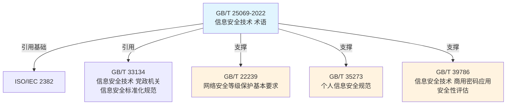

# GB/T 25069-2022 信息安全技术 术语

> [!info] 基础信息
> - **编号**：GB/T 25069-2022
> - **类别**：基础通用标准（推荐性）
> - **发布机构**：国家市场监督管理总局 国家标准化管理委员会
> - **版本**：2022
> - **生效日期**：2023-07-01
> - **替代**：GB/T 25069-2010

## 标准摘要

> [!abstract]
> 本标准界定了信息安全技术领域中的通用性术语及其定义，包括与信息和信息系统安全相关的概念性术语，以及与密码技术、网络安全等相关的专业性术语。
>
> **核心作用**：为信息安全领域提供统一的术语定义，消除歧义，便于技术交流、标准编制、产品研发和安全评估。

## 术语覆盖范围

本标准收录的术语涵盖以下领域：

| 领域 | 术语数量 | 说明 |
|------|----------|------|
| 基础通用 | ~50 | 安全、安全策略、安全机制、安全控制等 |
| 密码技术 | ~80 | 对称密码、公钥密码、数字签名、密钥管理等 |
| 身份鉴别 | ~40 | 鉴别、认证、凭证、标识符等 |
| 访问控制 | ~30 | 主体、客体、权限、角色等 |
| 网络安全 | ~60 | 防火墙、入侵检测、安全网关等 |
| 数据安全 | ~50 | 个人信息、敏感信息、数据分类等 |
| 安全管理 | ~40 | 安全审计、事件响应、风险评估等 |
| 密码产品 | ~30 | 密码机、智能卡、可信模块等 |

## 与 DM2 元模型的对应

| 安全术语分类 | DM2 数据组 | 说明 |
|--------------|------------|------|
| 系统/平台类 | [[Performer]] | 安全系统作为执行者 |
| 网络/通信设施类 | [[Performer]] | 网络设施作为系统 |
| 主体（主动方）类 | [[Performer]] | 用户、角色作为执行者 |
| 客体（被动方）类 | [[Resource]] | 数据、信息作为资源 |
| 密钥/证书类 | [[Resource]] | 密钥作为敏感资源 |
| 数据/信息类 | [[Resource]] | 资源/信息数据组 |
| 软件/程序类 | [[Resource]] | 软件作为资源 |
| 设备/硬件类 | [[Resource]] | 硬件设备作为资源 |
| 策略/规则类 | [[Guidance]] | 安全策略作为规则 |
| 事件/响应类 | [[Activity]] | 安全活动/事件 |
| 算法/协议类 | [[Guidance]] | 算法协议作为标准 |

## 术语词典关联

> [!note] 配套词典
> 本标准的完整术语词典收录于：[[安全术语词典]]

## 与其他标准的关系

## 实施要点

> [!warning] 关键使用场景
> 1. **标准编制**：制定信息安全相关标准时，涉及术语应引用本标准
> 2. **安全评估**：安全评估报告中应使用本标准规定的术语
> 3. **产品研发**：安全产品说明书、技术文档应遵循本标准术语
> 4. **招标投标**：安全项目招标文件中的术语应与本标准一致

## 相关链接

### 配套资源
- [[安全术语词典]] — 本标准收录的 817 条术语完整词典

### 关联标准
- [[GB/T 22239]] — 网络安全等级保护基本要求
- [[GB/T 35273]] — 个人信息安全规范
- [[GB/T 39786]] — 商用密码应用安全性评估

### DM2 知识库
- [[DM2-REFERENCE]] — DM2 元模型总览
- [[Guidance]] — 指导数据组入口

---

> [!note] 元数据
> - 创建时间：2026-04-13
> - 更新时间：2026-04-13
> - 关联 DM2 数据组：Guidance（05）、Resource（04）
