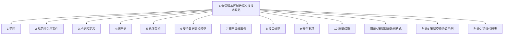
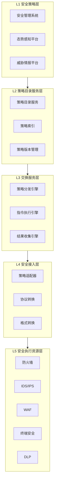
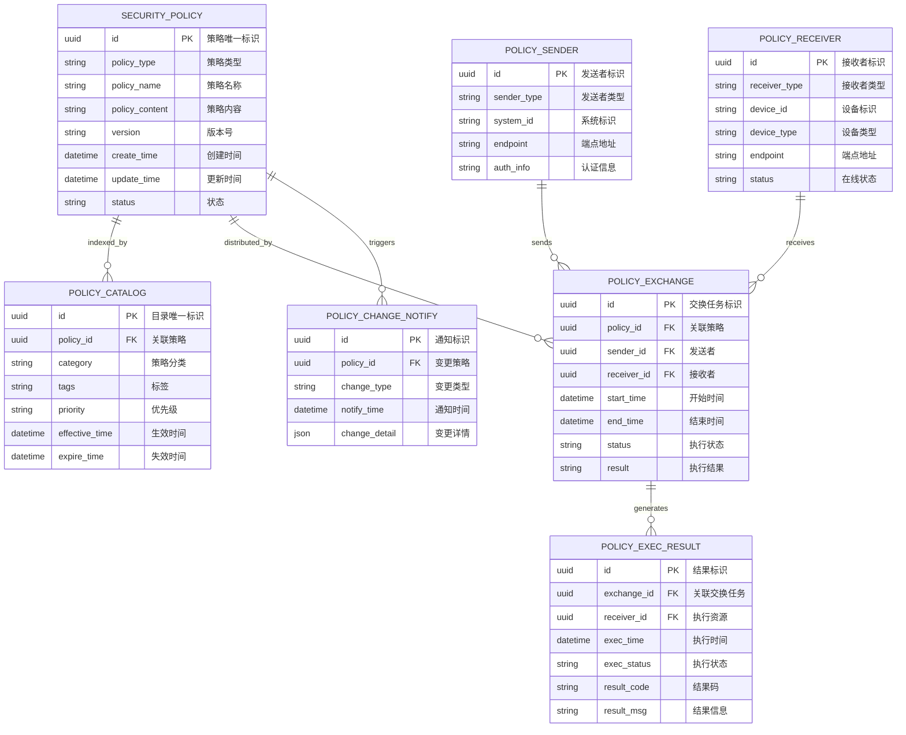
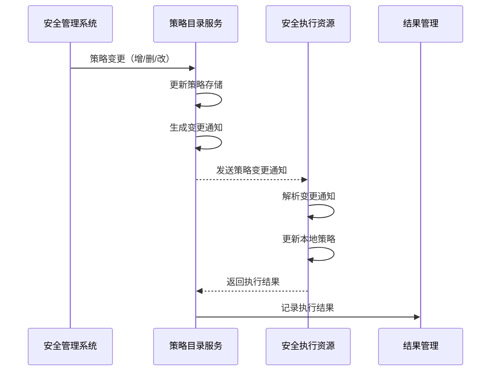

# 安全管理与控制数据交换技术规范

> [!info] 标准信息
> - **标准编号**：GA/T XXXXX-XXXX
> - **标准名称**：安全管理与控制数据交换技术规范
> - **英文译名**：Technical Specification for Security Management and Control Data Exchange
> - **发布日期**：XXXX-XX-XX
> - **实施日期**：XXXX-XX-XX
> - **发布机构**：待填写
> - **与国际标准一致性程度**：无

## 目次



## 前言

> 本文件按照 GB/T 1.1---2020《标准化工作导则 第1部分：标准化文件的结构和起草规则》的规定起草。

本文件由 ×××× 提出。

本文件由 ×××× 归口。

本文件起草单位：

本文件主要起草人：

## 引言

随着网络安全、数据安全、信息安全领域信息化建设的深入推进，不同安全系统之间的安全策略、安全指令和规则的交换需求日益增长。为规范安全管理和控制数据的交换过程，保障数据交换的可靠性、安全性和互操作性，特制定本文件。

本文件旨在为各类组织提供统一的安全管理与控制数据交换技术规范，重点聚焦于安全策略、安全指令、安全规则等核心安全数据的交换，涵盖总体架构、数据模型、策略目录服务、接口协议、安全机制和质量保障等方面的技术要求。

---

## 1 范围

### 1.1 目的

本文件旨在建立统一的安全管理与控制数据交换技术规范，为以下场景提供技术指导：

a) 多级安全管理系统之间的策略下发和同步；

b) 安全管理系统与安全执行资源之间的指令传达；

c) 跨组织的安全策略协调与共享；

d) 安全策略目录的查询、更新和同步；

e) 安全策略执行结果的反馈和报告。

### 1.2 适用范围

本文件适用于：

a) **安全管理系统**：包括但不限于安全信息和事件管理系统（SIEM）、安全运营中心（SOC）、安全态势感知平台、身份与访问管理系统（IAM）、终端检测与响应系统（EDR）、网络流量分析系统（NTA）等；

b) **安全执行资源**：包括但不限于防火墙、入侵检测/防御系统（IDS/IPS）、Web应用防火墙（WAF）、数据库审计系统（DAS）、日志审计系统、APT攻击检测系统等安全设备；

c) **安全策略目录服务**：提供安全策略集中管理、分发和同步的服务系统。

> [!note] 待定义类型
> 本文件可能涉及的其他中介系统类型（如数据交换平台、集成服务等），其命名和定义将在后续版本或相关配套文件中明确。

### 1.3 涉及领域

本文件涉及以下安全领域：

a) **网络安全**：网络边界防护、入侵检测、流量分析、DDoS防护等；

b) **数据安全**：数据分类分级、数据脱敏、数据加密、数据防泄漏（DLP）等；

c) **信息安全**：身份认证、访问控制、安全审计、漏洞管理等。

### 1.4 不适用范围

a) 实时性要求达到毫秒级的硬实时控制场景；

b) 涉及国家秘密的数据交换活动；

c) 金融、医疗、能源等有专门行业标准的领域（相关领域标准优先适用）。

---

## 2 规范性引用文件

> [!important] 引用说明
> 下列文件中的内容通过文中的规范性引用而构成本文件必不可少的条款。其中，注日期的引用文件，仅该日期对应的版本适用于本文件；不注日期的引用文件，其最新版本（包括所有的修改单）适用于本文件。

| 序号  | 文件编号       | 文件名称                               | 备注   |
| :-: | ---------- | ---------------------------------- | ---- |
|  1  | GB/T 22239 | 信息安全技术 网络安全等级保护基本要求                | 不注日期 |
|  2  | GB/T 25070 | 信息安全技术 网络安全等级保护安全设计技术要求            | 不注日期 |
|  3  | GB/T 28448 | 信息安全技术 网络安全等级保护测评要求                | 不注日期 |
|  4  | GB/T 35273 | 信息安全技术 个人信息安全规范                    | 不注日期 |
|  5  | GB/T 39786 | 信息安全技术 信息系统密码应用基本要求                | 不注日期 |
|  6  | GA/T XXXX  | 网络安全产品数据交换技术规范 第3部分：管理与控制数据-策略目录更新 | 待发布  |
|  7  | YD/T 1821  | 通信网络安全防护检测要求                       | 不注日期 |

---

## 3 术语和定义

> [!note] 引导语
> 下列术语和定义适用于本文件。术语来源依据 GB/T 25069-2022《信息安全技术 术语》及国内外相关标准，未标注来源的术语为自主定义。

### 3.1 安全

对某一系统，据以获得保密性、完整性、可用性、可核查性、真实性以及可靠性的性质。

> **来源**：GB/T 25069-2022，3.1

### 3.2 安全策略

安全策略（security policy）：根据安全需要，依据安全规则，对某一主体的访问和使用行为进行规范性约束的规则集。

> **来源**：GB/T 25069-2022，3.11，有修改

**本文件中的扩展定义**：由安全系统生成或维护的，用于描述安全控制要求、访问规则、防护规则等的数据结构。

**示例**：访问控制策略、入侵检测规则、威胁情报IOC、数据分类分级规则。

### 3.3 安全规则

用于描述安全检查条件、判断逻辑和响应动作的标准化表达。

> **来源**：自主定义

**示例**：IP黑白名单规则、敏感数据识别规则、异常行为检测规则。

### 3.4 安全指令

由安全管理系统向安全执行资源发出的，用于执行特定安全操作的命令。

> **来源**：自主定义

**示例**：阻断指令、隔离指令、告警确认指令、策略下发指令。

### 3.5 安全管理系统

对信息系统的安全策略以及执行该策略的安全计算环境、安全区域边界和安全通信网络等方面的安全保障和响应进行统一管理的系统。

> **来源**：GB/T 25069-2022，3.10

### 3.6 安全执行资源

执行安全策略和安全指令的终端设备或软件系统，包括但不限于安全设备、网络设备、终端软件等。

> **来源**：自主定义

### 3.7 策略目录服务

提供安全策略集中存储、索引、查询、分发和同步的服务组件。

> **来源**：自主定义

### 3.8 策略目录

安全策略的索引和元数据集合，用于支持策略的快速检索和分发。

> **来源**：自主定义

### 3.9 策略变更通知

当安全策略发生增删改操作时，向相关系统发送的变更事件通知。

> **来源**：自主定义

### 3.10 策略执行结果

安全执行资源执行安全策略后的状态和反馈信息。

> **来源**：自主定义

### 3.11 多级安全管理

指在不同安全级别（如总部/分部、省/市/区县）或不同管理域之间进行的安全策略统一管理和分发机制。

> **来源**：自主定义

### 3.12 安全数据交换

按照预定的规则和格式，在不同安全系统之间实现安全策略、指令和规则的传输、转换和共享的活动。

> **来源**：自主定义

### 3.13 安全服务

根据安全策略，为用户提供某种安全功能及相关保障。

> **来源**：GB/T 25069-2022，3.7

### 3.14 安全功能

为实现安全要素的要求，并正确实施相应安全策略所提供的功能。

> **来源**：GB/T 25069-2022，3.8

### 3.15 访问控制

按照特定安全策略的规定，对主体访问和使用客体的行为进行控制的机制。

> **来源**：GB/T 25069-2022，3.673

### 3.16 安全审计

按安全标准及相应方法，验证某一安全可交付件与适用标准的符合程度及其安全确保程度的过程。

> **来源**：GB/T 25069-2022，3.19

---

## 4 缩略语

> [!note] 缩略语说明
> 下列缩略语适用于本文件。

| 缩略语 | 英文全称 | 中文含义 |
|:------:|---------|---------|
| API | Application Programming Interface | 应用程序编程接口 |
| DDoS | Distributed Denial of Service | 分布式拒绝服务攻击 |
| DLP | Data Loss Prevention | 数据防泄漏 |
| EDR | Endpoint Detection and Response | 终端检测与响应 |
| IAM | Identity and Access Management | 身份与访问管理 |
| IDS | Intrusion Detection System | 入侵检测系统 |
| IPS | Intrusion Prevention System | 入侵防御系统 |
| IOC | Indicator of Compromise | 威胁指标 |
| JSON | JavaScript Object Notation | JavaScript 对象表示法 |
| NTA | Network Traffic Analysis | 网络流量分析 |
| RBAC | Role-Based Access Control | 基于角色的访问控制 |
| REST | Representational State Transfer | 表述性状态转移 |
| SIEM | Security Information and Event Management | 安全信息和事件管理 |
| SOC | Security Operations Center | 安全运营中心 |
| TLS | Transport Layer Security | 传输层安全协议 |
| WAF | Web Application Firewall | Web应用防火墙 |
| XML | eXtensible Markup Language | 可扩展标记语言 |

---

## 5 总体架构

### 5.1 架构层级

安全管理与控制数据交换系统采用分层架构，由上至下包括以下五个层级：

| 层级 | 名称 | 说明 |
|:----:|------|------|
| L1 | 安全策略层 | 策略生成、定义、管理的发起端 |
| L2 | 策略目录服务层 | 策略集中存储、索引、分发、同步的服务端 |
| L3 | 交换服务层 | 策略分发、指令传达、结果收集的传输端 |
| L4 | 安全接入层 | 与安全执行资源的连接适配端 |
| L5 | 安全执行资源层 | 策略和指令的实际执行端 |



> 图 1 安全管理与控制数据交换系统架构层级图

### 5.2 层级定义与约束

#### 5.2.1 L1 安全策略层

**定义**：负责生成、定义和管理安全策略的发起端系统。

**主要组件**：
- 安全管理系统
- 安全态势感知平台
- 威胁情报平台

**约束**：
a) 应支持安全策略的生成、定义和管理功能；

b) 应遵循统一的安全策略数据格式；

c) 应向 L2 层提供策略注册接口。

#### 5.2.2 L2 策略目录服务层

**定义**：提供安全策略集中存储、索引、查询、分发和同步的服务端组件。

**主要组件**：
- 策略目录服务
- 策略索引
- 策略版本管理

**约束**：
a) 应提供策略的集中存储和索引能力；

b) 应支持策略版本管理和回溯；

c) 应具备策略变更通知能力；

d) 应支持多级策略同步。

#### 5.2.3 L3 交换服务层

**定义**：负责安全数据高效、可靠传输的传输端组件。

**主要组件**：
- 策略分发引擎
- 指令执行引擎
- 结果收集引擎

**约束**：
a) 应支持策略分发、指令传达和结果收集；

b) 应具备消息队列和批量分发能力；

c) 应提供传输状态监控。

#### 5.2.4 L4 安全接入层

**定义**：负责与各类安全执行资源连接适配的接入端组件。

**主要组件**：
- 策略适配器
- 协议转换
- 格式转换

**约束**：
a) 应提供标准化的执行资源适配器；

b) 应支持多种协议（RESTful、MQTT、CoAP 等）；

c) 应支持多种数据格式（JSON、XML、二进制）。

#### 5.2.5 L5 安全执行资源层

**定义**：执行安全策略和安全指令的终端设备和软件系统。

**主要组件**：
- 防火墙（FW）
- 入侵检测/防御系统（IDS/IPS）
- Web应用防火墙（WAF）
- 终端安全（EDR）
- 数据防泄漏（DLP）

**约束**：
a) 应支持策略的执行和反馈；

b) 应具备策略适用性检查能力；

c) 应向 L3 层上报执行结果。

### 5.3 部署模式

#### 5.3.1 集中式部署

所有安全管理和控制功能集中部署在同一平台，适用于安全策略统一管理、集中控制场景。

**优点**：管理简单、策略一致性高

**缺点**：单点风险、扩展性受限

#### 5.3.2 分布式部署

策略目录服务和交换服务分散部署在多个节点，通过统一调度实现协同，适用于大规模、跨地域的安全管理场景。

**优点**：扩展性强、容错性好、响应快

**缺点**：管理复杂、策略一致性维护难度大

#### 5.3.3 多级联动部署

支持总部-省-市-区县多级安全管理体系，上下级之间策略同步、指令传达，适用于大型组织的纵深安全防护。

---

## 6 安全数据交换模型

### 6.1 数据模型设计原则

安全数据交换模型的设计应遵循以下原则：

a) **完备性**：能够覆盖各类安全策略、指令和规则的交换需求；

b) **扩展性**：支持新安全数据类型和交换场景的灵活扩展；

c) **互操作性**：支持不同厂商、不同类型安全系统间的数据互通；

d) **可追溯性**：支持交换全过程的追踪和审计；

e) **安全性**：内置安全机制，保障数据机密性和完整性。

### 6.2 核心数据实体



> 图 2 核心数据实体关系图

### 6.3 策略类型分类

| 策略类型   | 说明        | 示例             | 典型交换场景 |
| ------ | --------- | -------------- | ------ |
| 访问控制策略 | 控制资源访问权限  | IP黑白名单、用户权限    | 策略下发   |
| 检测规则策略 | 定义安全检测条件  | 入侵检测规则、APT检测规则 | 规则更新   |
| 防护配置策略 | 配置防护参数和阈值 | 防火墙规则、WAF规则    | 配置同步   |
| 数据分类策略 | 定义数据敏感等级  | 分级规则、脱敏规则      | 分类更新   |
| 响应动作策略 | 定义响应方式和流程 | 告警通知、自动化响应     | 策略同步   |
| 审计规则策略 | 定义审计检查项   | 合规检查规则、日志采集规则  | 规则下发   |

### 6.4 策略目录结构

策略目录采用树形结构组织，支持多级分类：

```json
{
  "catalog_id": "uuid",
  "catalog_name": "策略目录",
  "parent_id": null,
  "children": [
    {
      "catalog_id": "uuid",
      "catalog_name": "访问控制",
      "parent_id": "uuid",
      "children": [
        {
          "catalog_id": "uuid",
          "catalog_name": "网络访问控制",
          "parent_id": "uuid",
          "policy_count": 50
        },
        {
          "catalog_id": "uuid",
          "catalog_name": "应用访问控制",
          "parent_id": "uuid",
          "policy_count": 30
        }
      ]
    },
    {
      "catalog_id": "uuid",
      "catalog_name": "入侵检测",
      "parent_id": "uuid",
      "children": []
    }
  ]
}
```

---

## 7 策略目录服务

### 7.1 服务概述

策略目录服务是安全数据交换系统的核心组件，负责安全策略的集中存储、索引、查询、分发和同步。

### 7.2 核心服务功能

#### 7.2.1 策略存储服务

a) 提供策略的增删改查接口；

b) 支持策略版本管理；

c) 支持策略归档和备份。

#### 7.2.2 策略索引服务

a) 建立策略全文索引；

b) 支持按分类、标签、时间等条件检索；

c) 提供搜索建议和自动补全。

#### 7.2.3 策略分发服务

a) 支持推模式和拉模式分发；

b) 支持批量分发和增量分发；

c) 支持分发优先级设置。

#### 7.2.4 策略同步服务

a) 支持多级策略同步；

b) 支持策略冲突检测和处理；

c) 支持同步状态监控。

### 7.3 策略变更通知机制

当策略发生变更时，系统应向订阅者发送变更通知：



> 图 3 策略变更通知时序图

### 7.4 策略适用性检查

安全执行资源在接收策略后，应进行适用性检查：

a) 检查策略版本是否适合本设备；

b) 检查策略参数是否在设备支持范围内；

c) 检查策略是否存在冲突。

### 7.5 策略执行结果反馈

执行资源应将策略执行结果反馈给策略目录服务：

a) 成功执行：返回成功状态和执行时间；

b) 执行失败：返回失败原因和错误码；

c) 部分执行：返回部分执行状态和未执行项。

---

## 8 接口规范

### 8.1 接口类型

安全数据交换系统应提供以下类型的接口：

a) **RESTful API**：适用于轻量级、标准化的策略交换场景；

b) **消息队列接口**：适用于异步、高吞吐量的策略分发场景；

c) **文件传输接口**：适用于批量策略文件交换场景；

d) **专用协议接口**：适用于与特定安全设备的集成场景。

### 8.2 RESTful API 规范

#### 8.2.1 基本规范

a) 采用 HTTPS 协议传输；

b) 使用 JSON 格式传输数据；

c) 使用标准 HTTP 方法（GET、POST、PUT、DELETE）；

d) 使用标准 HTTP 状态码。

#### 8.2.2 策略目录服务接口

| 接口名称 | 方法 | 路径 | 说明 |
|---------|:----:|------|------|
| 创建策略 | POST | /api/v1/policies | 创建新的安全策略 |
| 查询策略 | GET | /api/v1/policies/{id} | 查询指定策略 |
| 列出策略 | GET | /api/v1/policies | 列出策略列表 |
| 更新策略 | PUT | /api/v1/policies/{id} | 更新策略内容 |
| 删除策略 | DELETE | /api/v1/policies/{id} | 删除策略 |
| 查询目录 | GET | /api/v1/catalog | 查询策略目录 |
| 注册发送者 | POST | /api/v1/senders | 注册策略发送者 |
| 注册接收者 | POST | /api/v1/receivers | 注册策略接收者 |
| 查询接收者 | GET | /api/v1/receivers/{id} | 查询接收者状态 |

#### 8.2.3 策略分发接口

| 接口名称 | 方法 | 路径 | 说明 |
|---------|:----:|------|------|
| 分发策略 | POST | /api/v1/distributions | 分发策略到目标 |
| 查询分发任务 | GET | /api/v1/distributions/{id} | 查询分发状态 |
| 发送策略变更通知 | POST | /api/v1/notifications | 发送策略变更通知 |
| 查询通知 | GET | /api/v1/notifications/{id} | 查询通知状态 |
| 提交执行结果 | POST | /api/v1/results | 提交策略执行结果 |
| 查询执行结果 | GET | /api/v1/results/{id} | 查询执行结果 |

#### 8.2.4 接口示例

**创建安全策略**

请求：
```http
POST /api/v1/policies
Content-Type: application/json
Authorization: Bearer {token}

{
  "policy_type": "access_control",
  "policy_name": "办公网络访问控制策略",
  "policy_content": {
    "rules": [
      {
        "id": 1,
        "action": "allow",
        "source_ip": "192.168.1.0/24",
        "dest_ip": "10.0.0.0/8",
        "protocol": "tcp",
        "port": "80,443"
      }
    ]
  },
  "catalog_id": "catalog-access-control",
  "tags": ["办公网络", "访问控制"],
  "priority": 3,
  "effective_time": "2026-04-13T00:00:00Z",
  "expire_time": "2027-04-13T00:00:00Z"
}
```

响应：
```http
HTTP/1.1 201 Created
Content-Type: application/json

{
  "policy_id": "550e8400-e29b-41d4-a716-446655440000",
  "version": "1.0",
  "status": "created",
  "created_at": "2026-04-13T10:00:00Z"
}
```

**发送策略变更通知**

请求：
```http
POST /api/v1/notifications
Content-Type: application/json
Authorization: Bearer {token}

{
  "change_type": "update",
  "policy_id": "550e8400-e29b-41d4-a716-446655440000",
  "old_version": "1.0",
  "new_version": "1.1",
  "change_summary": "更新访问控制规则",
  "targets": [
    {"receiver_id": "recv-001", "device_type": "firewall"},
    {"receiver_id": "recv-002", "device_type": "waf"}
  ],
  "notify_time": "2026-04-13T10:00:00Z"
}
```

响应：
```http
HTTP/1.1 201 Created
Content-Type: application/json

{
  "notification_id": "notif-20260413-001",
  "status": "sent",
  "sent_at": "2026-04-13T10:00:00Z",
  "target_count": 2
}
```

### 8.3 消息队列接口规范

#### 8.3.1 队列配置

| 队列名称 | 用途 | 优先级 | 消息TTL |
|---------|------|:------:|--------:|
| policy-priority-high | 高优先级策略变更 | 1 | 1小时 |
| policy-priority-normal | 普通策略分发 | 2 | 24小时 |
| policy-priority-low | 低优先级策略同步 | 3 | 7天 |
| policy-result | 策略执行结果上报 | 2 | 24小时 |

#### 8.3.2 消息格式

```json
{
  "message_id": "uuid-v4",
  "queue": "policy-priority-normal",
  "timestamp": "2026-04-13T10:00:00Z",
  "headers": {
    "message_type": "policy_distribution|policy_notification|policy_result",
    "policy_id": "uuid-v4",
    "correlation_id": "uuid-v4"
  },
  "body": {
    "policy_data": {}
  },
  "properties": {
    "priority": 2,
    "delivery_mode": 2,
    "content_encoding": "gzip",
    "content_type": "application/json"
  }
}
```

---

## 9 安全要求

### 9.1 身份认证

数据交换参与方应通过以下方式进行身份认证：

a) **数字证书认证**：适用于高安全要求的安全系统间交换（推荐）；

b) **OAuth 2.0 认证**：适用于开放平台和第三方应用接入场景；

c) **API Key 认证**：适用于服务调用方身份识别；

d) **双向TLS认证**：适用于系统间点对点安全通信。

### 9.2 访问控制

a) 应实现基于角色的访问控制（RBAC）；

b) 应支持最小权限原则；

c) 应提供细粒度的策略访问控制；

d) 应支持策略分发权限管理。

### 9.3 数据传输安全

a) 应使用 TLS 1.2 及以上版本加密传输通道；

b) 敏感策略数据应采用端到端加密；

c) 应使用数字签名保障策略数据的完整性和来源可信；

d) 应实施防重放攻击机制。

### 9.4 策略数据安全

a) 策略数据应加密存储；

b) 敏感策略（如密钥、认证信息）应单独加密存储；

c) 应实施策略数据备份和恢复机制；

d) 策略删除时应彻底清除。

### 9.5 审计要求

数据交换系统应记录以下审计信息：

a) 策略的创建、修改、删除和分发操作；

b) 策略变更通知的发送和接收；

c) 策略执行结果的上报；

d) 身份认证和访问控制事件；

e) 系统异常和错误信息。

审计日志应至少保留 **180 天**，并应支持日志的查询、导出和归档。

---

## 10 质量保障

### 10.1 策略数据质量要求

| 质量维度 | 要求 | 检测方式 |
|---------|------|---------|
| 准确性 | 策略内容正确无误 | 规则校验 |
| 完整性 | 必填字段完整 | Schema验证 |
| 一致性 | 跨系统策略一致 | 版本比对 |
| 时效性 | 策略在有效期内 | 时间戳检查 |
| 可用性 | 策略可正常获取 | 响应测试 |

### 10.2 传输质量要求

| 指标 | 要求 | 说明 |
|-----|:----:|------|
| 可用性 | ≥ 99.9% | 交换系统可用时间占比 |
| 分发成功率 | ≥ 99.5% | 策略分发成功率 |
| 通知送达率 | ≥ 99.0% | 变更通知送达率 |
| 延迟 | ≤ 10秒 | 策略分发端到端延迟 |
| 吞吐量 | 按需配置 | 支持峰值吞吐量的弹性扩展 |

### 10.3 错误处理

#### 10.3.1 错误代码

| 错误代码  | 错误类型    | 说明         | 处理建议          |
| :---: | ------- | ---------- | ------------- |
| E1001 | 连接失败    | 无法建立与端点的连接 | 检查网络和端点状态     |
| E1002 | 超时错误    | 请求响应超时     | 增加超时时间或检查目标系统 |
| E2001 | 认证失败    | 身份认证不通过    | 检查认证信息        |
| E2002 | 授权失败    | 访问权限不足     | 申请相应权限        |
| E2003 | 策略版本不匹配 | 策略版本与设备不匹配 | 检查设备支持的策略版本   |
| E3001 | 格式错误    | 策略格式不符合规范  | 修正策略格式        |
| E3002 | 校验失败    | 策略校验未通过    | 检查策略内容        |
| E3003 | 策略冲突    | 与现有策略存在冲突  | 解决策略冲突        |
| E3004 | 策略不适用   | 策略不适用于目标设备 | 检查设备类型兼容性     |
| E4001 | 存储错误    | 策略存储失败     | 检查存储系统        |
| E5001 | 系统错误    | 系统内部错误     | 联系技术支持        |

#### 10.3.2 重试机制

对于可恢复的错误，系统应支持自动重试：

a) **重试次数**：默认 3 次，可配置；

b) **重试间隔**：指数退避策略，间隔时间为 2^n 秒（n 为重试次数）；

c) **重试上限**：达到重试上限后，标记为失败并记录错误信息。

---

## 附录A（规范性） 策略目录数据格式

### A.1 策略目录结构

```json
{
  "catalog_version": "1.0",
  "catalog_id": "uuid-v4",
  "catalog_name": "安全策略目录",
  "description": "安全策略分类目录",
  "last_update": "2026-04-13T10:00:00Z",
  "categories": [
    {
      "category_id": "cat-access-control",
      "category_name": "访问控制策略",
      "parent_id": null,
      "policy_count": 100,
      "children": [
        {
          "category_id": "cat-net-acl",
          "category_name": "网络访问控制",
          "parent_id": "cat-access-control",
          "policy_count": 50
        },
        {
          "category_id": "cat-app-acl",
          "category_name": "应用访问控制",
          "parent_id": "cat-access-control",
          "policy_count": 50
        }
      ]
    },
    {
      "category_id": "cat-intrusion-detection",
      "category_name": "入侵检测策略",
      "parent_id": null,
      "policy_count": 200,
      "children": []
    }
  ]
}
```

### A.2 策略元数据结构

```json
{
  "policy_metadata": {
    "policy_id": "uuid-v4",
    "policy_name": "策略名称",
    "policy_type": "access_control|intrusion_detection|data_classification|...",
    "category_id": "cat-xxx",
    "version": "1.0",
    "description": "策略描述",
    "tags": ["tag1", "tag2"],
    "priority": 1-5,
    "creator": "system-id",
    "create_time": "ISO8601",
    "update_time": "ISO8601",
    "status": "active|inactive|archived",
    "effective_time": "ISO8601",
    "expire_time": "ISO8601",
    "applicable_devices": [
      {
        "device_type": "firewall",
        "device_vendor": "vendor-a",
        "device_model": "model-xxx",
        "min_version": "1.0",
        "max_version": "2.0"
      }
    ],
    "dependencies": ["policy-id-1", "policy-id-2"],
    "signature": "base64-signature"
  }
}
```

---

## 附录B（规范性） 策略交换协议示例

### B.1 策略分发协议（JSON）

```json
{
  "protocol_version": "1.0",
  "message_type": "policy_distribution",
  "distribution_id": "uuid-v4",
  "timestamp": "2026-04-13T10:00:00Z",
  "sender": {
    "sender_id": "sender-001",
    "system_id": "SIEM-001",
    "endpoint": "192.168.1.10:8080"
  },
  "receiver": {
    "receiver_id": "receiver-001",
    "device_id": "FW-001",
    "device_type": "firewall",
    "endpoint": "192.168.2.10:8080"
  },
  "policy": {
    "policy_id": "policy-001",
    "policy_name": "办公网络访问控制策略",
    "policy_type": "access_control",
    "version": "1.1",
    "content": {
      "rules": [
        {
          "id": 1,
          "action": "allow",
          "source_ip": "192.168.1.0/24",
          "dest_ip": "10.0.0.0/8",
          "protocol": "tcp",
          "port": "80,443"
        }
      ]
    },
    "effective_time": "2026-04-13T00:00:00Z",
    "expire_time": "2027-04-13T00:00:00Z"
  },
  "checksum": {
    "algorithm": "SHA256",
    "value": "a1b2c3d4e5f6..."
  },
  "signature": {
    "algorithm": "RSA-SHA256",
    "value": "signature_base64_value"
  }
}
```

### B.2 策略变更通知协议（JSON）

```json
{
  "protocol_version": "1.0",
  "message_type": "policy_change_notification",
  "notification_id": "notif-001",
  "timestamp": "2026-04-13T10:00:00Z",
  "sender": {
    "sender_id": "sender-001",
    "system_id": "SIEM-001"
  },
  "change_info": {
    "policy_id": "policy-001",
    "change_type": "create|update|delete",
    "old_version": "1.0",
    "new_version": "1.1",
    "change_summary": "更新访问控制规则，增加新的允许端口"
  },
  "targets": [
    {
      "receiver_id": "receiver-001",
      "device_id": "FW-001",
      "device_type": "firewall"
    },
    {
      "receiver_id": "receiver-002",
      "device_id": "FW-002",
      "device_type": "firewall"
    }
  ]
}
```

### B.3 策略执行结果上报协议（JSON）

```json
{
  "protocol_version": "1.0",
  "message_type": "policy_execution_result",
  "result_id": "result-001",
  "timestamp": "2026-04-13T10:01:00Z",
  "distribution_id": "uuid-v4",
  "receiver": {
    "receiver_id": "receiver-001",
    "device_id": "FW-001",
    "device_type": "firewall"
  },
  "execution": {
    "exec_time": "2026-04-13T10:00:30Z",
    "exec_status": "success|partial_failure|failure",
    "exec_duration_ms": 500
  },
  "result": {
    "result_code": 0,
    "result_message": "策略更新成功",
    "details": {
      "rules_updated": 5,
      "rules_failed": 0,
      "errors": []
    }
  },
  "signature": {
    "algorithm": "RSA-SHA256",
    "value": "signature_base64_value"
  }
}
```

---

## 附录C（资料性） 错误代码表

### C.1 错误代码完整列表

| 错误代码 | 错误类型 | 说明 | 严重级别 |
|:--------:|---------|------|:--------:|
| E1001 | 连接失败 | 无法建立与端点的连接 | 警告 |
| E1002 | 超时错误 | 请求响应超时 | 警告 |
| E1003 | 连接中断 | 连接在传输过程中中断 | 错误 |
| E2001 | 认证失败 | 身份认证不通过 | 警告 |
| E2002 | 授权失败 | 访问权限不足 | 警告 |
| E2003 | Token过期 | 认证Token已过期 | 警告 |
| E2004 | 证书无效 | 数字证书无效或过期 | 错误 |
| E2005 | 签名验证失败 | 策略签名验证失败 | 严重 |
| E3001 | 格式错误 | 策略格式不符合规范 | 错误 |
| E3002 | 校验失败 | 策略校验未通过 | 错误 |
| E3003 | 字段缺失 | 策略必填字段缺失 | 错误 |
| E3004 | 值域错误 | 策略字段值超出允许范围 | 警告 |
| E3005 | 策略冲突 | 与现有策略存在冲突 | 警告 |
| E3006 | 策略版本不匹配 | 策略版本与设备不匹配 | 错误 |
| E3007 | 策略不适用 | 策略不适用于目标设备 | 错误 |
| E3008 | 策略不存在 | 请求的策略不存在 | 警告 |
| E4001 | 存储错误 | 策略存储失败 | 错误 |
| E4002 | 存储空间不足 | 存储空间不足 | 错误 |
| E5001 | 系统错误 | 系统内部错误 | 严重 |
| E5002 | 服务不可用 | 服务暂时不可用 | 错误 |
| E5003 | 限流触发 | 请求频率超过限制 | 警告 |
| E5004 | 设备离线 | 目标设备不在线 | 警告 |
| E5005 | 设备忙 | 目标设备忙碌，稍后重试 | 警告 |

### C.2 错误响应格式

```json
{
  "error": {
    "code": "E3005",
    "type": "策略冲突",
    "message": "策略与现有策略存在冲突",
    "details": {
      "policy_id": "policy-001",
      "conflicting_policy_id": "policy-002",
      "conflict_type": "duplicate_rule",
      "conflict_description": "规则ID 1 与策略 policy-002 中的规则冲突"
    },
    "timestamp": "2026-04-13T10:00:00Z",
    "request_id": "req-20260413-001",
    "suggestion": "请修改策略规则或先删除冲突策略"
  }
}
```

---

## 参考文献

| 序号 | 文献格式 |
|:----:|---------|
| 1 | GB/T 1.1-2020 标准化工作导则 第1部分：标准化文件的结构和起草规则 |
| 2 | GB/T 22239-2019 信息安全技术 网络安全等级保护基本要求 |
| 3 | GB/T 25070-2019 信息安全技术 网络安全等级保护安全设计技术要求 |
| 4 | GB/T 35273-2020 信息安全技术 个人信息安全规范 |
| 5 | GB/T 39786-2021 信息安全技术 信息系统密码应用基本要求 |
| 6 | GA/T XXXX-XXXX 网络安全产品数据交换技术规范 第3部分：管理与控制数据-策略目录更新 |
| 7 | RFC 7519 - JSON Web Token (JWT) |
| 8 | RFC 6749 - The OAuth 2.0 Authorization Framework |

---

## 索引

| 术语 | 页码 |
|:-----|:----:|
| API | 1 |
| 策略目录 | 1 |
| 策略分发 | 1 |
| 策略变更通知 | 1 |
| 安全策略 | 1 |
| 安全指令 | 1 |
| 安全规则 | 1 |
| 策略执行结果 | 1 |
| 多级安全管理 | 1 |

---

> [!meta] 元数据
> - 创建时间：2026-04-13
> - 关联 DM2 数据组：05-Guidance/Standard
> - 关联法规：[[中华人民共和国网络安全法]]、[[中华人民共和国数据安全法]]、[[中华人民共和国密码法]]、[[中华人民共和国个人信息保护法]]
> - 关联标准：[[GB-T-22239-2019]]（待创建）
> - 参考标准：[[T/CCF 004.3-2024]]（网络安全产品数据交换技术规范 第3部分）
> - 状态：草稿（第一轮调整）
