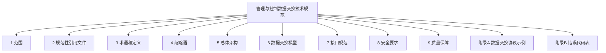
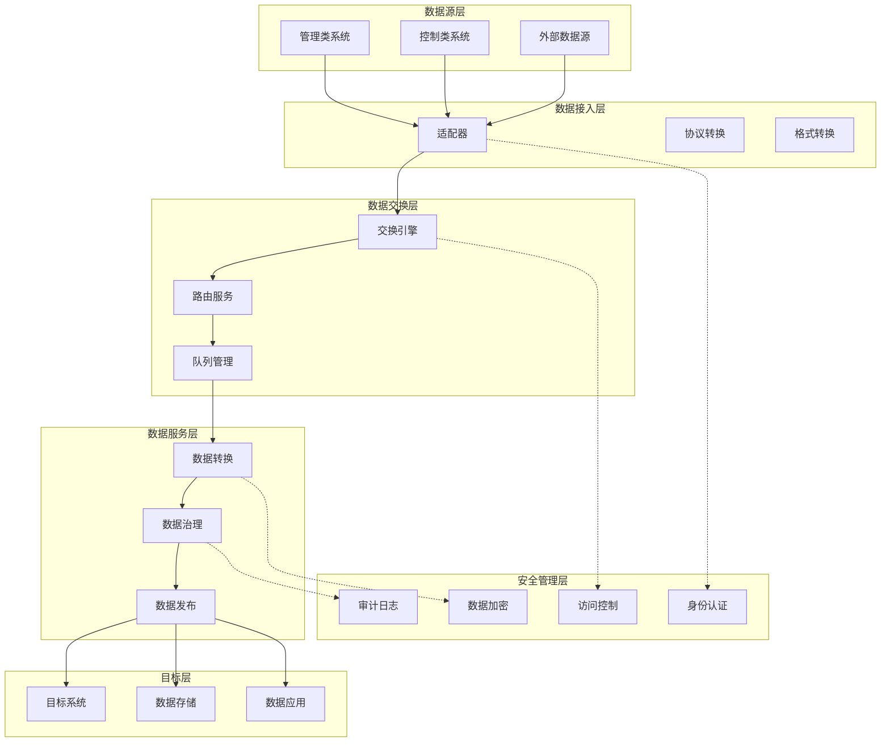
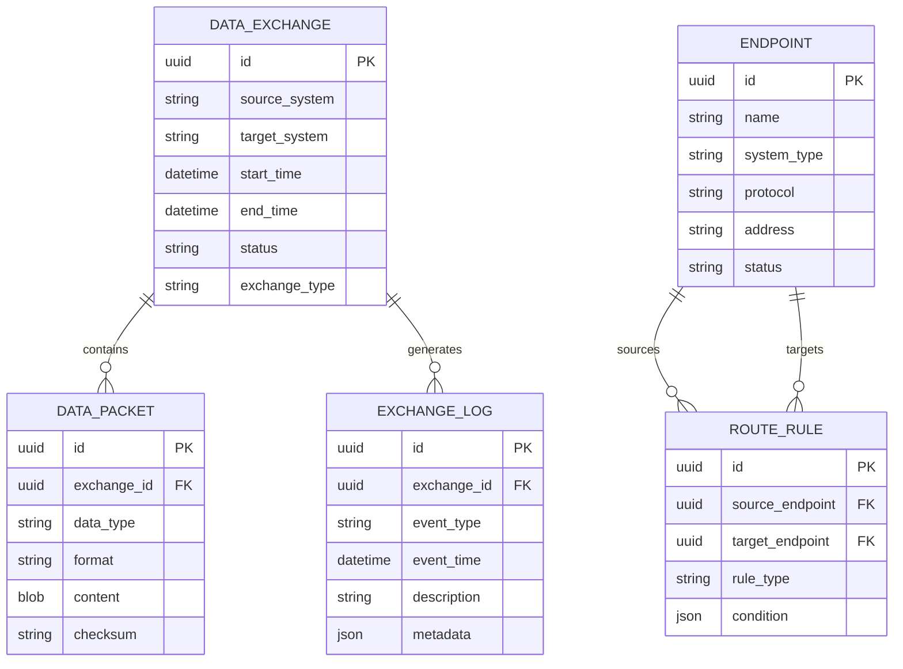

# 管理与控制数据交换技术规范

> [!info] 标准信息
> - **标准编号**：GA/T XXXXX-XXXX
> - **标准名称**：管理与控制数据交换技术规范
> - **英文译名**：Technical Specification for Management and Control Data Exchange
> - **发布日期**：XXXX-XX-XX
> - **实施日期**：XXXX-XX-XX
> - **发布机构**：待填写
> - **与国际标准一致性程度**：无

## 目次



## 前言

> 本文件按照 GB/T 1.1---2020《标准化工作导则 第1部分：标准化文件的结构和起草规则》的规定起草。

本文件由 ×××× 提出。

本文件由 ×××× 归口。

本文件起草单位：

本文件主要起草人：

## 引言

随着组织信息化建设的深入推进，不同业务系统、管理平台、控制设备之间的数据交换需求日益增长。为规范管理与控制数据的交换过程，保障数据交换的可靠性、安全性和互操作性，特制定本文件。

本文件旨在为各类组织提供统一的数据交换技术规范，涵盖总体架构、数据模型、接口协议、安全机制和质量保障等方面的技术要求。

---

## 1 范围

### 1.1 目的

本文件旨在建立统一的管理与控制数据交换技术规范，为以下场景提供技术指导：

a) 组织内部不同管理系统之间的数据交换；

b) 管理平台与控制设备之间的数据交互；

c) 跨组织的管理与控制数据共享；

d) 数据交换系统的规划、建设与运维。

### 1.2 适用范围

本文件适用于：

a) **管理类系统**：包括但不限于企业资源计划（ERP）、客户关系管理（CRM）、办公自动化（OA）等管理系统；

b) **控制类系统**：包括但不限于工业控制系统、物联网网关、智能设备管理等；

c) **数据交换平台**：承担数据汇聚、分发、转换等功能的中介系统；

d) **数据交换服务提供商**：提供数据交换技术产品和服务的企业。

### 1.3 不适用范围

a) 实时性要求达到毫秒级的硬实时控制场景；

b) 涉及国家秘密的数据交换活动；

c) 金融、医疗等有专门行业标准的领域（相关领域标准优先适用）。

---

## 2 规范性引用文件

> [!important] 引用说明
> 下列文件中的内容通过文中的规范性引用而构成本文件必不可少的条款。其中，注日期的引用文件，仅该日期对应的版本适用于本文件；不注日期的引用文件，其最新版本（包括所有的修改单）适用于本文件。

| 序号  | 文件编号       | 文件名称                    | 备注   |
| :-: | ---------- | ----------------------- | ---- |
|  1  | GB/T 22239 | 信息安全技术 网络安全等级保护基本要求     | 不注日期 |
|  2  | GB/T 25070 | 信息安全技术 网络安全等级保护安全设计技术要求 | 不注日期 |
|  3  | GB/T 28448 | 信息安全技术 网络安全等级保护测评要求     | 不注日期 |
|  4  | GB/T 33136 | 信息安全技术 数据交易服务安全规范       | 不注日期 |
|  5  | GB/T 35273 | 信息安全技术 个人信息安全规范         | 不注日期 |
|  6  | YD/T       | 移动网络数据交换技术要求            | 待补充  |

---

## 3 术语和定义

> [!note] 引导语
> 下列术语和定义适用于本文件。

### 3.1 管理数据

在组织管理活动中产生、流转和使用的数据，包括但不限于业务数据、配置数据、审计日志等。

**说明**：管理数据通常具有结构化程度高、时效性要求适中、安全敏感度各异等特点。

### 3.2 控制数据

用于对物理设备、过程或系统进行监测、调节和指令的数据。

**示例**：传感器采集数据、执行器指令、状态反馈数据。

### 3.3 数据交换

按照预定的规则和格式，在不同系统、平台或组织之间实现数据的传输、转换和共享的活动。

### 3.4 数据交换模型

对数据交换过程中的数据格式、传输协议、交互流程等进行抽象和规范的模型。

### 3.5 数据交换服务

提供数据发送、接收、转换、路由、存储等功能的软件服务或平台服务。

### 3.6 端点

参与数据交换的源系统或目标系统的逻辑接入点。

### 3.7 数据通道

端点之间用于传输数据的逻辑通信路径。

### 3.8 数据质量

数据在准确性、完整性、一致性、时效性、可用性等方面的满足程度。

---

## 4 缩略语

> [!note] 缩略语说明
> 下列缩略语适用于本文件。

| 缩略语 | 英文全称 | 中文含义 |
|:------:|---------|---------|
| API | Application Programming Interface | 应用程序编程接口 |
| CSV | Comma-Separated Values | 逗号分隔值 |
| JSON | JavaScript Object Notation | JavaScript 对象表示法 |
| REST | Representational State Transfer | 表述性状态转移 |
| SOAP | Simple Object Access Protocol | 简单对象访问协议 |
| TLS | Transport Layer Security | 传输层安全协议 |
| UUID | Universally Unique Identifier | 通用唯一标识符 |
| XML | eXtensible Markup Language | 可扩展标记语言 |

---

## 5 总体架构

### 5.1 架构概述

管理与控制数据交换系统采用分层架构，包括数据接入层、数据交换层、数据服务层和安全管理层。



> 图 1 数据交换系统总体架构

### 5.2 各层职责

#### 5.2.1 数据接入层

负责与各类数据源和目标系统的连接，主要功能包括：

a) **适配器管理**：提供标准化的端点适配器，支持多种接入协议；

b) **协议转换**：将异构协议转换为系统内部统一协议；

c) **格式转换**：将不同数据格式转换为统一的数据模型格式；

d) **连接管理**：维护与端点的长连接或处理短连接请求。

#### 5.2.2 数据交换层

负责数据的高效、可靠传输，主要功能包括：

a) **交换引擎**：执行数据的发送、接收、路由和分发；

b) **路由服务**：根据配置规则确定数据的传输路径；

c) **队列管理**：提供消息队列功能，支持异步传输和削峰填谷；

d) **流量控制**：防止系统过载，保障传输质量。

#### 5.2.3 数据服务层

负责数据的加工、处理和发布，主要功能包括：

a) **数据转换**：按照目标要求进行数据格式、结构和语义转换；

b) **数据治理**：实施数据质量检查、脱敏、清洗等处理；

c) **数据发布**：将处理后的数据对外提供服务接口。

#### 5.2.4 安全管理层

贯穿整个架构，提供统一的安全保障，主要功能包括：

a) **身份认证**：验证参与方的身份合法性；

b) **访问控制**：控制数据的访问权限；

c) **审计日志**：记录数据交换全过程，便于追溯和审计；

d) **数据加密**：保障数据传输和存储安全。

### 5.3 部署模式

根据业务需求和安全要求，数据交换系统可采用以下部署模式：

#### 5.3.1 集中式部署

所有数据交换功能集中部署在同一平台，适用于数据交换规模可控、安全控制集中的场景。

**优点**：管理简单、运维成本低

**缺点**：单点风险、扩展性受限

#### 5.3.2 分布式部署

数据交换功能分散部署在多个节点，通过统一调度实现协同，适用于大规模、跨地域的数据交换场景。

**优点**：扩展性强、容错性好

**缺点**：管理复杂、运维成本高

#### 5.3.3 混合部署

核心数据交换采用集中部署，边缘数据交换采用分布式部署，适用于核心安全可控、边缘灵活接入的场景。

---

## 6 数据交换模型

### 6.1 数据模型设计原则

数据交换模型的设计应遵循以下原则：

a) **完备性**：能够覆盖各类管理与控制数据的交换需求；

b) **扩展性**：支持新数据类型和交换场景的灵活扩展；

c) **互操作性**：支持不同系统间的数据互通；

d) **可追溯性**：支持数据交换全过程的追踪和审计。

### 6.2 核心数据实体



> 图 2 核心数据实体关系图

### 6.3 数据包格式

数据交换的基本单位为数据包（Data Packet），其结构如下：

```json
{
  "packet_id": "uuid-v4",
  "exchange_id": "uuid-v4",
  "header": {
    "version": "1.0",
    "data_type": "management|control",
    "source": {
      "endpoint_id": "string",
      "system": "string",
      "timestamp": "ISO8601"
    },
    "target": {
      "endpoint_id": "string",
      "system": "string"
    },
    "priority": 1-5,
    "encryption": "none|AES|RSA"
  },
  "body": {
    "data": {},
    "metadata": {}
  },
  "footer": {
    "checksum": "sha256",
    "signature": "base64"
  }
}
```

> 图 3 数据包结构示例

### 6.4 数据类型分类

| 数据类型 | 说明 | 示例 | 典型交换频率 |
|---------|------|------|-------------|
| 配置数据 | 系统或设备的配置参数 | 网络配置、阈值设置 | 低频 |
| 状态数据 | 实时或准实时的状态信息 | 设备状态、在线状态 | 中频 |
| 业务数据 | 管理活动中产生的数据 | 业务记录、审批数据 | 高频 |
| 控制指令 | 对设备或系统的控制命令 | 开关指令、参数调整 | 高频 |
| 告警数据 | 系统或设备产生的告警信息 | 故障告警、阈值超限 | 事件驱动 |
| 审计数据 | 用于审计追踪的日志数据 | 操作日志、访问记录 | 高频 |

---

## 7 接口规范

### 7.1 接口类型

数据交换系统应提供以下类型的接口：

a) **RESTful API**：适用于轻量级、标准化的数据交换场景；

b) **消息队列接口**：适用于异步、高吞吐量的数据交换场景；

c) **文件传输接口**：适用于批量数据交换场景；

d) **数据库直连接口**：适用于结构化数据的实时同步场景。

### 7.2 RESTful API 规范

#### 7.2.1 基本规范

a) 采用 HTTPS 协议传输；

b) 使用 JSON 格式传输数据；

c) 使用标准 HTTP 方法（GET、POST、PUT、DELETE）；

d) 使用标准 HTTP 状态码。

#### 7.2.2 接口列表

| 接口名称 | 方法 | 路径 | 说明 |
|---------|:----:|------|------|
| 创建数据交换任务 | POST | /api/v1/exchanges | 创建新的数据交换任务 |
| 查询交换任务 | GET | /api/v1/exchanges/{id} | 查询指定交换任务状态 |
| 列出交换任务 | GET | /api/v1/exchanges | 列出交换任务列表 |
| 取消交换任务 | DELETE | /api/v1/exchanges/{id} | 取消指定的交换任务 |
| 发送数据包 | POST | /api/v1/packets | 发送数据包 |
| 查询数据包 | GET | /api/v1/packets/{id} | 查询数据包状态 |
| 注册端点 | POST | /api/v1/endpoints | 注册新的端点 |
| 查询端点 | GET | /api/v1/endpoints/{id} | 查询端点信息 |
| 列出端点 | GET | /api/v1/endpoints | 列出端点列表 |
| 更新端点状态 | PUT | /api/v1/endpoints/{id}/status | 更新端点状态 |

#### 7.2.3 接口示例

**创建数据交换任务**

请求：
```http
POST /api/v1/exchanges
Content-Type: application/json
Authorization: Bearer {token}

{
  "source_endpoint": "endpoint-001",
  "target_endpoint": "endpoint-002",
  "data_type": "business_data",
  "priority": 3,
  "schedule": {
    "type": "immediate|scheduled|recurring",
    "start_time": "2026-04-13T10:00:00Z",
    "recurrence": "daily|weekly|monthly"
  },
  "options": {
    "compression": true,
    "encryption": "AES256",
    "retry_count": 3
  }
}
```

响应：
```http
HTTP/1.1 201 Created
Content-Type: application/json

{
  "exchange_id": "550e8400-e29b-41d4-a716-446655440000",
  "status": "created",
  "created_at": "2026-04-13T10:00:00Z",
  "estimated_completion": "2026-04-13T10:05:00Z"
}
```

### 7.3 消息队列接口规范

#### 7.3.1 队列配置

| 队列名称 | 用途 | 优先级 | 消息TTL |
|---------|------|:------:|--------:|
| priority-high | 高优先级数据 | 1 | 1小时 |
| priority-normal | 普通数据 | 2 | 24小时 |
| priority-low | 低优先级数据 | 3 | 7天 |
| priority-batch | 批量数据 | 4 | 30天 |

#### 7.3.2 消息格式

```json
{
  "message_id": "uuid-v4",
  "queue": "priority-normal",
  "timestamp": "2026-04-13T10:00:00Z",
  "headers": {
    "source": "system-a",
    "target": "system-b",
    "correlation_id": "uuid-v4"
  },
  "body": {
    "data": {}
  },
  "properties": {
    "priority": 2,
    "delivery_mode": 2,
    "content_encoding": "gzip",
    "content_type": "application/json"
  }
}
```

---

## 8 安全要求

### 8.1 身份认证

数据交换参与方应通过以下方式之一进行身份认证：

a) **用户名/密码认证**：适用于内部系统间的数据交换；

b) **数字证书认证**：适用于高安全要求的数据交换场景；

c) **OAuth 2.0 认证**：适用于开放平台和第三方应用接入场景；

d) **API Key 认证**：适用于服务调用方身份识别。

### 8.2 访问控制

a) 应实现基于角色的访问控制（RBAC）；

b) 应支持最小权限原则；

c) 应提供细粒度的数据访问控制；

d) 应记录访问控制策略的变更。

### 8.3 数据传输安全

a) 应使用 TLS 1.2 及以上版本加密传输通道；

b) 敏感数据应采用端到端加密；

c) 应使用数字签名保障数据完整性；

d) 应实施防重放攻击机制。

### 8.4 数据存储安全

a) 敏感数据应加密存储；

b) 应实施数据备份和恢复机制；

c) 应定期清理过期数据；

d) 应保障存储介质的安全。

### 8.5 审计要求

数据交换系统应记录以下审计信息：

a) 用户登录和登出信息；

b) 数据交换任务的创建、执行、完成和失败信息；

c) 数据访问和下载操作；

d) 安全策略的变更操作；

e) 系统异常和错误信息。

审计日志应至少保留 **180 天**，并应支持日志的查询、导出和归档。

---

## 9 质量保障

### 9.1 数据质量要求

| 质量维度 | 要求 | 检测方式 |
|---------|------|---------|
| 准确性 | 数据内容正确无误 | 规则校验 |
| 完整性 | 必填字段完整 | Schema验证 |
| 一致性 | 跨系统数据一致 | 校验和比对 |
| 时效性 | 数据在有效期内 | 时间戳检查 |
| 可用性 | 数据可正常获取 | 响应测试 |

### 9.2 传输质量要求

| 指标 | 要求 | 说明 |
|-----|:----:|------|
| 可用性 | ≥ 99.9% | 交换系统可用时间占比 |
| 成功率 | ≥ 99.5% | 数据交换成功率 |
| 延迟 | ≤ 5秒 | 普通优先级数据端到端延迟 |
| 吞吐量 | 按需配置 | 支持峰值吞吐量的弹性扩展 |

### 9.3 错误处理

#### 9.3.1 错误代码

| 错误代码 | 错误类型 | 说明 | 处理建议 |
|:--------:|---------|------|---------|
| E1001 | 连接失败 | 无法建立与端点的连接 | 检查网络和端点状态 |
| E1002 | 超时错误 | 请求响应超时 | 增加超时时间或检查目标系统 |
| E2001 | 认证失败 | 身份认证不通过 | 检查认证信息 |
| E2002 | 授权失败 | 访问权限不足 | 申请相应权限 |
| E3001 | 格式错误 | 数据格式不符合规范 | 修正数据格式 |
| E3002 | 校验失败 | 数据校验未通过 | 检查数据内容 |
| E4001 | 存储错误 | 数据存储失败 | 检查存储系统 |
| E5001 | 系统错误 | 系统内部错误 | 联系技术支持 |

#### 9.3.2 重试机制

对于可恢复的错误，系统应支持自动重试，重试策略如下：

a) **重试次数**：默认 3 次，可配置；

b) **重试间隔**：指数退避策略，间隔时间为 2^n 秒（n 为重试次数）；

c) **重试上限**：达到重试上限后，标记为失败并记录错误信息。

---

## 附录A（规范性） 数据交换协议示例

### A.1 JSON 数据交换协议

```json
{
  "protocol_version": "1.0",
  "exchange_id": "550e8400-e29b-41d4-a716-446655440000",
  "timestamp": "2026-04-13T10:00:00Z",
  "source": {
    "system_id": "ERP-001",
    "endpoint": "192.168.1.10:8080",
    "operator": "admin"
  },
  "target": {
    "system_id": "MES-001",
    "endpoint": "192.168.2.10:8080"
  },
  "data_package": {
    "package_id": "pkg-20260413-001",
    "data_type": "business_data",
    "content_encoding": "utf-8",
    "content": [
      {
        "record_id": "REC001",
        "field1": "value1",
        "field2": "value2",
        "create_time": "2026-04-13T09:30:00Z"
      }
    ]
  },
  "checksum": {
    "algorithm": "SHA256",
    "value": "a1b2c3d4e5f6..."
  },
  "signature": {
    "algorithm": "RSA-SHA256",
    "value": "signature_base64_value"
  }
}
```

### A.2 XML 数据交换协议

```xml
<?xml version="1.0" encoding="UTF-8"?>
<DataExchange xmlns="urn:example:data-exchange:v1">
  <Header>
    <ProtocolVersion>1.0</ProtocolVersion>
    <ExchangeID>550e8400-e29b-41d4-a716-446655440000</ExchangeID>
    <Timestamp>2026-04-13T10:00:00Z</Timestamp>
  </Header>
  <Source>
    <SystemID>ERP-001</SystemID>
    <Endpoint>192.168.1.10:8080</Endpoint>
    <Operator>admin</Operator>
  </Source>
  <Target>
    <SystemID>MES-001</SystemID>
    <Endpoint>192.168.2.10:8080</Endpoint>
  </Target>
  <DataPackage>
    <PackageID>pkg-20260413-001</PackageID>
    <DataType>business_data</DataType>
    <ContentEncoding>utf-8</ContentEncoding>
    <Record>
      <RecordID>REC001</RecordID>
      <Field1>value1</Field1>
      <Field2>value2</Field2>
      <CreateTime>2026-04-13T09:30:00Z</CreateTime>
    </Record>
  </DataPackage>
  <Checksum Algorithm="SHA256">a1b2c3d4e5f6...</Checksum>
  <Signature Algorithm="RSA-SHA256">signature_base64_value</Signature>
</DataExchange>
```

---

## 附录B（资料性） 错误代码表

### B.1 错误代码完整列表

| 错误代码 | 错误类型 | 说明 | 严重级别 |
|:--------:|---------|------|:--------:|
| E1001 | 连接失败 | 无法建立与端点的连接 | 警告 |
| E1002 | 超时错误 | 请求响应超时 | 警告 |
| E1003 | 连接中断 | 连接在传输过程中中断 | 错误 |
| E2001 | 认证失败 | 身份认证不通过 | 警告 |
| E2002 | 授权失败 | 访问权限不足 | 警告 |
| E2003 | Token过期 | 认证Token已过期 | 警告 |
| E3001 | 格式错误 | 数据格式不符合规范 | 错误 |
| E3002 | 校验失败 | 数据校验未通过 | 错误 |
| E3003 | 字段缺失 | 必填字段缺失 | 错误 |
| E3004 | 值域错误 | 字段值超出允许范围 | 警告 |
| E4001 | 存储错误 | 数据存储失败 | 错误 |
| E4002 | 存储空间不足 | 存储空间不足 | 错误 |
| E4003 | 数据不存在 | 请求的数据不存在 | 警告 |
| E5001 | 系统错误 | 系统内部错误 | 严重 |
| E5002 | 服务不可用 | 服务暂时不可用 | 错误 |
| E5003 | 限流触发 | 请求频率超过限制 | 警告 |

### B.2 错误响应格式

```json
{
  "error": {
    "code": "E3001",
    "type": "格式错误",
    "message": "数据包格式不符合规范要求",
    "details": {
      "field": "data_package.content",
      "expected": "JSON Array",
      "actual": "JSON Object"
    },
    "timestamp": "2026-04-13T10:00:00Z",
    "request_id": "req-20260413-001",
    "suggestion": "请将data_package.content修改为JSON数组格式"
  }
}
```

---

## 参考文献

| 序号 | 文献格式 |
|:----:|---------|
| 1 | GB/T 1.1-2020 标准化工作导则 第1部分：标准化文件的结构和起草规则 |
| 2 | GB/T 22239-2019 信息安全技术 网络安全等级保护基本要求 |
| 3 | GB/T 25070-2019 信息安全技术 网络安全等级保护安全设计技术要求 |
| 4 | GB/T 33136-2016 信息安全技术 数据交易服务安全规范 |
| 5 | RFC 7519 - JSON Web Token (JWT) |
| 6 | RFC 6749 - The OAuth 2.0 Authorization Framework |

---

## 索引

| 术语 | 页码 |
|:-----|:----:|
| API | 1 |
| 数据包 | 1 |
| 数据交换 | 1 |
| 端点 | 1 |
| 接口规范 | 1 |
| 安全要求 | 1 |
| 质量管理 | 1 |

---

> [!meta] 元数据
> - 创建时间：2026-04-13
> - 关联 DM2 数据组：05-Guidance/Standard
> - 关联法规：[[]]（如有）
> - 关联标准：[[GB-T-22239-2019]]（待创建）
> - 状态：草稿
