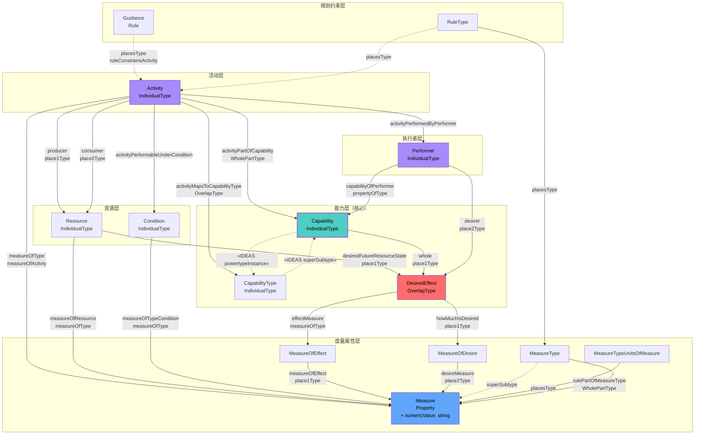
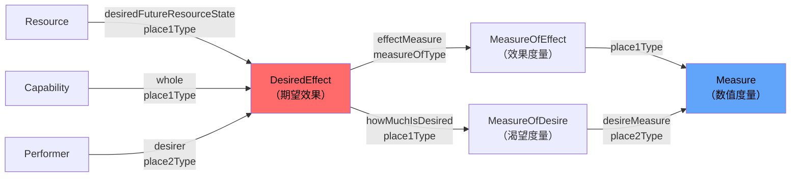
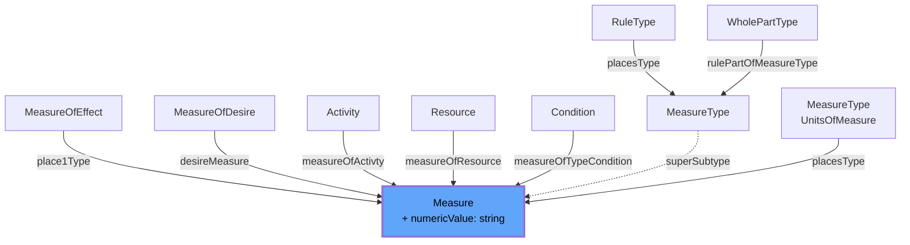
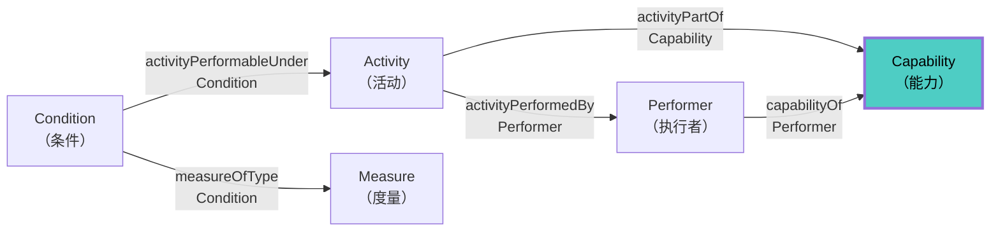
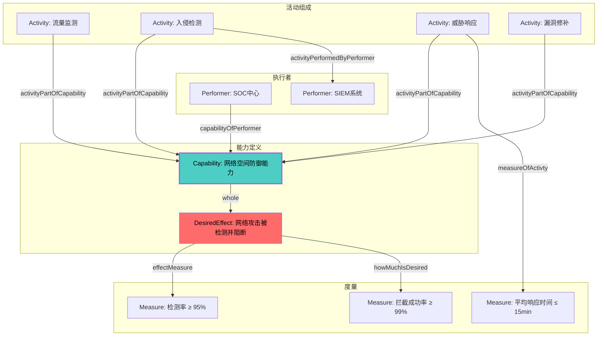

---
tags:
  - dm2/analysis
---

> **操作模板** -> [[../03-Capability/Capability-Template.md]]
> **所属数据组** -> [[../03-Capability]]

# DM2 Capability 详细分析

> **来源**：`Capability.png` 类图 + DoDAF v2.02 PDF pp.62-65 + DM2 元模型定义提取
>
> **分析日期**：2026-04-18
>
> **定位**：Capability（能力）= DM2 核心概念，回答 "What can be done?" —— 在指定条件和标准下实现期望效果的能力

---

## 一、概述

### 1.1 什么是 Capability？

**官方定义**（多来源对照）：

| 来源             | 定义                                                                                                                                                                                                                                                                                  |
| -------------- | ----------------------------------------------------------------------------------------------------------------------------------------------------------------------------------------------------------------------------------------------------------------------------------- |
| **JCIDS**      | The ability to achieve a **desired effect** under specified standards and conditions through combinations of **means and ways** to perform a set of tasks                                                                                                                           |
| **DoDAF/CADM** | An ability to achieve an objective                                                                                                                                                                                                                                                  |
| **JC3IEDM**    | The potential ability to do work, perform a function or mission, achieve an objective, or provide a service                                                                                                                                                                         |
| **MODAF**      | A high-level specification of the enterprise's ability — **not about equipment**, but a classification of some ability. Can be specified regardless of whether currently achievable. Once defined, **persistent** (not time-dependent). Only the **Capability Requirement** changes |
| **NAF**        | The ability of one or more resources to deliver an effect                                                                                                                                                                                                                           |

### 1.2 核心公式

```
Capability = Activity(ways) + Resource(means) → DesiredEffect
              [在指定条件下]
```

**PDF p.62 四条关键注释**：

| #     | 注释内容                                                                             | 含义                            |
| ----- | -------------------------------------------------------------------------------- | ----------------------------- |
| **a** | Ways and means → DM2 中解释为 **Resources 和 Activities**                             | "方式" = 活动；"手段" = 资源           |
| **b** | Desired Effect 是 Resource 的期望状态；**Capability 本质上关于 Resource 的状态**                | 能力 = 维持当前状态 或 改变未来状态          |
| **c** | Capability 通过其包含的 **Activities** 和追求的 **Desired Effects** 链接到 **Measures（度量指标）** | 可量化评估                         |
| **d** | Capability 通过 **Performer** 关联到 **Service**                                      | Service 不直接提供效果，而是提供对方式与手段的访问 |

---

## 二、类图结构解析

### 2.1 完整类图还原

基于 `Capability.png` 图片，类图核心结构如下：



### 2.2 类图中的颜色编码

| 颜色 | 含义 | 对应实体 |
|------|------|----------|
| 🟦 蓝色 | **Property（属性）** | Measure、Rule、Condition |
| 🟩 绿色 | **Type/Association 类型** | MeasureType、BeforeAfterType、OverlapType、WholePartType |
| 🟣 紫色 | **Individual（个体实例）** | Activity、Resource、Capability、Performer、DesiredEffect |
| ⬜ 白色/透明 | **IDEAS 基础关系标注** | «IDEAS superSubtype»、«IDEAS powertypeInstance» |

### 2.3 核心实体一览

| 实体 | IDEAS 层级 | 说明 |
|------|-----------|------|
| **Capability** | IndividualType | 能力实例——在特定条件/标准下实现期望效果的潜能 |
| **CapabilityType** | IndividualType | 能力的类型/分类（powertype） |
| **DesiredEffect** | OverlapType | 期望效果——资源的期望状态（重叠类型） |
| **MeasureOfEffect** | IndividualType | 效果度量类别 |
| **MeasureOfDesire** | IndividualType | 渴望度量类别 |
| **Activity** | IndividualType | 组成能力的活动 |
| **Performer** | IndividualType | 具备/展现能力的执行者 |
| **Resource** | IndividualType | 活动使用的资源 |
| **Condition** | IndividualType | 活动执行的条件 |
| **Measure** | Property | 数值型度量属性 |

---

## 三、核心关系详解

### 3.1 能力的构成关系（最关键）

#### activityPartOfCapability（WholePartType）

```
Activity ──whole──▶ Capability
```

- **含义**：一个能力由**一组活动**组成
- **类型**：整体-部分关系（强组合）
- **基数**：每个 Capability 必须由 ≥1 个 Activity 构成
- **PDF 原文**：*"Each Capability must be the result of one or more Activities"*

#### activityMapsToCapabilityType（OverlapType）

```
Activity ──mapsTo──▶ CapabilityType
```

- **含义**：活动可以映射到**能力类型**
- **类型**：重叠关系（非强绑定）
- **用途**：支持同一活动参与多个能力类型的场景

### 3.2 执行者与能力的关系

#### capabilityOfPerformer（propertyOfType）

```
Performer ──capabilityOf──▶ Capability
```

- **含义**：执行者**具备/展现**某项能力
- **类型**：属性关系（Performer 的属性之一）
- **方向**：从 Performer 指向 Capability
- **实际意义**：谁有什么能力

### 3.3 期望效果的关系链

这是类图中最复杂的子结构：



**解读**：

| 关系 | 方向 | 含义 |
|------|------|------|
| desiredFutureResourceState | Resource → DesiredEffect | 资源的**期望未来状态**就是期望效果 |
| whole | Capability → DesiredEffect | 能力**拥有**期望效果（整体-部分） |
| effectMeasure | DesiredEffect → MeasureOfEffect | 期望效果有**效果度量** |
| howMuchIsDesired | DesiredEffect → MeasureOfDesire | 期望效果有**渴望程度度量** |
| desirer | Performer → DesiredEffect | 执行者是期望效果的**渴望者** |

### 3.4 活动的完整关系集

基于图片左侧的 Activity 紫色大框：

| 关系名 | 目标 | 类型 | 含义 |
|--------|------|------|------|
| **producer** | Resource | BeforeAfterType | 活动**产生**资源 |
| **consumer** | Resource | BeforeAfterType | 活动**消耗**资源 |
| **activityPerformableUnderCondition** | Condition | OverlapType | 活动在特定**条件**下可执行 |
| **measureOfActivty** | Measure | measureOfType | 活动可被**度量** |
| **activityPartOfCapability** | Capability | WholePartType | 活动是能力的**组成部分** |
| **activityMapsToCapabilityType** | CapabilityType | OverlapType | 活动映射到**能力类型** |
| **activityPerformedByPerformer** | Performer | OverlapType | 活动由**执行者**执行 |
| **ruleConstrainsActivity** | Rule/Guidance | placesType | **规则**约束活动 |

---

## 四、度量子系统（Measure Subsystem）

### 4.1 Measure 的角色

Measure 在 Capability 类图中扮演**贯穿性角色**——几乎所有核心实体都通过某种方式链接到它：



### 4.2 度量的两种语义

| 度量类型 | 来源 | 用途 |
|----------|------|------|
| **MeasureOfEffect** | DesiredEffect → Measure | 衡量**效果达到程度** |
| **MeasureOfDesire** | DesiredEffect → Measure | 衡量**渴望程度/优先级** |
| **measureOfActivty** | Activity → Measure | 衡量**活动性能** |
| **measureOfResource** | Resource → Measure | 衡量**资源状态** |

### 4.3 RuleType 与 Measure 的关联

图中显示：
- **RuleType** → placesType → **MeasureType**
- **MeasureType** → rulePartOfMeasureType → **WholePartType**

这意味着：
1. **规则可以引用度量类型**（如："延迟不得超过 X 毫秒"）
2. **度量类型可以有单位**（MeasureTypeUnitsOfMeasure）
3. **度量类型是规则的组成部分**

---

## 五、能力建模的核心模式

### 5.1 "方式-手段-效果"三角

```
         ┌─────────────┐
         │ DesiredEffect │ ← What we want
         └──────┬───────┘
                │ achieved by
    ┌───────────┼───────────┐
    │           │           │
    ▼           ▼           ▼
┌───────┐  ┌────────┐  ┌─────────┐
│Activity│  │Resource │  │Performer│
│ (Ways) │  │ (Means) │  │ (Who)   │
└───┬───┘  └────┬───┘  └────┬────┘
    │           │          │
    └───── capabilityPartOf ───┘
                │
                ▼
          ┌──────────┐
          │Capability │ ← The Ability
          └──────────┘
```

### 5.2 条件-活动-执行者-能力 四元组

从类图中提取的核心四元组：



**完整语义**：

> *在 Condition 条件下，由 Performer 执行 Activity，这些 Activity 共同组成 Capability，而该 Performer 具备此 Capability。整个过程可通过 Measure 进行度量。*

### 5.3 DesiredEffect 的双重归属

这是一个重要的设计决策——DesiredEffect 同时属于两个父实体：

| 归属关系 | 类型 | 含义 |
|----------|------|------|
| **Capability** → whole → DesiredEffect | WholePartType | 能力**拥有**期望效果 |
| **Resource** → desiredFutureResourceState → DesiredEffect | place1Type | 资源有**期望的未来状态** |

这印证了 PDF p.62 注释 b：**Capability 本质上关于 Resource 的状态**。

---

## 六、物化层次（Type ↔ Individual）

### 6.1 能力层次的物化

| Type 层 | Individual 层 | 示例 |
|---------|---------------|------|
| **CapabilityType** | **Capability** | "网络防御能力" → "第7营的网络防御能力 v2.0" |
| **MeasureOfEffectType** | **MeasureOfEffect** | "拦截率" → "95%拦截率" |
| **MeasureOfDesireType** | **MeasureOfDesire** | "优先级等级" → "P1优先级" |

### 6.2 IDEAS Powertype 模式

类图中标注了关键的 IDEAS 基础关系：

- **`«IDEAS powertypeInstance»`**：CapabilityType → Capability
- **`«IDEAS superSubtype»`**：CapabilityType ⊃ Capability

这意味着 **CapabilityType 是 Capability 的幂类型（Powertype）**——CapabilityType 的每个实例都是 Capability 的一个子类型。

---

## 七、与其他数据组的关系

### 7.1 Capability ↔ Services（服务）

**PDF p.62 注释 d**：

> *Capabilities relate to Services via the realization of the Capability by a Performer that is a Service. In general, a Service would not provide the Desired Effect(s) but, rather, access to ways and means (Activities and Resources) that would.*

| 关系 | 说明 |
|------|------|
| Service 作为 Performer | Service 可以是 Capability 的执行载体 |
| Service ≠ 直接效果 | Service 提供的是**访问途径**，不是直接的效果实现 |
| Service → Activity + Resource | Service 暴露活动和资源的接口 |

### 7.2 Capability ↔ Goals（目标）

- **Goal** → 定义战略愿景和目标
- **Capability** → 实现 Goal 所需的能力
- **DesiredEffect** → Goal 的具体化表达
- **MeasureOfDesire** → Goal 的优先级/重要性度量

### 7.3 Capability ↔ Rules（规则）

- **Rule/Guidance** → 约束 Activity（ruleConstrainsActivity）
- **Standard** → 定义 Capability 的**性能标准**（通过 MeasureType）
- **Constraint** → 限制 Capability 的边界条件

---

## 八、架构开发过程中的使用（PDF pp.63-64）

### 8.1 各阶段如何使用 Capability

| 阶段 | 使用方式 |
|------|----------|
| **AD（架构开发）** | 描述能力；定义采办/开发需求；促进理解能力执行 |
| **SE（系统工程）** | 能力需求分析；能力分解为功能需求 |
| **Ops Planning（作战规划）** | 能力部署规划；能力缺口分析 |
| **PPBE（规划计划预算执行）** | 能力投资优先级排序；预算分配依据 |

### 8.2 PDF p.63 核心流程文本

> *"Data for Capabilities are used to describe the capability; define acquisition and development requirements necessary to provide the required capability; facilitate understanding of capability execution; develop/update/improve doctrine and educational materials in support of capability execution; and to facilitate sharing and reuse of data."*

### 8.3 能力基线分析（CBA）要素

PDF p.63-64 详细描述了能力基线分析中各类 Performer 与 Capability 的关系：

**Personnel（人员）**：
1. 每个 Person 同一时刻只能分配给一个 Organization
2. 每个 Person 可能使用一个或多个 Materiel
3. 每个 Materiel 必须被一个或多个 Person 使用
4. 每个 Capability 必须是一个或多个 Activity 的结果
5. 每个 Activity 必须由一个或多个 Performer 执行（Organization 或 Person using Materiel）
6. 每个 Person 必须是一个或多个 Activity 的 Performer
7. 每个 Rule 可能约束一个或多个 Persons

**Facilities（设施）**：
1. 每个 Facility 可能是一个或多个 Performer 及其 Materiel 的所在地
2. 每个 Performer 任意时刻只能位于一个 Facility 或 Materiel 围栏内
3. Facility 是 Individual，具有空间和时间范围

---

## 九、视图映射

### 9.1 主要视图

| 视图 | 使用的能力元素 |
|------|---------------|
| **CV-1（愿景）** | Capability 顶层分类、战略能力愿景 |
| **CV-2（能力分类）** | CapabilityType 层次结构、能力分解树 |
| **CV-3（能力阶段化）** | Capability 时间演进、能力里程碑 |
| **CV-4（能力依赖）** | Capability 间的依赖关系、能力映射 |
| **CV-6（能力vs运营活动）** | activityPartOfCapability 映射表 |
| **SV-1（系统接口）** | System as Performer 的 Capability 展现 |
| **OV-5b（作战活动模型）** | Activity → Capability 映射 |

### 9.2 推荐呈现形式

**PDF p.65 建议**：

> *"Capabilities are typically depicted in tabular or textual form. In some cases a pictorial is used to help clarify the Capability."*

推荐格式：
1. **层级表格**：主能力和派生能力的结构化展示
2. **追踪矩阵**：Capability → Activity → Goal 的双向追溯
3. **能力热图**：按时间轴展示能力的成熟度和覆盖范围

---

## 十、典型建模场景

### 场景一：网络空间防御能力建模



### 场景二：MODAF 式能力定义（不依赖装备）

根据 MODAF 的观点：

| 能力名称 | 当前可实现？ | 未来规划？ |
|----------|-------------|-----------|
| 无人机集群协同 | ❌ 不可行 | ✅ 2030年目标 |
| 全球实时态势感知 | ⚠️ 部分 | ✅ 2028年增强 |
| 量子加密通信 | ❌ 不可行 | ✅ 研究阶段 |

> *MODAF 强调：能力是**持久存在的分类**，不随时间变化。变化的只是**能力需求（Requirement）**。*

---

## 十一、版本差异：DoDAF 1.5 vs 2.0 (DM2)

| 维度 | DoDAF 1.5 | DM2 (DoDAF 2.0) |
|------|-----------|------------------|
| **定义来源** | 较模糊，依赖 JCIDS | 明确的多来源定义（JCIDS/CADM/MODAF/NAF等）|
| **Ways/Means 解释** | 未明确 | **Ways = Activities, Means = Resources** |
| **DesiredEffect 定位** | 隐含在 Goal 中 | **显式实体**，作为 Resource 的期望状态 |
| **Measure 集成** | 分离 | **深度集成**——所有核心实体均可度量 |
| **Performer 关联** | 隐式 | **显式**：capabilityOfPerformer |
| **Service 关联** | 无 | **明确**：Service 作为 Performer 实现能力 |
| **Condition 约束** | 弱 | **强**：activityPerformableUnderCondition |
| **IDEAS 基础** | 无 | **完整**：powertypeInstance、superSubtype 等 |
| **物化层次** | 模糊 | **清晰**：Type ↔ Individual 双层 |

---

## 十二、关键洞察总结

### 🔑 从类图中学到的 5 个重要发现

1. **Capability 不是孤立概念**
   - 它同时连接 Activity（构成）、Performer（承载）、DesiredEffect（目标）、Measure（度量）
   - 是 DM2 中**连接度最高**的概念之一

2. **DesiredEffect 是桥梁**
   - 连接 Capability（拥有方）和 Resource（状态来源）
   - 同时承载效果度量和渴望度量
   - **本质上是 Resource 的期望未来状态**

3. **Measure 贯穿一切**
   - Activity、Resource、Condition、DesiredEffect 都有对应的 Measure
   - 支持完整的**能力度量体系**

4. **Condition 是隐含前提**
   - 每个活动都在特定条件下可执行
   - Condition 本身也可被度量
   - 这是能力建模常被忽略的关键维度

5. **Service 的间接性**
   - Service 作为 Performer 实现能力时
   - **不直接提供 DesiredEffect**
   - 而是**提供访问方式和手段的接口**

---

*文档结束。基于 Capability.png 类图 + DoDAF v2.02 PDF pp.62-65 + DM2 元模型 JSON 提取综合分析。*
