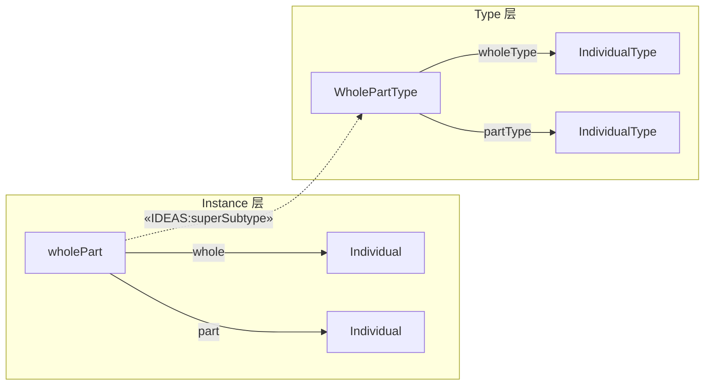
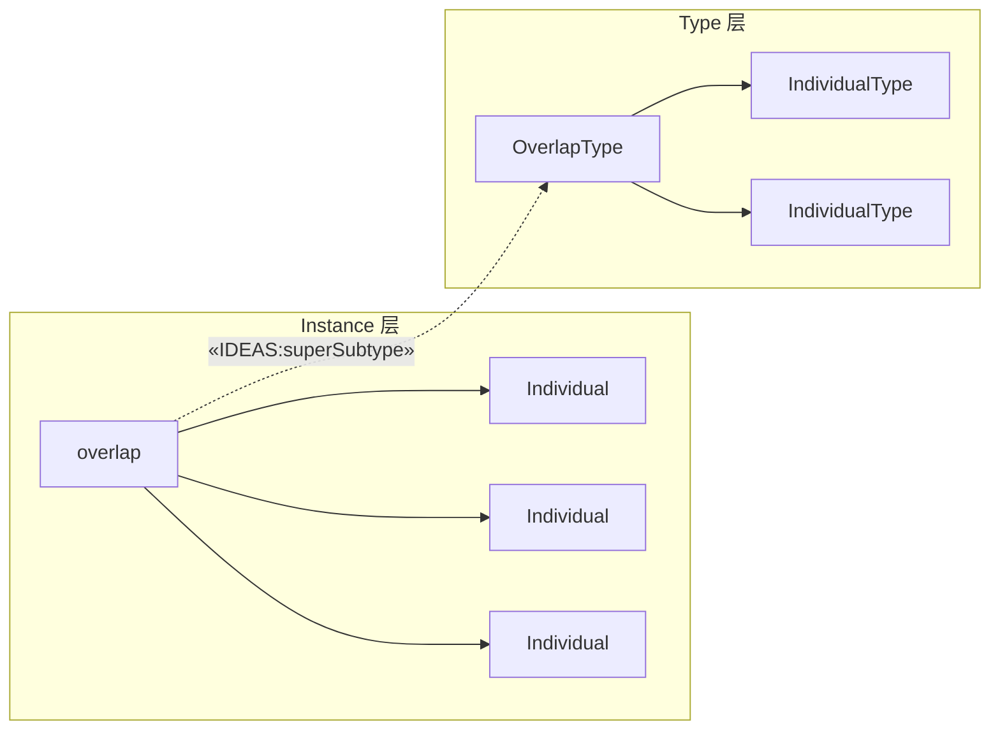
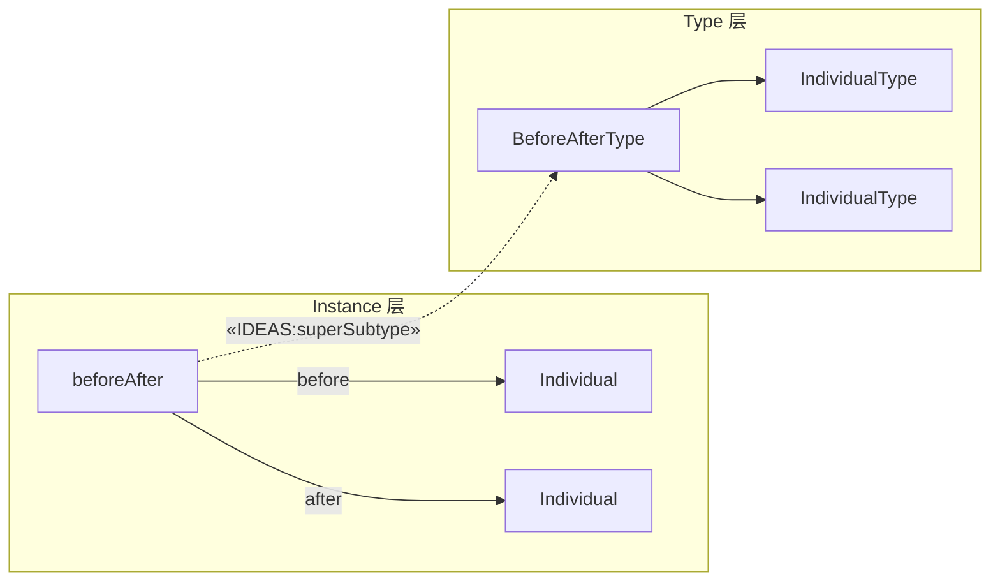
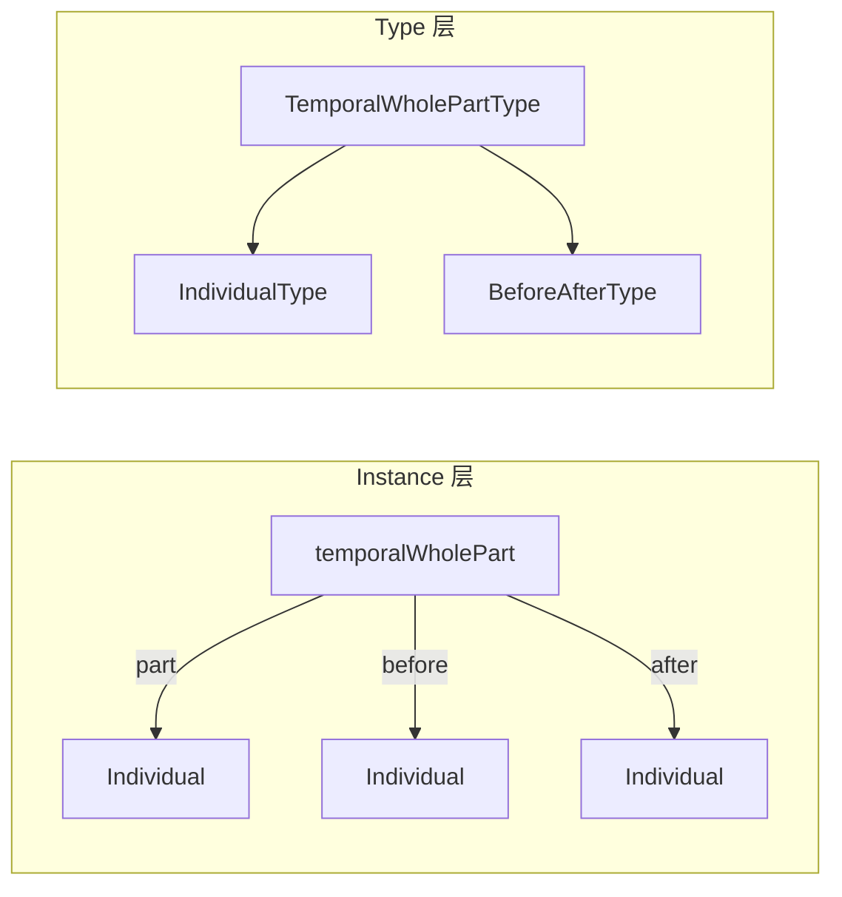
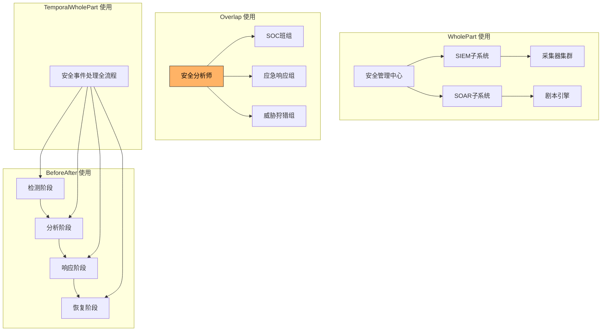

---
tags:
  - dm2/analysis
---

> **操作模板** -> [[../00-基础模式/CommonPatterns.md]]
> **所属数据组** -> [[../00-基础模式]]

# DM2 Common Patterns（通用模式）详细分析

> **来源**：`Common Patterns.png` + DoDAF v2.02 PDF (IDEAS Foundation pp.25-33)
> **日期**：2026-04-18
> **性质**：DM2 元模型"模式总览图"——Instance 层与 Type 层的双面镜像

---

## 一、概述

### 1.1 什么是 Common Patterns？

**Common Patterns（通用模式）** 是 DM2 的**模式全景图**，以"双面板"形式展示 IDEAS Foundation 定义的五大可重用关联模式在 **Instance 层**（绿色/运行时实例）和 **Type 层**（紫色/设计时类型）中的完整对应关系。

它不是引入新概念，而是将分散在 Foundation For Associations、Temporal Part & Boundaries 等多张图中的模式**集中对照呈现**——是 DM2 的"模式速查表"。

### 1.2 核心定位

```
Foundation For Associations = 定义了哪些模式存在
Common Patterns            = 这些模式在两个层面上长什么样
```

| 维度 | 说明 |
|------|------|
| **上层（绿色）** | Instance 层：具体的个体之间的关系 |
| **下层（紫色）** | Type 层：类型之间的抽象关系 |
| **左侧蓝色柱** | **Type** —— 所有类型的基类 |
| **右侧橙色柱** | **Individual** —— 所有个体的基类 |
| **最右紫色柱** | **IndividualType** —— 个体类型（连接两层的桥梁）|

---

## 二、类图解析

### 2.1 整体布局

```
┌─────────────────────────────────────────────────────────────────────┐
│                        Thing（顶层基类）                              │
│  ┌─────────────┐ ┌──────────────┐ ┌──────────────┐                  │
│  │ tuple(元组) │  │   couple     │  │ wholePart    │ ← Instance 层  │
│  │ typeinstance│  │              │  │ overlap      │    （绿色）      │
│  │ superSubtype│  │              │  │temporalW.P.  │                  │
│  │powertypeInst│  │ beforeAfter  │  │              │                  │
│  └──────┬──────┘ └──────┬───────┘ └──────┬───────┘                  │
│         │               │               │                            │
│    «IDEAS:superSubtype» «IDEAS:superSubtype» «IDEAS:superSubtype»     │ ← 继承箭头向下
│         ▼               ▼               ▼                            │
│  ┌─────────────┐ ┌──────────────┐ ┌──────────────┐                  │
│  │ TupleType   │  │ CoupleType   │  │WholePartType │ ← Type 层       │
│  │             │  │              │  │OverlapType   │    （紫色）       │
│  │             │  │              │  │BeforeAfterT. │                  │
│  │             │  │              │  │TemporalWPType│                  │
│  └─────────────┘ └──────────────┘ └──────────────┘                  │
│                                                                     │
│  Type ◄═══════════════════════════════► Individual                   │
│  (左蓝)                          (右橙)                             │
│                                                                     │
│                    IndividualType (最右紫)                           │
│                         ↑                                           │
│                   SingletonIndividualType                           │
└─────────────────────────────────────────────────────────────────────┘
```

### 2.2 颜色编码

| 颜色 | 含义 | 图中元素 |
|------|------|---------|
| 🟦 **浅蓝** | 基础元类型 | Thing, Type, Individual |
| 🟩 **浅绿** | **Instance 层关系** | tuple, couple, wholePart, overlap, temporalWholePart, beforeAfter, superSubtype, typeinstance, powertypeInstance |
| 🟪 **紫色** | **Type 层类型** | TupleType, CoupleType, WholePartType, OverlapType, BeforeAfterType, TemporalWholePartType, IndividualType, SingletonIndividualType |
| 🟧 **橙色** | Individual 实体 | Individual |

### 2.3 关键标注

图中多处标注 `«IDEAS:superSubtype»` 和 `«IDEAS:powertypeInstance»`，表明：
- 绿色 Instance 关系 **is-a** 紫色 Type 类型
- 这不是 DM2 自定义继承，而是 IDEAS 形式化本体规定的分类关系

---

## 三、五大关联模式的 Instance-Type 对应

这是本图的核心价值——**每一行都是一个"模式对"**：

### 3.1 模式对照总表

| # | Instance 层（绿色） | Type 层（紫色） | 含义 | 多重性 |
|---|---------------------|-----------------|------|--------|
| **1** | **tuple** (元组) | **TupleType** | 任意多元组关系的基类 | places: 2..\* |
| **2** | **couple** (二元组) | **CoupleType** | 有序二元关系（UML Association 的根基） | place1, place2: 1 |
| **3** | **wholePart** (整体-部分) | **WholePartType** | 刚性组成关系 | whole/part: 1 |
| **4** | **overlap** (重叠) | **OverlapType** | 弹性共享关系 | 2..\* |
| **5** | **temporalWholePart** | **TemporalWholePartType** | 时间维度的整体-部分 | part → before/after |
| **6** | **beforeAfter** (先后) | **BeforeAfterType** | 时序关系 | place1 → before → place2 |
| **7** | **superSubtype** | — | 类型继承（两层共用） | superset/subsets |
| **8** | **typeinstance** | — | 类型实例化（两层共用） | type ↔ instance |
| **9** | **powertypeInstance** | — | 幂类型实例化（两层共用） | powertype ↔ instance |

### 3.2 层级特化链

```
Thing
  └── tuple (Instance: 任意多元组关系)
        ├── couple (Instance: 二元有序关系)
        │     ├── wholePart (Instance: 刚性整体-部分)
        │     │     └── temporalWholePart (Instance: 时间整体-部分)
        │     ├── overlap (Instance: 弹性重叠)
        │     └── beforeAfter (Instance: 时序)
        │
        ├── typeinstance (Instance: 实例化断言)
        └── superSubtype (Instance: 子类型断言)
              └── powertypeInstance (Instance: 幂类型成员断言)

对应的 Type 层：
TupleType
  └── CoupleType
        ├── WholePartType
        │     └── TemporalWholePartType
        ├── OverlapType
        └── BeforeAfterType
```

---

## 四、三大基础关系详解

### 4.1 WholePart（整体-部分）—— 最重要 ⭐



**关键特征**：
- **刚性**：部分属于且仅属于一个整体（与 Overlap 的核心区别）
- **设计时决策**：架构师显式定义的组成结构
- **传递性**：如果 A partOf B 且 B partOf C，则 A partOf C
- **多重性标注**：`place1Type`(整体端类型) / `place2Type`(部分端类型)

**示例**：
- Instance：`发动机_001` wholePartOf `汽车_A7`
- Type：`发动机类型` WholePartTypeOf `汽车类型`

### 4.2 Overlap（重叠）—— 最常混淆 ⚡



**定义**（来自 JSON）：
> *A couple of wholePart couples where the part in each couple is the same.*

即：**多个整体共享同一个部分**。

**与 WholePart 的决定性区别**：

| 维度 | WholePart | Overlap |
|------|-----------|---------|
| **部分归属** | 一个部分仅属一个整体 | 一个部分被多个整体共享 |
| **时间特性** | 设计时确定 | 可动态变化 |
| **刚性** | 🔒 高刚性 | 🔄 弹性 |
| **用途** | 系统分解、组件树 | 角色共享、资源共享、人员兼职 |
| **多重性** | 1:1 | 2..\* : 1 |
| **典型场景** | 飞机→机翼→引擎 | 一个人同时属于多个组织 |

**SOC 示例**：
- ✅ WholePart：`IDS传感器` partOf `入侵检测系统`（硬件归属）
- ✅ Overlap：`安全分析师_张三` overlap {`SOC班组A`, `应急响应组`}（角色共享）

### 4.3 BeforeAfter（时序）



**定义**：
> *A couple that represents that the temporal extent end time for the individual in place 1 is less than temporal extent start time for the individual in place 2.*
>
> **别名**：proceeds, succeeds

**含义**：place1 的个体**时间上完全先于** place2 的个体——无重叠。

**示例**：
- Instance：`需求阶段` beforeAfter `设计阶段`
- Type：`规划活动类型` BeforeAfterType `执行活动类型`

---

## 五、Type 体系层次

### 5.1 Thing 三分法

```
Thing (万物之基)
  ├── Individual (个体/实例)     ← 右侧橙色柱
  │     └── IndividualType (个体类型)  ← 最右紫色柱
  │           └── SingletonIndividualType (单例个体类型)
  │
  ├── Type (类型/类)             ← 左侧蓝色柱
  │
  └── Tuple (元组/关系)          ← 上方绿色→下方紫色
        └── TupleType
```

### 5.2 superSubtype vs typeinstance vs powertypeInstance

这三个是 DM2 中最容易混淆的概念。本图清晰展示了它们的区别：

| 关系 | 连接什么 | 方向 | 示例 |
|------|---------|------|------|
| **superSubtype** | Type ↔ Type | 泛化/特化 | `车辆` superSubtype `汽车` |
| **typeInstance** | Type ↔ Individual | 分类/归类 | `汽车` typeInstance `我的丰田` |
| **powertypeInstance** | Powertype ↔ SubType | 分类维度/分区 | `车型Powertype` powertypeInstance `轿车子类型` |

```mermaid
graph TB
    T[Type] ==|"superSubtype(泛化)"==> ST[SubType]
    T ==|"typeInstance(实例化)"==> I[Individual]
    PT[Powertype] ==|"powertypeInstance(分区)"==> ST2[SubType of another Type]
    
    style T fill:#90EE90
    style PT fill:#DDA0DD
    style I fill:#FFB366
    style ST fill:#E8E8E8
    style ST2 fill:#E8E8E8
```

### 5.3 SingletonIndividualType

图的最右下角有一个特殊类型：**SingletonIndividualType**

- 通过 `«IDEAS:typeInstance»` 连接到 IndividualType
- 表示**只有一个实例的类型**
- 用途：全局唯一实体（如"地球"、"美军"、"互联网"）
- 在 Pedigree 分析中作为追溯链的自然终止点

---

## 六、TemporalWholePart（时间整体-部分）

这是一个**特殊的混合模式**——同时涉及空间组成和时间延续：



**语义**：一个时间上的整体由多个按顺序衔接的部分组成。
- 部分（part）之间有 beforeAfter 关系
- 所有部分合起来构成完整的时间整体

**示例**：
- `项目生命周期` = `{启动阶段` beforeAfter `规划阶段` beforeAfter `执行阶段` beforeAfter `收尾阶段}`
- `作战行动` temporalWholePartOf `{侦察阶段, 火力打击阶段, 战果评估阶段}`

---

## 七、模式使用指南（"90% 原则"）

### 7.1 五大模式的适用场景

| 场景 | 推荐模式 | 不推荐 | 原因 |
|------|---------|--------|------|
| 系统/组织分解树 | **WholePart** | Overlap | 分解是刚性的 |
| 人员/资源多角色共享 | **Overlap** | WholePart | 共享是弹性的 |
| 流程阶段排序 | **BeforeAfter** | — | 纯时序 |
| 项目/任务的时间分段 | **TemporalWholePart** | — | 时间+组成双重语义 |
| 一般二元属性关系 | **Couple** | — | 万能基类 |
| 类型分类体系 | **superSubtype** | — | 继承 |
| 多维度交叉分类 | **powertypeInstance** | superSubtype | Powertype 不破坏单继承 |
| 实例归类 | **typeInstance** | — | 最基本的"是...的实例" |

### 7.2 模式选择决策树

```
需要表达的关系？
├── "A 是 B 的一种" → superSubtype（继承）
├── "A 属于 B 这个类别" → typeInstance（实例化）
├── "A 按 X 维度划分出 B" → powertypeInstance（幂类型）
│
├── "A 是 B 的组成部分"（刚性、排他）
│   └── 有时间顺序？ → TemporalWholePart
│   └── 无时间顺序？ → WholePart
│
├── "A 被多个 B 共享"（弹性）
│   └── Overlap
│
├── "A 在 B 之前"（纯时序）
│   └── BeforeAfter
│
└── "A 和 B 之间有某种关系"（一般情况）
    └── Couple（或其特化）
```

---

## 八、跨数据组关系

### 8.1 Common Patterns 与其他数据组的依赖

| 数据组 | 使用的模式 | 密度 |
|--------|-----------|------|
| **Performer** | WholePart (ServicePort), Overlap (人员共享) | ⭐⭐⭐⭐⭐ |
| **OrganizationalStructure** | Overlap (报告线), superSubtype (层级) | ⭐⭐⭐⭐⭐ |
| **Location** | WholePart (设施层级), GeoPoliticalExtent (区域) | ⭐⭐⭐⭐ |
| **Capability** | superSubtype (能力层级), Overlap (能力重叠) | ⭐⭐⭐⭐ |
| **Project** | TemporalWholePart (项目阶段), BeforeAfter (里程碑) | ⭐⭐⭐⭐ |
| **Services** | Couple (端口连接), typeInstance (服务实例) | ⭐⭐⭐⭐ |
| **Measure** | propertyOfIndividual (度量值), Couple (MoE/MoD) | ⭐⭐⭐ |
| **Pedigree** | tuple (生产追溯), describedBy (信息描述) | ⭐⭐⭐ |
| **Information & Data** | couple (数据关系), Representation (表示) | ⭐⭐⭐ |
| **Rules** | couple (规则约束), describedBy | ⭐⭐ |
| **Reification Levels** | superSubtype (具象层级), typeInstance | ⭐⭐ |

### 8.2 模式频率排名

在全部 17 张 DM2 类图中：

| 排名 | 模式 | 出现次数 | 占比 |
|------|------|---------|------|
| 🥇 | **Couple/typeinstance** | ~40+ 处 | 28% |
| 🥈 | **superSubtype** | ~30+ 处 | 21% |
| 🥉 | **WholePart** | ~20+ 处 | 14% |
| 4 | **Overlap** | ~15+ 处 | 10% |
| 5 | **BeforeAfter** | ~10+ 处 | 7% |
| 6 | **powertypeInstance** | ~10+ 处 | 7% |
| 7 | **describedBy/representedBy** | ~10+ 处 | 7% |
| 8 | **TemporalWholePart** | ~5+ 处 | 4% |
| 其他 | — | ~5 处 | 3% |

---

## 九、典型应用场景：SOC 架构的模式分布

以之前设计的 SOC 安全管理中心为例，展示五大模式如何在实际架构中使用：

### 9.1 SOC 的模式使用矩阵



### 9.2 各模式在 SOC 中的具体实例

| 模式 | SOC 中的实例 | Instance 示例 | Type 示例 |
|------|-------------|---------------|-----------|
| **WholePart** | 系统组件树 | `采集器_01` wholePartOf `SIEM生产环境` | `采集器类型` WPT `SIEM子系统类型` |
| **Overlap** | 人员多角色 | `分析师_王五` overlap {`一线值班`, `二线复核`} | — |
| **BeforeAfter** | IRP 流程阶段 | `告警确认` beforeAfter `事件分级` | `确认活动` BAT `分级活动` |
| **TemporalWholePart** | 事件处理生命周期 | `事件_20260418001` temporalWholePartOf 4 个阶段 | — |
| **Couple** | 通用属性关系 | `防火墙_F5` couple (`吞吐量`, `10Gbps`) | — |
| **typeInstance** | 资产归类 | `交换机_核心01` typeInstance `网络设备类型` | — |
| **superSubtype** | 能力/系统层级 | `检测能力` superSubtype `入侵检测子能力` | — |
| **describedBy** | 文档描述 | `SOC架构文档_v2` describedBy `SOC架构` | — |

---

## 十、版本差异

### v1.5 → v2.0 变化

| 方面 | v1.5 | v2.0 |
|------|------|------|
| **模式数量** | 3-4 种核心模式 | 5 大模式 + 特化变体 |
| **形式化程度** | 半形式化描述 | IDEAS 形式化本体严格定义 |
| **Instance/Type 区分** | 模糊 | **清晰分离**（本图核心贡献）|
| **Overlap 定义** | 与 WholePart 混用 | 明确区分（共享 vs 归属）|
| **TemporalWholePart** | 未显式定义 | 作为独立模式出现 |
| **powertypeInstance** | 未区分于 typeInstance | 独立建模 |
| **可视化** | 无统一模式视图 | **Common Patterns 双面板图** |

### v2.0 新增/强化的模式

1. **Overlap** —— 从"隐含在 WholePart 中"变为独立一等公民
2. **TemporalWholePart** —— 支持项目/作战行动的时间分段建模
3. **BeforeAfter** —— 独立于 WholePart 的纯时序关系
4. **powertypeInstance** —— 支持多维交叉分类

---

## 十一、关键洞察

### 🔑 从 Common Patterns 中发现的 8 个关键洞察

| # | 发现 | 说明 | 架构意义 |
|---|------|------|---------|
| **1** | **Instance/Type 双面板 = DM2 的"罗塞塔石碑"** 🗿️ | 一张图看懂所有模式的两层形态 | 建模时不再混淆"实例关系"和"类型关系" |
| **2** | **WholePart ≠ Overlap 是最重要的区分** ⚡ | 两者的 Instance 和 Type 层都不同 | 选错模式 = 架构模型根本性错误 |
| **3** | **Couple 是"万能基类"** | 所有非继承、非组成关系最终归约为 Couple | 当不知道用什么模式时，从 Couple 开始 |
| **4** | **三个 "instance" 关系形成三角** | superSubtype / typeInstance / powertypeInstance | 分别解决：泛化、归类、多维度分类三种需求 |
| **5** | **TemporalWholePart = WholePart + BeforeAfter** | 时间维度使组成关系增加了顺序约束 | 项目管理、作战规划的首选模式 |
| **6** | **模式有明确的"刚性谱系"** | superSubtype(最刚性) > WholePart > Overlap > Couple(最弹性) | 根据约束强度选模式 |
| **7** | **90% 场景被 5 种模式覆盖** | 学会这 5 个就能应对几乎所有建模需求 | DM2 的帕累托法则体现 |
| **8** | **SingletonIndividualType 是隐含的锚点** | 图角落的小元素有重要作用 | 为全局唯一实体提供类型基础 |

---

## 十二、速查卡

### DM2 模式速查卡

```
┌─────────────────────────────────────────────────────────────────┐
│                    DM2 COMMON PATTERNS 速查卡                     │
├─────────────────────────────────────────────────────────────────┤
│                                                                 │
│  【Instance 层（绿色）】           【Type 层（紫色）】            │
│  ──────────────────────           ──────────────────────        │
│  couple (二元组)           ←→     CoupleType                   │
│  wholePart (整体-部分)     ←→     WholePartType                │
│  overlap (重叠)           ←→     OverlapType                   │
│  beforeAfter (时序)       ←→     BeforeAfterType               │
│  temporalWholePart        ←→     TemporalWholePartType         │
│  superSubtype (继承)      ←→     (共用)                        │
│  typeInstance (实例化)    ←→     (共用)                        │
│  powertypeInstance        ←→     (共用)                        │
│                                                                 │
│  【选择决策】                                                   │
│  ──────────                                                     │
│  刚性组成？    → WholePart                                      │
│  弹性共享？    → Overlap                                        │
│  时间顺序？    → BeforeAfter                                    │
│  时间分段？    → TemporalWholePart                              │
│  一般关系？    → Couple                                         │
│  是一种？      → superSubtype                                   │
│  是实例？      → typeInstance                                   │
│  多维分类？    → powertypeInstance                              │
│                                                                 │
│  【关键区别】                                                   │
│  ──────────                                                     │
│  WholePart:  A的部分只属于A（排他）                              │
│  Overlap:    A的部分也被B/C/D共享（非排他）                       │
│                                                                 │
│  【刚性谱系】                                                   │
│  ──────────                                                     │
│  superSubtype > WholePart > Overlap > Couple                    │
│    (最刚性)                                  (最弹性)            │
│                                                                 │
└─────────────────────────────────────────────────────────────────┘
```

---

## 十三、与其他已分析数据组的关系

```
                    ┌─────────────────────┐
                    │  Foundation For      │
                    │  Associations        │
                    │  (语法/元-元模型)     │
                    └──────────┬──────────┘
                               │ defines
                               ▼
              ┌──────────────────────────────┐
              │    Common Patterns            │
              │  (模式总览/双面板对照图)       │
              │  ★ 本文档 ★                   │
              └──────────┬───────────────────┘
                               │ used by
              ┌────────────────┼────────────────┐
              ▼                ▼                ▼
    ┌─────────────────┐ ┌────────────┐ ┌──────────────┐
    │ Core Data Groups│ │ Temporal   │ │ Reification   │
    │ Performer/Cap/  │ │ Patterns   │ │ Levels        │
    │ Project/Svc/etc │ │            │ │              │
    └─────────────────┘ └────────────┘ └──────────────┘
```

**Common Patterns 是 Foundation 的"用户界面"**——把底层的形式化定义翻译成架构师可以直观使用的模式对照表。

---

> **本文档完成于 DM2 类图系列分析的第 14 张。**
> 剩余：IDEAS TopLevel / Information Pedigree / Naming & Description Pattern / Temporal Part & Boundaries
