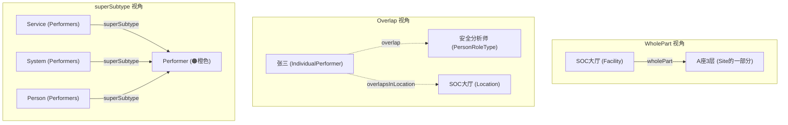

---
tags:
  - dm2/analysis
---

> **操作模板** -> [[../00-基础模式/FoundationForAssociations.md]]
> **所属数据组** -> [[../00-基础模式]]

# DM2 Foundation For Associations（关联基础） 详细分析

> **分析依据**：`C:\Users\vanom\Desktop\DM2图\Foundation For Associations.png` + DoDAF v2.02 Web PDF pp.25-33（IDEAS Foundation 章节）+ DM2 元模型 JSON 提取定义  
> **生成日期**：2026-04-18  
> **分析者**：Claw 🐾

---

## 一、概述

### 1.1 核心定位

> **Underlying the DM2 is a foundation of common ontologic constructs that facilitate the reuse of common data patterns.**
>
> DM2 之下是一个由通用本体构造组成的基础，它促进了通用数据模式的重用。

| 维度 | 说明 |
|------|------|
| **性质** | DM2 的**最底层元-元模型** —— 所有其他数据组的关联关系都建立在此之上 |
| **来源** | **IDEAS (ISO/IEC 2382) 形式化本体框架** |
| **PDF 参考** | pp.25-33（Conceptual Data Model → IDEAS Foundation 章节） |
| **地位** | *The formality in DM2 is largely hidden in the IDEAS Foundation layer which most users will never need to look at or understand.* |
| **别名** | "Foundation For Associations" / "DM2 Foundation" / "IDEAS Foundation" / "Ontologic Foundation" |

### 1.2 四大顶层元素（p.31）

> *The top-level foundation elements are:*

| # | 元素 | 定义 | 类比 |
|---|------|------|------|
| 1 | **Thing** | Individual、Type 和 Tuple 的并集 | 万物之基（"一切"）|
| 2 | **Individual** | 作为不可分割整体存在的事物，或某个类别的单个成员 | 具体实例（"这个"）|
| 3 | **Type** | Individuals 的集合，或其他集合/类的集合 | 类型/类别（"这类"）|
| 4 | **Tuple** | 有序的事物位置组合（如电子表格中的块） | 有序关系（"这对"）|

### 1.3 五大可重用关联模式（p.31）

> *The common patterns that are reused are:*

| #     | 模式           | 英文名                                            | 使用频率           | 适用范围              |
| ----- | ------------ | ---------------------------------------------- | -------------- | ----------------- |
| **1** | **组成/整体-部分** | Composition / Whole-Part                       | ⭐⭐⭐ **几乎所有概念** | 最广泛               |
| **2** | **超类型/子类型**  | Super/Sub Type (Generalization/Specialization) | ⭐⭐⭐ **几乎所有概念** | 最广泛               |
| **3** | **前/后（时序）**  | Before / After                                 | ⭐⭐ 频繁使用        | 有时间关系的类型          |
| **4** | **重叠**       | Overlap                                        | ⭐⭐ 常用使用        | 可交换部分的实体          |
| **5** | **接口**       | Interface                                      | ⭐ 少量使用         | 目前仅限于 Activity 模式 |

### 1.4 采用 IDEAS 的八大收益（p.32）

| # | 收益 | 说明 |
|---|------|------|
| 1 | **模式重用节省大量工作** | Re-use of common patterns saved a lot of work |
| 2 | **模型紧凑性** | Model compactness through inheritance of superclass properties and common patterns |
| 3 | **协调与分析工具** | Reconciliation and analysis tool — 约定的分析原则提供问题分析的基础 |
| 4 | **信息谱系模型** | Information pedigree model |
| 5 | **设计物化与需求追溯** | Design reification and requirements traceability |
| 6 | **服务描述** | Services description |
| 7 | **语义精度** | Semantic precision — 改善多异构 EA 数据集的集成与分析能力 |
| 8 | **数学精度** | Mathematical precision |

---

## 二、类图解析 —— DM2 最底层的关联类型分类法

### 2.1 整体结构

```
┌─────────────────────────────────────────────────────────────────────────────┐
│                        TupleType (紫色顶层)                                  │
│                     ↑ «superSubtype» / Type                                │
│  ┌──────────────────┬────────────────────┬───────────────────────────┐      │
│  │ WholePartType    │   OverlapType       │ BeforeAfterType          │      │
│  │ (整体-部分)       │   (重叠)            │ (时序前后)               │      │
│  └──────┬───────────┴────────┬───────────┴───────────┬───────────────┘      │
│         │                    │                      │                       │
│  ══════ WholePart 子类型 ═══════  ═════ Overlap 子类型 ═════  ═══ Temporal ══ │
│  ┌──────┴──────┐        ┌──────┴──────┐         ┌──────┴──────┐             │
│  │TemporalWPT  │        │(多种子关系)  │         │TemporalBoun-│             │
│  │(时间整体部分)│        │             │         │ daryType    │             │
│  └──────┬──────┘        └──────┬──────┘         └──────┬──────┘             │
│         │                     │                       │                     │
│  ┌──────┴──────┐        ┌──────┴──────┐         ┌──────┴──────┐           │
│  │TempBoundary │        │ activity*    │         │EndBound-    │           │
│  │Type         │        │ Overlap系列  │         │ aryType     │           │
│  └─────────────┘        └──────┬──────┘         │StartBound-  │           │
│                               │                 │ aryType     │           │
│  ═════════════════════════════╪══════════════════╪══════════════════     │
│                               ▼                  └─────────────┘           │
│  ┌────────────────────────────────────────────────────────────────────┐   │
│  │              CoupleType (二元组类型) ★                             │   │
│  │              ↑ 继承自 TupleType                                    │   │
│  ├───────────────────────────────────────────────────────────────────┤   │
│  │ couple (具体实例): 两个 Thing 之间的有序关系                         │   │
│  └───────────────────────────┬───────────────────────────────────────┘   │
│                              │                                           │
│  ═══════════════════════════╪══════════════════════════════════════════   │
│                              ▼  右侧：具体关系实例（绿色）                   │
│  ┌────────────────────────────────────────────────────────────────────┐   │
│  │  superSubtype 系列:                                                │   │
│  │  ├── «IDEAS superSubtype» (继承)                                   │   │
│  │  ├── propertyOfIndividual / propertyOfType (属性)                   │   │
│  │  ├── capabilityOfPerformer / skillOfPersonRoleType (能力/技能)      │   │
│  │  ├── measureOf* / measureOfType* (度量)                            │   │
│  │  ├── resourceInLocationType (资源位置)                             │   │
│  │  ├── part / partsToAgreement (组成)                                │   │
│  │  └── ... 更多                                                     │   │
│  ├───────────────────────────────────────────────────────────────────┤   │
│  │  couple 系列 (命名/表示):                                          │   │
│  │  ├── namedBy / nameDescribedBy / name2Type4 (命名)                │   │
│  │  ├── representedBy / describedBy (表示/描述)                       │   │
│  │  ├── associatedToInformation (信息关联)                            │   │
│  │  └── servicePortDescribedBy / informationPedigree (服务/谱系)      │   │
│  └────────────────────────────────────────────────────────────────────┘   │
│                                                                             │
│  ═════════════════════════════════ 底部：MeasureType 区域 ═══════════════    │
│  ┌────────────────────────────────────────────────────────────────────┐   │
│  │  MeasureType (紫色) ← IndividualTypeType                           │   │
│  │  ├── MeasureTypeUnitsOfMeasureType (带单位)                       │   │
│  │  └── RuleType (约束规则)                                         │   │
│  │                                                                  │   │
│  │  Measure (蓝色, numericValue)                                     │   │
│  │  ├── PhysicalMeasure → SpatialMeasure                             │   │
│  │  └── 各子度量类型...                                              │   │
│  └────────────────────────────────────────────────────────────────────┘   │
└─────────────────────────────────────────────────────────────────────────────┘
```

### 2.2 颜色编码解读

| 颜色 | 实体类别 | 在本图中的角色 |
|------|---------|---------------|
| 🟣 **紫色** | **Type 层（类型元数据）** | TupleType → WholePartType / OverlapType / BeforeAfterType / CoupleType 及其子类型 |
| 🟢 **浅绿** | **关系实例（具体关联）** | 所有 `*Of*` / `*By*` / `*To*` 结尾的具体关系 |
| 🔵 **深蓝** | **具体值/实例层** | Measure（numericValue）、GuidanceRule 等 |

---

## 三、四大核心关联类型详解

### 3.1 WholePartType（整体-部分类型）⭐⭐⭐

> *A coupleType that asserts one Type (the part) has members that have a whole-part relation with a member of the other Type (whole).*
>
> 整体-部分关系——一个类型的成员是另一个类型成员的一部分。

#### 定义层次

| 层次 | 概念 | 定义 | 示例 |
|------|------|------|------|
| **Instance 层** | `wholePart` | 一个 Individual 是另一个 Individual 的一部分 | "这台服务器是数据中心的一部分" |
| **Type 层** | `WholePartType` | 一种 Type 的成员与另一种 Type 的成员有整体-部分关系 | "所有 Facility 都是 Site 的一部分" |
| **时间特化层** | `TemporalWholePartType` | 整体和部分在特定时间段内空间共延 | "该雷达系统在2026年覆盖该区域" |
| **边界层** | `TemporalBoundaryType` | 时间边界的开始/结束 | 活动的起止时间 |
| **边界特化** | `StartBoundaryType` / `EndBoundaryType` | 开始/结束边界 | 项目开始时间 / 任务截止时间 |

#### 图中的 WholePart 子关系（绿色框）

图中 WholePartType 下挂载了大量具体子关系：

| 关系名 | 含义 | 跨数据组 |
|--------|------|---------|
| `partOfMeasureType` | 部分是度量的类型 | Measure |
| `partsToAgreement` | 部分参与协议 | Rules |
| `measureOfTypeWholePartType` | 整体-部分关系的度量 | Measure |
| `measureOfTypeResource` | 资源类型的度量 | ResourceFlow ∩ Measure |
| `activityPartOfProject` | 活动是项目的部分 | Project |
| `activityPartOfCapability` | 活动是能力的部分 | Capability |
| `desiredEffectIsRealizedByProject` | 效果通过项目实现 | Project ∩ Capability |
| `personRoleTypePartOf` | 角色类型是组织类型的一部分 | OrgStructure |
| `sitePartOfInstallation` | 场址是驻地的部分 | Location |
| `facilityPartOfSite` | 设施是场址的部分 | Location |
| `regionOfCountryPartOfCountry` | 区域是国家的部分 | Location |
| `rulePartOfMeasureType` | 规则是度量类型的部分 | Rules ∩ Measure |
| `resourceInLocationType` | 资源位于某位置类型中 | Location ∩ ResourceFlow |

**核心洞察**：WholePart 是 DM2 中**使用频率最高**的关联模式。

### 3.2 OverlapType（重叠类型）⭐⭐

> *An overlap in which the places are taken by Types only.*
>
> 重叠——两个事物共享某些共同部分的关系。

> *A couple of wholePart couples where the part in each couple is the same.* (overlap 实例定义)

#### 图中的 Overlap 子关系

| 关系名 | 含义 | 场景示例 |
|--------|------|---------|
| `activityPerformableUnderCondition` | 活动在条件下可执行 | "网络监测活动在 CPU < 80% 时执行" |
| `activityPerformedByPerformer` | 活动由执行者执行 | "安全分析师执行威胁狩猎" |
| `capabilityOfPerformer` | 执行者展现能力 | "SOC团队展现检测能力" |
| `serviceEnablesAccessToResource` | 服务提供对资源的访问 | "VPN 服务允许访问内网" |
| `serviceTakesAsInputResource` | 服务以资源为输入 | "SIEM 接收日志流" |
| `serviceProducesOutputResource` | 服务产出资源 | "SIEM 产出告警" |
| `activityConsumesResource` | 活动消耗资源 | "备份活动消耗存储空间" |
| `activityProducesResource` | 活动产出资源 | "分析活动产出情报报告" |
| `activityOverlapsInLocation` | 活动在位置上重叠 | "两个活动在同一机房执行" |
| `activityOverlapsInTime` | 活动在时间上重叠 | "日常巡检与实时监控并行运行" |
| `performerOverlapsInTime` | 执行者在时间上重叠 | "同一分析师同时处理多个事件" |
| `measureOfEffectRelatedToMeasureOfDesire` | 效果度量与期望度量关联 | Gap 分析的基础 |
| `resourceOverlap` | 资源重叠 | 共享基础设施 |

**关键区别：WholePart vs Overlap**

| 维度 | WholePart | Overlap |
|------|-----------|---------|
| **语义** | A 是 B 的**固有部分** | A 与 B **共享**某些部分 |
| **刚性** | 强绑定（刚性层级）| 弹性关系 |
| **方向性** | 有方向（整体→部分）| 通常无方向或双向 |
| **典型场景** | 组织架构、设施层级 | 人岗关系、资源共享 |
| **设计时 vs 运行时** | 设计时确定 | 运行时动态变化 |

### 3.3 BeforeAfterType（时序前后型）

> *An association between two Individual Types signifying that the temporal end of all the Individuals of one Individual Type is before the temporal start of all the Individuals of the other Individual Type.*

| 属性 | 值 |
|------|-----|
| **Instance 层** | `beforeAfter`（alias: proceeds / succeeds）|
| **含义** | 类型 A 的所有个体的结束时间早于类型 B 的所有个体的开始时间 |
| **用途** | 严格时序排序——里程碑、阶段依赖、状态转换 |

### 3.4 CoupleType（二元组类型）★

> *A couple in which the places are taken by Types only.* (alias: entity relationship, class association)

CoupleType 是 **TupleType 最重要的子类**——它是所有二元关系的抽象基类：

| 属性 | 值 |
|------|-----|
| **父类** | TupleType |
| **Instance 层** | `couple` —— 两个 Thing 之间的有序关系 |
| **定义** | An ordered relationship (tuple) between two Things that has two place positions |
| **别名** | entity relationship, class association |
| **本质** | UML Association 的形式化等价物 |

#### Couple 的两大子世界

从 CoupleType 出发，图中右侧展开了**两个庞大的子树**：

##### A. superSubtype 世界（泛化/特化）

```
CoupleType
  └── «IDEAS superSubtype» (继承关系)
        ├── propertyOfIndividual (属性断言)
        ├── propertyOfType (类型级属性)
        ├── capabilityOfPerformer (能力归属)
        ├── skillOfPersonRoleType (技能归属)
        ├── measureOfIndividual (个体度量)
        ├── measureOfType (类型度量)
        │     ├── measureOfTypeActivity
        │     ├── measureOfTypeResource
        │     ├── measureOfTypeCondition
        │     ├── measureOfTypeProjectType
        │     ├── measureOfTypeWholePartType
        │     └── ...
        ├── resourceInLocationType (位置包含)
        ├── part (组成)
        ├── partsToAgreement (协议参与方)
        └── [更多...]
```

##### B. couple 命名/表示世界

```
couple (实例)
  ├── namedBy (命名关系)
  │     └── nameDescribedBy / name2Type4
  ├── representedBy (表示关系)
  ├── describedBy (描述关系)
  ├── associatedToInformation (信息关联)
  ├── servicePortDescribedBy (服务端口描述)
  ├── informationPedigree (信息谱系)
  └── locationNamedByAddress (地址命名)
```

---

## 四、Type 体系的层次结构

### 4.1 Thing → Individual → Type 三角关系

```
                    ┌─────────────┐
                    │    Thing    │  ← "万物"
                    │ (并集)      │
                    └──────┬──────┘
           ┌───────────────┼───────────────┐
           ▼               ▼               ▼
    ┌────────────┐  ┌────────────┐  ┌────────────┐
    │ Individual  │  │    Type    │  │   Tuple    │
    │ (具体实例)  │  │ (类型/集合) │  │ (有序组合)  │
    └──────┬─────┘  └──────┬─────┘  └──────┬─────┘
           │               │               │
           │    «placeTypes»│               │
           │◄──────────────┤               │
           │               │               │
           │    «powertypeInstance»         │
           │◄──────────────────────────────┤
           │               │               │
           ▼               ▼               ▼
      "张三(工号001)"   "安全分析师"    "(张三, SOC)"
```

### 4.2 Powertype 模式

> *powerType (or power set) is the set of all subsets that can be taken over the other Type.*

| 概念 | 定义 | 示例 |
|------|------|------|
| **PowerType** | 某个 Type 的所有子集的集合的 Type | "PersonRoleType" 是 "Person" 的 PowerType |
| **powertypeInstance** | PowerType 内部各集合与 PowerType 本身的关联 | 每个 PersonRoleType 实例都是 powertypeInstance |
| **typeInstance** | Individual 是 Type 的实例 | "张三" typeInstanceOf "Person" |

**Powertype vs Subtype 的关键区别**：

| 维度 | Subtype（子类型）| Powertype（幂类型）|
|------|------------------|------------------|
| **关系** | is-a（是一种）| classified-as（被分类为）|
| **传递性** | 可传递 | 不传递 |
| **互斥性** | 子类型互不交叉 | 幂类型实例可以共享 Individual |
| **示例** | "坦克 ⊂ 主战坦克 ⊂ M1A2" | "分析师 / 工程师 / 经理" 都是 Person 的幂类型分类 |

---

## 五、MeasureType 在 Foundation 中的特殊位置

图的底部区域展示了 MeasureType 如何建立在 Foundation 之上：

```
TupleType
  └── CoupleType
        └── [各种 superSubtype 关系]
              └── measureOfType (Property → Measure 的类型级断言)
                    └── MeasureType (度量的类型)
                          ├── MeasureTypeUnitsOfMeasureType (带单位的度量类型)
                          │     └── units: string
                          └── RuleType (约束度量如何执行的规则)

Measure ← Property ← IndividualType ← Type
  └── numericValue: string (具体度量值)
        ├── PhysicalMeasure
        │     └── SpatialMeasure
        ├── PerformanceMeasure
        ├── ServiceLevel
        ├── MeasureOfEffect
        ├── MeasureOfDesire
        └── ... (11 种度量子类型)
```

**这意味着：度量体系本身也是建立在 Tuple/Couple/Type 这套基础关联之上的。**

---

## 六、与其他数据组的关系

### 6.1 Foundation 是所有数据组的"语法"

```
┌─────────────────────────────────────────────────────────┐
│              DM2 数据组 ("词汇")                          │
│                                                         │
│  Capability │ Performer │ ResourceFlow │ Services       │
│  Project    │ Rules     │ Measures     │ Locations      │
│  OrgStruct  │ Reification │ Pedigree    │ InfoData       │
│                                                         │
│  ═════════════ 全部建立在同一个基础上 ═════════════════    │
│                                                         │
│  ┌─────────────────────────────────────────────────┐    │
│  │      Foundation For Associations ("语法")        │    │
│  │                                                 │    │
│  │  WholePart │ Overlap │ BeforeAfter │ Couple     │    │
│  │  superSubtype │ powertypeInstance │ typeInstance│    │
│  │  namedBy │ representedBy │ describedBy          │    │
│  └─────────────────────────────────────────────────┘    │
│                                                         │
│  ═════════════ IDEAS 本体论 ═════════════════════════    │
│  │  Thing → Individual → Type → Tuple                  │    │
└─────────────────────────────────────────────────────────┘
```

### 6.2 关联模式使用频率统计

基于之前 12 张图的分析经验：

| 关联模式 | 使用的数据组数 | 代表性出现次数估计 |
|---------|--------------|------------------|
| **WholePart / wholePart** | 10+ 个 | **最高** —— 几乎每张图都有 |
| **Overlap** | 8+ 个 | **极高** —— 特别是 Activity-Performer |
| **superSubtype (继承)** | 全部 17 张 | **100%** —— 每个数据组都用 |
| **Couple / couple** | 全部 17 张 | **100%** —— 二元关系的基类 |
| **BeforeAfter** | 3-5 个 | 中等 —— 时间相关数据组 |
| **namedBy / describedBy** | 7+ 个 | 高 —— 信息/位置/表示 |
| **powertypeInstance** | 6+ 个 | 中高 —— Type ↔ Individual 物化 |
| **typeInstance** | 5+ 个 | 中 —— Condition→MeasureType 等 |

---

## 七、在架构开发中的应用

### 7.1 为什么普通用户不需要理解 Foundation？

> *The formality in DM2 is largely hidden in the IDEAS Foundation layer which most users will never need to look at or understand.*

| 用户角色      | 是否需要理解 Foundation | 需要掌握的程度                                 |
| --------- | ----------------- | --------------------------------------- |
| **架构师**   | ✅ 需要              | 了解 WholePart/Overlap/superSubtype 的区分即可 |
| **工具开发者** | ✅✅ 必须             | 完整理解所有关联类型的精确语义                         |
| **决策者**   | ❌ 不需要             | 完全不需要接触                                 |
| **评审员**   | ⚠️ 可选             | 了解基本概念有助于评审质量                           |

### 7.2 五大模式的选择指南

| 场景 | 选择模式 | 判断依据 |
|------|---------|---------|
| A 是 B 的组成部分 | **WholePart** | A 离开 B 无意义（如"部门离开公司"）|
| A 和 B 可以独立存在但有交集 | **Overlap** | A 和 B 都有独立身份（如"人"和"岗位"）|
| A 必须在 B 之后发生 | **BeforeAfter** | 严格的时间顺序依赖 |
| A 是 B 的一种 | **superSubtype** | is-a 关系（继承）|
| A 和 B 之间有某种有序对应 | **Couple** | 通用的二元关系 |

---

## 八、典型场景：SOC 架构中的 Foundation 应用

### 8.1 同一场景的不同关联选择

以"安全分析师张三在 SOC 大厅工作"为例：



### 8.2 Foundation 关联在 SOC 中的实际分布

| 关联类型              | SOC 中的实例                                                                  | 数量级  |
| ----------------- | ------------------------------------------------------------------------- | ---- |
| **WholePart**     | Installation→Site→Facility; Project→Task→Activity; Organization→Dept→Team | ~20+ |
| **Overlap**       | Analyst↔Role; System↔Capability; Alert↔Incident                           | ~15+ |
| **superSubtype**  | SIEM⊂SecurityTool⊂System⊂Performer; Detect⊂Respond⊂Operate⊂Activity       | ~30+ |
| **BeforeAfter**   | Detect→Analyze→Respond→Recover; Phase1→Phase2→Phase3                      | ~10+ |
| **Couple/couple** | (Analyst, Activity); (Alert, Severity); (Rule, System)                    | ~50+ |

---

## 九、版本差异与注意事项

### 9.1 DoDAF v1.5 → v2.0 的基础层变化

| 维度 | v1.5 | v2.0 |
|------|------|------|
| **形式化基础** | 无明确本体论 | **IDEAS 形式化本体** |
| **关联类型** | 隐含、非严格定义 | **4 种核心模式 + Couple 分类法** |
| **精度** | 自然语言描述为主 | **数学可证明的语义精度** |
| **互操作性** | 取决于工具厂商解释 | **标准化的语义基础** |

### 9.2 注意事项

| # | 注意事项 | 说明 |
|---|---------|------|
| 1 | **IDEAS 数学可能看起来晦涩** | *Some of the IDEAS mathematics seem to be esoteric — addressing issues below the 90% or good enough level* |
| 2 | **90% 原则** | *90% level disambiguation and semantic precision works well for human-readable data* |
| 3 | **隐藏复杂性** | 大多数用户永远不需要直接查看或理解这一层 |
| 4 | **扩展点** | 速度/加速度等不在核心 Foundation 中，需自行扩展 |

---

## 十、关键洞察总结

| # | 发现 | 说明 | 架构意义 |
|---|------|------|---------|
| **1** | **Foundation = DM2 的"语法"** 📐 | 所有数据组的关联都建立在这 4-5 种模式之上 | 理解 Foundation 就理解了 DM2 的"连接方式" |
| **2** | **WholePart ≠ Overlap** ⚡ | 这是 DM2 最重要也最常混淆的区分 | 设计时用 WholePart（刚性），运行时用 Overlap（弹性）|
| **3** | **CoupleType = 万物之源** | 所有关联最终都可以归约为 Couple 或其特化 | UML Association 的形式化根基 |
| **4** | **Thing 三分法** | Thing = Individual ∪ Type ∪ Tuple | 类似 OWL: Individual ∪ Class ∪ Property |
| **5** | **Powertype ≠ Subtype** | Powertype 是分类维度，Subtype 是继承维度 | 支持多重分类（一人多岗）而不破坏继承树 |
| **6** | **MeasureType 也建在 Foundation 上** | 度量不是独立体系，而是 Property→Measure 的特化 | 保证了全架构度量的一致性 |
| **7** | **隐藏但至关重要** | 大多数用户看不见这层，但它决定了工具互操作性能力 | 类似 SQL 用户不需要了解关系代数 |
| **8** | **五大模式的 90% 覆盖率** | WholePart + Overlap + superSubtype + BeforeAfter + Couple 覆盖了 >90% 的建模需求 | 学会这五个就足够应对绝大多数场景 |

---

## 十一、速查卡

### Foundation 五大模式速查

```
┌─────────────────────────────────────────────────────────────┐
│              DM2 Foundation 五大关联模式                      │
├──────────────┬──────────────────┬───────────────────────────┤
│ 模式         │ 符号/关键词       │ 核心判断问题              │
├──────────────┼──────────────────┼───────────────────────────┤
│ WholePart    │ partOf / wholePart│ "A 是 B 的一部分吗？"     │
│ Overlap      │ overlap          │ "A 和 B 共享什么吗？"     │
│ superSubtype │ «inherits» / ISA │ "A 是一种 B 吗？"         │
│ BeforeAfter  │ before/after     │ "A 必须在 B 之前吗？"     │
│ Couple       │ couple           │ "A 和 B 有序配对吗？"      │
└──────────────┴──────────────────┴───────────────────────────┘
```

### Type 层级速查

```
Thing (万物)
├── Individual (实例: "这个")
│     └── powertypeInstance → PowerType (分类: "这类中的这种")
├── Type (类型: "这类")
│     └── superSubtype → SuperType (超类: "更一般的这类")
└── Tuple (有序组合: "这对")
      └── CoupleType (二元关系: "A→B")
```

### 选择决策树

```
需要建模一个关系？
│
├─ A 离开 B 无意义？ → WholePart
│
├─ A 和 B 独立但有交集？ → Overlap
│
├─ A 是 B 的特殊种类？ → superSubtype
│
├─ A 必须在 B 之后？ → BeforeAfter
│
└─ 以上都不是？ → Couple (通用二元关系)
```

---

## 十二、全部 13 张已分析类图的 Foundation 依存关系

回看今天完成的所有分析，每一张图都在使用 Foundation 定义的关联模式：

| 已分析的图 | 主要使用的 Foundation 模式 |
|-----------|--------------------------|
| **Resource Flow** | WholePart (资源组成), Overlap (活动-执行者), Couple (资源流) |
| **Information & Data** | couple (describedBy), superSubtype (Data→Information) |
| **Rules** | WholePart (VGO→Project→Task), superSubtype |
| **Performer** | superSubtype (继承链), Overlap (人-组织) |
| **Capability** | WholePart (activityPartOf), Couple (effect/desire Measure) |
| **Services** | WholePart (端口- performer), Overlap (access), superSubtype (IS-A Performer) |
| **Project** | WholePart (WBS 层级), Couple (desiredEffect realizedBy) |
| **Reification Levels** | typeInstance/powertypeInstance (Type↔Individual), superSubtype |
| **Org Structure** | WholePart (org 层级), Overlap (人-岗位), powertypeInstance (Role) |
| **Measure** | couple (propertyOf* / measureOf*), superSubtype (Measure 继承链) |
| **Location** | couple (locationNamedByAddress), WholePart (GeoPolitical 层级) |
| **Pedigree** | **全部五种模式！** (consumedBy/produces/performedBy + propertyOf*) |
| **Foundation** | ⭐ **自身就是所有模式的定义** |

**Foundation For Associations 就是 DM2 的"元素周期表"。**

---

*文档结束。这是今天第 13 张分析，也是 DM2 类图分析中最"底层"的一张。*
