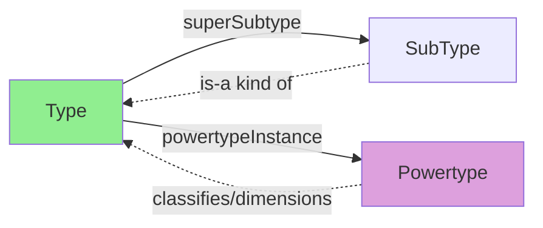

---
tags:
  - dm2/analysis
---

> **操作模板** -> [[../00-基础模式/IDEAS-TopLevel.md]]
> **所属数据组** -> [[../00-基础模式]]

# DM2 IDEAS Top Level（IDEAS 顶层本体）详细分析

> **来源**：`IDEAS TopLeve.png` + DoDAF v2.02 PDF (IDEAS Foundation pp.25-27)
> **日期**：2026-04-18
> **性质**：DM2 的"根元模型"——IDEAS 本体的顶层分类体系

---

## 一、概述

### 1.1 什么是 IDEAS Top Level？

**IDEAS Top Level（IDEAS 顶层）** 是 DM2 底层形式化本体 **IDEAS (ISO/IEC 23277)** 的最上层分类图。图中开宗明义：

> *This diagram shows the fundamental ontic categories defined by the IDEAS Model. The upper level of the IDEAS model is based on BORO and ISO15926.*

它定义了 **DM2 中一切事物的四个根本分类（ontic categories）**：

```
Thing (万物)
  ├── Individual   (个体)    —— 具体的、可识别的单一事物
  ├── Type         (类型)    —— 抽象的分类/概念
  └── Tuple        (元组)    —— 事物之间的关系
        └── TupleType (元组类型) —— 关系的类型
```

### 1.2 为什么重要？

这是 DM2 的 **"元素周期表的第一行"**：
- 所有其他类图的实体都继承自这四大类别
- 理解这四个概念 = 理解 DM2 的世界观
- 类似 OWL 的 `Individual ∪ Class ∪ Property` 三分法，但 IDEAS 多了一个 **Tuple**

### 1.3 与标准的关系

| 标准 | 对应关系 |
|------|---------|
| **BORO** (Business Object Reference Ontology) | IDEAS 的基础——提供四分类的本体框架 |
| **ISO 15926** | 工业过程领域的数据建模标准——影响 IDEAS 的 Individual 概念 |
| **OWL (Web Ontology Language)** | 类似但不同：OWL 三分法 vs IDEAS 四分法 |
| **UML** | UML 的 Class ≈ Type + Individual（未区分）|

---

## 二、类图解析

### 2.1 核心结构图

```
┌──────────────────────────────────────────────────────────────────────┐
│                         Thing（万物之基）                              │
│                        ─────────────────                             │
│                    "任何可以谈论的事物"                                │
└───────┬────────────────────────────────────────────┬────────────────┘
        │ «IDEAS: superSubtype»                       │ places: 2..*
        │                                            │ «placeType» *
        ▼                                            ▼
┌───────────────┐                            ┌────────────────┐
│  Individual   │                            │   tuple(元组)   │
│  (个体)       │                            │  (关系实例)     │
│               │                            │                │
│ 🟠 橙色       │                            │ 🟩 浅绿色      │
└───────┬───────┘                            └────────┬────────┘
        │ «IDEAS:                                    │ «IDEAS:
        │  superSubtype»                             │  superSubtype»
        ▼                                            ▼
┌───────────────┐                            ┌────────────────┐
│     Type      │                            │   TupleType    │
│    (类型)     │                            │  (关系类型)    │
│               │                            │                │
│ 🔵 蓝色       │                            │ 🟣 紫色        │
└───┬───────┬───┘                            └────────────────┘
    │       │
    │       │ «IDEAS:              places: 2..*
    │       │  powertypeInstance»  «placeType» *
    │       ▼                      «IDEAS: powertypeInstance»
    │  ┌────────────┐                    │
    │  │ Powertype  │◄───────────────────┘
    │  │ (幂类型)    │ «IDEAS: typeinstance»
    │  │            │
    │  └────────────┘
    │       
    │ «IDEAS: 
    │  powertypeInstance»
    ▼
┌──────────────────┐
│  IndividualType  │
│  (个体类型)      │
│                  │
│ 🟣 紫色          │
└──────────────────┘
```

### 2.2 颜色编码

| 颜色 | 元素 | 含义 |
|------|------|------|
| 🔵 **浅蓝** | **Thing, Type** | 抽象基类 / 类型层 |
| 🟠 **橙色** | **Individual** | 具体个体 |
| 🟩 **浅绿** | **tuple** | 关系实例 |
| 🟣 **紫色** | **IndividualType, TupleType, Powertype** | 类型层的特殊子类 |

### 2.3 关键标注解读

1. **`«IDEAS: superSubtype`**：IDEAS 形式化继承关系（不是 UML generalization）
2. **`places 2..*` / `placeType *`**：tuple 有 2 到 N 个"位置"（place），每个位置有类型约束
3. **`«IDEAS: powertypeInstance»`**：Powertype 的成员关系
4. **`«IDEAS: typeinstance`**：Type 的实例化关系
5. **`tuple (元组)`**：中文注释——说明 tuple 就是数学/逻辑中的"元组"

---

## 三、四大核心类别详解

### 3.1 Thing（万物）

**定义**：任何可以纳入模型的事物。

**特性**：
- 顶层的抽象超类
- 不直接实例化——通过其三个子类表达具体事物
- 在 IDEAS/BORO 中对应 "Particular" 概念

**哲学背景**：
> BORO 哲学中，世界由 **Particulars（殊相）** 和 **Universals（共相）** 组成。Thing = Particulars ∪ Universals。

### 3.2 Individual（个体）

**定义**：具体的、可识别的、在时空中有位置的单一事物。

**关键特征**：
- ✅ 可以被命名、指向、计数
- ✅ 存在于特定时间和地点
- ✅ 是唯一的（不可复制）
- ✅ 可参与关系（作为 tuple 的 place）
- ❌ 不是类别/概念本身

**示例**：

| 领域 | Individual 示例 |
|------|----------------|
| 物理 | 我的丰田凯美瑞、五角大楼、地球 |
| 组织 | 美国陆军第1装甲师、SOC班组A |
| 项目 | "铁穹"开发项目、JCTD 2026 演习 |
| 信息 | 《JP 3-0》2024版、架构描述文档 v2.1 |
| 时间 | 2026年4月18日17:15这个时刻 |

**与 UML Object 的区别**：
- UML Object = Class 的运行时实例
- IDEAS Individual = 更广泛——包括物理对象、组织、事件、时间点等一切"具体的东西"

### 3.3 Type（类型）

**定义**：抽象的分类、概念或模式，用于对 Individual 进行归类。

**关键特征**：
- ✅ 描述一类事物的共同特征
- ✅ 可以有 subType（子类型）形成层级
- ✅ 可以是 Powertype（幂类型）提供分类维度
- ❌ 自身不在时空中存在
- ❌ 不能直接参与 Instance 层的关系

**示例**：

| 领域 | Type 示例 |
|------|----------|
| 物理类型 | 汽车、建筑物、传感器 |
| 组织类型 | 陆军师、SOC班组、项目组 |
| 能力类型 | 网络防御能力、态势感知能力 |
| 信息类型 | 条令文档、架构描述 |
| 活动类型 | 入侵检测、事件响应、漏洞扫描 |

**Type 的两种角色**：



| 角色 | 关系 | 含义 | 示例 |
|------|------|------|------|
| **父类型** | superSubtype → SubType | "是一种"继承 | `车辆` is-a `交通工具` |
| **幂类型** | powertypeInstance → 成员 | "按...分类"维度 | `颜色Powertype` 分类 `车辆` |

### 3.4 Tuple / TupleType（元组 / 元组类型）

**Tuple 定义**：
> *A relationship between two or more things. Note: Tuples are identified by their places (i.e., the ends of the relationship).*

**核心特征**：
- **关系的实例化**——连接两个或多个 Thing
- 通过 **places（位置）** 识别——每个 place 是一个端点
- 最少 2 个 place，无上限
- 每个 place 可以有类型约束（`placeType`）

**TupleType 定义**：
> *The powertype of tuple that provides the stereotype for tuples of Types.*

即：TupleType 是所有 Tuple 关系的**类型模板**——定义了"什么样的关系是合法的"。

**Tuple 的谱系**（从通用到特化）：

```
tuple (N元关系，N≥2)
  └── couple (二元关系，N=2)
        ├── wholePart (整体-部分)
        │     └── temporalWholePart (时间整体-部分)
        ├── overlap (重叠)
        ├── beforeAfter (时序)
        ├── typeinstance (实例化断言)
        └── ... (更多特化)
```

---

## 四、三大衍生类型

### 4.1 Powertype（幂类型）

**定义**：
> *A Type that is the set (i.e., Type) of all subsets (i.e., subTypes) that can be taken over some other Type.*

通俗理解：**"类型的类型"**——一个分类维度。

**数学类比**：
- 如果 Type A = {a, b, c, d}
- 则 Powertype P(A) = {{},{a},{b},{c},{d},{a,b},{a,c},...,{a,b,c,d}} （幂集的子集）
- 实际使用中通常只取其中**有意义的分区**

**经典示例**：

| 目标 Type | Powertype（分类维度）| PowertypeInstance（成员）|
|-----------|---------------------|------------------------|
| `人员` | `军衔Powertype` | `{士兵, 军士, 尉官, 校官, 将官}` |
| `车辆` | `颜色Powertype` | `{红色车, 蓝色车, 绿色车}` |
| `能力` | `作战领域Powertype` | `{陆战能力, 海战能力, 空战能力, 网战能力}` |
| `项目` | `状态Powertype` | `{规划中, 执行中, 已完成, 已取消}` |

### 4.2 IndividualType（个体类型）

**定义**：
> *The powertype of Individual.* (IDEAS)

**独特地位**：IndividualType 是一个**二阶类型**——它的实例是 Individual，而 Individual 又是 Type 的实例。形成了三层结构：

```
IndividualType (二阶：个体的分类)
  └── instance-of → Individual (一阶：具体的单个事物)
        └── instance-of → Type (零阶：事物的抽象类别)
              └── ...
```

**用途**：
- 当需要对 Individual 本身进行分类时使用
- 例如：将 Individual 分为 `PhysicalObject`、`Organization`、`Event`、`Document` 等

**在 DM2 中的出现**：
- 出现在 OrganizationalStructure（组织类型层级）
- 出现在 Pedigree（资源追溯中的个体分类）
- 出现在 Measure（度量对象的个体类型）

### 4.3 TupleType（元组类型）

已在 3.4 节详述。补充其在 DM2 中的分布：

| 数据组 | 使用的主要 TupleType 子类型 |
|--------|--------------------------|
| Performer | CoupleType（活动执行者）、WholePartType（服务端口组成）|
| Capability | OverlapType（能力重叠）、superSubtype（能力层级）|
| Project | TemporalWholePartType（阶段）、BeforeAfterType（里程碑）|
| Services | CoupleType（服务端口连接）、typeInstance（服务实例）|
| Measure | CoupleType（MoE/MoD度量）、propertyOfIndividual（属性值）|

---

## 五、核心关系网络

### 5.1 图中的六大关系

| # | 关系 | 从 | 到 | 含义 |
|---|------|---|---|------|
| 1 | **superSubtype** | Individual | Thing | Individual is-a Thing |
| 2 | **superSubtype** | Type | Thing | Type is-a Thing |
| 3 | **superSubtype** | tuple | Thing | tuple is-a Thing |
| 4 | **superSubtype** | Individual | Type | ⚠️ 注意！Individual 也是 Type 的子类？ |
| 5 | **superSubtype** | TupleType | tuple | TupleType defines tuple |
| 6 | **powertypeInstance** | IndividualType | Type | IndividualType classifies Individuals of a Type |
| 7 | **powertypeInstance** | Powertype | Type | Powertype classifies Types |
| 8 | **powertypeInstance** | TupleType | tuple | TupleType classifies tuples |
| 9 | **typeinstance** | Powertype | Type | Powertype is an instance of Type |

### 5.2 关系 #4 的深层含义 ⚡

图中有一条非常重要的隐含关系链：

```
Individual --«IDEAS:superSubtype»--> Type
```

这意味着 **Individual 继承自 Type**！

这在 BORO/IDEAS 哲学中是有意为之的设计：
- **Every Individual is also a Type**（每个个体也是一个类型）
- 因为每个个体都可以定义一个单例集合 `{该个体}`
- 这个单例集合就是一个 Type（SingletonIndividualType）

**实际意义**：你可以同时说：
- "`我的车` is-an Individual"（它是具体的一辆车）
- "`我的车` is-a Type"（它可以作为一个类型，虽然只有一个成员）

这就是为什么 Common Patterns 图最右下角有 **SingletonIndividualType** 的原因。

### 5.3 完整的层次图谱

```
Level 3 (三阶):  IndividualType, Powertype, TupleType
                    ↑ powertypeInstance / superSubtype
Level 2 (二阶):  Individual, Type, tuple
                    ↑ superSubtype
Level 1 (一阶):  Thing (万物)
```

---

## 六、IDEAS vs 其他本体标准对比

### 6.1 四大本体的顶层分类对比

| 维度 | **IDEAS (DM2)** | **OWL (W3C)** | **BORO** | **ISO 15926** |
|------|-----------------|---------------|----------|---------------|
| **顶层分类数** | **4 个** (Ind/Type/Tuple/Thing) | 3 个 (Class/Individual/Property) | 4 个 (类似 IDEAS) | 3+ 个 |
| **关系一等公民？** | ✅ **Tuple 是独立类别** | ❌ Property 是附属 | ✅ Relator 独立 | ⚠️ 部分 |
| **Individual=Type?** | ✅ Individual is-a Type | ❌ 分离 | ✅ 类似 | ❌ 分离 |
| **Powertype?** | ✅ 一等公民 | ⚠️ owl:disjointWith 近似 | ✅ 核心 | ❌ 无 |
| **形式化程度** | ★★★★★ (ISO标准) | ★★★★★ (W3C推荐) | ★★★★☆ | ★★★★☆ |
| **工具支持** | DM2 工具链 | Protegé/推理器 | 有限 | 工业工具 |
| **适用领域** | 企业/国防架构 | 语义网/知识图谱 | 企业集成 | 过程工业 |

### 6.2 IDEAS 的独特优势

1. **Tuple 作为一等公民**：关系和实体同等重要——更符合真实世界的"万物皆关联"
2. **Individual is-a Type**：优雅地解决了单例问题
3. **Powertype 内建**：多维度分类不需要 hack
4. **BORO 哲学基础**：基于成熟的本体论研究，非 ad-hoc 设计
5. **ISO 标准**：IDEAS = ISO/IEC 23277，国际认可

### 6.3 与 UML 的关键差异

| 方面 | UML | IDEAS/DM2 |
|------|-----|-----------|
| Class | 同时代表类型和个体 | Type 和 Individual 分离 |
| Association | 附属在 Class 上 | Tuple 是独立的一等实体 |
| Generalization | 单一继承为主 | superSubtype + powertypeInstance 双轨 |
| Instance | Object = Class 的实例 | Individual ≠ Type 的实例（Individual IS-A Type）|
| Multiplicity | 在端点上标注 | 通过 placeType + cardinality |

---

## 七、在 DM2 全局中的位置

### 7.1 IDEAS Top Level = DM2 的"公理系统"

```
┌──────────────────────────────────────────────────────┐
│                  DM2 架构框架                         │
│                                                      │
│  ┌────────────────────────────────────────────┐     │
│  │         52 视图 (CV/OV/SV/DV etc.)         │     │
│  └──────────────────┬─────────────────────────┘     │
│                     │ 基于                            │
│  ┌──────────────────▼─────────────────────────┐     │
│  │        17 个数据组 (Data Groups)           │     │
│  │  Performer/Capability/Project/Services/...  │     │
│  └──────────────────┬─────────────────────────┘     │
│                     │ 使用                           │
│  ┌──────────────────▼─────────────────────────┐     │
│  │     DM2 Meta-Model (元模型)                 │     │
│  │  17 张类图 + Common Patterns                │     │
│  └──────────────────┬─────────────────────────┘     │
│                     │ 定义于                         │
│  ┌──────────────────▼─────────────────────────┐     │
│  │   ★ IDEAS Top Level (本体公理) ★            │     │
│  │   Thing / Individual / Type / Tuple        │     │
│  │   基于 BORO + ISO15926                     │     │
│  └────────────────────────────────────────────┘     │
└──────────────────────────────────────────────────────┘
```

### 7.2 四大类别在 17 个数据组中的分布

| 类别 | 主要承载者 | 数据组 |
|------|-----------|--------|
| **Individual** | 具体实体 | Performer, Location, Resource, Project(实例), Services(实例), Measure(值) |
| **Type** | 分类体系 | Capability(层级), Project(类型), OrgStructure(类型), Rules(条件) |
| **Tuple/TupleType** | 关系模式 | ResourceFlow, InfoData, Pedigree(追溯), Measure(MoE/MoD) |
| **Powertype** | 分类维度 | Measure(MeasureType), Location(LocationType), OrgStructure(OrgType) |
| **IndividualType** | 个体分类 | OrgStructure, Pedigree, Measure |

---

## 八、典型应用场景：用 IDEAS 四分类为 SOC 建模

### 8.1 SOC 架构的 IDEAS 分类

```mermaid
graph TB
    subgraph "Individual (具体实例)"
        I1["SOC中心_北京"]
        I2["分析师_张三"]
        I3["SIEM生产环境_v2"]
        I4["安全事件_20260418001"]
        I5["《SOC运营规范》v3.0"]
    end
    
    subgraph "Type (抽象类型)"
        T1["安全管理中心类型"]
        T2["安全分析师类型"]
        T3["SIEM系统类型"]
        T4["安全事件类型"]
        T5["运营规范文档类型"]
    end
    
    subgraph "Tuple (关系)"
        TU1["张三_隶属于_SOC班组A"]
        TU2["SIEM_v2_检测到_事件_001"]
        TU3["SOC中心_位于_北京基地"]
        TU4["事件_001_触发_剧本_应急响应"]
    end
    
    subgraph "Powertype (分类维度)"
        P1["严重等级: {低,中,高,严重}"]
        P2["状态: {开放/处理中/已关闭/误报}"]
        P3["角色: {值班/二线/狩猎/响应}"]
    end
    
    I1 -.->|"typeinstance"| T1
    I2 -.->|"typeinstance"| T2
    I3 -.->|"typeinstance"| T3
    TU1 -.->|"coupleInstanceOf"| "CoupleType"
    TU2 -.->|"wholePartInstanceOf"| "WholePartType"
    
    style I1 fill:#FFB366
    style I2 fill:#FFB366
    style T1 fill:#87CEEB
    style T2 fill:#87CEEB
    style TU1 fill:#90EE90
    style TU2 fill:#90EE90
    style P1 fill:#DDA0DD
    style P2 fill:#DDA0DD
```

### 8.2 建模检查清单

当为一个领域建模时，用 IDEAS 四分类做自我审查：

| 检查项 | 问题 | SOC 示例 |
|--------|------|---------|
| ✅ Individual | 我列出的具体事物是否都是唯一可识别的？ | `SIEM_v2` 是唯一实例 |
| ✅ Type | 我是否有清晰的类型分类体系？ | `SIEM系统类型` 有明确属性 |
| ✅ Tuple | 我是否把关系当作一等公民来建模？ | `检测到` 是独立的关系实例 |
| ✅ Powertype | 我的分类维度是否足够灵活？ | `严重等级` Powertype 支持自定义级别 |
| ⚠️ IndividualType | 是否需要区分不同种类的 Individual？ | 区分 `人` vs `系统` vs `文档` |

---

## 九、版本差异

### IDEAS 在 DM2 中的演进

| 版本 | IDEAS 地位 | 变化 |
|------|-----------|------|
| **DM2 v0.75/v1.0** | 未引入 | 使用 ad-hoc 元模型 |
| **DM2 v1.5** | 部分采用 | 引入 IDEAS 概念但不严格 |
| **DM2 v2.0** | **完全基于 IDEAS** | ISO/IEC 23277 形式化本体成为 DM2 的底层基础 |

### v2.0 的 IDEAS 特定增强

1. **显式的四分类图**：新增此 Top Level 图（v1.5 无）
2. **Common Patterns 双面板**：Instance/Type 清晰分离
3. **所有关系标注 `«IDEAS:xxx»`**：明确标识来源
4. **BORO + ISO15926 双重引用**：理论基础透明

---

## 十、关键洞察

### 🔑 从 IDEAS Top Level 中发现的 7 个关键洞察

| # | 发现 | 说明 | 架构意义 |
|---|------|------|---------|
| **1** | **IDEAS 四分类 = DM2 的"创世神话"** 🌍 | 万物分四类：个体、类型、元组、(它们的基类)| 这是理解 DM2 世界观的起点 |
| **2** | **Tuple 是一等公民** 🔗 | 关系与实体同等地位（不同于 UML/OWL）| 改变了建模思维——先想关系再想实体 |
| **3** | **Individual IS-A Type** 👤 | 每个个体天然也是一种类型（单例类型）| 优雅解决全局唯一实体的类型归属问题 |
| **4** | **Powertype = 灵活分类的秘诀** 🎯 | 幂类型提供不破坏继承的多维分类 | 比 OWL 的 disjointWith 更强大 |
| **5** | **BORO + ISO15926 双基因** 🧬 | 既有哲学深度又有工业实用性 | 不纯学术也不纯工程 |
| **6** | **这张图虽小但密度最高** 💎 | 仅 7 个框 + 9 条关系 | 每条线都有深远的含义 |
| **7** | **IDEAS 是"看不见的手"** 🤲 | 用户日常建模不直接接触它 | 但它决定了所有工具的互操作性 |

---

## 十一、速查卡

```
┌──────────────────────────────────────────────────────────────────┐
│                   IDEAS TOP LEVEL 速查卡                          │
├──────────────────────────────────────────────────────────────────┤
│                                                                  │
│  【四大根本类别】                                                │
│  ───────────────                                                │
│  Thing (万物)                                                    │
│  ├── Individual  (个体)  → 具体的、唯一的、有时空位置的事物        │
│  ├── Type        (类型)  → 抽象的分类、概念、模式                 │
│  └── Tuple       (元组)  → 连接事物的关系 (N≥2个place)           │
│                                                                  │
│  【三大衍生类型】                                                │
│  ───────────────                                                │
│  Powetype       (幂类型)  → "类型的类型"，分类维度               │
│  IndividualType (个体类型)→ Individual的二阶分类                  │
│  TupleType      (元组类型)→ Tuple的类型模板                      │
│                                                                  │
│  【核心关系】                                                    │
│  ──────────                                                      │
│  Individual ──is-a──→ Type (!!)                                  │
│  IndividualType ──classifies──→ Individual (via Type)            │
│  Powertype ──classifies──→ Type                                 │
│  TupleType ──defines──→ tuple                                   │
│                                                                  │
│  【vs OWL 对照】                                                 │
│  ────────────                                                   │
│  IDEAS Individual ≈ OWL Individual                               │
│  IDEAS Type       ≈ OWL Class                                   │
│  IDEAS Tuple      ≈ OWL Property (+ 一等公民地位)               │
│  IDEAS Powertype  ≈ OWL 无直接对应 (用 disjointUnionOf 近似)      │
│                                                                  │
│  【金句】                                                        │
│  ───────                                                        │
│  "In IDEAS, relationships are first-class citizens."             │
│  "Every individual is also a type."                             │
│                                                                  │
└──────────────────────────────────────────────────────────────────┘
```

---

## 十二、与其他已分析数据组的关系

```
IDEAS Top Level (本体公理 - 本文档)
    │ defines the categories used by
    ▼
Common Patterns (模式总览 - 已分析)
    │ instantiates into
    ▼
Foundation For Associations (关联定义 - 已分析)
    │ provides building blocks for
    ▼
┌─────────┬─────────┬─────────┬─────────┐
│Performer│Capability│ Project │Services │  ← 业务层数据组
│Location │ Measure  │OrgStruc │Rules    │
│Resource │Pedigree  │InfoData │Reific.  │
└─────────┴─────────┴─────────┴─────────┘
```

**IDEAS Top Level 是整个 DM2 系统的"形而上学基础"**——不直接参与业务建模，但决定了什么是可以被建模的。

---

> **本文档完成于 DM2 类图系列分析的第 15 张。**
> 剩余：Information Pedigree / Naming & Description Pattern / Temporal Part & Boundaries
