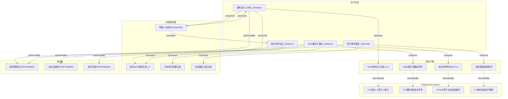

---
tags:
  - dm2/analysis
---

> **操作模板** -> [[../12-Pedigree/README.md]]
> **所属数据组** -> [[../12-Pedigree]]

# DM2 Information Pedigree（信息血缘）详细分析

> **来源**：`Information Pedigree.png` + DoDAF v2.02 PDF (相关章节)
> **日期**：2026-04-18
> **性质**：DM2 的"信息资源生产追溯元模型"——Pedigree 在信息领域的特化

---

## 一、概述

### 1.1 什么是 Information Pedigree？

**Information Pedigree（信息血缘）** 是 DM2 中专门用于**追溯信息资源生产过程**的元模型。它是通用 Pedigree 图在信息/文档领域的特化实例，聚焦于：

> **"这份信息是从哪里来的？由谁、在什么条件下、按照什么规则生产的？"**

### 1.2 与 Pedigree 的关系

| 维度 | **Pedigree (通用)** | **Information Pedigree (特化)** |
|------|---------------------|--------------------------------|
| **范围** | 所有资源类型 | 仅限 **Information / 文档类资源** |
| **核心实体** | Resource (泛) | **PedigreeInformation** (信息专有) |
| **关注点** | 物资、人员、系统、信息... | **架构文档、规范、报告、数据** |
| **典型场景** | 供应链追踪、项目审计 | **架构描述的可信度验证** |
| **图中位置** | 独立图 (pp.88-89) | 独立图 (本分析) |

### 1.3 核心公式

```
Information Pedigree = 
    信息(What) + 描述方式(How) + 生产过程(Who/When/Where/Why)
```

### 1.4 为什么需要单独的信息血缘？

因为**架构描述本身也是一种信息资源**——DoDAF 要求每份架构文档都能追溯到其来源，形成完整的证据链。

---

## 二、类图解析

### 2.1 整体结构

```
┌─────────────────────────────────────────────────────────────────────┐
│                        Thing                                        │
│  ┌────────────────┐  thingDescribed                                │
│  │ representedBy  │◄──────────────────────────────────┐            │
│  │ describedBy    │                                    │            │
│  └───────┬────────┘                                    │            │
│          │ «IDEAS:superSubtype»                        │            │
│          ▼                                            │            │
│  ┌──────────────┐      description     ┌──────────────┴──────────┐  │
│  │Representation│◄────────────────────►│   Information           │  │
│  │  Information │                     │        (蓝色)            │  │
│  └──────────────┘                      └──────────┬───────────────┘  │
│          ▲                                         │                │
│          │ «IDEAS:superSubtype»                    │ «IDEAS:         │
│          │                    powertypeInstance»   │ superSubtype»  │
│          ▼                                         ▼                │
│  ┌──────────────────┐               ┌──────────────────────┐       │
│  │PedigreeInformation│◄──place2Type──►│  InformationType     │       │
│  │  (绿色小框)       │  (紫色)        │  (紫色)              │       │
│  └────────┬──────────┘               └──────────┬───────────┘       │
│           │                                      │                  │
│           │                                      │ superSubtype      │
│           ▼                                      ▼                  │
│  ┌──────────────────┐               ┌──────────────────────┐       │
│  │PedigreeInfoType  │               │ SignType              │       │
│  │  (紫色)          │               │ RepresentationType    │       │
│  └──────────────────┘               └──────────────────────┘       │
│                                                                   │
│  ════════════════════════ 生产流程区域 ═════════════════════════   │
│                                                                   │
│  activityConsumesResource ◄─── Activity ───► activityProducesRes.  │
│        (绿色)                          (绿色)                      │
│                                           │                        │
│                                    ruleConstrainsActivity          │
│                                           ▲                        │
│                                     Guidance / Rule               │
│                                                                     │
│  measureOfTypeActivity    measureOfTypeResource    Measure+Property │
│       (绿色)                   (绿色)                 (蓝+绿)      │
│                                                          + numericValue│
│                                                                   │
│  ════════════════════════ 参与者区域 ═══════════════════════════   │
│                                                                   │
│  IndividualType ──superSubtype──► LocationType                    │
│       (紫)              (紫)                                      │
│                                          ▲                        │
│                                   Individual ─wholePart──► Location │
│                                   (橙)             (橙)            │
│                                                                   │
│  IndividualTypeType ──superSubtype──► MeasureType                 │
│  MeasureTypeUnitsOfMeasure (+ units: string)                       │
│                                                                   │
│  Performer                                                           │
│       ▲                                                              │
│  activityPerformedByPerformer (Overlap)                             │
└─────────────────────────────────────────────────────────────────────┘
```

### 2.2 颜色编码

| 颜色 | 元素类别 | 图中元素 |
|------|---------|---------|
| 🔵 **浅蓝** | 基础实体 | Thing, Information, Measure |
| 🟩 **浅绿** | Instance 层关系/实体 | PedigreeInformation, activityConsumesResource, activityProducesResource, measureOfType* |
| 🟣 **紫色** | Type 层分类 | IndividualType, InformationType, PedigreeInformationType, SignType/RepresentationType, LocationType, MeasureType, RuleType, Guidance |
| 🟠 **橙色** | Individual 实体 | Individual, Location |

### 2.3 三大区域划分

| 区域 | 内容 | 关注点 |
|------|------|--------|
| **左上：信息表示区** | representedBy/describedBy → Representation/Information → PedigreeInformation | "信息如何被表示和描述" |
| **中部：生产流程区** | Activity + Consumes/Produces + Rules + Measures | "信息如何被生产和约束" |
| **右下：参与者/上下文区** | Performer, Location, IndividualType 层级 | "谁、在哪里参与信息生产" |

---

## 三、核心实体详解

### 3.1 Information & PedigreeInformation

**Information（信息）**：
- 蓝色大框，图的中心实体之一
- 继承自 `representedBy/describedBy` 关系链
- 通过 `description` 连接到 Representation

**PedigreeInformation（血缘信息）**：
- **绿色小框**，继承自 Information 的特化
- 定义：*"Information describing pedigree"* —— 描述其他信息来源的信息
- 出现在 **6 个数据组**中：InfoData, Reification, Services, Pedigree, InfoPedigree, Foundation
- 这是整个图的**主角**

**PedigreeInformationType**：
- PedigreeInformation 的 Powertype
- 对 PedigreeInformation 进行分类

### 3.2 表示体系（Sign / Representation）

```mermaid
graph LR
    T[Thing] --|"representedBy"| R[Representation]
    T --|"describedBy"| I[Information]
    I --|"«IDEAS:superSubtype»"| PI[PedigreeInformation]
    
    R -.->|"«IDEAS:superSubtype»"| RT[RepresentationType]
    RT -.->|"«IDEAS:superSubtype»"| ST[SignType]
    
    I -.->|"«IDEAS:powertypeInstance»"| IT[InformationType]
    IT -.->|"«IDEAS:superSubtype»"| PIT[PedigreeInfoType]
    IT -.->|"«IDEAS:superSubtype»"| ST2[SignType]
    
    style PI fill:#90EE90
    style ST fill:#DDA0DD
    style PIT fill:#DDA0DD
```

**关键区分**：

| 概念 | 定义 | 示例 |
|------|------|------|
| **Thing** | 被表示的对象 | 北京这个城市 |
| **Sign** | 表示 Thing 的符号 | "北京"、"Beijing"、"010" |
| **Representation** | Sign 的具体实现形式 | 地图上的标记、数据库中的记录 |
| **Information** | 关于 Thing 的结构化描述 | "北京是中国的首都，人口2189万" |
| **PedigreeInformation** | 描述 Information 来源的信息 | "此数据来自国家统计局2024年鉴" |

**Sign vs Representation**：
- **Sign** 是抽象的符号概念（IndividualType）
- **Representation** 是 Sign 的具体 Powertype 分类

### 3.3 InformationType 的多重角色 ⭐

InformationType 在图中是一个**超级连接器**，同时是多个概念的父类型：

```
InformationType (信息的类型分类)
  ├── «IDEAS:superSubtype» → PedigreeInformationType (血缘信息类型)
  ├── «IDEAS:superSubtype» → SignType (符号类型)
  └── «IDEAS:superSubtype» → RepresentationType (表示类型)
```

这意味着：**血缘信息、符号、表示都是"信息"的特殊子类型**——统一了信息的不同用途视角。

---

## 四、生产流程网络

### 4.1 三大生产关系

这是与 Pedigree 共享的核心叙事线：

```mermaid
graph TB
    ACT["Activity<br/>(活动)"]
    
    ACT --|"activityConsumesResource<br/>BeforeAfterType+OverlapType"--> CONSUMER[consumer:<br/>place1Type]
    ACT --|"activityProducesResource<br/>BeforeAfterType+OverlapType"--> PRODUCER[producer:<br/>place1Type]
    
    RULE["Guidance / Rule<br/>(规则/指导)"]
    RULE --|"ruleConstrainsActivity<br/>superSubtype"--> ACT
    
    MEA_ACT["measureOfTypeActivity"]
    MEA_RES["measureOfTypeResource"]
    MEA_ACT --> ACT
    MEA_RES --> PRODUCER
    
    style ACT fill:#90EE90
    style CONSUMER fill:#E8E8E8
    style PRODUCER fill:#E8E8E8
    style RULE fill:#87CEEB
```

### 4.2 各关系的详细含义

#### activityConsumesResource（活动消耗资源）
- **类型**：BeforeAfterType + OverlapType（联合约束）
- **语义**：活动在其执行过程中消耗某种资源（通常是信息或输入数据）
- **时序**：资源在活动开始前就存在（BeforeAfter），且可能被多个活动共享（Overlap）
- **place1Type** = consumer（消费者/活动端）

#### activityProducesResource（活动产生资源）
- **类型**：BeforeAfterType + OverlapType
- **语义**：活动产出新的资源（信息、文档、数据等）
- **时序**：资源在活动完成后才存在（BeforeAfter），产出物可能被多方使用（Overlap）
- **place1Type** = producer（生产者/活动端）

#### ruleConstrainsActivity（规则约束活动）
- **类型**：superSubtype（继承式约束）
- **语义**：Guidance 或 Rule 为 Activity 设定边界条件
- **来源**：
  - **Guidance**："An authoritative statement intended to lead or steer the execution of actions."
  - **Rule**：更具体的条件/约束

### 4.3 Measure 在生产流程中的角色

| 度量关系 | 测量对象 | 用途 |
|---------|---------|------|
| **measureOfTypeActivity** | Activity 类型 | 度量活动的性能（耗时、成本、质量）|
| **measureOfTypeResource** | Resource 类型 | 度量资源的属性（大小、格式、可信度）|
| **Measure + Property + numericValue** | 个体属性值 | 具体的度量数值（如"处理时间=3.5秒"）|

---

## 五、参与者与上下文

### 5.1 Performer（执行者）

- 图右下角的紫色框
- 通过 `activityPerformedByPerformer`（**OverlapType**）连接到 Activity
- **注意使用 OverlapType 而非 WholePartType**：一个 Performer 可以同时参与多个 Activity

### 5.2 Location（位置）

```mermaid
graph LR
    ILT[IndividualType] --|"«IDEAS:superSubtype»"| LT[LocationType]
    
    IND[Individual] --|"WholePartType<br/>resourceInLocationType"| LOC[Location]
    IND --|"partType"| LT
    LOC --|"wholeType"| LT
    
    LOC --|"«IDEAS:powertypeInstance»"| LT
    
    style IND fill:#FFB366
    style LOC fill:#FFB366
    style LT fill:#DDA0DD
```

- **IndividualType → LocationType**：位置类型是个体类型的子类型（位置也是个体的一种！）
- **resourceInLocationType**（WholePartType 特化）：资源位于某个位置
- Location 同时连接到 IndividualType 和 Individual 两层

### 5.3 MeasureType 与 RuleType

**MeasureType 系列**：
```
IndividualTypeType 
  └── «IDEAS:superSubtype» → MeasureType
        └── MeasureTypeUnitsOfMeasure (+ units: string)
```
- MeasureType 是 IndividualTypeType 的子类型
- MeasureTypeUnitsOfMeasure 有一个额外属性 `units: string`（度量单位）

**RuleType**：
- 出现在图的右下角
- `place1Type` 标注表明它通过某个 Tuple 关系连接

---

## 六、Information Pedigree vs Pedigree 对比

### 6.1 详细对比表

| 维度 | **Pedigree (通用)** | **Information Pedigree** |
|------|---------------------|--------------------------|
| **焦点资源** | Resource (任意) | **PedigreeInformation / Information** |
| **核心问题** | "这个资源怎么来的？" | **"这份信息/文档怎么来的？"** |
| **表示层** | 简单提及 | **详细的 Sign/Representation 体系** |
| **符号学** | 无 | **有（Sign ↔ Thing 的指称关系）** |
| **度量集成** | 有 | **有 + numericValue 属性** |
| **规则约束** | 有 | **有 Guidance + Rule 双轨** |
| **位置追踪** | 有 | **有 Location 集成** |
| **典型产物** | 物资清单、组件树 | **架构文档族、数据字典、规范集** |
| **适用视图** | SV-8 (系统演化) | **StdV-1 (标准)**, DV-2 (字典) |

### 6.2 共享元素

两者共享的核心元素：
- ✅ Activity + Consumes/Produces 三件套
- ✅ measureOfTypeActivity / measureOfTypeResource
- ✅ ruleConstrainsActivity
- ✅ Performer + activityPerformedByPerformer
- ✅ Location 集成
- ✅ IndividualType 层级

### 6.3 Information Pedigree 独有元素

| 独有元素 | 说明 |
|---------|------|
| **Information / PedigreeInformation** | 信息作为一等公民 |
| **Sign / SignType** | 符号学基础——符号指称事物 |
| **Representation / RepresentationType** | 表示形式的分类 |
| **describedBy / representedBy** | 描述和表示的双重关系 |
| **numericValue : string** | Measure 上的具体数值属性 |
| **Guidance** | 区别于 Rule 的"方向性引导" |
| **InformationType 多重继承** | 作为 SignType/RepType/PedigreeInfoType 的共同父类 |

---

## 七、应用场景

### 7.1 架构文档溯源矩阵

以 SOC 安全管理中心设计为例：



### 7.2 信息血缘追溯示例

| 追溯维度 | 具体内容 |
|---------|---------|
| **What** | SOC架构设计文档 v2.1 |
| **Who Produced** | 架构师团队 (Performer) |
| **When** | 2026-04-10 工作坊 |
| **Where** | 北京基地会议室 (Location) |
| **From What** | 原有 v1 文档 + 等保2.0标准 |
| **Following What Rule** | DoDAF CV-1/SV-1 模板要求 |
| **Measured By** | 文档完整度评分=92%, 审核通过率=100% |
| **Represented By** | Markdown 格式 + Enterprise Architect 模型 |
| **Described By** | PedigreeInformation: "基于2026年Q1架构评审意见修订" |

### 7.3 Sign/Representation 在实践中的体现

| 层次 | SOC 示例 |
|------|---------|
| **Thing** | 入侵检测能力 |
| **Sign** | "入侵检测"、"ID"、" Intrusion Detection" |
| **Representation** | OV-5b活动图中的圆角矩形、SV-4功能描述中的文本条目、CSV 数据字典中的一行 |
| **Information** | "入侵检测能力包括恶意流量识别、异常行为分析、威胁情报关联三个子功能..." |
| **PedigreeInformation** | "此定义来源于 JP3-0联合作战条令第六章，经安全专家组适配" |

---

## 八、跨数据组关系

### 8.1 Information Pedigree 连接的数据组

| 数据组 | 连接方式 | 密度 |
|--------|---------|------|
| **Information And Data** | 核心（Information/PedigreeInformation 定义）| ⭐⭐⭐⭐⭐ |
| **Reification Levels** | Information 是具象层级的一部分 | ⭐⭐⭐⭐⭐ |
| **Services** | 服务契约/接口描述 | ⭐⭐⭐⭐ |
| **Pedigree** | 父/泛化关系（InfoPedigree is-a Pedigree 的特化）| ⭐⭐⭐⭐⭐ |
| **DM2 Foundation** | Sign/Representation/Guidance 定义 | ⭐⭐⭐⭐ |
| **Location** | 信息产生的位置 | ⭐⭐⭐ |
| **Rules** | Guidance/Rule 约束 | ⭐⭐⭐ |
| **Measure** | 信息质量度量 | ⭐⭐⭐ |
| **Performer** | 信息生产者 | ⭐⭐⭐ |
| **Project** | 信息产出的项目管理 | ⭐⭐ |

### 8.2 Information Pedigree 的独特价值

| 能力 | 说明 |
|------|------|
| **文档可信度验证** | 每份文档都有完整的血缘链 |
| **变更影响分析** | 修改源头信息可追踪所有下游依赖 |
| **合规审计支持** | 满足"DoDAF描述必须可追溯"的要求 |
| **知识资产治理** | 将架构文档视为受管理的资产 |
| **多表示同步** | 同一信息的多种表示（图/表/文本）保持一致 |

---

## 九、与其他已分析图的关系

```
Pedigree (通用追溯 - 已分析)
    │ specialises into
    ▼
Information Pedigree (信息追溯 - ★ 本文档 ★)
    │ uses
    ├── Sign/Representation (来自 Foundation)
    ├── Activity Consumes/Produces (来自 Pedigree)
    ├── Measure + numericValue (来自 Measure)
    ├── Location (来自 Location)
    └── Guidance/Rule (来自 Rules)
    
Common Patterns (模式总览 - 已分析)
    │ provides patterns for
    ▼
Information Pedigree 中使用的所有关系类型:
    - couple (describedBy, representedBy)
    - typeinstance (powertypeInstance 变体)
    - superSubtype (类型层级)
    - overlap (activityPerformedByPerformer)
    - BeforeAfter (Consumes/Produces)
    - WholePart (resourceInLocation)
```

---

## 十、关键洞察

### 🔑 从 Information Pedigree 中发现的 7 个关键洞察

| # | 发现 | 说明 | 架构意义 |
|---|------|------|---------|
| **1** | **Information 也是资源** 📄 | PedigreeInformation 继承自 Information，而 Information 通过 Resource 关联到生产流程 | 架构文档不是"附属品"，而是需要被管理的"一等公民" |
| **2** | **三层表示体系** 🪧 | Thing → Sign → Representation → Information | Peirce 符号学的三元模型在 DM2 中的体现 |
| **3** | **describedBy ≠ representedBy** | describedBy = 结构化描述；representedBy = 符号表示 | 一份文档可以有多种表示但只有一种描述 |
| **4** | **Guidance ≠ Rule** | Guidance = 方向性引导；Rule = 条件性约束 | 架构中同时需要"北极星"(Guidance)和"护栏"(Rule) |
| **5** | **Performers 用 Overlap 连接** | activityPerformedByPerformer 使用 OverlapType | 一个人可以同时在多个信息生产活动中扮演角色 |
| **6** | **numericValue 使度量落地** | Measure 上直接带 `numericValue: string` | 不再需要外部表来存具体数值 |
| **7** | **最实用的追溯场景** | 架构文档族的可信度验证 | 回答"这份架构描述为什么可信？"的关键工具 |

---

## 十一、速查卡

```
┌──────────────────────────────────────────────────────────────────┐
│               INFORMATION PEDIGREE 速查卡                         │
├──────────────────────────────────────────────────────────────────┤
│                                                                  │
│  【核心问题】                                                    │
│  ──────────                                                     │
│  "This information came from WHERE, by WHOM, following WHAT?"   │
│                                                                  │
│  【信息三层次】                                                  │
│  ──────────                                                     │
│  Thing (被描述的对象)                                            │
│    ├── representedBy → Sign (符号: "名称")                       │
│    ├── representedBy → Representation (表示形式)                 │
│    └── describedBy → Information (结构化描述)                    │
│            └── → PedigreeInformation (描述来源的信息)            │
│                                                                  │
│  【生产四要素】                                                  │
│  ──────────                                                     │
│  Activity                                                        │
│    ├── consumes → InputResources (BeforeAfter+Overlap)          │
│    ├── produces → OutputResources (BeforeAfter+Overlap)         │
│    ├── constrainedBy → Guidance/Rule                            │
│    └── performedBy → Performer (Overlap)                        │
│                                                                  │
│  【vs 通用 Pedigree】                                            │
│  ─────────────────                                              │
│  通用: Resource (物资/人员/系统...)                              │
│  信息: PedigreeInformation (文档/规范/数据/模型...)              │
│  新增: Sign/Representation/Guidance/numericValue                │
│                                                                  │
│  【典型输出】                                                    │
│  ──────────                                                     │
│  ✓ 架构文档溯源矩阵                                              │
│  ✓ 变更影响链                                                    │
│  ✓ 合规审计证据包                                                │
│  ✓ 多表示一致性检查表                                            │
│                                                                  │
└──────────────────────────────────────────────────────────────────┘
```

---

> **本文档完成于 DM2 类图系列分析的第 16 张。**
> 剩余：Naming & Description Pattern / Temporal Part & Boundaries
