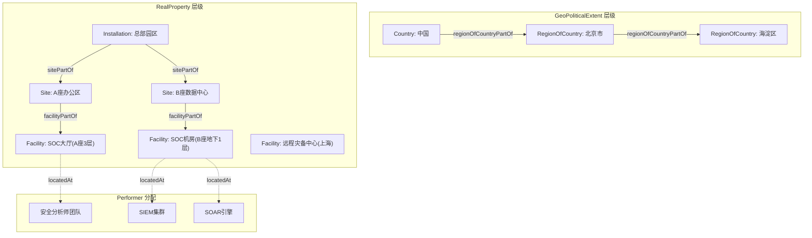

---
tags:
  - dm2/analysis
---

> **操作模板** -> [[../07-Location/Location-Template.md]]
> **所属数据组** -> [[../07-Location]]

# DM2 Locations（位置）数据组 详细分析

> **分析依据**：`C:\Users\vanom\Desktop\DM2图\Location.png` + DoDAF v2.02 Web PDF pp.85-87 + DM2 元模型 JSON 提取定义  
> **生成日期**：2026-04-18  
> **分析者**：Claw 🐾

---

## 一、概述

### 1.1 核心定义

> **A location is a point or extent in space.**
>
> 位置是空间中的点或范围。

| 来源                     | 定义                                                                                                                                                                                              |
| ---------------------- | ----------------------------------------------------------------------------------------------------------------------------------------------------------------------------------------------- |
| **DoDAF v2.02 (p.85)** | A location is a point or extent in space. The need to specify or describe Locations occurs in some Architectural Descriptions when it is necessary to support decision-making of a core process |
| **IDEAS 元模型**          | Location 继承自 IndividualResource（橙色），IndividualResource → Individual → Thing —— 位置是一种"具体资源"，是 Thing 的特化                                                                                          |
| **v1.x 遗留**            | Location 概念支持了 DoDAF V1.0/V1.5 的 **System Node** 概念；v2.0 中被泛化和精确定义                                                                                                                              |

### 1.2 核心公式

```
Location = Point | Line | Surface | SolidVolume
         + Address (命名模式)
         + GeoPoliticalExtent (政治地理范围)
         + Facility/Site/Installation (设施层级)

Location ≠ Performer！ Facility 本身不执行活动，
Facility 的功能由位于其中的 Performer 执行的活动来描述。
```

### 1.3 v2.0 的关键变化

> *The role of Locations in the decision process was implicit in earlier versions of DoDAF. In this version, they are treated explicitly and precisely to allow more rigorous analysis of requirements.*

| 维度 | v1.5 | v2.0 |
|------|------|------|
| **地位** | 隐式（System Node 内嵌）| **显式独立数据组** |
| **精度** | 模糊的节点概念 | **精确的几何+命名双模式** |
| **范围** | 仅系统部署位置 | **覆盖所有空间维度** |
| **用途** | 系统图上的圆圈 | **支撑 BRAC/JCIDS/Ops/SE 决策** |

---

## 二、类图解析

### 2.1 完整元模型结构

```
┌──────────────────────────────────────────────────────────────────────────────┐
│                         Thing (顶层蓝色)                                      │
│                    ↑ «IDEAS superSubtype»                                     │
│ ┌────────────────┬──────────────────┬───────────────────────────────────┐    │
│ │ Representation │   Individual     │           ...                    │    │
│ │ (Name)         │   (🟠橙色)       │                                   │    │
│ └───────┬────────┴────────┬─────────┴───────────────────────────────────┘    │
│         ↑                 ↑                                                   │
│ representedBy        «IDEAS superSubtype»                                    │
│         │          ┌────────────────┐                                       │
│         │          │ IndividualResource│ ← 🟠 橙色                          │
│         │          └───────┬────────┘                                       │
│ namedBy                │ «IDEAS»                                            │
│         │          ┌─────▼─────────┐                                       │
│    Name ◄───────────│ ★ Location      │ ★ 核心                              │
│ (蓝色)               │ (🟠橙色)        │                                       │
│                      └───┬────┬─────┘                                       │
│                          │    │                                             │
│            ┌─────────────┘    └────────────┐                               │
│            ▼                                ▼                               │
│  ═══════ 左下：GeoPoliticalExtent ════  ═══ 右侧：SpatialExtent ═════       │
│  ┌──────────────────────────┐      ┌────────────────────────────────┐       │
│  │ GeoPoliticalExtent (🟠)  │      │ SolidVolume (🟠)               │       │
│  │   ├─ RealProperty        │      │                               │       │
│  │   │   ├─ GeoFeature      │      ├─ Surface (🟠)                │       │
│  │   │   │   ├─ Installation│      │   ├─ PlanarSurface (🟠)       │       │
│  │   │   │   │   ├─ Site(🟠)│      │   │   ├─ PolygonArea         │       │
│  │   │   │   │   │   └─Facility│      │   │   ├─ RectangularArea   │       │
│  │   │   │   │   │          │      │   │   ├─ EllipticalArea      │       │
│  │   │   │   │   │          │      │   │   └─ CircularArea        │       │
│  │   │   │   │   │          │      │   └─ Line (🟠)              │       │
│  │   │   │   │   │          │      │       └─ Point (🟠)          │       │
│  │   │   │   │   │          │      │           └─ GeostationaryPoint│      │
│  │   │   │   │   │          │      └────────────────────────────────┘       │
│  │   │   │   └── Country    │                                          │       │
│  │   │   └─ RegionOfWorld   │                                          │       │
│  │   └─ RegionOfCountry     │                                          │       │
│  └──────────────────────────┘                                          │       │
│                                                                             │
│  ═══════ 上左：Address 命名模式 ══════════  ═══ 右上：关联区域 ══════════     │
│  ┌──────────────────┐              ┌──────────────────────────────┐        │
│  │ Address (黄色⚠️)  │              │ WholePartType (紫色)         │        │
│  │ locationNamedBy  │←             │ resourceInLocationType (绿)  │        │
│  │    Address       │              │ IndividualResourceLocation   │        │
│  └──────────────────┘              │ LocationType (紫色)          │        │
│                                    └──────────┬───────────────────┘        │
│  ═══════ 右中：度量关联区域 (Measure) ══════════════════════════════════     │
│  ┌────────────────────────────────────────────────────────────────┐        │
│  │ PositionReferenceFrame (蓝色)                                  │        │
│  │ coordinateCenterDescribedBy → Point                           │        │
│  │ axesDescribedBy → (旋转轴)                                    │        │
│  │                                                                │        │
│  │ Measure (蓝色, numericValue: string)                           │        │
│  │ measureOfIndividualPoint → Point                              │        │
│  │ measureOfIndividual → Individual                              │        │
│  │ PhysicalMeasure → SpatialMeasure                              │        │
│  │                                                                │        │
│  │ MeasureTypeUnitsOfMeasure (units: string)                     │        │
│  └────────────────────────────────────────────────────────────────┘        │
│                                                                             │
│  ═══════ 右上角注释框 ════════════════════════════════════════════════      │
│  "Individuals have types, not shown on this diagram."                       │
│  "Addresses have schemes; the naming pattern diagram rules                  │
│   are associated with Coordinate system rules                               │
│   MeasureTypes, shown on Measure diagram."                                 │
└──────────────────────────────────────────────────────────────────────────────┘
```

### 2.2 颜色编码解读

| 颜色 | 实体类型 | 说明 |
|------|---------|------|
| 🔵 **深蓝** | Thing / Representation / PositionReferenceFrame / Measure / Guidance Rule | IDEAS 基础层或外部引用 |
| 🟠 **橙色** | **核心实体层** — Location 及其子类 | 这是 Location 数据组的主体，全部继承自 IndividualResource |
| 🟡 **黄色** | **Address** | 特殊标记——命名模式的入口 |
| 🟣 **紫/粉** | Type 层 — LocationType / WholePartType 等 | 类型元数据（Powertype）|
| 🟢 **浅绿** | 关系/属性 — resourceInLocationType 等 | 关联关系 |
| ⚪ **白底绿边** | facilityPartOfSite 等 | 组成关系 |

### 2.3 特殊标记与注释

| 标记 | 位置 | 含义 |
|------|------|------|
| **右上角注释框** | 整个图的右侧 | Individual 有类型但未在图中显示；Address 有命名模式规则；坐标系统规则关联到 MeasureType |
| **Address 黄色高亮** | 左上 | Address 是特殊的——它是 Location 的**名称**，不是 Location 本身 |
| **`«IDEAS powertypeInstance»`** | Location → LocationType | Location 是 LocationType 的实例（类型-实例物化）|

---

## 三、三大子体系详解

### 3.1 命名模式（Naming Pattern）— 左上区域

#### Address = Location 的名称

> *Addresses such as URLs, Universal Resource Names (URNs), postal addresses, datalink addresses, etc. are considered Names for Locations.*
>
> 例如：邮政地址是建筑物位置的命名系统。URL 是 Web 上某服务器的名称。

**命名模式的三要素**：

| 要素 | 说明 | 示例 |
|------|------|------|
| **① name string** | 名称字符串 | "北京市海淀区中关村大街1号" |
| **② object being named** | 被命名的对象 | 某栋办公楼（Location）|
| **③ type of name** | 名称类型 | PostalAddress / URL / URN / Email |

**关键洞察**：*Name here is used in the broadest sense, such that a description is considered a long name.* —— 描述也是一种"长名称"。

#### `locationNamedByAddress` 关系

| 属性 | 值 |
|------|-----|
| **定义** | Location 通过 Address 获得名称 |
| **方向** | Location → Address |
| **含义** | 每个 Location 可以有多个不同类型的地址（邮址、URL、GPS坐标名等）|

### 3.2 地理政治范围（GeoPoliticalExtent）— 左下区域

这是 DM2 最丰富的层级结构之一，从全球到建筑逐级细化：

```
GeoPoliticalExtent（政治声明/协议划定的边界）
├── RealProperty（不动产）
│   ├── GeoFeature（地理特征/控制特征）
│   │   ├── Installation（驻地/设施群）
│   │   │   └── Site（场址）
│   │   │       └── Facility（设施/建筑物）
│   │   └── （其他 GeoFeature 子类）
│   └── （其他 RealProperty 子类）
├── RegionOfWorld（世界区域）
│   └── Country（国家）
│       └── RegionOfCountry（国家内的区域，如省/州）
└── （其他 GeoPoliticalExtent 子类）
```

#### 各级定义

| 实体 | 定义 | 来源说明 |
|------|------|---------|
| **GeoPoliticalExtent** | 边界由政治方声明或协议确定的地理范围 | 政治协定优先于几何计算 |
| **RealProperty** | 不动产 | 土地+建筑物+构筑物+公用设施+铺装地面 |
| **GeoFeature** | 具有任务重要性的气象/地理/控制特征 | JC3IEDM 中称为 FEATURE |
| **Installation** | 驻地/基地 | Army RIPR 指导文件 |
| **Site** | 场址/场地 | Installation 下的一块地 |
| **Facility** | 设施/建筑物 | Site 上的具体建筑/结构/线性设施 |
| **RegionOfWorld** | 世界区域 | 如"亚太地区"、"北约区域" |
| **Country** | 国家/政治体 | 主权国家及其领土 |
| **RegionOfCountry** | 国内区域 | 省、州、大区 |

#### ⭐ Facility 不是 Performer！（关键澄清）

> *In prior versions of DoDAF it was not clear if a Facility could be thought of as a system or just a Location. This is now clarified. **To describe the functionality of a Facility, the Activities performed by the Performers located at the Facility are described.***  
> ***The Facility itself is not a Performer.***

这是一个极其重要的澄清：

| 概念 | 是否为 Performer | 功能如何表达 |
|------|-----------------|-------------|
| **Facility** | ❌ **不是 Performer** | 通过位于其内部的 Performer 执行的 Activity 来间接描述 |
| **位于 Facility 中的人** | ✅ Performer | 执行 Activity |
| **位于 Facility 中的系统** | ✅ Performer（IS-A Performer）| 执行 Activity |

#### Facility 可以是线性结构

> *a Facility can be a linear structure, such as a road or pipeline.*

设施不限于建筑物——管道、道路、输电线路也是 Facility。

#### Army RIPR 层级遵循

> *Installation, Site, and Facility follow Army guidance from the Real Property Inventory Requirements (RIPR).*

| RIPR 层级 | 对应 DM2 实体 | 示例 |
|-----------|-------------|------|
| **Installation** | Installation | Fort Bragg（布拉格堡基地）|
| **Site** | Site | 基地内的某区块 |
| **Facility** | Facility | 区块内的某栋大楼 |

### 3.3 空间范围（SpatialExtent）— 右侧区域

> *Minimal parts of the Spatial Extent (Point, Line, Surface, and Solid Volume) are detailed because of the varying requirements within a federate.*

DM2 只提供最小化的几何原语，联邦成员可按需扩展。

```
SolidVolume（立体体积）— 用于防空系统覆盖体积等
├── Surface（表面）
│   ├── PlanarSurface（平面表面）
│   │   ├── PolygonArea（多边形区域）
│   │   ├── RectangularArea（矩形区域）
│   │   ├── EllipticalArea（椭圆区域）— 如雷达覆盖椭圆
│   │   └── CircularArea（圆形区域）
│   └── Line（线）
│       └── Point（点）
│           └── GeostationaryPoint（地球静止点）
```

#### 几何原语详解

| 维度 | 原语 | DM2 提供的预定义子类 | 用途示例 |
|------|------|-------------------|---------|
| **0D** | Point | GeostationaryPoint | GPS 坐标、经纬度 |
| **1D** | Line | 由两个 Point 描述 | 轨道、路线、管道线路 |
| **2D** | Surface → PlanarSurface | Polygon/Rectangular/Elliptical/Circular | 雷达覆盖区、责任区(AOR)、搜索区域 |
| **3D** | SolidVolume | 无预定义子类 | 防空覆盖体积、传感器探测范围 |

#### 几何组成关系

| 关系 | 含义 | 示例 |
|------|------|------|
| `pointPartOfLine` | 点是线的组成部分 | 航线的途经航点 |
| `linePartOfSurface` | 线是面的边界 | 多边形的边 |
| `pointPartOfPlanarSurface` | 点属于平面 | 区域内的采样点 |
| `partOfPlanarPart` | 面是更大面的一部分 | 小区域属于大区域 |
| `wholePart` | 通用组成关系 | 任意层次组合 |

---

## 四、参考坐标系与度量

### 4.1 PositionReferenceFrame（位置参考系）

| 属性 | 值 |
|------|-----|
| **关系** | `coordinateCenterDescribedBy` → Point（原点）、`axesDescribedBy` → 旋转轴 |
| **含义** | 定义空间的坐标系统——原点和轴向 |

### 4.2 GML 坐标系统参考

> *If a geometric system is needed, the coordinate system, reference frame, and units are chosen. The Geospatial Markup Language (GML) defines 26 different kinds of coordinate systems, including one called user defined.*

| 建议 | 说明 |
|------|------|
| **推荐引用 GML** | 避免重新定义手性(handedness)和方向(orientation)问题 |
| **用户自定义** | GML 支持 user-defined 坐标系 |
| **26 种坐标系** | 大地测量、投影、垂直、时间、参数等 |

### 4.3 度量集成（与 Measure 数据组的交叉）

图中右下角的 Measure 区域展示了 Location 如何接入 DM2 的统一度量体系：

| 关联 | 目标 | 说明 |
|------|------|------|
| `measureOfIndividualPoint` | Point | 位置点的度量（如坐标值）|
| `measureOfIndividual` | Individual | 个体的位置度量 |
| **PhysicalMeasure** → **SpatialMeasure** | Measure 继承链 | 物理度量的空间子类 |

> *Coordinate system rules are associated with MeasureTypes, shown on Measure diagram.*

---

## 五、核心关系总览

| # | 关系名 | 源 | 目标 | 含义 |
|---|--------|----|------|------|
| 1 | **locationNamedByAddress** | Location | Address | 位置通过地址命名 |
| 2 | **resourceInLocationType** | ResourceType | LocationType | 资源类型的位置类型约束 |
| 3 | **individualResourceLocation** | IndividualResource | Location | 具体资源的位置 |
| 4 | **facilityPartOfSite** | Facility | Site | 设施属于场址 |
| 5 | **sitePartOfInstallation** | Site | Installation | 场址属于驻地 |
| 6 | **regionOfCountryPartOfCountry** | RegionOfCountry | Country | 国内区域属于国家 |
| 7 | **coordinateCenterDescribedBy** | Point | PositionReferenceFrame | 点描述坐标系原点 |
| 8 | **axesDescribedBy** | (隐式) | PositionReferenceFrame | 旋转轴描述 |
| 9 | **describedBy** | Location | RepresentationInformation | 位置信息描述 |
| 10 | **placeType** | 各 Location 子类 | 对应 Type | 类型归属 |
| 11 | **wholePart** | 各级 GeoPoliticalExtent | 上下级 | 地理政治范围的组成 |
| 12 | **pointPartOfLine** | Point | Line | 点组成线 |
| 13 | **linePartOfSurface** | Line | Surface | 线围成面 |
| 14 | **pointPartOfPlanarSurface** | Point | PlanarSurface | 点属于平面 |

---

## 六、六大流程用法

### 6.1 Location 影响决策的场景（p.85）

| # | 流程 | 场景 | Location 角色 |
|---|------|------|--------------|
| 1 | **SE** | Base Realignment and Closure (BRAC) | 决定哪些基地关闭/重组 |
| 2 | **JCIDS** | 新战区司令部的能力需求 | 能力的地域分布 |
| 3 | **Ops** | 任务区的通信/后勤规划 | 覆盖范围和物流路径 |
| 4 | **Ops + SE** | 系统/设备安装和人员分配到设施 | 部署规划 |

### 6.2 Location 不重要的场景（p.85）

| # | 流程 | 场景 | 原因 |
|---|------|------|------|
| 1 | PPBE + CPM | 精确打击计划优先排序 | 位置无关，看能力/成本 |
| 2 | SE | 业务流程优化 | 关注流程效率，非物理位置 |
| 3 | JCIDS + Ops | 条令开发 | 概念层面，无需位置细节 |

### 6.3 各类 Location 在核心流程中的用途（p.87）

| # | Location 类型 | 用途 | 流程 |
|---|-------------|------|------|
| **a** | **Facility** | 描述特定系统/组织位于某设施 | SE/Ops |
| **b** | **Installation** | 描述组织运营/使用某驻地 | Ops/SE |
| **c** | **Region** | 描述执行者和活动在某个区域内 | JCIDS/Ops |
| **d** | **Point** | 执行者位于特定点（经纬度）| 全部 |
| **e** | **Line** | 执行者位于线上/旁/内（轨道）| SE/Ops |
| **f** | **Volume (SolidVolume)** | 系统覆盖某体积（防空系统）| JCIDS/SE |
| **g** | **Address** | 使用寻址方案定位（URL→IP→文件）| SE/Ops |

### 6.4 建模注意事项（p.86）

| # | 注意事项 | 说明 |
|---|---------|------|
| **a** | **几何系统为主** | 许多用途需要几何计算 |
| **b** | **命名位置也常用** | 名称可作为几何位置的替代（如设施名称代替坐标）|
| **c** | **选择坐标系/参考框架/单位** | 推荐 GML 标准 |
| **d** | **确定精度要求** | 架构中的位置通常不需要 GIS 级精度 |
| **e** | **扩展：速度/加速度** | 不属核心 DM2，需自行扩展为轨迹（时空点集）|

---

## 七、跨数据组关系

### 7.1 Location 与其他数据组的连接

```
                    ┌─────────────────┐
                    │   Performer     │ ◄── individualResourceLocation
                    │  (执行者在此)    │
                    └────────┬────────┘
                             │ 位于
                             ▼
┌────────────┐    ┌─────────────────────┐    ┌─────────────┐
│  Resource  │◄───│      Location        │───►│   Measure   │
│  (资源部署) │    │  (★ 核心)           │    │ (空间度量)   │
└────────────┘    └──────────┬──────────┘    └─────────────┘
                             │
              ┌──────────────┼──────────────┐
              ▼              ▼              ▼
     ┌────────────┐  ┌────────────┐  ┌────────────┐
     │  Project   │  │  Services  │  │   Rules    │
     │(项目位置)  │  │(服务端点)  │  │(部署策略)  │
     └────────────┘  └────────────┘  └────────────┘
              │                            ▲
              ▼                            │
     ┌──────────────────────────────────────┘
     │  Information And Data
     │ (describedBy)
     └──────────────────────────────────────┘
```

### 7.2 连接密度表

| 目标数据组 | 连接方式 | 强度 |
|-----------|---------|------|
| **Performer** | individualResourceLocation（执行者位于某处）| ⭐⭐⭐ 核心 |
| **Resource Flow** | resourceInLocationType + individualResourceLocation | ⭐⭐⭐ 核心 |
| **Measure** | SpatialMeasure + measureOfIndividualPoint + 坐标系规则 | ⭐⭐ 重要 |
| **Project** | 项目部署位置 | ⭐⭐ 中等 |
| **Services** | 服务端点位置 | ⭐ 中等 |
| **Information & Data** | describedBy（位置信息的描述）| ⭐ 基础 |
| **Rules** | 部署约束规则 | ⭐ 基础 |

---

## 八、视图映射

| 视图 ID | 视图名称 | Location 使用方式 |
|---------|---------|------------------|
| **OV-2** | 运作资源流描述 | ⭐ **主视图** — 节点位置、资源流向地理分布 |
| **SV-1** | 系统接口描述 | 系统部署位置、接口端点的地理位置 |
| **OV-4** | 组织结构 | 组织/人员的驻地/设施分配 |
| **CV-1** | 愿景概览 | 战略覆盖区域（全球/区域）|
| **PV-2** | 项目时间线 | 项目交付物的部署地点 |
| **StdV-1** | 标准配置 | 技术标准的地域适用性 |
| **SvcV-1** | 服务接口描述 | 服务端点的 URL/网络位置 |
| **SvcV-2** | 服务资源流 | 服务调用的地理路径 |

---

## 九、呈现形式

> *Location is typically represented in architecture in pictorial diagrams, however tabular and other representations may be used depending on the "Fit-for-Purpose" application. In many instances, locations are depicted in conjunction with typical models and view used in architectural descriptions.*

| 形式 | 适用场景 | 示例 |
|------|---------|------|
| **图形/地图** | 默认呈现方式 | OV-2 上的地理背景、部署图 |
| **表格** | 设施清单 | Facility 列表（名称/地址/类型/坐标）|
| **树形** | 层级结构 | Installation → Site → Facility |
| **结合其他视图** | 常见模式 | 在 OV-2/SV-1 节点上叠加位置标注 |

---

## 十、典型场景：SOC 安全运营中心的位置建模

### 场景背景

大型企业 SOC 需要对其安全基础设施进行完整的位置建模，用于灾难恢复规划、合规审计和网络架构设计。

### 10.1 设施层级建模



### 10.2 空间范围建模

| Location 类型 | 具体对象 | 空间表示 | 用途 |
|--------------|---------|---------|------|
| **GeostationaryPoint** | 卫星链路地面站 | 单点坐标 | 通信上行链路 |
| **CircularArea** | WAF 防护半径 | 以数据中心为中心 R=50km | DDoS 清洗路由范围 |
| **EllipticalArea** | 雷达预警覆盖 | 长轴 200km × 短轴 100km | 空域监控 |
| **RectangularArea** | 责任区域(AOR) | 经纬度矩形框 | SOC 监控边界 |
| **PolygonArea** | 合规管辖范围 | 多边形顶点 | GDPR/网络安全法适用区 |
| **Line** | 光纤主干线路 | 两点间的路径 | 网络拓扑 |
| **SolidVolume** | 无人机防御覆盖 | 立体空域体积 | 反无人机系统有效范围 |

### 10.3 地址命名模式

| Location | Address Type | name string | 寻址方案 |
|----------|-------------|------------|---------|
| SOC 机房 | PostalAddress | "北京市海淀区XX路100号B座B1" | 邮政编码+门牌 |
| SIEM API | URL | "https://siem.internal.corp/api/v2" | DNS → IP |
| VPN 网关 | IP Address | "10.0.1.100" | IPv4 |
| 灾备中心 | URN | "urn:corp:facility:dr-shanghai-pudong" | 企业内部标识 |

### 10.4 位置与度量集成

| 度量对象 | MeasureType | 当前值 | 目标值 |
|---------|-------------|--------|--------|
| SOC 机房 → Point | SpatialMeasure (延迟) | 到总部 2ms | ≤1ms |
| 灾备中心 → Point | TemporalMeasure (RTO) | 4h | ≤1h |
| 防护区域 → CircularArea | PerformanceMeasure (清洗容量) | 500Gbps | ≥1Tbps |
| 监控边界 → PolygonArea | NeedsSatisfactionMeasure (覆盖率) | 92% | 99% |

---

## 十一、版本差异与注意事项

### 11.1 v1.x → v2.0

| 方面 | v1.5 | v2.0 |
|------|------|------|
| **概念来源** | System Node（模糊）| 显式 Location 数据组 |
| ** Facility 身份** | 可能被视为 System | 明确：**Facility ≠ Performer** |
| **几何精度** | 无 | Point/Line/Surface/Volume 四维 |
| **命名支持** | 无 | Address 命名模式（含 URL/URN）|
| **坐标系统** | 无 | PositionReferenceFrame + GML 参考 |

### 11.2 未包含在核心 DM2 中的扩展

| 扩展项 | 说明 | 建议实现方式 |
|--------|------|-------------|
| **速度/加速度范围** | 轨迹追踪场景 | 扩展为时空点集（spatial-temporal points）轨迹 |
| **高度/海拔** | 3D 空间 | 在 Point 或 SolidVolume 上添加 elevation 属性 |
| **时区** | 全球部署 | 扩展 Location 或关联 TemporalMeasure |

---

## 十二、关键洞察总结

| # | 发现 | 说明 | 架构意义 |
|---|------|------|---------|
| **1** | **Location IS-A IndividualResource** 🟠 | 位置继承自 IndividualResource → Individual → Thing | 位置是"资源"的一种——可以拥有、分配、度量 |
| **2** | **Facility ≠ Performer** ⚡ | 设施本身不执行活动，功能通过内部 Performer 的 Activity 表达 | 解决了 v1.5 的根本歧义 |
| **3** | **三重建模模式** | GeoPoliticalExtent（行政）+ SpatialExtent（几何）+ Address（命名）| 同一位置可有多种表达视角 |
| **4** | **Address = 名称** | URL/邮址/URN 都是 Location 的 Name | 解耦了"叫什么"和"在哪里" |
| **5** | ** Facility 可线性** | 道路/管道也是 Facility | 不仅限于建筑物 |
| **6** | **几何原语最小化** | 仅提供 Point/Line/Surface/Volume + 少量预定义形状 | 联邦成员按需扩展 |
| **7** | **Location 非通用需求** | PPBE 优先级排序、业务流程优化、条令开发不需要它 | "Fit-for-Purpose" 原则 |
| **8** | **GML 作为坐标系标准** | 推荐 26 种 GML 坐标系避免重复定义手性问题 | 互操作性的基础 |

---

## 十三、速查卡

### Location 三大子体系

```
┌─────────────────────────────────────────────────┐
│              ★ Location                         │
├─────────────┬──────────────┬────────────────────┤
│  命名模式    │ 地理政治范围   │ 空间范围            │
│ (Address)   │ (GeoPolitical)│ (SpatialExtent)    │
├─────────────┼──────────────┼────────────────────┤
│ URL/邮址/URN │ Country      │ Point (0D)         │
│ name scheme │ RegionOfCntry │ Line (1D)          │
│              │ Installation │ Surface (2D)       │
│              │ Site         │ SolidVolume (3D)   │
│              │ Facility     │                    │
│              │ GeoFeature   │                    │
└─────────────┴──────────────┴────────────────────┘
```

### Facility 层级速查（Army RIPR）

```
Installation（驻地/基地）
  └── Site（场址）
       └── Facility（设施/建筑/线性结构）
            └── [Performers 和 Activities 在此执行]
```

### 核心原则

> **Facility is NOT a Performer. Its function is defined by the Activities of the Performers located within it.**

### 坐标系选择建议

```
需要几何计算？ → 选 GML 坐标系之一（推荐）
只需名称标识？ → Address 命名模式即可
精度要求？    → 通常不需要 GIS 级精度
```

---

*文档结束。下一张待定*
