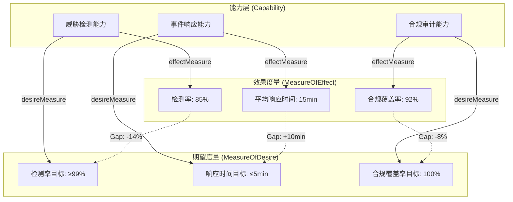

---
tags:
  - dm2/analysis
---

> **操作模板** -> [[../06-Measure/Measure-Template.md]]
> **所属数据组** -> [[../06-Measure]]

# DM2 Measures（度量）数据组 详细分析

> **分析依据**：`C:\Users\vanom\Desktop\DM2图\Measure.png` + DoDAF v2.02 Web PDF pp.81-83 + DM2 元模型 JSON 提取定义  
> **生成日期**：2026-04-18  
> **分析者**：Claw 🐾

---

## 一、概述

### 1.1 核心定义

> **A measure is the magnitude of some attribute of an object.**
>
> 度量是某个对象属性的量级大小。

| 来源 | 定义 |
|------|------|
| **DoDAF v2.02 (p.82)** | A measure is the magnitude of some attribute of an object. Measures provide a way to compare objects, whether Projects, Services, Systems, Activities, or Capabilities |
| **IDEAS 元模型** | Measure 继承自 `Property`，Property 继承自 `IndividualType`——即度量是一种"可量化属性"，是具体实例的属性值 |
| **形式化语义** | *Formally, a Measure defines membership criteria for a set or class; e.g., the set of all things that has 2 kg mass* |
| **JSON 提取** | `Measure`: 无独立 alias，归属 **Measure** 数据组 |

### 1.2 DM2 v2.0 的关键升级

> **Measures play a much greater, central role in DoDAF V2.0, compared to earlier versions of DoDAF.**

度量在 DoDAF v2.0 中地位大幅提升，驱动因素包括：

1. **核心流程对架构数据的依赖** —— 六大核心流程都需要量化支撑
2. **FEA 性能参考模型** —— 联邦企业架构性能模型的引入
3. **客观性需求** —— 通过度量提升决策的客观性、问责性和效率

### 1.3 核心公式

```
Measure = numericValue + unit + MeasureType
         ↓
Measure 定义了"具有某属性值的对象的集合"
例如："所有质量为 2 kg 的对象"
```

**关键区分**：

| 概念 | 含义 | 类比 |
|------|------|------|
| **Measure Type** | "测什么" —— 被测量事物的类别 | "质量"、"速度" |
| **Measure** | "测得多少" —— 具体的度量值+单位 | "2 kg"、"80 km/h" |
| **MeasureableSkill** | 可度量的技能 | "Python 编程能力: 高级" |

---

## 二、类图解析

### 2.1 完整元模型结构

```
┌─────────────────────────────────────────────────────────────────────────────┐
│                              Type (紫色)                                     │
│                         ↑ «placeTypes»                                      │
│                    IndividualType                                           │
│                   ↑ «IDEAS superSubtypes»                                   │
│                  Property (蓝色)                                            │
│               ↑ «IDEAS superSubtypes»                                       │
│ ┌─────────────────────────────────┐                                        │
│ │        ★ Measure (大蓝色框)      │  numericValue: string                 │
│ │                                 │                                        │
│ │  ┌── PhysicalMeasure            │← SpatialMeasure                        │
│ │  │     └── TemporalMeasure      │                                        │
│ │  │                              │                                        │
│ │  ├── ServiceLevel ◄──────────────┼── PerformanceMeasure                   │
│ │  │   (多重继承)                  │← MaintainabilityMeasure                │
│ │  │                              │     └── AdaptabilityMeasure           │
│ │  ├── MeasureOfEffect            │← NeedsSatisfactionMeasure              │
│ │  │                              │                                        │
│ │  ├── MeasureOfDesire            │                                        │
│ │  │                              │                                        │
│ │  ├── MeasurableSkill            │                                        │
│ │  │                              │                                        │
│ │  └── OrganizationalMeasure      │                                        │
│ └─────────────────────────────────┘                                        │
│           ↑ «powertypeInstances»                                            │
│  ┌──────────────────────┐                                                   │
│  │ MeasureType (紫色)    │ ← IndividualTypeType                            │
│  │                      │                                                   │
│  │  ┌────────────────┐  │ ← RuleType (粉色)                               │
│  │  │units: string   │  │     rulePartOfMeasureType                       │
│  │  └────────────────┘  │                                                   │
│  │  MeasureTypeUnitsOf  │ ← Guidance Rule (蓝色)                           │
│  │       OfMeasureType  │     needs more work                              │
│  └──────────────────────┘                                                   │
│                                                                             │
│  ═════════════════════════ 右侧：度量关系网络（绿色）═══════════════════     │
│                                                                             │
│  propertyOfType ─────────────→ Measure (属性度量)                           │
│  capabilityOfPerformer ──────→ measureOfPerformer (个体度量)                │
│  skillOfPersonRoleType ─────→ measurableSkillOfPersonRoleType (技能度量)    │
│  effectMeasure ─────────────→ MeasureOfEffect (效果度量)                    │
│  desireMeasure ─────────────→ MeasureOfDesire (期望度量)                    │
│  measureOfTypeResource ─────→ Resource 度量                                │
│  measureOfTypeWholePartType → WholePart 度量                               │
│  measureOfTypeCondition ────→ Condition 度量                               │
│  measureOfTypeProjectType ──→ ProjectType 度量                             │
│  measureOfTypeActivity ────→ Activity 度量                                 │
│  measureOfIndividualPoint ──→ Location Point 度量                          │
│                                                                             │
└─────────────────────────────────────────────────────────────────────────────┘
```

### 2.2 颜色编码解读

| 颜色 | 实体类型 | 说明 |
|------|---------|------|
| 🔵 **深蓝** | Measure 及子类型 | 核心度量概念体系 |
| 🟣 **紫/粉** | MeasureType / RuleType / IndividualTypeType | 类型层（元数据） |
| 🟢 **浅绿** | measureOf* 关系 | 度量关联关系（跨数据组的桥梁） |
| ⚪ **白底绿边** | propertyOfType 等 | IDEAS 基础属性关系 |

### 2.3 特殊标记

| 标记 | 位置 | 含义 |
|------|------|------|
| **红色虚线箭头** | Measure → MeasureType | powertypeInstances 关系（类型-实例） |
| **"Needs more work"** | measureTypeApplicableToActivity | 该关联尚未完善 |
| **ServiceLevel 多重继承** | ServiceLevel 同时继承多个父类 | SLA 可能涉及 Needs/Satisfaction/Interoperability/Performance |

---

## 三、核心实体详解

### 3.1 Measure（度量）—— 核心

| 属性 | 值 |
|------|-----|
| **父类** | Property → IndividualType |
| **核心属性** | `numericValue: string` |
| **含义** | 对象某属性的具体量级值 |
| **形式化定义** | 定义一个集合的成员标准（如"所有质量为 2kg 的物体"集合）|

**Measure 与 Measure Type 的关系**：
> The relationship between Measure and Measure Type is that any particular Measure is an instance of all the possible sets that could be taken for a Measure Type.

即：每个具体 Measure 是其 Measure Type 下所有可能值集合中的一个实例。

### 3.2 Measure 子类型分类体系

#### 第一层：物理/时空维度

| 子类型                 | 定义   | 示例             |
| ------------------- | ---- | -------------- |
| **PhysicalMeasure** | 物理度量 | 质量、长度、功率       |
| **SpatialMeasure**  | 空间度量 | 位置坐标、覆盖范围、距离   |
| **TemporalMeasure** | 时间度量 | 持续时间、响应时间、MTBF |

#### 第二层：服务与性能维度

| 子类型 | 定义 | 多重继承说明 |
|--------|------|-------------|
| **ServiceLevel** | 服务水平度量 | **多重继承** —— SLA 可能涉及用户需求、满意度、互操作性或性能 |
| **PerformanceMeasure** | 性能度量 | 吞吐量、延迟、并发数 |
| **MaintainabilityMeasure** | 可维护性度量 | MTTR、可用性百分比 |
| **AdaptabilityMeasure** | 适应性度量 | *"The ease with which Performers satisfy differing Constraints"* |
| **NeedsSatisfactionMeasure** | 需求满足度量 | 用户满意度、需求覆盖率 |

#### 第三层：战略/组织维度

| 子类型 | 定义 | 所属数据组交叉 |
|--------|------|--------------|
| **MeasureOfEffect** | 效果度量（实际达成的效果）| Capability ∩ Project ∩ Measure |
| **MeasureOfDesire** | 期望度量（期望达到的目标）| Capability ∩ Project ∩ Measure |
| **MeasurableSkill** | 可度量技能 | Measure ∩ OrganizationalStructure |
| **OrganizationalMeasure** | 组织度量 | 团队规模、层级深度、汇报线复杂度 |

### 3.3 Measure Type 分类法（Taxonomy）

> *The lower part of Figure 20 depicts the upper tiers of a Measure Type taxonomy or classification scheme. It is expected that architects would add more detailed types (make the taxonomy more specialized), as needed, within their federate.*

**注意**：上图中的分类只是**顶层骨架**，架构师应在自己的联邦中按需细化。

```
MeasureType (顶层)
├── 物理度量类型（PhysicalMeasureType）
│   ├── 空间度量类型（SpatialMeasureType）
│   │   └── 坐标系统规则（Geodetic Coordinate System）
│   └── 时间度量类型（TemporalMeasureType）
├── 服务水平类型（ServiceLevelType）
│   ├── 性能度量类型
│   ├── 可维护性度量类型
│   │   └── 适应性度量类型
│   └── 需求满足度量类型
├── 效果度量类型（MeasureOfEffectType）
├── 期望度量类型（MeasureOfDesireType）
├── 技能度量类型（MeasurableSkillType）
└── 组织度量类型（OrganizationalMeasureType）
```

### 3.4 RuleType — 度量的规则约束

| 属性 | 值 |
|------|-----|
| **父类** | （无显式，但通过 rulePartOfMeasureType 关联 MeasureType）|
| **核心属性** | `units: string` |
| **含义** | 规定度量如何执行：单位、校准程序、坐标系等 |

**关键洞察**：

> *All Measure Types have a Rule that prescribes how the Measure is accomplished; e.g., units, calibration, or procedure.*

**空间度量的特殊规则示例**：
> *Spatial measures' Rules include coordinate system rules. For example, latitude and longitude are understandable only by reference to a Geodetic coordinate system around the Earth.*

---

## 四、度量关系网络（右侧绿色区域）

这是 DM2 中最密集的关系网络之一。**Measure 通过 11 条 `measureOf*` 关系连接到几乎所有其他数据组**。

### 4.1 关系总览表

| # | 关系名 | 目标实体 | 方向 | 所属数据组交叉 | 含义 |
|---|--------|---------|------|---------------|------|
| 1 | **propertyOfType** | Measure | Type→Measure (属性) | Foundation | 任何 IndividualType 都可以有度量属性 |
| 2 | **capabilityOfPerformer** | measureOfPerformer | Performer→Individual | Capability | 能力的个体度量 |
| 3 | **skillOfPersonRoleType** | measurableSkillOf | PersonRoleType→Skill | OrgStructure∩Measure | 角色技能的可度量性 |
| 4 | **effectMeasure** | MeasureOfEffect | DesiredEffect→MoE | Capability∩Project∩Measure | 效果的实际度量值 |
| 5 | **desireMeasure** | MeasureOfDesire | DesiredEffect→MoD | Capability∩Project∩Measure | 期望目标的度量值 |
| 6 | **measureOfTypeResource** | ResourceType | Resource→MeasureType | ResourceFlow∩Measure | 资源的度量类型声明 |
| 7 | **measureOfTypeWholePart** | WholePartType | WholePart→MeasureType | Measure | 组成关系的度量 |
| 8 | **measureOfTypeCondition** | Condition | Condition→MeasureType | ResourceFlow∩Capability∩Services∩Project∩Measure | 前提条件的度量（条件可量化）|
| 9 | **measureOfTypeProjectType** | ProjectType | Project→MeasureType | Project∩Measure | 项目类型的度量声明 |
| 10 | **measureOfTypeActivity** | Activity | Activity→MeasureType | **8个数据组共享！** | 活动的度量类型（UJTL 任务度量）|
| 11 | **measureOfIndividualPoint** | Point | LocationPoint→Measure | Location∩Measure | 地理位置的点度量 |

### 4.2 最关键的 3 个关系

#### 🔑 effectMeasure vs desireMeasure —— 双轨度量模式

这是 DM2 最精妙的设计之一：

```
DesiredEffect（期望效果）
    ├─→ effectMeasure ──→ MeasureOfEffect    【实际达成多少】
    └─→ desireMeasure ──→ MeasureOfDesire    【目标期望多少】
```

| 维度 | MeasureOfEffect | MeasureOfDesire |
|------|----------------|-----------------|
| **性质** | 事实型（事后） | 目标型（事前）|
| **来源** | 实际测量/评估 | 战略规划/需求分析 |
| **用途** | 能力基线对比、差距分析 | 目标设定、演进路线图 |
| **变化** | 随时间波动（当前状态）| 相对稳定（里程碑目标）|
| **典型值** | "当前检测率: 85%" | "目标检测率: 99%" |

#### 🔑 measureOfTypeActivity —— 跨度最大的关系

**8 个数据组同时引用此关系**：ResourceFlow, InformationAndData, ReificationLevels, Capability, Services, Project, Pedigree, InformationPedigree, Measure

> *This represents Universal Joint Task List (UJTL) tasks and their applicable Measure Types, including Conditions, that is, Condition is quantified by a Measure Type.*

这意味着 **Activity 的度量是整个架构的核心量化锚点**。

#### 🔑 measureOfTypeCondition —— 条件也可量化

> *Condition's typeInstance association, saying an elementary Condition is a member (instance) of a Measure Type class.*

活动执行的前提条件本身也是可度量的——这支持了"门槛条件"的建模（如"CPU 使用率 < 80% 才能启动备份任务"）。

---

## 五、度量的六大流程用法

### 5.1 PPBE & JCIDS（联合能力集成与开发系统 / 规划-计划-预算-执行）

| 用途 | 度量角色 | 说明 |
|------|---------|------|
| **① 规划 — 充分性分析 (Adequacy Analysis)** | Measure ↔ Capability | 将能力关联的度量与执行者的度量对比，判断方案是否充分；支持 AoA（备选方案分析）|
| **② 计划编制 — 重叠分析 (Overlap Analysis)** | Measure 区分相似功能 | 判断投资组合/能力开发/采办计划中是否有重复能力；**不同度量=不重复** |
| **③ 目标设定 (Goal Setting)** | Measure 作为 Goal 组成部分 | 生产率/效率目标 |
| **④ 需求定义** | Measure 作为 Requirement 元素 | 需求中的量化指标 |
| **⑤ 能力演进 (Capability Evolution)** | Measure 追踪增量 | 展示能力的渐进式改进，监控预计达成时间 |

**重叠分析的精妙之处**：
> *Similar functionality is often only an indicator of overlapping or duplicative capability. Often Performers with similar functionality operate under different Measures which are not duplicative or overlapping capability.*
>
> 例如：作战级态势感知系统可能不如战术级的快速精确，但它处理更大范围、更多对象 —— **度量不同 = 能力不重复**。

### 5.2 SE & DAS（系统工程 & 国防采办系统）

| # | 用途 | 度量角色 | 示例 |
|---|------|---------|------|
| 1 | **系统工程设计** | 设计包络目标（性能特征/属性）、约束（如成本约束）| 响应时间 < 200ms, 成本 <$500K |
| 2 | **性能-成本权衡** | Performance vs Cost 比较 | MoE vs 成本曲线选择最优方案 |
| 3 | **基准测试 (Benchmarking)** | 建立性能基准 | 人员技能等级标准、雷达跟踪精度测试 |
| 4 | **组织与人员发展** | 组织/人员目标设定与监控 | 培训完成率、认证通过率 |
| 5 | **容量规划 (Capacity Planning)** | 规划所需容量 | 网络带宽、培训项目规模 |
| 6 | **QoS 描述 (SOA)** | 服务质量以度量表达 | 误码率、抖动、SLA 等级 |
| 7 | **项目约束** | 成本/风险作为约束 | 预算上限、风险阈值 |

**SOA QoS 特殊用法**：
> *In SOA, QoS is often expressed as a Measure; e.g., bit loss rate or jitter. These Measures show up in the service description and are part of service discovery.*

### 5.3 CPM（组合管理）

| 用途 | 度量角色 |
|------|---------|
| **组合平衡 (Portfolio Balancing)** | 用度量实现目标与约束的正确组合平衡 |

### 5.4 Ops Planning（作战规划）

| 用途 | 度量角色 |
|------|---------|
| **组织与人员发展** | 组织/人员目标的建立和监控 |

---

## 六、跨数据组关系

### 6.1 Measure 是 DM2 最大的"连接器"

```
                    ┌─────────────┐
                    │  Capability  │ ← effectMeasure, desireMeasure
                    │  (CV视图)    │
          ┌─────────┤              ├──────────┐
          │         └─────────────┘          │
          ▼                                  ▼
┌──────────────┐                    ┌──────────────┐
│  Performer   │ ← measureOfPerformer│   Project    │ ← measureOfTypeProjectType
│  (OV/SV视图) │                    │   (PV视图)    │
└──────┬───────┘                    └──────┬────────┘
       │                                  │
       ▼                                  ▼
┌──────────────┐                    ┌──────────────┐
│   Activity   │ ← measureOfTypeActivity (8组共享!) │
│  (OV-5b)     │◄──────────────────────────────────┤
└──────┬───────┘                    └──────────────┘
       │
       ▼
┌──────────────┐     ┌──────────────┐     ┌──────────────┐
│   Resource   │←────│  Condition   │     │   Location   │
│(资源流)      │     │ (前提条件)    │     │ (地理位置)    │
└──────────────┘     └──────────────┘     └──────────────┘
       │
       ▼
┌──────────────┐     ┌──────────────┐     ┌──────────────┐
│   Service    │     │Organization  │     │    Rules     │
│  (SvcV视图)  │     │  Structure   │     │ (rulePartOf) │
└──────────────┘     │ (技能度量)    │     └──────────────┘
                     └──────────────┘
```

### 6.2 各数据组对 Measure 的依赖程度

| 数据组 | 依赖度量数 | 关键关系 | 依赖级别 |
|--------|-----------|---------|---------|
| **Capability** | 2 | effectMeasure, desireMeasure | ⭐⭐⭐ 核心 |
| **Resource Flow** | 2 | measureOfTypeResource, measureOfTypeCondition | ⭐⭐ 重要 |
| **Services** | 1 | measureOfTypeCondition | ⭐⭐ 重要 |
| **Project** | 2 | desireMeasure, effectMeasure, measureOfTypeProjectType | ⭐⭐⭐ 核心 |
| **Org Structure** | 1 | measureableSkillOf | ⭐ 中等 |
| **Location** | 1 | measureOfIndividualPoint | ⭐ 中等 |
| **Rules** | 1 | rulePartOfMeasureType | ⭐ 中等 |
| **Pedigree** | 1 | measureOfType | ⭐ 基础 |

---

## 七、呈现形式

> *Measures are typically displayed in tabular form and are usually tied to Structural, Behavioral or Tree models and their constituent elements. Measures can also be represented in a tree structure illustrating the traceability of derived metric requirements.*

| 形式 | 适用场景 | 示例 |
|------|---------|------|
| **表格** | 默认呈现方式 | 能力-度量矩阵 |
| **树结构** | 追溯派生度量需求 | Goal → Objective → Measure → KPI 层级 |
| **绑定到结构/行为模型** | 与架构元素关联时 | SV-1 节点上标注 QoS 度量 |
| **仪表盘** | 监控运行状态 | SOC 态势感知面板 |

---

## 八、视图映射

| 视图 ID | 视图名称 | 度量使用方式 |
|---------|---------|-------------|
| **CV-1** | 愿景 | 战略目标的量化指标 |
| **CV-2** | 能力分类 | 每个能力的 MoE/MoD 声明 |
| **CV-3** | 能力阶段化 | 各阶段的度量增量目标 |
| **CV-6** | 能力与运维活动映射 | 活动的 UJTL 度量 |
| **OV-2** | 资源流 | 资源的流量/延迟度量 |
| **OV-4** | 组织结构 | 组织度量 + 技能度量 |
| **OV-5b** | 活动模型 | 活动的性能度量 (UJTL) |
| **SV-1** | 系统接口 | 接口 QoS 度量 (带宽/延迟/抖动) |
| **SV-2** | 系统资源流 | 流量度量 |
| **SV-5** | 能力-系统映射 | 系统能力的充分性度量对比 |
| **SV-7** | 系统性能参数 | ⭐ **度量主视图** |
| **PV-2** | 项目时间线 | 项目进度/成本/风险度量 |
| **PV-6** | 能力-项目映射 | 项目交付物的验收度量 |
| **StdV-1** | 标准 | 标准符合性度量 |
| **SvcV-2** | 服务资源流 | 服务 QoS 度量 (SLA) |
| **SvcV-3b** | 服务行为模型 | 服务活动的性能度量 |

---

## 九、典型场景：SOC 安全运营中心的度量体系

### 场景背景

企业安全运营中心（SOC）需要建立完整的度量体系来衡量安全能力和运营效能。

### 9.1 能力度量矩阵



### 9.2 活动度量 (UJTL 式)

| 活动 (Activity) | Measure Type | 当前值 (Measure) | 单位 (RuleType.units) | 目标值 |
|-----------------|-------------|-----------------|---------------------|--------|
| 日志采集 | TemporalMeasure (采集延迟) | 30 | 秒 | ≤10 |
| 告警关联 | PerformanceMeasure (关联速率) | 1500 | EPS | ≥3000 |
| 威胁狩猎 | NeedsSatisfactionMeasure (覆盖率) | 65 | % | ≥90 |
| 事件处置 | MaintainabilityMeasure (MTTR) | 120 | 分钟 | ≤30 |
| 报告生成 | OrganizationalMeasure (报告准确率) | 97 | % | ≥99 |

### 9.3 服务 QoS 度量 (SOA)

| 服务 | ServiceLevel 子类型 | 度量项 | SLA 值 |
|------|-------------------|--------|--------|
| SIEM 数据查询 | PerformanceMeasure | P95 查询延迟 | ≤2s |
| 威胁情报推送 | AdaptabilityMeasure | 格式适配种类 | ≥5 种 |
| 告警 API | NeedsSatisfactionMeasure | API 可用性 | 99.9% |
| 案件管理 | MaintainabilityMean | 平均修复时间 | ≤4h |

### 9.4 技能度量 (MeasurableSkill)

| 角色 (PersonRoleType) | Skill           | MeasurableSkill       | 当前水平    | 目标等级    |
| ------------------- | --------------- | --------------------- | ------- | ------- |
| 一级分析师               | 恶意代码分析          | MeasurableSkill       | L2 (中级) | L3 (高级) |
| 二级分析师               | MITRE ATT&CK 映射 | MeasurableSkill       | L3 (高级) | L4 (专家) |
| 值班工程师               | SOAR 剧本编写       | MeasurableSkill       | L1 (入门) | L3 (高级) |
| SOC 经理              | 团队管理            | OrganizationalMeasure | 评分 78   | 评分 ≥90  |

---

## 十、版本差异与注意事项

### 10.1 DoDAF v1.5 → v2.0 的变化

| 维度 | v1.5 | v2.0 |
|------|------|------|
| **地位** | 辅助信息 | **核心数据组** |
| **覆盖范围** | 主要关注系统性能 | 覆盖所有架构元素 |
| **形式化程度** | 非正式文本 | **完整的元模型 + 分类法** |
| **与其他数据组关系** | 松散耦合 | **11条显式关系，8组共享** |
| **流程支撑** | 有限 | **6大核心流程全面依赖** |

### 10.2 未完善的部分

| 标记 | 位置 | 状态 |
|------|------|------|
| **"Needs more work"** | measureTypeApplicableToActivity | 尚待完善 |
| **分类法细化** | MeasureType Taxonomy | 仅提供顶层，需架构师自定义扩展 |

---

## 十一、关键洞察总结

| # | 发现 | 说明 | 架构意义 |
|---|------|------|---------|
| **1** | **Measure 是 DM2 最大的连接器** | 通过 11 条 `measureOf*` 关系连接 9 个数据组 | 度量是架构的"通用语言" |
| **2** | **双轨度量设计** | MeasureOfEffect（实际）vs MeasureOfDesire（目标）| 支持 Gap 分析和演进追踪 |
| **3** | **Activity 度量是核心锚点** | measureOfTypeActivity 被 8 个数据组共享 | UJTL 式的任务度量贯穿全架构 |
| **4** | **Condition 也可度量** | measureOfTypeCondition 使前提条件量化 | 支持门槛条件和自适应调度 |
| **5** | **ServiceLevel 多重继承** | SLA 涉及多维度（性能/满意度/互操作/需求）| SOA QoS 建模的灵活性 |
| **6** | **Rule 约束每一条度量** | 所有 MeasureType 都有 RuleType（单位/程序/坐标系）| 保证度量的可比性和一致性 |
| **7** | **重叠 ≠ 重复** | 不同度量意味着不同的能力定位 | 投资组合去重的关键判据 |
| **8** | **分类法开放扩展** | 顶层骨架 + 架构师自定义细化 | 支持领域特定度量体系（如安全 NIST CSF 映射） |

---

## 十二、速查卡

### Measure 核心公式

```
度量 = 量值 (numericValue) + 单位 (RuleType.units) + 类型 (MeasureType)
```

### 四大度量层次

| 层次 | 概念 | 问题 |
|------|------|------|
| **L1 物理时空** | Physical/Spatial/Temporal | 多大？多远？多久？ |
| **L2 服务性能** | ServiceLevel/Performance/Maintainability | 多快？多可靠？多灵活？ |
| **L3 战略效果** | MeasureOfEffect/Desire | 达成了多少？目标是多少？ |
| **L4 组织技能** | MeasurableSkill/Organizational | 人行不行？团队强不强？ |

### 11 条度量关系速查

```
propertyOfType          → 任何属性都可度量
capabilityOfPerformer   → 能力个体的度量
skillOfPersonRoleType   → 技能的可度量性
effectMeasure           → 实际效果度量
desireMeasure           → 期望目标度量
measureOfTypeResource   → 资源类型度量
measureOfTypeWholePart  → 组成关系度量
measureOfTypeCondition  → 前提条件度量
measureOfTypeProjectType→ 项目类型度量
measureOfTypeActivity   → 活动度量 (★最核心)
measureOfIndividualPoint→ 位置点度量
```

---

*文档结束。下一张：Location.png*
