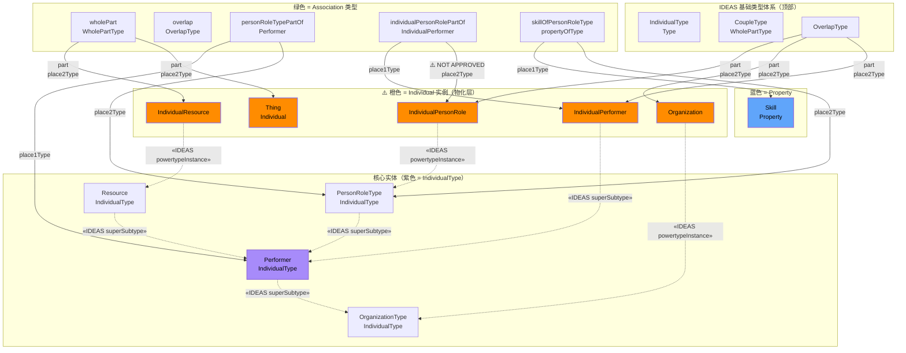
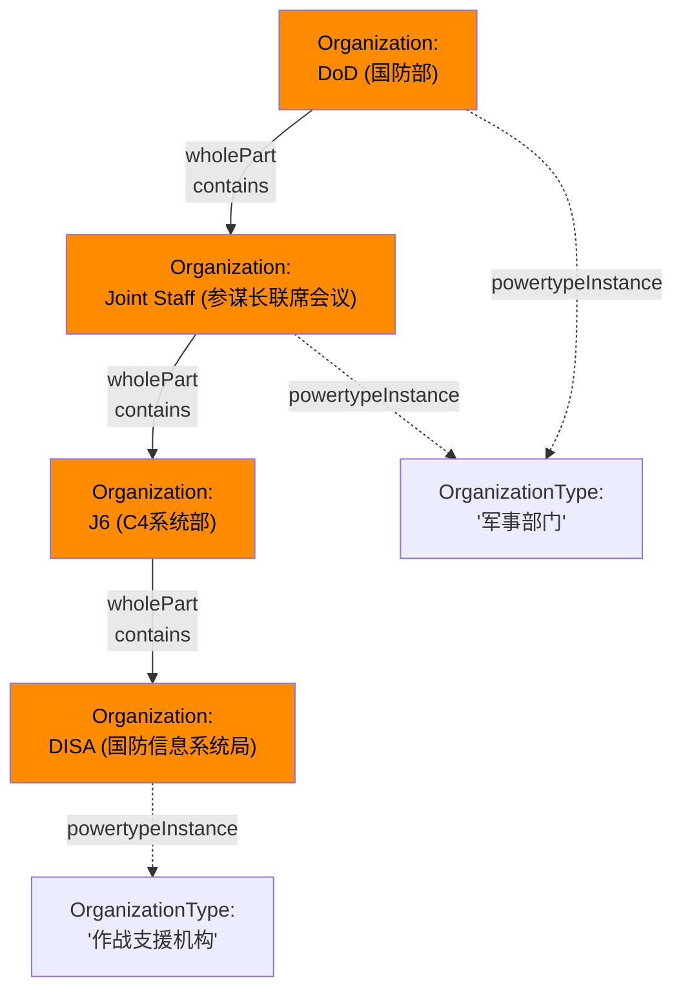
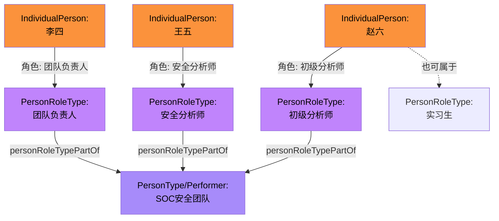

---
tags:
  - dm2/analysis
---

> **操作模板** -> [[../14-OrganizationalStructure/README.md]]
> **所属数据组** -> [[../14-OrganizationalStructure]]

# DM2 Organizational Structure 详细分析

> **来源**：`Organizational Structure.png` 类图 + DoDAF v2.02 PDF pp.79-80 + DM2 元模型定义提取
>
> **分析日期**：2026-04-18
>
> **定位**：Organization Structure（组织结构）= DM2 中的人员与组织建模概念，回答 "Who is organized how?" —— 人、角色、组织之间的组成、嵌套与技能关联关系

---

## 一、概述

### 1.1 核心问题

Organizational Structure 数据组回答的是：**在架构中，人如何组织成团队，角色如何定义，技能如何匹配？**

### 1.2 核心公式

```
Organization (组织)
  ├── contains → Performer(s) (执行者/组成部分)
  │     ├── PersonRoleType (人员角色类型)
  │     │     ├── has Skill (技能)
  │     │     └── individualPersonRolePartOfIndividualPerformer → IndividualPerformer
  │     └── Organization (子组织, 嵌套)
  └── uses → IndividualResource (资源实例)
```

### 1.3 与 Performer 数据组的关系

Organizational Structure 是 **Performer 数据组的"子集深化"**——它不引入全新的顶层概念，而是聚焦于：

1. **PersonRoleType / PersonRole**：人的角色类型和具体角色实例
2. **Organization / OrganizationType**：组织的类型和实例
3. **Skill**：角色的技能属性
4. **IndividualXXX 实例层**：具体的个人、组织、资源实例

---

## 二、类图结构解析

### 2.1 完整类图还原

基于 `Organizational Structure.png` 图片：



### 2.2 图中的特殊标注

#### ⚠️ "NOT APPROVED" 标记

图中 `individualPersonRolePartOfIndividualPerformer` 关系上标注了 **"NOT APPROVED"**。

这意味着：
- 该关系是**提议中的**但尚未被 DM2 正式批准
- 在实际使用时需谨慎对待
- 可能存在替代方案或待完善的语义

#### 📝 注释框（左下角）

> *"When a Person is part of another Person Type, that refers to a role within a Person Type."*

这句话解释了 **Person 的角色嵌套**：
- 一个 Person（作为 Individual）可以属于另一个 Person Type
- 这种从属关系表达的就是**角色（Role）**
- 例如："张三（Person）属于 安全分析师（Person Role Type）"，而安全分析师属于 SOC 团队（Person Type 或 Organization）

#### 🔴 红色虚线（powertypeInstance）

类图顶部有多条红色虚线，标注 `«IDEAS powertypeInstance»`：
- IndividualType ← Thing/Individual
- Resource → IndividualResource
- Performer → IndividualPerformer
- OrganizationType → Organization
- PersonRoleType → IndividualPersonRole

这些红色虚线统一表达了 **Type → Individual 的物化方向**。

### 2.3 核心实体一览

| 实体 | IDEAS 层级 | 颜色 | 说明 |
|------|-----------|------|------|
| **Thing / Individual** | Individual | 🟠 橙色 | 最顶层的具体事物 |
| **Resource** | IndividualType | 🟣 紫色 | 资源类型 |
| **Performer** | IndividualType | 🟣 紫色 | 执行者（组织/人/系统/服务的基类）|
| **OrganizationType** | IndividualType | 🟣 紫色 | 组织的类型分类 |
| **PersonRoleType** | IndividualType | 🟣 紫色 | 人员角色的类型分类 |
| **Skill** | Property | 🔵 蓝色 | 技能——角色的一种属性 |
| **IndividualResource** | Individual | 🟠 橙色 | 具体资源实例 |
| **IndividualPerformer** | Individual | 🟠 橙色 | 具体执行者实例 |
| **Organization** | Individual | 🟠 橙色 | 具体组织实例 |
| **IndividualPersonRole** | Individual | 🟠 橙色 | 具体人员角色实例 |

---

## 三、核心关系详解

### 3.1 组织层次（Organization Hierarchy）



**Organization 的多来源定义**：

| 来源 | 定义要点 |
|------|---------|
| **DoDAF/CADM** | An administrative structure with a mission（有使命的行政结构）|
| **JC3IEDM** | An administrative or functional structure（行政或功能结构）|
| **NAF** | An actual specific organization, an instance of an organization class（实际的组织实例）|
| **Zachman** | A collection of people brought together for a specific purpose（为特定目的聚集的人群）|
| **Webster's** | A group of persons organized for some end or work; association |

**关键理解**：Organization 是一种 **Performer**（继承），同时也是一种 **Resource**（被包含）。它是人和资源的**有目的集合体**。

### 3.2 PersonRoleType 与 Performer 的关系

```
personRoleTypePartOfPerformer:
    Performer ──whole(Place1Type)──▶ PersonRoleType ──part(Place2Type)
```

- **含义**：**Performer 包含 PersonRoleType 作为其组成部分**
- 这意味着一个组织（Performer: Organization）可以由多种角色类型构成
- **基数**：一个 Performer 可以有 ≥1 个 PersonRoleType；一个 PersonRoleType 可属于 ≥1 个 Performer（通过 Overlap）

**示例**：

| Performer（执行者/组织）| 包含的 PersonRoleType（角色类型）|
|--------------------------|------------------------------|
| SOC 安全运营中心 | 安全分析师、威胁猎手、事件响应者、合规审计员 |
| 联合特遣队 | 指挥官、情报官、作战官、后勤官 |
| 软件开发团队 | 架构师、开发工程师、测试工程师、产品经理 |

### 3.3 IndividualPersonRole 与 IndividualPerformer 的关系（⚠️ NOT APPROVED）

```
individualPersonRolePartOfIndividualPerformer:
    IndividualPerformer ──whole(Place1Type)──▶ IndividualPersonRole ──part(Place2Type)
```

- **含义**：**具体执行者包含具体人员角色作为其部分**
- **状态**：⚠️ **NOT APPROVED** —— 尚未正式批准的关系
- 这是 Type 层 `personRoleTypePartOfPerformer` 在 Individual 层的镜像

**为什么需要这个关系？**

因为到了运行时（Individual 层），你需要知道：
- **哪个具体的人**（IndividualPerson）以**什么角色**（IndividualPersonRole）
- 属于**哪个具体的组织/系统**（IndividualPerformer）

### 3.4 Skill（技能）与 PersonRoleType 的关系

```
skillOfPersonRoleType:
    PersonRoleType ──propertyOf(Place1Type)──▶ Skill ──Place2Type
```

- **含义**：**角色类型拥有特定的技能要求**
- **类型**：Property 关系（Skill 是 PersonRoleType 的属性之一）
- **可度量**：通过 `measureableSkillOfPersonRoleType` → MeasureableSkill → Measure 链路实现量化

**Skill 的多来源定义**：

| 来源 | 定义要点 |
|------|---------|
| **Webster's** | The ability, coming from one's knowledge, practice, aptitude, etc., to do something well |
| **DoDAF/CADM** | An ability（一种能力）|
| **NAF** | Competence: A specific set of abilities defined by knowledge, skills and attitude（知识+技能+态度的综合能力）|

**别名**：Training, Knowledge, Ability —— 说明 Skill 是培训/知识/能力的统称。

### 3.5 Overlap vs WholePart 的使用区分

类图中同时使用了两种组合关系：

| 关系类型 | 使用场景 | 示例 |
|----------|---------|------|
| **WholePartType（强组合）** | Performer ⊃ PersonRoleType | 组织**强包含**角色类型（角色是组织的固有部分）|
| **OverlapType（弱重叠）** | IndividualPerformer ↔ IndividualPersonRole 等 | 具体**执行者**与具体**角色**之间可能是临时/重叠关系（一个人可以在不同时间扮演不同角色）|

**关键区别**：
- **WholePart**：部分不能独立于整体存在（如：心脏是人体的 WholePart）
- **Overlap**：部分可以独立存在，只是当前与整体有交集（如：分析师角色可以被不同人扮演）

---

## 四、Type ↔ Individual 双层物化

### 4.1 完整物化矩阵

这是本类图的**核心价值所在**——展示每个概念如何在 Type 和 Individual 两个层面并存：

| Type 层（抽象/分类）| Individual 层（具体/实例）| 物化关系 |
|---------------------|------------------------|---------|
| **OrganizationType** | **Organization** | powertypeInstance |
| **PersonRoleType** | **IndividualPersonRole** | powertypeInstance |
| **Performer** (as Type) | **IndividualPerformer** | powertypeInstance |
| **Resource** (as Type) | **IndividualResource** | powertypeInstance |
| **Skill** (as Property) | **MeasureableSkill** (measurable) | skillOf → measureableSkillOf |

### 4.2 角色嵌套模型（注释框详解）

> *"When a Person is part of another Person Type, that refers to a role within a Person Type."*

这描述了一种常见的**层级角色**模式：



**角色嵌套场景**：
1. **层级角色**：初级分析师 → 分析师 → 高级分析师（纵向嵌套）
2. **兼任角色**：同一个人同时在两个 PersonRoleType 中（横向重叠）
3. **矩阵角色**：一个人既属于职能线（角色）又属于项目线（另一角色）

---

## 五、Skill 技能体系深入

### 5.1 Skill 在 DM2 中的位置


**这意味着**：
1. 每个 PersonRoleType 可以定义**一组必需技能**
2. 技能可以是**不可度量的**（Skill）或**可度量的**（MeasureableSkill）
3. 可度量技能有**数值型度量值**

### 5.2 Skill 别名揭示的完整能力观

| 别名 | 关注维度 | 示例 |
|------|---------|------|
| **Skill** | 能力/技巧 | Python编程、网络协议分析 |
| **Training** | 培训认证 | CISSP、CISA、等保测评师 |
| **Knowledge** | 知识领域 | MITRE ATT&CK、 kill chain |
| **Ability** | 天赋/资质 | 安全思维、应急判断力 |

**NAF 的扩展最全面**：Competence = Knowledge + Skills + Attitude（KSA 模型）

### 5.3 技能度量的实际应用

| 角色类型 | 必备技能 | 度量方式 | 阈值 |
|----------|---------|---------|------|
| 安全分析师 | 日志分析能力 | 平均告警处理数/日 | ≥ 50 条 |
| 威胁猎手 | ATT&CK 知识 | Technique 覆盖率 | ≥ 80% |
| SOC 经理 | 团队管理能力 | 团队满意度评分 | ≥ 4.0/5.0 |
| 合规审计员 | 法规熟悉度 | 等保条款掌握率 | 100% |

---

## 六、与其他数据组的关系

### 6.1 Organizational Structure ↔ Performer

| 关系 | 说明 |
|------|------|
| Organization ⊂ Performer | 组织是一种执行者（继承）|
| PersonRoleType ⊂ Performer | 角色类型属于执行者范畴 |
| personRoleTypePartOfPerformer | 执行者由角色类型组成 |

### 6.2 Organizational Structure ↔ Resource Flow

- **IndividualResource** 出现在此数据组中
- PersonRoleType 的 Individual 实例（人）可以**消费/生产资源**
- Organization 作为 Performer 参与资源流

### 6.3 Organizational Structure ↔ Rules

- Agreement（协议）与此数据组共享
- 组织间的协议约束角色行为
- Rule 可以约束 PersonRoleType（如岗位规范）

### 6.4 Organizational Structure ↔ Project

- 项目 WBS 中分配 Personnel 到 Organization
- IndividualPersonRole 作为项目的**人力交付物**
- Organization 作为 Performer 执行项目 Activity

### 6.5 Organizational Structure ↔ Pedigree

- IndividualPerformer 和 Organization 都出现在 Pedigree 数据组中
- 支持**人员和组织的谱系追溯**

### 6.6 Organizational Structure ↔ Measure

- **OrganizationalMeasure**：组织运行成本度量
- **measureableSkillOfPersonRoleType**：技能度量
- **Skill** → **MeasureableSkill** → **Measure** 度量链

---

## 七、视图映射

### 7.1 主要视图

| 视图 | 使用元素 |
|------|---------|
| **OV-4（组织关系图）** | **核心视图**：Organization、PersonRoleType、组织间关系、报告线 |
| **SV-1（系统接口）** | System as Performer 中的 Organization 结构 |
| **CV-1（愿景）** | 组织能力愿景 |
| **PV-1（项目组合）** | 组织参与的项目 |
| **StdV-1（标准）** | 组织遵循的标准 |

### 7.2 OV-4 重点要素

OV-4（Command Control Coordination Communication Computers Intelligence Surveillance & Reconnaissance, aka **C4ISR**）是组织结构的主要呈现视图：

| OV-4 要素 | DM2 对应 |
|-----------|----------|
| 组织单元 | Organization / OrganizationType |
| 角色 | PersonRoleType |
| 报告线/指挥关系 | wholePart (Organization hierarchy) |
| 协调关系 | overlap / partsToAgreement |
| 人员配备 | IndividualPersonRole → IndividualPerformer |
| 技能要求 | skillOfPersonRoleType → Skill |

---

## 八、PDF 内容说明

### 8.1 PDF pp.79-80 的特殊情况

本次分析的 PDF 页面内容**非常有限**：

| 页面 | 内容 |
|------|------|
| **p.79** | 导航菜单 + 类图标题 + 图片引用链接（无正文文本）|
| **p.80** | 仅页脚（Privacy Policy / Web Policy / Contacts）|

**原因推测**：
- Organizational Structure 的详细说明可能在早期版本的 DoDAF v2.02 网站页面中被移除或合并
- 核心内容已全部体现在**类图本身**和 **DM2 元模型 JSON 定义**中
- 本分析主要依赖类图可视化 + 元模型提取数据进行解读

---

## 九、典型建模场景

### 场景一：企业安全团队的 OV-4 组织结构

```mermaid
graph TB
    subgraph 组织架构["组织层次（Organization / OrganizationType）"]
        CSO["Organization:<br/>首席安全官办公室"]
        SOC_MGR["Organization:<br/>SOC运营中心"]
        SEC_ENG["Organization:<br/>安全工程部"]
        COMP["Organization:<br/>合规管理部"]
        
        CSO --> SOC_MGR
        CSO --> SEC_ENG
        CSO --> COMP
    end
    
    subgraph 角色定义["角色类型（PersonRoleType）+ 技能（Skill）"]
        R1["PersonRoleType:<br/>SOC经理"]
        R2["PersonRoleType:<br/>一级安全分析师"]
        R3["PersonRoleType:<br/>二级安全分析师"]
        R4["PersonRoleType:<br/>威胁猎手"]
        R5["PersonRoleType:<br/>安全工程师"]
        R6["PersonRoleType:<br/>合规专员"]
        
        R1 -->|requires| S1["Skill:<br/>团队管理<br/>CISSP认证"]
        R2 -->|requires| S2["Skill:<br/>SIEM操作<br/>日志分析"]
        R3 -->|requires| S3["Skill:<br/>恶意代码分析<br/>逆向工程"]
        R4 -->|requires| S4["Skill:<br/>ATT&CK框架<br/>威胁情报"]
        R5 -->|requires| S5["Skill:<br/>安全架构设计<br/>DevSecOps"]
        R6 -->|requires| S6["Skill:<br/>等保测评<br/>法规熟悉"]
    end
    
    subgraph 人员实例["具体人员（IndividualPersonRole → IndividualPerformer）"]
        P1["Individual:<br/>张三 → SOC经理"]
        P2["Individual:<br/>李四 → 一级分析师"]
        P3["Individual:<br/>王五 → 二级分析师"]
        P4["Individual:<br\">赵六 → 威胁猎手"]
        
        P1 -->|"individualPersonRolePartOf ⚠️N/A"| SOC_MGR
        P2 & P3 & P4 -->|"individualPersonRolePartOf ⚠️N/A"| SOC_MGR
    end
    
    R1 -->|"personRoleTypePartOf"| SOC_MGR
    R2 & R3 & R4 -->|"personRoleTypePartOf"| SOC_MGR
    R5 -->|"personRoleTypePartOf"| SEC_ENG
    R6 -->|"personRoleTypePartOf"| COMP
    
    style CSO fill:#FF8C00,color:#000,stroke-width:2px
    style SOC_MGR fill:#FF8C00,color:#000,stroke-width:2px
    style R1 fill:#C084FC,color:#000
    style S1 fill:#60A5FA,color:#000
    style P1 fill:#FB923C,color:#000
```

### 场景二：军事指挥结构的 DM2 映射

| 军事概念 | DM2 映射 | 类型 |
|----------|---------|------|
| 战区司令部 | Organization (Individual) | 🟠 Instance |
| 作战部队类别 | OrganizationType | 🟣 Type |
| 指挥官 | PersonRoleType → IndividualPersonRole | 🟣→🟠 |
| 参谋人员 | PersonRoleType → IndividualPersonRole | 🟣→🟠 |
| 指挥关系 (COCOM) | WholePart (Organization hierarchy) | 🟢 Type |
| 支持关系 (Support) | overlap (Performer ↔ Performer) | 🟢 Type |
| 作战技能 | Skill → MeasureableSkill | 🔵 Property |
| 编制（TO&E） | personRoleTypePartOfPerformer + Skill | 复合 |

---

## 十、关键洞察总结

### 🔑 从类图中学到的 7 个重要发现

1. **Organization Structure 是 Performer 的"子集放大镜"**
   - 不引入新的顶级实体
   - 而是将 Performer 中关于"人和组织"的部分**深度细化**
   - 聚焦三个维度：**组织层次、角色定义、技能属性**

2. **五个橙色 Individual 实例是组织结构的"运行时快照"**
   - Thing/Individual、IndividualResource、IndividualPerformer、Organization、IndividualPersonRole
   - 这些代表了组织架构从"设计时(Type)"到"运行时(Individual)"的**完全物化**

3. **"NOT APPROVED" 关系的警示意义**
   - `individualPersonRolePartOfIndividualPerformer` 未获批准
   - 说明 DM2 对 Individual 层的角色分配关系仍在**演进中**
   - 实际建模时可参考但不应视为最终标准

4. **角色嵌套 = Person 属于 PersonType 时就是 Role**
   - 注释框精辟地解释了 Person ↔ Role ↔ PersonType 三者关系
   - 支持层级角色、兼任角色、矩阵角色等多种组织模式

5. **Skill 是连接 HR 与架构的桥梁**
   - 通过 Skill 将人力资源视角（KSA）纳入架构模型
   - 支持 measureableSkillOf → Measure 的**能力量化评估**
   - 别名 Training/Knowledge/Ability 揭示了完整的 KSA 模型

6. **WholePart vs Overlap 的选择有深意**
   - **Type 层多用 WholePart**：角色是组织的固有组成部分
   - **Individual 层多用 Overlap**：具体人与具体执行者的关系更灵活（一人多岗、一岗多人）
   - 反映了**设计时的刚性 vs 运行时的灵活性**

7. **PDF 正文缺失但类图自洽**
   - pp.79-80 几乎没有文字说明
   - 但类图本身非常丰富——IDEAS 基础类型、双色标注、注释框、NOT APPROVED 标记
   - 结合 DM2 JSON 元模型定义足以完成完整的分析

---

## 附录：Organizational Structure 实体速查表

```
┌────────────────────┬───────────────┬────────┬──────────────────────────────┐
│      实体           │    IDEAS类型    │  颜色  │          说明               │
├────────────────────┼───────────────┼────────┼──────────────────────────────┤
│ Thing/Individual    │ Individual     │ 🟠橙   │ 顶层具体事物                  │
│ Resource            │ IndividualType │ 🟣紫   │ 资源类型基类                 │
│ Performer           │ IndividualType │ 🟣紫   │ 执行者基类（含Org/Person）   │
│ OrganizationType    │ IndividualType │ 🟣紫   │ 组织类型分类                 │
│ PersonRoleType      │ IndividualType │ 🟣紫   │ 人员角色类型                 │
│ Skill               │ Property       │ 🔵蓝   │ 技能属性                    │
│ IndividualResource  │ Individual     │ 🟠橙   │ 具体资源实例                │
│ IndividualPerformer │ Individual     │ 🟠橙   │ 具体执行者实例              │
│ Organization        │ Individual     │ 🟠橙   │ 具体组织实例                │
│ IndividualPersonRole│ Individual     │ 🟠橙   │ 具体人员角色实例            │
├────────────────────┼───────────────┼────────┼──────────────────────────────┤
│ personRoleTypePartOf│ WholePart     │ 🟢绿   │ Performer包含PersonRoleType │
│ individualPerson..  │ WholePart*    │ 🟢绿   │ ⚠️ NOT APPROVED             │
│ skillOfPersonRole  │ propertyOf     │ 🟢绿   │ 角色的技能属性              │
│ measurableSkillOf  │ measure       │ 🟢绿   │ 技能的可度量版本            │
│ wholePart (Org)    │ WholePart     │ 🟢绿   │ 组织层次包含关系            │
│ overlap            │ Overlap       │ 🟢绿   │ 执行者/角色灵活关联         │
└────────────────────┴───────────────┴────────┴──────────────────────────────┘
```

---

*文档结束。基于 Organizational Structure.png 类图 + DoDAF v2.02 PDF pp.79-80（注：PDF 正文极少，主要依赖类图+DM2元模型JSON提取）综合分析。*
