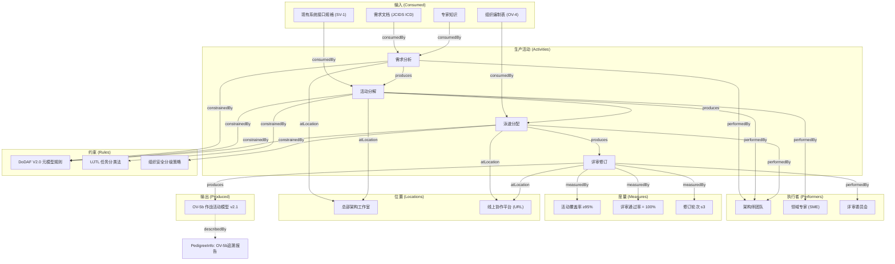

---
tags:
  - dm2/analysis
---

> **操作模板** -> [[../12-Pedigree/README.md]]
> **所属数据组** -> [[../12-Pedigree]]

# DM2 Pedigree（谱系）数据组 详细分析

> **分析依据**：`C:\Users\vanom\Desktop\DM2图\Pedigree.png` + DoDAF v2.02 Web PDF pp.88-89 + DM2 元模型 JSON 提取定义  
> **生成日期**：2026-04-18  
> **分析者**：Claw 🐾

---

## 一、概述

### 1.1 核心定义

> **The pedigree data group represents the workflow for a Resource. It describes the Activities used to produce a Resource, e.g., a piece of Information.**
>
> 谱系数据组表示一个资源的工作流（生产过程）。它描述用于产生某个资源的活动——比如一条信息的产生过程。

| 维度 | 说明 |
|------|------|
| **本质** | 资源的**生产工作流元模型** —— 回答"这个东西是怎么来的？" |
| **核心关注** | 架构描述信息（Architecture Description Information）的**生产追溯** |
| **关键洞察** | *Architecture descriptions are types of Information since Information describes some Thing* |
| **PDF 页数** | 仅 2 页（pp.88-89）——内容精炼但概念密度极高 |

### 1.2 核心公式

```
Pedigree = Activity (生产过程)
         + Resource (输入/输出)
         + Performer (执行者)
         + Rule (约束)
         + Measure (度量)
         + Location (位置)
         → 完整的资源生产追溯链
```

### 1.3 五大追溯维度

PDF p.88 明确列出：

| # | 追溯维度 | 问题 |
|---|---------|------|
| **a** | **Consumed Resources** | 生产过程中消耗了哪些资源？ |
| **b** | **Performers** | 谁执行了这个生产活动？ |
| **c** | **Rules** | 什么规则约束了这个生产活动？ |
| **d** | **Measures** | 应用了什么度量指标？ |
| **e** | **Location** | 生产发生在哪里？ |

---

## 二、类图解析 —— DM2 最复杂的"元视图"

### 2.1 整体结构理解

**Pedigree 图是 DM2 中最特殊的一张类图**。它不是引入新概念，而是将其他数据组的已有概念通过"资源生产工作流"的视角重新组织在一起。

```
┌─────────────────────────────────────────────────────────────────────────────┐
│                          Thing (顶层蓝色)                                    │
│                    ↑ «IDEAS superSubtype» / «placeTypes»                      │
│  ┌────────────────┬───────────────┬──────────────────┬──────────────────┐   │
│  │     Type       │    Individual │    Name          │  Representation │   │
│  │  (浅蓝)        │  (🟠橙色)     │  (Representation)│  (蓝色)           │   │
│  └───────┬────────┴───────┬───────┴────────┬─────────┴────────┬────────┘   │
│          │                │               │                    │             │
│  ┌───────▼────────┐  ┌────▼────────┐ ┌────▼────────┐  ┌──────▼────────┐  │
│  │IndividualType  │  │propertyOf   │ │describedBy   │  │SignType       │  │
│  │(大紫色框) ★    │  │Individual   │ │              │  │ exemplar:variant│ │
│  │                │  │(绿色)       │ │Information   │  ├─ SignTypeType │  │
│  │包含:           │  │             │  │PedigreeInfo  │  └─ RepType(紫) │  │
│  │• Condition     │  │             │  │(蓝色)        │                │  │
│  │• LocationType  │  │             │  │              │                │  │
│  │• Activity      │  │             │  │              │                │  │
│  │• IndividualRsc │  │             │  │              │                │  │
│  │• IndividualAct │  │             │  │              │                │  │
│  │• IndivPerfmr  │  │             │  │              │                │  │
│  │• Organization  │  │             │  │              │                │  │
│  │• Singleton*    │  │             │  │              │                │  │
│  └───────┬────────┘  └──────┬──────┘ └──────┬───────┘  ┌──────────────┤  │
│          │                 │              │            │   Resource    │  │
│          ▼                 ▼              ▼            │  (大紫色框)   │  │
│  ════════════════ 核心实体区域 ══════════════════════════  │             │  │
│  ┌────────────────────────────────────────────────────┐  │ 包含:        │  │
│  │  Condition (蓝色)                                  │  │ • Performer  │  │
│  │  LocationType (紫色)                               │  │ • PersonRole │  │
│  │  Activity (大紫色框) ◄─────────────────────────────┼►│ • System     │  │
│  │  IndividualResource (🟠橙色)                       │  │ • Service    │  │
│  │  IndividualActivity (🟠橙色)                       │  └──────────────┘  │
│  │  IndividualPerformer (🟠橙色)                      │                   │
│  │  Organization (🟠橙色)                             │  ═══ Measure 区域 ══ │
│  │  Guidance Rule (蓝色)                              │  ┌──────────────┐   │
│  │  SingletonActivity (紫)                            │  │Measure (蓝色) │   │
│  │                                                    │  │numericValue   │   │
│  └────────────────────────────────────────────────────┘  └──────┬───────┘   │
│                                                              │             │
│  ═══════════ 底部：三大核心关系（浅绿色横条）═══════════════════════════     │
│  ┌─────────────────────────────────────────────────────────────────────┐   │
│  │ activityPerformedByPerformer  ← Activity 与 Performer 的执行关系     │   │
│  ├─────────────────────────────────────────────────────────────────────┤   │
│  │ activityConsumesResource         ← Activity 消耗 Resource (输入)     │   │
│  ├─────────────────────────────────────────────────────────────────────┤   │
│  │ activityProducesResource         ← Activity 产生 Resource (输出)     │   │
│  └─────────────────────────────────────────────────────────────────────┘   │
│                                                                              │
│  右下角: OverlapType (BelongsTo/OverlapsWith) — 重叠关系类型                  │
└─────────────────────────────────────────────────────────────────────────────┘
```

### 2.2 颜色编码解读

| 颜色 | 实体类别 | 在 Pedigree 中的角色 |
|------|---------|---------------------|
| 🔵 **深蓝** | IDEAS 基础层 | Thing, Type, Representation, Property, Measure, Rule, Information |
| 🟠 **橙色** | **Individual 层（具体实例）** | IndividualResource, IndividualActivity, IndividualPerformer, Organization |
| 🟣 **紫色** | **Type 层（类型/分类）** | IndividualType, Activity, Resource, Performer, Singleton*, SignType 等 |
| 🟢 **浅绿** | **关系/属性** | propertyOfIndividual, propertyOfType, measureOf*, measureOfType*, 三大核心关系横条 |
| ⚪ **白底绿边** | 关联关系 | resourceInLocationType, part, skillOfPersonRoleType 等 |
| 💗 **粉色** | 特殊类型层 | SignTypeType, RepresentationType, SingletonIndividualType, MeasureType |

### 2.3 图的特殊性

**这是 DM2 唯一一张不聚焦于单一数据组内部结构的类图**。它的特点是：

| 特征 | 说明 |
|------|------|
| **非独立领域** | 不引入新实体，而是聚合所有数据组的"生产视角" |
| **元视图性质** | 回答"架构数据本身是如何产生的"——即**元-元模型** |
| **最密集的交叉引用** | 同时涉及 **10+ 个数据组**的概念 |
| **底部三横条** | `activityPerformedByPerformer` / `activityConsumesResource` / `activityProducesResource` 是整个图的叙事主线 |

---

## 三、核心实体详解

### 3.1 IndividualType 大紫色框 —— 类型的集合

图中最大的紫色框，包含了几乎所有 DM2 核心的 Type 层概念：

| 子实体 | 来源数据组 | 在 Pedigree 中的角色 |
|--------|-----------|---------------------|
| **Condition** | Resource Flow ∩ Rules | 生产活动的约束条件（环境/状态）|
| **LocationType** | Location | 生产发生的位置类型 |
| **Activity** | Resource Flow（⭐ 核心）| **生产活动的类型** —— Pedigree 的主角 |
| **IndividualResource** | Resource Flow（🟠橙色实例）| 被生产的具体资源 |
| **IndividualActivity** | Reification Levels（🟠橙色）| 具体的生产事件实例 |
| **IndividualPerformer** | Org Structure（🟠橙色）| 执行生产活动的具体执行者 |
| **Organization** | Org Structure（🟠橙色）| 组织作为执行者的容器 |
| **SingletonActivity** | Pedigree | 单例活动（只含一个活动的集合）|

### 3.2 Property 系统 —— 属性的两种粒度

Pedigree 精确区分了 Type 级和 Individual 级的属性断言：

| 概念 | 定义 | 示例 |
|------|------|------|
| **propertyOfType** | 断言某 IndividualType 的所有成员都具有某 Property | *"All Porsche 911 2.2S have mass between 900-960 kg"* |
| **propertyOfIndividual** | 断言某具体 Individual 具有某 Property | *"This laptop weighs 2.2kg"* / *"A product being 'expensive'"* |
| **measureOfType** | propertyOfType 的特化 —— 度量类型的属性 | *"All atoms of mercury have atomic weight 200.59 g/mol"* |
| **measureOfIndividual** | propertyOfIndividual 的特化 —— 度量值的属性 | *"A car travelling between 40-50 km/h"* |

**关键洞察**：
> *measureOfIndividual: A propertyOfIndividual that asserts an Individual is an instance of a Measure - i.e. the Individual "has" a property corresponding to the Measure.*

### 3.3 Sign 与 Representation —— 符号与表示

| 实体 | 定义 | 角色 |
|------|------|------|
| **Sign** | An Individual that signifies a Thing | 如字符串 "BOSTON" 表示波士顿这个城市 |
| **SignType** | Sign 的 Powertype | 符号类型 |
| **exemplar : variant** | SignType 的两个子类型 | 蓝图 vs 变体（如标准模板 vs 定制版本）|
| **Representation** | 表示形式 | 信息的外在表达 |
| **RepresentationType** | 表示形式的 Powertype | （跨 7 个数据组共享）|
| **Information** | 描述某事物的信息 | 架构描述就是 Information 的一种！|
| **PedigreeInformation** | **描述谱系的信息** | Pedigree 自指 —— 用信息描述信息的来源 |

**自指特性**：PedigreeInformation ∈ Information，而 Architecture Description ∈ Information。这意味着 **Pedigree 可以描述自身**。

### 3.4 Singleton 系列

| 概念 | 定义 | 含义 |
|------|------|------|
| **SingletonActivity** | 只包含一个活动的集合 | 原子性的不可分解活动 |
| **SingletonIndividualType** | 只包含一个 Individual 的 Type | 单例类型（如"地球"、"当前CEO"）|
| **SingletonResource** | 只包含一个资源的集合 | 独一无二的资源 |

---

## 四、三大核心关系（底部横条）

这是整个 Pedigree 图的**叙事主线**——资源生产的完整故事：

### 4.1 activityPerformedByPerformer（谁做的？）

```
Activity ◄──── overlap ────► Performer
```

| 属性 | 值 |
|------|-----|
| **定义** | Activity 与 Performer 之间的重叠关系（Overlap）|
| **语义模糊度（有意为之）** | 不限定：①活动仅由此人执行 ②活动由多人执行 ③此人仅做此活动 ④此人做多活动 |
| **所属数据组** | **10 个数据组共享**！（ResourceFlow, InfoData, Reification, Capability, Services, Project, Pedigree, Rules, InfoPedigree）|
| **在 Pedigree 中的角色** | 回答"谁执行了资源生产活动？" |

### 4.2 activityConsumesResource（用了什么？）

```
Activity ◄──── consumer ────► Resource
```

| 属性 | 值 |
|------|-----|
| **定义** | 活动消耗资源（输入端）|
| **所属数据组** | **9 个数据组共享** |
| **在 Pedigree 中的角色** | 回答"生产过程中消耗了哪些输入资源？" |

### 4.3 activityProducesResource（产出了什么？）

```
Activity ◄──── producer ────► Resource
```

| 属性 | 值 |
|------|-----|
| **定义** | 活动产出资源（输出端）|
| **所属数据组** | **9 个数据组共享** |
| **在 Pedigree 中的角色** | 回答"生产出了什么输出资源？" |

### 4.4 三关系的协同 —— 完整的生产故事

```
         Consumes (输入)                   Produces (输出)
  [Resource A] ──────────────► [Activity] ◄─────────────→ [Resource B]
                                   ▲
                                   │ PerformedBy
                                   │
                              [Performer X]
                                   │
                              UnderCondition [Rule Y]
                              AtLocation [Location Z]
                              WithMeasure [Measure M]
```

**这就是 Pedigree 的全部叙事逻辑**。

---

## 五、五大追溯维度的详细映射

### 5.1 完整映射表

| PDF 维度 | 图中对应元素 | 关系/实体 | 数据来源 |
|---------|------------|----------|---------|
| **a. 消耗的资源** | Resource → Activity | `activityConsumesResource` (consumer) | 左下横条 |
| **b. 执行的 Performer** | Performer → Activity | `activityPerformedByPerformer` | 底部横条 |
| **c. 约束的 Rules** | Condition / GuidanceRule | `activityPerformableUnderCondition`, `ruleConstrainsActivity` | 左侧 |
| **d. 应用的 Measures** | Measure / MeasureType | `measureOfIndividual`, `measureOfType`, `measureOfTypeActivity` | 中下部 |
| **e. 发生位置** | LocationType / IndividualResourceLocation | `resourceInLocationType`, `individualResourceLocation` | 左中部 |

### 5.2 追溯链示例：架构文档的产生

以一份 **OV-5b 作战活动模型** 文档为例，其 Pedigree 链为：



---

## 六、流程用法

### 6.1 核心用途

> *Pedigree is used to demonstrate the rationale for architecture description choices. In many systems engineering and requirements analysis processes, it is the means by which traceability information is maintained.*

| 用途 | 说明 |
|------|------|
| **决策合理性论证** | 展示架构描述选择的依据和理由 |
| **可追溯性维护** | SE 和需求分析过程中维持追溯信息的主手段 |
| **需求满足证明** | 反向追溯（reverse-traceability）：从需求到架构制品 |

### 6.2 呈现形式

> *Pedigree information is usually presented in traceability matrices, tables, or indented text.*

| 形式 | 适用场景 | 示例 |
|------|---------|------|
| **追溯矩阵 (Traceability Matrix)** | 默认形式 | 需求ID ↔ 架构制品ID 的二维矩阵 |
| **表格** | 详细追溯 | 输入/活动/执行者/输出/规则的列表 |
| **缩进文本 (Indented Text)** | 层级展示 | 树形缩进的父子关系文本 |
| **反向追溯** | 需求验证 | 列出需求源，旁边显示满足它的架构制品 |

---

## 七、与其他数据组的关系

### 7.1 Pedigree 作为"元-连接器"

Pedigree 不是独立的数据组——它是所有数据组的**元视图（Meta-View）**。

```
┌─────────────────────────────────────────────────────────┐
│                    Pedigree (元视图)                     │
│         "资源是如何被生产出来的？"                         │
│                                                          │
│   ┌─────┐ ┌─────┐ ┌────┐ ┌─────┐ ┌──────┐ ┌────────┐ │
│   │Capab│ │ResFl│ │Rule│ │Meas │ │Locat │ │Project │ │
│   └──┬──┘ └──┬──┘ └─┬─┘ └──┬──┘ └──┬───┘ └───┬────┘ │
│      └──────┴──────┴────┴───────┴────────┘        │    │
│                    ↓ 通过三大核心关系 ↓               │    │
│              Activity ── Performs ── Resource        │    │
│                                                          │
│   ┌─────┐ ┌──────┐ ┌──────┐ ┌──────────┐             │
│   │Perf │ │Service│ │OrgStr│ │InfoPedigree│             │
│   └─────┘ └──────┘ └──────┘ └──────────┘             │
└─────────────────────────────────────────────────────────┘
```

### 7.2 关系复用统计

Pedigree 图中引用的其他数据组的核心关系数量：

| 来源数据组 | 引用关系数 | 代表性关系 |
|-----------|-----------|-----------|
| **Resource Flow** | 4 | activityProducesResource, activityConsumesResource, activityPerformedByPerformer, activityPerformableUnderCondition |
| **Measure** | 4 | measureOfIndividual, measureOfType, measureOfTypeActivity, measureOfTypeResource |
| **Organization** | 2 | IndividualPerformer → PersonRoleType → Skill → measureableSkillOf |
| **Location** | 2 | LocationType, individualResourceLocation |
| **Rules** | 2 | GuidanceRule, ruleConstrainsActivity |
| **Reification Levels** | 3 | IndividualActivity, IndividualResource, IndividualPerformer |
| **Information & Data** | 3 | describedBy, Information, PedigreeInformation |
| **Services** | 1 | Service (作为 Performer 子类) |
| **Project** | 1 | measureOfTypeProjectType |

### 7.3 与 Information Pedigree 的关系

| 数据组 | 关注点 | 区别 |
|--------|-------|------|
| **Pedigree** | **任意 Resource** 的生产工作流（通用）| 范围更广 |
| **Information Pedigree** | **Information** 类资源的专门谱系 | 更深入信息层面 |

两者有大量交集：PedigreeInformation 同时属于两个数据组。

---

## 八、Singleton 模式的深层含义

### 8.1 为什么需要 Singleton？

在资源生产的语境中，有些事物天然是唯一的：

| Singleton 类型 | 场景示例 | 为什么唯一？ |
|---------------|---------|-------------|
| **SingletonActivity** | "签署发布命令" | 这是一个原子动作，不可再分 |
| **SingletonIndividualType** | "现任国防部长" | 任期内只有一个人 |
| **SingletonResource** | "核发射密码本" | 物理上只有一个 |

### 8.2 Singleton 在 Pedigree 中的作用

当追溯链中出现 Singleton 时，意味着：

```
普通 Activity: 可能有多个实例，每个实例可能不同
  ↓
SingletonActivity: 只有一个实例 —— 这个活动是确定性的、原子性的
  ↓
追溯到这里就"到底了"，不需要继续细分
```

Singleton 为追溯链提供了**自然终止点**。

---

## 九、视图映射

| 视图 ID | 视图名称 | Pedigree 支持方式 |
|---------|---------|------------------|
| **SV-8** | 系统演进描述 | ⭐ **主视图** —— 系统每个版本的变更追溯 |
| **SV-9** | 系技术预测 | 技术选型的论证依据 |
| **CV-3** | 能力阶段化 | 各阶段能力交付物的追溯 |
| **PV-2** | 项目时间线 | 项目里程碑产出的追溯 |
| **StdV-1** | 标准配置 | 标准选型理由 |
| **全视图通用** | 需求追溯矩阵 | 从需求到设计实现的完整链路 |

---

## 十、典型场景：SOC 安全架构文档的 Pedigree 追溯

### 场景背景

SOC 安全运营中心的 SV-5（系统能力-服务映射）文档需要完整的追溯记录以满足等保审计要求。

### 10.1 追溯矩阵示例

| 产出物 (Produced) | 生产活动 | 执行者 | 消耗资源 | 约束规则 | 度量 | 位置 |
|------------------|---------|--------|---------|---------|------|------|
| SV-5 v1.0 初稿 | 需求梳理 | 架构师A | CV-2能力清单 | DoDAF元模型 | 需求覆盖率≥90% | 总部 |
| SV-5 v1.1 修订 | 专家评审 | SME团队 | SV-5 v1.0 | 评审SOP | 评审通过率=100% | 会议室 |
| SV-5 v2.0 定稿 | 方案确认 | 架构委 | SV-5 v1.1 + 评审意见 | 发布流程规范 | 修订轮次≤2 | 办公室 |
| SIEM集成规格 | 接口设计 | 安全工程师 | SV-5 + SV-1 | API设计规范 | 接口合规率100% | 远程 |

### 10.2 反向追溯（需求驱动）

| 需求源 (Source) | 满足的架构制品 | 关联中间产物 |
|----------------|--------------|------------|
| 等保2.0三级-安全审计 | OV-5b活动模型 | 审计规程 → 活动分解 |
| GB/T 22239-运维管理 | SvcV-3b服务行为 | 服务SLA → QoS参数 |
| JCIDS ICD能力需求 | CV-2能力分类 | 能力树 → 系统映射 |
| 内部安全策略 | StdV-1标准配置 | 策略条款 → 标准选择 |

---

## 十一、关键洞察总结

| # | 发现 | 说明 | 架构意义 |
|---|------|------|---------|
| **1** | **Pedigree = DM2 的"元-元模型"** 🔮 | 它描述的是"架构数据本身如何产生" | 自指性——可以描述自身的生产过程 |
| **2** | **三大关系 = 整个图的叙事骨架** | consumedBy / performedBy / produces | 这三个关系在其他图中也存在，但在此处成为**主角** |
| **3** | **Architecture Description IS Information** | 架构描述是一种信息资源 | 所以可以用 Pedigree 追溯架构文档本身 |
| **4** | **propertyOfIndividual ≠ propertyOfType** | 属性断言有两个精度层级 | 类型级（所有成员都有）vs 个体级（仅此个体有）|
| **5** | **activityPerformedByPerformer 有意模糊** | 不限定 4 种组合中的任何一种 | 保持最大灵活性——适应各种组织模式 |
| **6** | **Singleton = 自然终止点** | 单例活动/类型/资源为追溯链提供终点 | 避免无限递归 |
| **7** | **Pedigree 是最密集的交叉引用图** | 同时涉及 10+ 个数据组 | 它是理解 DM2 数据组间关系的"罗塞塔石碑" |
| **8** | **PDF 仅 2 页但概念密度极高** | p.88 定义+p.89 用法，无冗余 | Pedigree 的简洁反而体现了其"元"性质 |

---

## 十二、速查卡

### Pedigree 核心公式

```
资源生产追溯 = 谁(Performer) + 做什么(Activity) 
            + 用了什么(Resource-in) + 产出什么(Resource-out)
            + 受何规则(Rule)约束 + 用何度量(Measure)评估 
            + 在何处(Location)发生
```

### 三大核心关系

| 关系 | 方向 | 问题 |
|------|------|------|
| `activityPerformedByPerformer` | Performer ↔ Activity | 谁做的？ |
| `activityConsumesResource` | Resource → Activity | 用了什么？（输入）|
| `activityProducesResource` | Activity → Resource | 产出了什么？（输出）|

### 属性断言双模式

```
propertyOfType:     "所有 X 都是 Y"          → 类型级泛化
propertyOfIndividual: "这个具体的 X 是 Y"    → 个体级特化
measureOfType:      "所有 X 都有度量值范围 Z"  → 度量类型声明  
measureOfIndividual: "这个 X 的度量值是 Z"     → 度量值实例
```

### 呈现方式优先级

```
1. 追溯矩阵 (Traceability Matrix)    ← 默认首选
2. 表格 (Table)                       ← 详细条目
3. 缩进文本 (Indented Text)           ← 层级展示
4. 反向追溯 (Reverse Traceability)    ← 需求验证
```

---

## 十三、与其他已分析数据组的关系图谱

Pedigree 可以被视为之前分析的多个数据组的**汇聚点**：

```
Capability 分析 ──→ effectMeasure/desireMeasure ──→ Pedigree (度量追溯)
Services 分析  ──→ Service as Performer  ───────→ Pedigree (执行者)
Project 分析  ──→ WBS Activity 层级  ──────────→ Pedigree (生产活动)
Reification   ──→ Individual 层实例  ───────────→ Pedigree (具体追溯)
OrgStructure  ──→ Performer/Organization  ─────→ Pedigree (谁执行的)
Measure 分析  ──→ measureOf* 全系列  ──────────→ Pedigree (度量评估)
Location 分析 ──→ individualResourceLocation  ──→ Pedigree (在哪里)
```

**Pedigree 就是把前面所有数据组"串起来"的那根线。**

---

*文档结束。下一张待定（PES 或剩余类图）*
