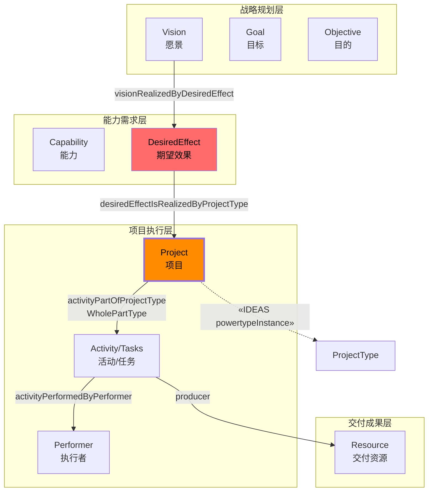
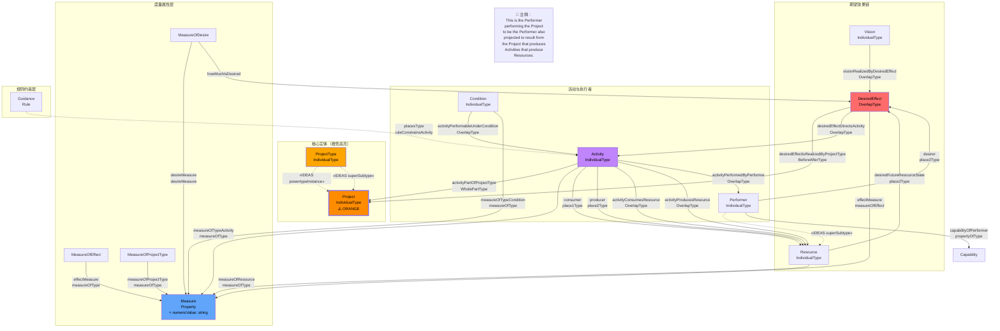
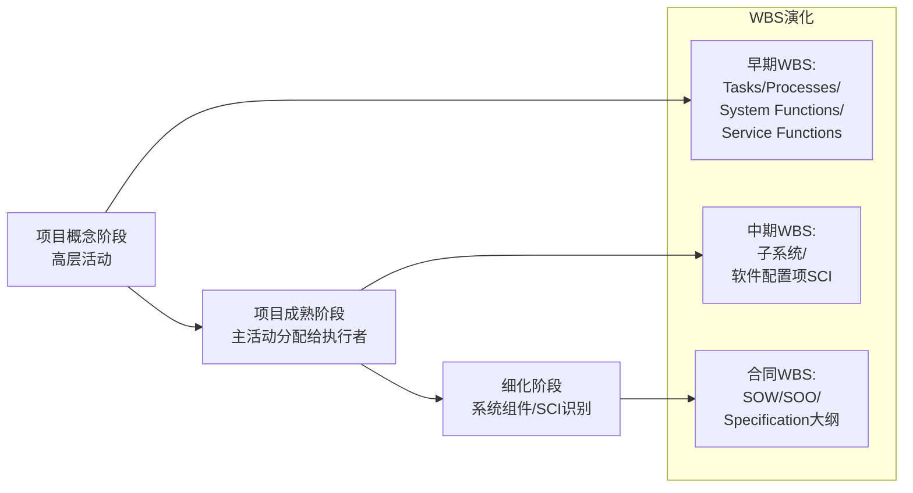
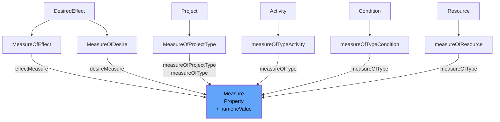
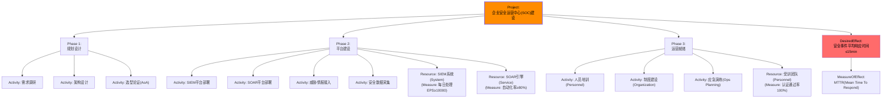

---
tags:
  - dm2/analysis
---

> **操作模板** -> [[../09-Project/Project-Template.md]]
> **所属数据组** -> [[../09-Project]]

# DM2 Project 详细分析

> **来源**：`project.png` 类图 + DoDAF v2.02 PDF pp.70-76 + DM2 元模型定义提取
>
> **分析日期**：2026-04-18
>
> **定位**：Project（项目）= DM2 中的执行与交付概念，回答 "How do we organize work to deliver capabilities?" —— 将活动组织成有明确时间、资源和交付成果的临时性工作单元

---

## 一、概述

### 1.1 什么是 Project？

**官方定义**（多来源对照）：

| 来源 | 定义 |
|------|------|
| **PMBOK (PMI, 3rd Ed., 2004)** | A temporary endeavor undertaken to create a **unique product, service, or result** |
| **DoDAF/CADM** | A planned action that represents a set of activities organized and managed to produce a **specified product in a specified period of time with specified resources** |
| **NAF** | A time-limited endeavour to create a specific set of products or services |
| **Webster's** | 1. Something that is contemplated, devised, or planned; plan; scheme. 2. A large or major undertaking involving considerable money, personnel, and equipment |
| **DoDAF DM2** | A temporary endeavor undertaken to create **Resources or Desired Effects** |

**核心公式**：

```
Project = Activities(Tasks) + Performers + Timeframe → Deliverables(Resources / DesiredEffects)
```

### 1.2 Project 在 DM2 体系中的定位



---

## 二、类图结构解析

### 2.1 完整类图还原

基于 `project.png` 图片：



### 2.2 图中的特殊标注

#### 🟠 Project 的橙色高亮

在所有已分析的类图中，**Project 是唯一使用橙色标注的核心实体**。这暗示其在 DM2 中的特殊性——它不是像 Capability 或 Performer 那样的"领域概念"，而是**组织管理概念**。

#### 注释框解读（图中左下角）

> *"This is the Performer performing the Project to be the Performer also projected to result from the Project that produces Activities that produce Resources."*

这句话描述了一个**自举循环（Bootstrap Loop）**：


> *即：某个 Performer 执行一个 Project，该项目产生的活动产出资源，这些资源最终可能形成新的或增强后的 Performer。* 例如：一个组织（Performer）执行"安全能力建设项目"（Project），产出的活动交付了 SIEM 系统、培训人员（Resources），最终增强了该组织的整体安全能力（增强的 Performer）。

### 2.3 核心实体一览

| 实体 | IDEAS 层级 | 说明 |
|------|-----------|------|
| **Project** | IndividualType | **核心**——临时性工作单元，创造 Resource 或 DesiredEffect |
| **ProjectType** | IndividualType (Powertype) | 项目类型分类（powertype） |
| **DesiredEffect** | OverlapType | 项目要实现的期望效果 |
| **Vision** | IndividualType | 战略愿景，通过 DesiredEffect 与 Project 关联 |
| **MeasureOfProjectType** | Measure 子类 | 项目专用度量类型 |

---

## 三、核心关系详解

### 3.1 desiredEffectIsRealizedByProjectType（最关键）

```
DesiredEffect ──(BeforeAfterType)──▶ Project
```

- **含义**：**期望效果由项目来实现**
- **类型**：BeforeAfterType（时间先后关系）
- **方向**：DesiredEffect → Project（效果驱动项目）
- **实际意义**：先定义要达到的效果，再组织项目去实现

### 3.2 activityPartOfProjectType（构成关系）

```
Activity ──(WholePartType)──▶ Project
```

- **含义**：活动是项目的组成部分
- **类型**：WholePartType（整体-部分）
- **基数**：每个 Project 由 ≥1 个 Activity 组成
- **实际意义**：项目被分解为任务/活动（Tasks）

### 3.3 visionRealizedByDesiredEffect（战略对齐）

```
Vision ──(OverlapType)──▶ DesiredEffect
```

- **含义**：愿景通过期望效果来实现
- **类型**：OverlapType（重叠）
- **实际意义**：建立从 Vision → DesiredEffect → Project 的**战略追溯链**

### 3.4 desiredEffectDirectsActivity（效果指导活动）

```
DesiredEffect ──(OverlapType)──▶ Activity
```

- **含义**：期望效果**指导/驱动**活动的执行
- **类型**：OverlapType
- **实际意义**：确保每项活动都服务于期望效果的实现

### 3.5 Project 的完整关系网络汇总

| 关系名 | 起始 | 目标 | 类型 | 含义 |
|--------|------|------|------|------|
| desiredEffectIsRealizedByProjectType | DesiredEffect | Project | BeforeAfterType | **效果由项目实现** |
| activityPartOfProjectType | Activity | Project | WholePartType | **活动组成项目** |
| visionRealizedByDesiredEffect | Vision | DesiredEffect | OverlapType | 愿景通过效果实现 |
| desiredEffectDirectsActivity | DesiredEffect | Activity | OverlapType | 效果指导活动 |
| measureOfProjectType | Project | Measure | measureOfType | **项目可度量** |
| desireMeasure | DesiredEffect | MeasureOfDesire | measureOfType | 渴望程度度量 |
| effectMeasure | DesiredEffect | MeasureOfEffect | measureOfType | 效果达成度量 |

---

## 四、WBS（工作分解结构）在 DM2 中的角色

### 4.1 什么是 WBS？（PDF p.70）

> *Work Breakdown Structure: "A product-oriented family tree composed of hardware, software, services, data, and facilities."*
>
> *The family tree results from systems engineering efforts during the acquisition of a defense materiel item.*
>
> *MIL-HDBK-881A provides guidance for constructing the WBS.*

**WBS 的核心特征**：

| 特征 | 说明 |
|------|------|
| **面向产品** | 以产品为导向，非以组织为导向 |
| **家族树结构** | 层次化分解 |
| **覆盖五类要素** | Hardware、Software、Services、Data、Facilities |
| **系统工程产物** | 来自采办过程中的系统工程努力 |
| **持续演化** | 从项目构思到生命周期管理持续演进 |

### 4.2 WBS 与 DM2 的映射

| WBS 要素 | DM2 对应 | 说明 |
|----------|----------|------|
| Work Packages（工作包） | Activity（Task） | 具体工作任务 |
| Deliverables（交付物） | Resource | 产出的硬件/软件/服务/数据/设施 |
| Responsible Organizations | Performer（Organization） | 责任组织 |
| Cost Accounts | Measure（cost measures） | 成本核算 |
| Milestones | BeforeAfterType 时间节点 | 里程碑时间点 |
| Product Hierarchy | WholePartType 分解 | 产品层次分解 |

### 4.3 WBS 的演化过程（PDF p.71）



### 4.4 WBS 的双重性质

**PDF p.71 明确区分**：

| 性质                         | 内容                                                                           | DM2 对应                        |
| -------------------------- | ---------------------------------------------------------------------------- | ----------------------------- |
| **物资部分（Materiel Portion）** | Hardware、Software、Services、Data、Facilities → 通过系统工程过程分解为子系统、SCI              | Resource + Performer (System) |
| **非物资部分（Non-Materiel）**    | Work Packages、Task、Activity → 分配给 Performer（Organization、Personnel、Facility） | Activity + Performer          |

---

## 五、"Data for Projects are used in the following ways" —— 详细分析与中国的适配性

### 5.1 原文逐条展开

**PDF p.72 完整原文**：

> *a. JCIDS: Project is the typical outcome of the JCIDS process when material solutions are identified. Non-material solutions may also result in projects.*
>
> *b. PPBE, DAS, and CPM: Project is the core element of the PPBE, DAS and CPM processes... The WBS is the primary reification within Project that relates Performers and Activities to Cost and Milestones.*
>
> *c. SE: The data derived from Architectural Descriptions directly support the definition and structuring of Projects.*
>
> *d. Ops Planning: Project also is used in Operational Planning in such areas as developing specific Mission Plans and procedures. Any effort in the Operational community requiring identifiable funding and management can be defined as a Project.*

### 5.2 逐条中国适配性分析

#### ✅ 条目 a：JCIDS → 中国对应

| 维度 | 美国 (JCIDS) | 中国对应 | 适配性 |
|------|-------------|---------|--------|
| **全称** | Joint Capabilities Integration and Development System（联合能力集成与开发系统） | **装备需求论证体系**（GJB 系列）+ **国防科技发展规划** | ⭐⭐⭐ 高 |
| **功能** | 识别能力缺口 → 生成能力需求文档(CDD) → 导向采办决策 | **作战需求论证** → **装备型号立项** → **科研计划下达** | ⭐⭐⭐ 高 |
| **输出** | Material Solution → Project | **装备研制项目** / **预先研究项目** | ⭐⭐⭐ 高 |
| **差异** | JCIDS 强调"联合"（Joint）和跨军种协同 | 中国强调"体系化"和"军民融合"，但流程逻辑一致 | — |
| **具体文件** | CDD (Capabilities Description Document), ICD (Initial Capabilities Document) | **《武器装备研制总要求》**、**《装备需求论证报告》**（GJB 2116 等） | — |

**中国对应机制详情**：

| 美国机制 | 中国等价物 | 文件依据 |
|----------|-----------|----------|
| JCIDS Analysis | **装备需求论证** | GJB 2116A《武器装备研制项目工作分解结构》 |
| ICd (Initial Capabilities Document) | 《**装备发展战略**》/《**装备建设中长期规划**》 | 国防部发布 |
| CDD (Capabilities Description Document) | 《**研制总要求**》（GZQ）/ **《研制任务书》** | GJB 2737、GJB 2116 |
| Materiel Solution Record (MSR) | **立项综合论证报告** | 装备发展部 |
| Material Solution → Project | **型号研制工程** / **预研课题** | 各军工集团/研究院所 |

**结论：高度适配。** 中国的装备发展流程虽然名称不同，但逻辑完全一致：需求论证 → 能力定义 → 项目确立 → 交付验收。

---

#### ✅ 条目 b：PPBE/DAS/CPM → 中国对应

这是最复杂的映射，因为涉及三个美国特有流程：

##### b.1 PPBE（Planning, Programming, Budgeting, and Execution）

| 维度 | 美国 (PPBE) | 中国对应 | 适配性 |
|------|-------------|---------|--------|
| **全称** | 规划-计划-预算-执行 | **五年规划 + 年度预算 + 计划执行** | ⭐⭐⭐ 高 |
| **核心构建块** | **Program Element (PE)** | **预算科目 / 建设项目编号** | ⭐⭐ 中高 |
| **核心工具** | **WBS + FYDP**（未来年度防务计划） | **《项目建设方案》+《投资概算》+《建设进度表》** | ⭐⭐⭐ 高 |
| **周期** | 两年一周期（POM 循环） | **五年规划（中期）+ 年度预算（短期）** | ⭐⭐ 中（周期不同但逻辑同）|
| **主管机构** | USD(C)（副国防部长/审计长） | **财政部 + 发改委 + 行业主管部门** | ⭐⭐ 中（分散 vs 集中）|

**PPBE 关键概念的中文映射**：

| 美国 PPBE 概念 | 中国等价物 | 示例 |
|----------------|-----------|------|
| Program Element (PE) | **建设项目 / 科研课题** | "某型雷达研制工程"、"网络安全态势感知平台建设项目" |
| Future Years Defense Program (FYDP) | **中期财政规划 / 五年投资计划** | "十四五信息化建设规划"、"2024-2028年装备发展计划" |
| WBS as cost/milestone linkage | **投资分解结构 + 甘特图** | 工程建设的 WBS 直接对应中国的概算分解和进度计划 |
| Budget Apportionment | **预算批复 / 资金拨付** | 财政部/发改委批复资金额度 |
| Execution Review | **项目审计 / 绩效评估** | 国家审计署项目审计、第三方绩效评价 |

##### b.2 DAS（Defense Acquisition System）

| 维度 | 美国 (DAS) | 中国对应 | 适配性 |
|------|-------------|---------|--------|
| **全称** | 国防采办系统 | **装备采购制度** + **政府采购法体系** | ⭐⭐⭐ 高 |
| **框架基础** | DoDI 5000.02（《国防采办系统运作》） | **《军队装备条例》** + **《装备采购管理规定》** | ⭐⭐⭐ 高 |
| **里程碑决策** | Milestone A/B/C（概念/开发/生产） | **方案评审→设计评审→定型审查** | ⭐⭐⭐ 高 |
| **关键文档** | SOW（工作说明）、SOO（目标说明）、Spec（规格书） | **《研制任务书》**、**《技术规格书》**、**《采购合同》** | ⭐⭐⭐ 高 |

**里程碑对比**：

| 美国 DAS 里程碑 | 中国装备研制节点 | 对应文件 |
|-----------------|-----------------|----------|
| Milestone A（MS A）：概念成熟 | **立项评审** | 立项批复 |
| Milestone B（MS B）：开始研发 | **方案设计评审** | 方案设计报告审批 |
| MSE（工程制造开发） | **工程研制评审** | 初样/正样评审 |
| Milestone C（MS C）：生产决策 | **设计定型 / 生产定型** | 定型审查 |
| FOC（全面运行能力） | **形成战斗力 / 验收交付** | 验收鉴定证书 |

##### b.3 CPM（Capital Planning and Investment Management / Portfolio Management）

| 维度 | 美国 (CPM) | 中国对应 | 适配性 |
|------|-------------|---------|--------|
| **本质** | 投资组合管理与资本规划 | **固定资产投资管理** + **预算绩效管理** | ⭐⭐ 中高 |
| **核心关注** | IT Investment Portfolio（IT 投资组合） | **政务信息化项目管理** / **企业IT治理** | ⭐⭐⭐ 高（IT领域）|
| **管理机构** | OMB（管理和预算办公室） | **国办电子政务办 / 发改委高技术司 / 信通院** | ⭐⭐ 中 |
| **关键实践** | Enterprise Architecture (EA) 驱动的投资决策 | **"数字中国" / "新型基础设施"投资评审** | ⭐⭐⭐ 高（近年强化）|

**中国特有的补充机制**：

| 中国特有机制 | 说明 | 与 DM2 Project 的关联 |
|-------------|------|---------------------|
| **重大项目库制度** | 发改委/各部门建立项目储备库，按优先级排序 | 对应 PPBE 的 Program Priority 排序 |
| **可行性研究报告制度** | 所有重大投资项目必须编制可研报告 | 对应 DAS 的 AoA（替代方案分析） |
| **初步设计与概算审查** | 超额项目需发改委/行业部门审批概算 | 对应 WBS + Cost Account 的关联 |
| **后评价制度** | 项目完成后进行绩效后评价 | 对应 MeasureOfEffect / MeasureOfProjectType |

---

#### ✅ 条目 c：SE（Systems Engineering）→ 中国对应

| 维度 | 美国 (SE) | 中国对应 | 适配性 |
|------|-----------|---------|--------|
| **标准框架** | ISO/IEC 15288、INCOSE SE Handbook | **GB/T 18757（系统工程设计）**、**GJB 811（武器装备系统工程）** | ⭐⭐⭐ 高 |
| **核心过程** | Stakeholder Requirements → System Requirements → Architecture → Design → Integration → Verification | **需求分析→总体方案→技术设计→系统集成→试验验证** | ⭐⭐⭐ 高 |
| **基线管理** | Functional Baseline → Allocated Baseline → Product Baseline | **功能基线 → 分配基线 → 产品基线**（GJB 2737） | ⭐⭐⭐ 高 |
| **架构支撑** | DoDAF architectural data → WBS → Spec/SOW | **架构设计文档（GJB）** → **WBS（GJB 2116A）** → **《研制总要求》** | ⭐⭐⭐ 高 |
| **AoA（替代方案分析）** | Trade studies among alternatives | **方案比选 / 论证** | ⭐⭐⭐ 高 |

**特别指出**：中国在系统工程领域的**军用标准体系（GJB系列）**与美国 DoD 标准高度对齐，许多 GJB 标准直接参考或等效采用美军标。因此 SE 方面的适配性**极高**。

---

#### ✅ 条目 d：Ops Planning（作战规划）→ 中国对应

| 维度 | 美国 (Ops Planning) | 中国对应 | 适配性 |
|------|---------------------|---------|--------|
| **全称** | Operational Planning（联合作战规划） | **作战方案拟制 / 训练计划制定 / 演习筹划** | ⭐⭐⭐ 高 |
| **核心输出** | OPLAN（作战计划）、OPORD（作战命令）、CONPLAN（概念计划） | **《×××行动方案》**、**《演习实施方案》**、**《训练大纲》** | ⭐⭐⭐ 高 |
| **Project 映射** | Any effort requiring funding/management = Project | **专项建设任务 / 保障任务 / 演习任务** | ⭐⭐⭐ 高 |
| **规划层次** | Strategic → Operational → Tactical | **战略→战役→战术**（三级规划体系相同） | ⭐⭐⭐ 高 |

**中国作战规划中作为 "Project" 管理的具体例子**：

| 中国语境下的"项目式"作战/训练任务 | 对应 DM2 Project 特征 |
|-------------------------------|----------------------|
| **"蓝盾-XXXX"联合演习筹备** | 有明确时间、预算、交付成果（演习方案/总结报告） |
| **某战区信息化战场设施建设工程** | 有 WBS（各子系统的建设任务） |
| **新型装备接装培训专项** | 产生 Personnel（受训人员）这一 Resource |
| **应急通信保障预案编制** | 非物质产出（Document/Plan 作为 Resource） |

---

## 六、综合适配性评估

### 6.1 总体评分

| 流程/机制 | 适配性 | 主要障碍 | 建议 |
|-----------|--------|---------|------|
| **JCIDS → 装备需求论证** | ⭐⭐⭐⭐ (95%) | 名称和术语不同，但逻辑一致 | 建立术语映射表 |
| **PPBE → 预算规划体系** | ⭐⭐⭐ (80%) | 中国预算周期（5年+年度）vs 美国（2年POM）；集中度不同 | 适配调整周期映射 |
| **DAS → 装备采办** | ⭐⭐⭐⭐ (90%) | 军民融合背景下的双轨制（军购+民用） | 区分军用/民用两套路径 |
| **CPM → 投资组合管理** | ⭐⭐⭐ (75%) | IT 治理领域较成熟，其他领域较弱 | 重点在 IT/信息化领域推广 |
| **SE → 系统工程** | ⭐⭐⭐⭐ (95%) | GJB 标准体系完善 | 直接对标 GJB 标准 |
| **Ops Planning → 作战规划** | ⭐⭐⭐⭐ (90%) | 概念通用，细节有军事特色 | 军事术语本地化 |

### 6.2 中国特色的补充维度

DM2 Project 数据组的美国视角**未覆盖**以下中国特色：

| 中国独有概念 | 说明 | 是否建议纳入 DM2 本地化扩展 |
|-------------|------|--------------------------|
| **党建要求** | 重大项目的党组织领导和政治审核 | ✅ 建议：增加 Governance/PoliticalCompliance 维度 |
| **保密等级管理** | 涉密项目分级管理（秘密/机密/绝密） | ✅ 建议：与 Rules/Constraint 结合扩展 |
| **国产化率要求** | 信创/自主可控要求（如信创目录符合性） | ✅ 建议：纳入 Condition/Rule 约束 |
| **审计全覆盖** | 政府投资项目必审制度 | ✅ 建议：Measure 增加 audit/compliance 维度 |
| **生态文明约束** | 环评、能评等前置条件 | ✅ 建议：Condition 增加 environmentalPrerequisite |
| **军民融合** | 同一能力可能有军用/民用两条项目路径 | ✅ 建议：ProjectType 增加 militaryCivilDualUse 分类 |

---

## 七、Project 的度量体系

### 7.1 PDF p.72 注释 d：多种度量类型

> *Many kinds of measures may be associated with a Project - needs, satisfaction, performance, interoperability, organizational, and cost.*

| 度量类型 | 英文 | 含义 | 中国常见指标示例 |
|----------|------|------|-----------------|
| **Needs** | needs | 需求满足度 | 需求覆盖率、功能完备率 |
| **Satisfaction** | satisfaction | 利益相关方满意度 | 用户满意度调查分值、专家评审意见 |
| **Performance** | performance | 性能指标 | 响应时间、吞吐量、精度、可靠性 MTBF |
| **Interoperability** | interoperability | 互操作性 | 接口兼容性、协议符合度、数据交换成功率 |
| **Organizational** | organizational | 组织效能 | 团队规模、技能匹配度、协作效率 |
| **Cost** | cost | 成本 | 投资 ROI、全生命周期成本 LCC、人均成本 |

### 7.2 度量在类图中的体现

基于图片右侧的 Measure 区域：



---

## 八、规则与约束的分层分配

### 8.1 PDF p.72 注释 e

> *Measures and Rules can be assigned at all levels of the Project decomposition. Top-level Measures and Rules could be assigned to the Vision, Goals, and Objectives (VGO). Lower-level Measures and Rules can then be derived and assigned to compliance and test criteria.*

```mermaid
graph TB
    subgraph 顶层["顶层（VGO）"]
        V["Vision"] 
        G["Goal"]
        O["Objective"]
    end
    
    subgraph 中层["中层（Project 分解）"]
        PHASE1["Phase 1<br/>子项目A"]
        PHASE2["Phase 2<br/>子项目B"]
    end
    
    subgraph 底层["底层（Activity/Task）"]
        TASK1["Task 1.1"]
        TASK2["Task 1.2"]
        TASK3["Task 2.1"]
    end
    
    subgraph 规则约束["Rules & Constraints"]
        STRAT_R["战略约束<br/>(Policy)"]
        PROJ_R["项目约束<br/>(Standard)"]
        TASK_R["任务约束<br/>(Specification)"]
    end
    
    subgraph 度量["Measures"]
        STRAT_M ["战略度量<br/>(KPI)"]
        PROJ_M ["项目度量<br/>(Milestone)"]
        TASK_M ["任务度量<br/>(Acceptance Criteria)"]
    end
    
    V & G & O --> STRAT_R & STRAT_M
    PHASE1 & PHASE2 --> PROJ_R & PROJ_M
    TASK1 & TASK2 & TASK3 --> TASK_R & TASK_M
    
    STRAT_R -->|"derive"| PROJ_R -->|"derive"| TASK_R
    STRAT_M -->|"decompose"| PROJ_M -->|"allocate"| TASK_M
    
    style STRAT_R fill:#EF4444,color:#fff
    style TASK_R fill:#F97316,color:#fff
    style STRAT_M fill:#22C55E,color:#fff
```

**关键原则**：规则和度量遵循**从上至下派生、从下至上聚合**的双向流动。

---

## 九、与其他数据组的关系

### 9.1 Project ↔ Capability

| 关系 | 说明 |
|------|------|
| DesiredEffect → Project | 能力的期望效果由项目来实现 |
| ProjectType ↔ CapabilityType | 项目类型和能力类型的交叉引用 |
| activityPartOfProjectType ↔ activityPartOfCapability | 同一组 Activity 既属于 Project 也属于 Capability |

### 9.2 Project ↔ Goals/Vision

| 关系 | 说明 |
|------|------|
| Vision → DesiredEffect → Project | **完整的战略追溯链** |
| Goal → DesiredEffect | 目标的量化表达为期望效果 |
| MeasureOfDesire | 连接 DesiredEffect 和优先级度量 |

### 9.3 Project ↔ Resource Flow

- Project 中的 **Activity** 产生/消耗 **Resource**
- Project 的交付物就是 **Resource**（System、Service、Personnel Type、Organization、Facility）
- **serviceEnablesAccessToResource** 也适用于项目中使用的 Service

### 9.4 Project ↔ Services

- Service 可以作为 **Project 的交付物**
- Project 内部的 **Service Composition** 可以是 WBS 的一部分
- **SaaS** 等云服务模式可以是一种 Project 实现方式（PDF p.68 CPM 部分）

---

## 十、视图映射

### 10.1 主要视图

| 视图 | 使用 Project 元素 |
|------|-------------------|
| **PV-1（项目组合）** | ProjectType 层次、项目组合全景 |
| **PV-2（项目时间线）** | Project 的 BeforeAfter 时间关系 |
| **StdV-1（标准）** | 项目遵循的标准和规范 |
| **CV-3（能力阶段化）** | Project 里程碑 → 能力演进节点 |
| **SV-8（系统演化）** | Project 驱动系统技术预测和演化 |
| **SV-9（系统技术预测）** | Project 中的技术发展策略 |
| **OV-3（资源流）** | Project 内的资源流动 |

### 10.2 PV 视点详解

| 子视图 | 内容 | 对应类图元素 |
|--------|------|-------------|
| PV-1 | 项目清单、项目类型分类、项目-能力映射 | Project, ProjectType, capabilityOfPerformer |
| PV-2 | 项目时间线、里程碑、依赖关系 | BeforeAfterType, desiredEffectIsRealizedByProjectType |
| PV-2c | 项目-项目依赖矩阵 | Project 间的关系 |
| PV-6 | 项目-活动-资源的完整追踪 | Activity → Resource via Project |

### 10.3 呈现形式（PDF p.74）

> *Project presentation techniques typically use Tree models (WBS), Timeline Models and Tabular information (e.g. spreadsheets).*

| 形式 | 用途 | DM2 对应 |
|------|------|----------|
| **Tree Model（树形）** | WBS 结构、产品分解 | WholePartType 分解 |
| **Timeline Model（时间线）** | 甘特图、里程碑图 | BeforeAfterType 时间关系 |
| **Tabular（表格）** | 项目清单、成本估算表 | Measure 数值展示 |

---

## 十一、典型建模场景

### 场景一：网络安全体系建设项目的 WBS 分解



**中国适配要点**：
- 此项目在中国语境下可能是**"信息安全等级保护建设项目"**或**"关基安全能力提升工程"**
- 需满足**等保 2.0 合规**（Rule/Standard）
- 可能需要**涉密信息系统分级保护**（额外的 Rule 约束）
- 预算需经**发改委/主管部门审批**（PPBE 对应流程）
- 产出需通过**第三方测评/公安备案**（MeasureOfEffect 验证）

### 场景二：中国国防装备研制项目的 DM2 映射

| 美国流程 | 中国流程 | DM2 映射 |
|----------|----------|----------|
| JCIDS 分析 → CDD | **装备需求论证** → **《研制总要求》(GZQ)** | DesiredEffect → Project |
| AoA（替代方案分析） | **方案比选 / 多方案论证** | Activity（分析活动） |
| MS A/B/C（里程碑决策） | **立/研/定（立项-研制-定型）** | Project 阶段（BeforeAfter） |
| WBS (MIL-HDBK-881A) | **GJB 2116A WBS** + **《工作说明》(SOW)** | activityPartOfProjectType |
| FYDP（未来年度防务计划） | **"十四五"装备发展规划 + 年度预算** | ProjectType → Measure(cost) |
| OT&E（作战试验与评估） | **设计定型试验 / 作战效能评估** | MeasureOfEffect |

---

## 十二、版本差异：DoDAF 1.5 vs 2.0 (DM2)

| 维度 | DoDAF 1.5 | DM2 (DoDAF 2.0) |
|------|-----------|------------------|
| **Project 定位** | 弱定义，主要在 PV 视图中 | **一等公民**——独立数据组，完整元模型 |
| **WBS 集成** | 隐式 | **显式**——activityPartOfProjectType 直接映射 WBS |
| **与 Vision/Goal 关联** | 无 | **显式**——visionRealizedByDesiredEffect → Project |
| **与 DesiredEffect 关联** | 无 | **核心**——desiredEffectIsRealizedByProjectType |
| **度量支持** | 分离 | **深度集成**——MeasureOfProjectType + 六种度量类别 |
| **规则分层** | 无 | **支持**——VGO 层 → Project 层 → Task 层逐级派生 |
| **Performer 自举** | 无 | **显式注释**——Project 增强 Performer |
| **SV-8/SV-9 替代** | SV-8/SV-9 为独立视图 | **Project 数据组内建模**——技术预测和演化成为 Project 的一部分 |
| **IDEAS 基础** | 无 | **完整**——Powertype、WholePart、BeforeAfter、Overlap |
| **采办系统集成** | 松散 | **紧密**——WBS 直接连接 DoD 5000.02 采办流程 |

---

## 十三、关键洞察总结

### 🔑 从类图中学到的 7 个重要发现

1. **Project 是唯一橙色高亮实体**
   - 暗示其**组织管理属性**强于领域属性
   - 它是连接"要做什么"(Capability) 和"怎么做成"(Execution) 的桥梁

2. **Vision → DesiredEffect → Project 是完整的战略追溯链**
   - 不是 Project 直接承接 Vision
   - 而是通过 **DesiredEffect** 作为中介——确保每个项目都服务于明确的期望效果

3. **WBS 是 Project 的物理化身**
   - WBS = activityPartOfProjectType 的实例化
   - WBS 将 Performer 和 Activity 关联到 Cost 和 Milestone
   - **WBS 是产品导向的，不是组织导向的**

4. **Project 具有 Performed 自举特性**
   - 执行 Project 的 Performer 可能因 Project 产出而被增强
   - 这解释了"能力建设项目"的本质——投入是为了获得更强的能力

5. **规则和度量可分层派生**
   - 顶层：VGO 级别的战略性规则/度量
   - 中层：Project 级别的标准和里程碑
   - 底层：Task 级别的合规/测试准则
   - 支持**从上至下派生、从下至上聚合**

6. **六大度量类别覆盖全方位**
   - Needs / Satisfaction / Performance / Interoperability / Organizational / Cost
   - 不只是"进度和成本"——还有互操作性和满意度

7. **中国高度适配但有本土化扩展空间**
   - 核心 JCIDS/DAS/SE 逻辑与中国流程**高度一致**（90%+）
   - 需补充：保密分级、国产化率、党建要求、审计全覆盖、环评/能评、军民融合

---

## 附录：中美项目管理体系对照速查表

| 维度 | 美国 (DoDAF/DoD) | 中国 | 对齐度 |
|------|------------------|------|--------|
| 需求源头 | JCIDS → ICD/CDD | 装备需求论证 → 发展战略/研制总要求 | ⭐⭐⭐⭐ |
| 项目确立 | MS A (Concept Decision) | 立项批复 | ⭐⭐⭐⭐ |
| 规划周期 | 2年 POM Cycle | 5年规划 + 年度预算 | ⭐⭐⭐ |
| 预算管理 | PPBE → PE/FYDP | 发改委/财政部预算审批 | ⭐⭐⭐ |
| 采办框架 | DAS (DoDI 5000.02) | 装备采购条例 / 政府采购法 | ⭐⭐⭐⭐ |
| 工作分解 | WBS (MIL-HDBK-881A) | WBS (GJB 2116A) | ⭐⭐⭐⭐ |
| 系统工程 | INCOSE SE / ISO 15288 | GB/T 18757 / GJB 811 | ⭐⭐⭐⭐ |
| 里程碑 | MS A/B/C → FOC | 立项→方案→初样→正样→定型→列装 | ⭐⭐⭐⭐ |
| 投资组合 | CPM / IT Portfolio | 固定资产投资 / 数字中国投资 | ⭐⭐⭐ |
| 作战规划 | OPLAN/OPORD/CONPLAN | 作战方案/行动计划/演习方案 | ⭐⭐⭐⭐ |
| 绩效度量 | 6类度量（needs~cost） | KPI/OKR/审计/后评价 | ⭐⭐⭐ |
| 法规合规 | FAR/DFAR | 采购法/审计法/保密法 | ⭐⭐⭐ |
| 特色补充 | — | 党建/保密/国产化/环评/军民融合 | 🆕 中国独有 |

---

*文档结束。基于 project.png 类图 + DoDAF v2.02 PDF pp.70-76 + DM2 元模型 JSON 提取综合分析。特别包含中国适配性深度分析。*
