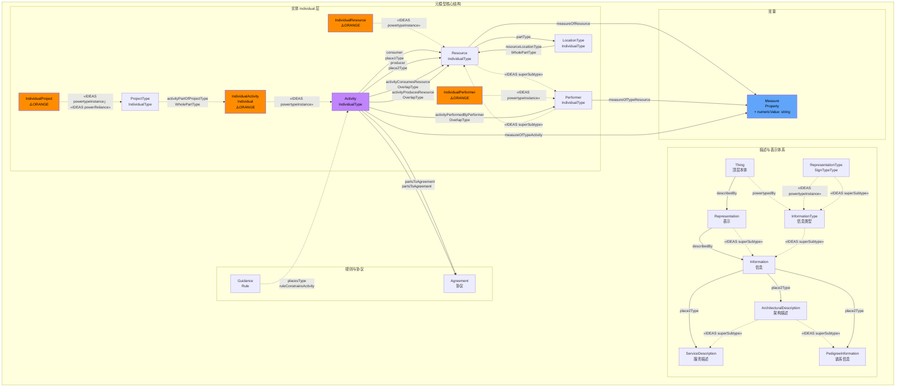
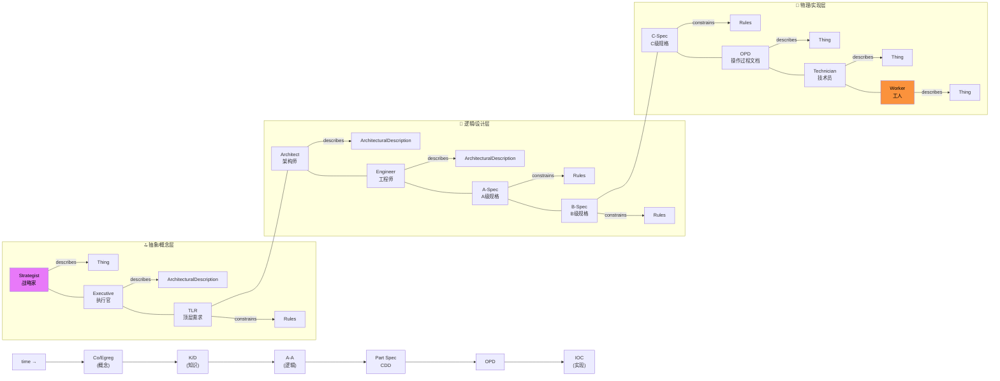
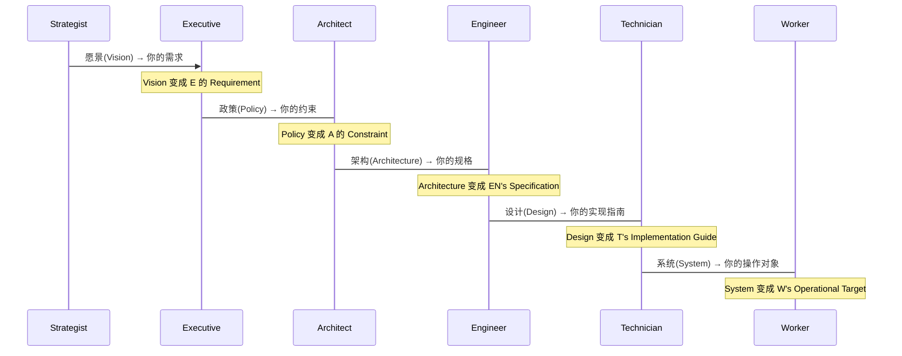
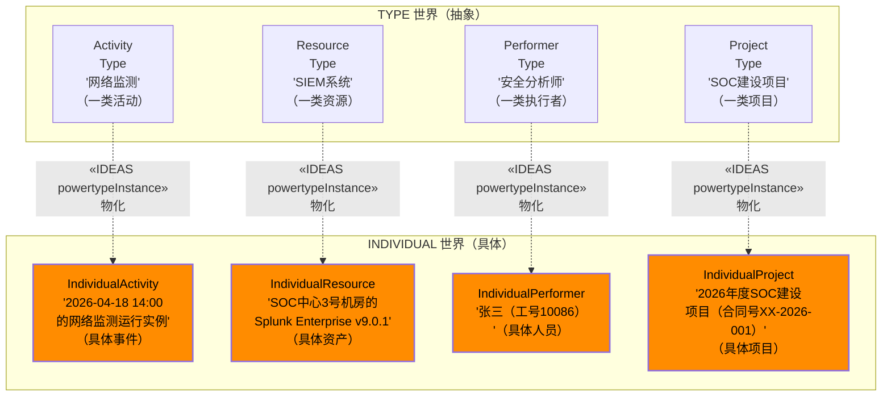
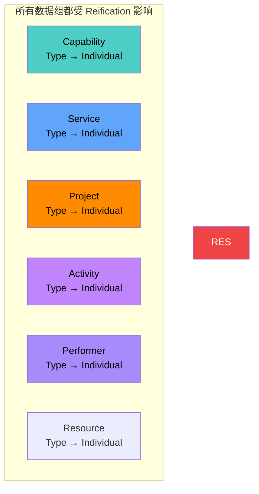

---
tags:
  - dm2/analysis
---

> **操作模板** -> [[../15-ReificationLevels/README.md]]
> **所属数据组** -> [[../15-ReificationLevels]]

# DM2 Reification Levels 详细分析

> **来源**：`Reification Levels.png` 类图 + DoDAF v2.02 PDF pp.76-78 + DM2 元模型定义提取
>
> **分析日期**：2026-04-18
>
> **定位**：Reification（物化/具象化）= DM2 中的**抽象-具体层次转换机制**——回答 "How do architectural descriptions become increasingly concrete?" —— 从战略概念到物理实现的逐层细化过程

---

## 一、概述

### 1.1 什么是 Reification？

**词源**：来自拉丁语 *res*（事物）+ *facere*（制造）→ "使某物成为具体的/真实的"

**哲学含义**：将抽象概念转化为可感知的具体实例的过程。

**DM2 定义**：

> *"Architectural descriptions such as activity models are examples of architectural descriptions that are **reified at many levels of detail**. In a typical development project, the architecture descriptions provide **increasing levels of detail as the project progresses** through the normal DoD Milestone process."* (PDF p.76)

### 1.2 核心公式

```
Reification = 抽象描述(Conceptual) → 逐步细化 → 具体实现(Physical)
              每一层细化 = "上一层的 Design 成为下一层的 Requirement"
```

### 1.3 Zachman 的 "Levels of Reification" 概念

**PDF p.76 明确引用 John Zachman**：

> *This is what John Zachman calls "levels of reification", as shown in the figure below.*

这意味着 Reification Levels 与 **Zachman Framework** 有直接的对应关系。类图右侧的可视化部分正是这一思想的体现。

---

## 二、类图结构解析

### 2.1 完整类图还原

基于 `Reification Levels.png` 图片，这是一个**复合类图**——左侧是元模型关系，右侧是 Zachman 式的层次可视化。



### 2.2 ⚠️ 橙色标注的四个 Individual 实体

这是 Reification Levels 类图的**最显著特征**——四个橙色高亮的 Individual 实例：

| 橙色实体                    | 含义                           | 为什么在 Reification 中特别标注 |
| ----------------------- | ---------------------------- | ---------------------- |
| **IndividualResource**  | 资源的**具体实例**（如某台特定服务器、某个特定人员） | 物化的最终产物                |
| **IndividualPerformer** | 执行者的**具体实例**（如某个人、某个具体系统）    | 执行层面的具体化               |
| **IndividualActivity**  | 活动的**具体实例**（即发生在时空中的活动）      | 活动从类型到执行的物化            |
| **IndividualProject**   | 项目的**具体实例**                  | 项目从计划到实施的物化            |
|                         |                              |                        |

**这些橙色的 Individual 实体正是 "Reification" 的产物**——它们代表了从 Type 到 Individual 的完整物化链条的终点。

### 2.3 类图右侧：Zachman 式层次可视化

图片右侧有一个非常重要的**层次可视化图**，展示了 Reification 在不同角色和文档粒度上的体现：



**这个可视化揭示了 Reification 的本质**：

| 角色 | 层次 | 粒度 | 输出 |
|------|------|------|------|
| **Strategist** | 最抽象 | 概念/愿景 | 战略意图（Thing 的最抽象描述）|
| **Executive** | 高层 | 政策/约束 | 架构概览描述 |
| **TLR** | 高层需求 | 能力约束 | 规则/标准 |
| **Architect** | 逻辑设计 | 架构模型 | 架构描述（OV/SV/CV 等）|
| **Engineer** | 详细设计 | 系统/子系统设计 | 详细架构描述 |
| **A-Spec** | A级规格 | 接口/功能规格 | 规格约束 |
| **B-Spec** | B级规格 | 设计规格 | 设计约束 |
| **C-Spec** | C级规格 | 实现/编码规格 | 实现约束 |
| **OPD** | 操作层面 | 操作手册/程序 | 操作过程描述 |
| **Technician** | 技术实施 | 安装/配置 | 具体的 Thing 描述 |
| **Worker** | 运行操作 | 使用/操作 | 具体的 Thing 描述 |

---

## 三、核心概念详解

### 3.1 Reification 的本质："Design becomes Requirement"

**PDF p.77 的关键表述**：

> *From one level to another level different people become involved in the architecture and design process. The reification process illustrates that at different levels, **'one person's design becomes the next person's requirement'**.*

这是 Reification 的**核心哲学**：



### 3.2 Type ↔ Individual 的物化链

Reification Levels 类图的核心就是展示 **Type 如何变成 Individual**：



### 3.3 ArchitecturalDescription 作为 Reification 的载体

**定义**：*Information describing an architecture such as an OV-5 Activity Model document.* (DM2)

**继承层次**：
```
Information ⊃ ArchitecturalDescription ⊃ ServiceDescription
                                    ⊃ PedigreeInformation
```

| 子类 | 说明 | 示例 |
|------|------|------|
| **ArchitecturalDescription** | 通用架构描述基类 | OV-5 活动模型文档、SV-1 系统接口描述 |
| **ServiceDescription** | 服务专用架构描述 | SvcV-1 服务接口规范 |
| **PedigreeInformation** | 谱系/来源信息 | 数据来源追踪记录 |

### 3.4 Agreement（协议）

**定义**：*A consent among parties regarding the terms and conditions of activities that said parties participate in.*

- **参与者**：`partsToAgreement` 关系中的两方
- **用途**：在 Reification 过程中，不同层次的交接需要**正式协议**
- **典型场景**：
  - 架构师与工程师之间的**接口协议**
  - 开发方与验收方的**验收标准协议**
  - 各承包商之间的**互操作协议**

---

## 四、"Data for Reification are used in the following ways" 逐条分析

**PDF p.77 原文**：

### a. JCIDS

> *Refinement and increased levels of detail of capability and solution constraint descriptions from ICD to CPD.*

| 文档 | 全称 | Reification 层次 | 说明 |
|------|------|-----------------|------|
| **ICD** | Initial Capabilities Document | 最粗粒度 | 初始能力需求——战略家视角 |
| **CPD** | Capabilities Development Document | 更细粒度 | 能力开发文档——架构师视角 |

**Reification 过程**：ICD（"我们需要网络防御能力"）→ CPD（"我们需要能拦截95%攻击、响应时间<15min的防御能力，包含SIEM+SOAR+情报组件"）

### b. PPBE

> *Refinement in Project or Program Work Breakdown Structures (WBSs) and Cost to complete estimates.*

- **WBS 细化**：高层 WBS（"平台建设"）→ 中层 WBS（"SIEM部署"）→ 底层 WBS（"Agent安装-第3批次"）
- **成本估算细化**：ROM Cost（数量级估算）→ Budget Estimate（预算估算）→ Definitive Estimate（确定估算）

### c. DAS

> *Refinement and Increase detail of design and architectural descriptions through the milestone review process.*

- **MS A（概念决策）**： Conceptual Architecture
- **MS B（开发决策）**： System Architecture → Preliminary Design
- **MS C（生产决策）**： Detailed Design → Product Baseline

每个里程碑评审都是一次 **Reification 检查点**——确认上一层的设计是否已充分细化。

### d. SE（系统工程）——两条子项

> *1) Refinement and Increase detail of design and architectural descriptions through the various design and development stages.*
> 
> *2) Clearly described functional allocations and traceability throughout the various levels of architectural descriptions (e.g. specifications, architectural view and models).*

**关键强调**：**追溯性（Traceability）**——每一层细化的元素都能回溯到上层来源。这正是 Reification 的管理价值所在。

**SE 阶段与 Reification 层次的对应**：

| SE 阶段 | 输出 | Reification 层次 |
|----------|------|-----------------|
| Stakeholder Requirements | ConOps / StkRq | Strategic → Executive |
| System Requirements | SysRS / IRS | Executive → Architect |
| Architecture Design | Architectural Views (DoDAF) | Architect → Engineer |
| Detailed Design | ICD/IDD/Detailed Specs | Engineer → A/B-Spec |
| Integration & Test | Test Procedures / Reports | B/C-Spec → Technician |
| Operations & Maintenance | O&M Manuals / Procedures | Technician → Worker |

### e. Ops Planning

> *Refinement and increasing levels of detail in Tactics, Techniques and Procedures throughout the stages of operational plan development.*

| Ops Planning 层次 | 内容 | Reification 对应 |
|------------------|------|------------------|
| **Tactics（战术）** | 高层作战方法 | 战略家/执行官层 |
| **Techniques（技术）** | 中层操作技术 | 架构师/工程师层 |
| **Procedures（程序）** | 具体步骤规程 | 技术员/操作员层 |

### f. CPM

> *Refinement and increased detail in the descriptions of the capability, performance, functionality and cost effectiveness of the portfolio.*

投资组合管理中的 Reification 关注**组合整体**的细化——从战略能力组合到具体项目的性能和成本效益分析。

---

## 五、Reification 与其他数据组的关系

### 5.1 Reification 是横向关注点

与其他数据组不同，Reification **不引入新实体**，而是关注所有实体的**细化层次维度**。



### 5.2 Reification Levels 出现的数据组交叉引用统计

基于 JSON 提取数据，标记为 `"groups": [..., "Reification Levels", ...]` 的关系/实体包括：

| 出现在 Reification Levels 中的实体/关系 | 同时还属于哪些数据组 |
|----------------------------------------|--------------------|
| Activity | Resource Flow, Info&Data, Capability, Services, Project, Rules, Pedigree, InfoPedigree |
| IndividualActivity | Info&Data, Pedigree |
| IndividualPerformer | Resource Flow, Info&Data, OrgStructure, Pedigree |
| IndividualResource | ResourceFlow, OrgStructure, Location, Pedigree |
| activityPerformedByPerformer | ResourceFlow, Info&Data, Capability, Services, Project, Rules, InfoPedigree |
| activityConsumesResource | ResourceFlow, Info&Data, Capability, Services, Project, Rules, InfoPedigree |
| activityProducesResource | 同上 | 
| activityPartOfProjectType | Info&Data, Project |
| activityPerformableUnderCondition | ResourceFlow, Capability, Project, Rules |
| Agreement | Info&Data, Rules |
| partsToAgreement | Info&Data, Rules |
| ArchitecturalDescription | Info&Data, Services |
| ServiceDescription | Info&Data, Services |
| PedigreeInformation | Info&Data, Pedigree, InfoPedigree |
| IndividualProject | —（仅 Reification + Project）|

**结论**：Activity 及其关联关系是 Reification 中**被引用最多**的概念——因为活动的细化是最显著的 Reification 过程。

---

## 六、Zachman Framework 对照

### 6.1 DM2 Reification vs Zachman Framework

| Zachman 维度 | Zachman 询问 | DM2 Reification 对应 | DM2 实体 |
|--------------|------------|---------------------|---------|
| **Why（动机）** | 战略意图 | Strategist 层 | Vision, Goal, DesiredEffect |
| **How（功能）** | 过程/功能 | Architect/Engineer 层 | Activity, Capability |
| **What（数据）** | 数据/资源 | Engineer/A-Spec 层 | Resource, Information, Data |
| **Where（位置）** | 位置/网络 | Engineer 层 | Location |
| **Who（人员/组织）** | 组织/角色 | Architect/Executive 层 | Performer, Organization, PersonRole |
| **When（时机）** | 时序/周期 | 全层次 | BeforeAfterType, Condition |
| **（实际行）** | **角色** | **全11种角色** | Individual 实例 |

### 6.2 图片右侧可视化的 Zachman 解读

图中右侧的层次图实际上是一个**简化的 Zachman 矩阵**：

| 层次标签 | 可能的全称 | 对应 Zachman 行 | 对应 DM2 概念 |
|---------|-----------|----------------|-------------|
| **Co/Egreg** | Conceptual / Aggregated | Planner (Scope) | Vision, Goal, DesiredEffect |
| **K/D** | Knowledge / Definition | Owner (Enterprise) | ArchitecturalDescription (High-level) |
| **A-A** | Analysis - Architecture | Designer (System) | ArchitecturalDescription (Detailed) |
| **Part Spec** | Part Specification | Builder (Technology) | Specification (A-Spec) |
| **CDD** | Capabilities Development Document | — | CDD (JCIDS 文档) |
| **OPD** | Operational Procedure Document | Sub-Contractor (Detailed) | ServiceDescription, Operational Procedures |
| **IOC** | Initial Operating Capability / Implementation | Enterprise (Functioning) | Individual 实例（具体运行的系统）|

---

## 七、呈现形式

**PDF p.77**：

> *Reification is depicted throughout all the elements of the architectural descriptions. It is evident in all levels of design detail or refinement. ... Typically the structural, behavioral, tree models and views will be present throughout all the normal programs documentation (e.g. specifications, system engineering plans, procedural documents, training manuals, doctrine publications, etc.)*

| 形式 | 用途 | 出现层次 |
|------|------|---------|
| **Structural Models（结构模型）** | 组成分解、层级关系 | 所有层次 |
| **Behavioral Models（行为模型）** | 流程、时序、状态 | Architect → Engineer 层 |
| **Tree Models（树形模型）** | WBS、分类目录 | Engineer → Worker 层 |
| **Specifications（规格书）** | 详细技术规格 | A-Spec → C-Spec |
| **Plans（计划）** | SE 计划、项目计划 | Executive → Engineer |
| **Manuals（手册）** | 操作手册、培训手册 | Technician → Worker |
| **Doctrine（条令/规范）** | 作战条令、业务规范 | Ops Planning 层 |

---

## 八、典型建模场景

### 场景一：网络安全平台的 Reification 层次演示

```mermaid
graph TB
    subgraph L0["L0: 战略家层（Strategist）"]
        VISION["Vision:<br/>'建成行业领先的<br/>安全运营体系'"]
    end
    
    subgraph L1["L1: 执行官层（Executive）"]
        POLICY["Policy:<br/>'等保2.0三级合规 +<br/>满足关基保护要求'"]
        GOAL["Goal:<br/>'安全事件自动检测率≥99%<br/>平均响应≤15分钟'"]
    end
    
    subgraph L2["L2: 架构师层（Architect）"]
        ARCH_OV5["OV-5:<br/>安全运营活动模型<br/>(监测→分析→响应→恢复)"]
        ARCH_SV1["SV-1:<br/>系统集成架构<br/>(SIEM+SOAR+TI+Asset)"]
        ARCH_CV2["CV-2:<br/>能力分类<br/>(检测/防护/响应/恢复)"]
    end
    
    subgraph L3["L3: 工程师层（Engineer）"]
        SPEC_A ["SRS:<br/>SIEM系统需求规格<br/>(EPS≥10K, 保留180天)"]
        SPEC_B ["IDS:<br/>SOAR接口设计文档<br/>(REST API, Playbook格式)"]
        SPEC_C ["NWK:<br/>网络采集节点<br/>部署方案<br/>(SPAN/mirror端口)"]
    end
    
    subgraph L4["L4: 技术员层（Technician）"]
        DEPLOY["部署清单:<br/>Splunk ENT v9.0.1<br/>License: 50GB/day"]
        CONFIG["配置基线:<br/>syslog-ng规则集<br/>v2.3.1 baseline"]
    end
    
    subgraph L5["L5: 操作员层（Worker）"]
        SOP["标准作业程序:<br/>告警分诊SOP-v3<br/> playbook: 'Web攻击-中危'"]
        RUNBOOK["运行手册:<br/>值班操作手册<br/>每班检查项12项"]
    end
    
    VISION -->|"design becomes requirement"| POLICY
    POLICY -->|"design becomes requirement"| GOAL
    GOAL -->|"design becomes requirement"| ARCH_OV5
    ARCH_OV5 -->|"design becomes requirement"| SPEC_A
    SPEC_A -->|"design becomes requirement"| DEPLOY
    DEPLOY -->|"design becomes requirement"| SOP
    
    style VISION fill:#E879F9,color:#000
    style SOP fill:#FB923C,color:#000
```

### 场景二：Reification 的追溯矩阵

| 上层输出 | 关系 | 下层输入 | 追溯ID |
|----------|------|----------|---------|
| Vision V-001 | drives | Goal G-001 | TR-VG-001 |
| Goal G-001 | constrains | Capability CAP-005 | TR-GC-001 |
| CAP-005 | decomposes to | Activity A-023 | TR-CA-001 |
| A-023 | allocated to | Project P-007 | TR-AP-001 |
| P-007 | contains | WorkPackage WP-023-01 | TR-PW-001 |
| WP-023-01 | specifies | Deliverable D-SIEM-001 | TR-WD-001 |
| D-SIEM-001 | verified by | TestCase TC-SIEM-PERF-05 | TR-DT-001 |

---

## 九、版本差异与 IDEAS 基础

### 9.1 Reification 特有的 IDEAS 关系使用

| IDEAS 关系 | 在 Reification 中的用法 | 含义 |
|-----------|----------------------|------|
| **powertypeInstance** | Type → Individual（4个橙色实体） | 类型到实例的物化 |
| **powerReliance** | ProjectType → IndividualProject | 项目类型的依赖性实例化 |
| **superSubtype** | 多处继承链 | 层次分类 |
| **describedBy** | Thing → Representation → Information | 描述关系的传递链 |

### 9.2 DoDAF 1.5 vs 2.0

| 维度 | DoDAF 1.5 | DM2 (DoDAF 2.0) |
|------|-----------|------------------|
| **Reification 概念** | 隐式存在于视图细化中 | **显式数据组**——独立元模型和类图 |
| **Type/Individual 区别** | 不明确 | **清晰**——powertypeInstance 显式建模 |
| **Zachman 引用** | 无 | **明确**——直接引用 John Zachman 的 "levels of reification" |
| **追溯性** | 未强制要求 | **核心原则**——SE d.2 强调 traceability |
| **"Design becomes Requirement"** | 无此表述 | **核心理念**——p.77 明确阐述 |
| **角色层次** | 无 | **11角色模型**——从 Strategist 到 Worker |
| **ArchitecturalDescription** | 非正式文档 | **一等实体**——有明确定义和类型层次 |

---

## 十、关键洞察总结

### 🔑 从类图中学到的 7 个重要发现

1. **Reification 不是独立领域，而是横切关注点**
   - 它是**所有数据组的公共维度**
   - 不引入新的领域概念，而是为所有概念提供**细化深度坐标**

2. **四个橙色 Individual 实体是 Reification 的终点**
   - IndividualResource / IndividualPerformer / IndividualActivity / IndividualProject
   - 它们标志着从 Type 世界到 Individual 世界的**完全跨越**

3. **"Design becomes Requirement" 是黄金法则**
   - 每一层细化的产出都是下一层的输入
   - 这是工程组织中**分工协作的本质逻辑**
   - 解释了为什么架构师必须考虑下游可实现性

4. **Zachman Framework 是 Reification 的理论基础**
   - PDF 直接引用 John Zachman
   - 类图右侧的可视化是一个**简化版 Zachman 矩阵**
   - 11 种角色对应不同的抽象层次

5. **追溯性（Traceability）是 Reification 的管理工具**
   - SE 明确要求各层次间的**双向追溯**
   - 从需求到设计到实现到测试的**完整链路**
   - 变更影响分析的基础

6. **ArchitecturalDescription 是 Reification 的载体**
   - Information ⊃ ArchitecturalDescription ⊃ {ServiceDescription, PedigreeInformation}
   - 每个层次都有对应的**架构描述文档**

7. **Reification 贯穿整个项目生命周期**
   - 从 JCIDS（需求定义）到 PPBE（预算规划）
   - 从 DAS（采办里程碑）到 SE（系统工程阶段）
   - 从 Ops Planning（战术/程序细化）到 CPM（组合管理）
   - **六大核心流程全部涉及 Reification**

---

## 附录：Reification 层次速查卡

```
┌─────────────────────────────────────────────────────────────────┐
│                    REIFICATION LEVELS 速查                       │
├──────────────┬────────────┬──────────────┬─────────────────────┤
│    层次       │    角色     │    粒度       │    典型产出          │
├──────────────┼────────────┼──────────────┼─────────────────────┤
│ L0 概念      │ Strategist  │ 愿景/方向     │ Vision Statement    │
│ L1 政策      │ Executive   │ 目标/约束     │ Policy, Goal, Std    │
│ L2 架构      │ Architect   │ 逻辑模型      │ OV/SV/CV Views      │
│ L3 设计      │ Engineer    │ 规格/接口     │ SRS, ICD, IDD       │
│ L4 A级规格   │ A-Specifier │ 功能规格      │ Functional Spec     │
│ L5 B级规格   │ B-Specifier │ 设计规格      │ Design Spec         │
│ L6 C级规格   │ C-Specifier │ 实现规格      │ Code/Config Spec    │
│ L7 操作      │ Operator    │ 程序/手册      │ SOP, Runbook        │
├──────────────┼────────────┼──────────────┼─────────────────────┤
│  黄金法则    │ ←←← Design becomes Requirement →→→                │
│  追溯要求    │ ↑↑↑ Full Bidirectional Traceability ↑↑↑             │
└──────────────┴────────────┴──────────────┴─────────────────────┘
```

---

*文档结束。基于 Reification Levels.png 类图 + DoDAF v2.02 PDF pp.76-78 + DM2 元模型 JSON 提取综合分析。*
