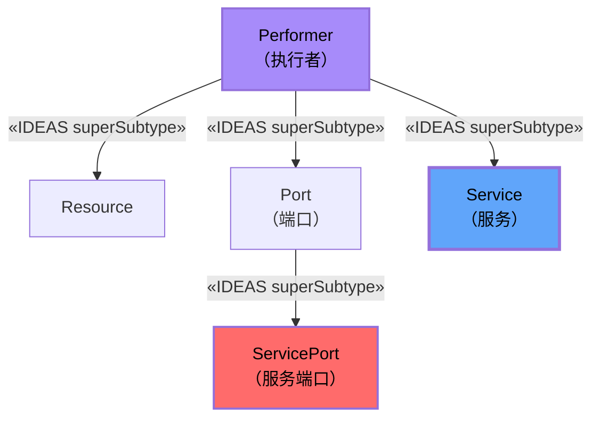
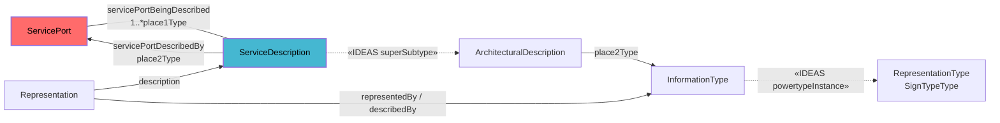
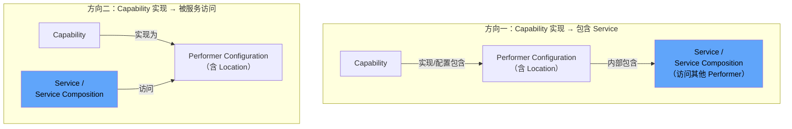
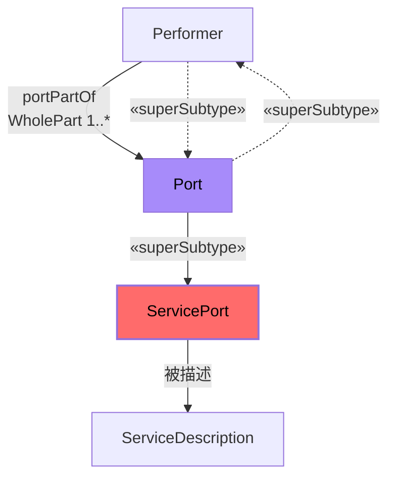
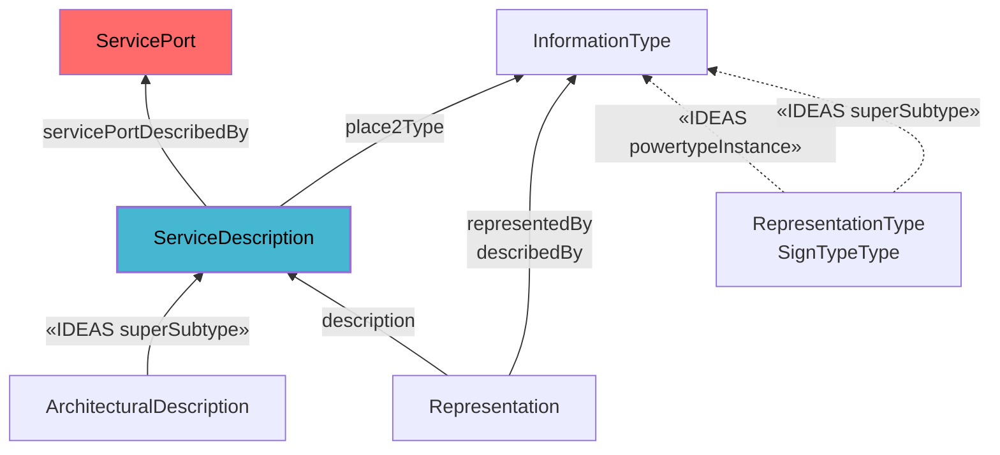
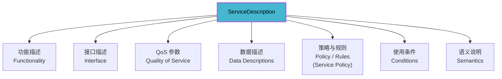
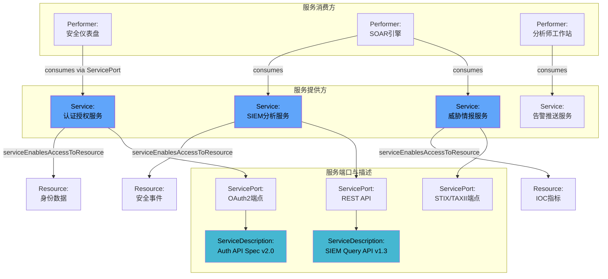
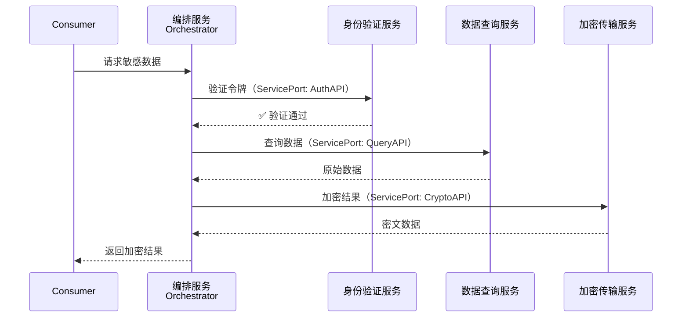

---
tags:
  - dm2/analysis
---

> **操作模板** -> [[../08-Services/Services-Template.md]]
> **所属数据组** -> [[../08-Services]]

# DM2 Services 详细分析

> **来源**：`Services.png` 类图 + DoDAF v2.02 PDF pp.67-69 + DM2 元模型定义提取
>
> **分析日期**：2026-04-18
>
> **定位**：Service（服务）= DM2 中的访问机制概念，回答 "How is capability accessed?" —— 通过标准化接口使消费者访问能力/资源的机制

---

## 一、概述

### 1.1 什么是 Service？

**官方定义**（多来源对照）：

| 来源 | 定义 |
|------|------|
| **Net-Centric Services Strategy (2007)** | A mechanism to enable access to **one or more capabilities**, where the access is provided using a **prescribed interface** and is exercised consistent with **constraints and policies** as specified by the service description |
| **OASIS SOA RM** | 同上，强调接口 + 约束/策略的一致性执行 |
| **WordNet** | Work done by one person or group that benefits another |
| **Free On-line Dictionary of Computing** | Work performed (or offered) by a server — from simple data requests to complex process services |
| **DoDAF DM2** | A mechanism to enable access to a set of one or more capabilities, where the access is provided using a prescribed interface... The mechanism is a **Performer**. The "capabilities" accessed are **Resources** — Information, Data, Materiel, Performers, and Geo-political Extents |

### 1.2 核心公式

```
Service = Interface（接口）+ Policy/Constraint（策略约束）+ Access Mechanism（访问机制）
         → 使 Consumer 访问 Provider 的 Capability/Resource
```

### 1.3 Service ≠ Web Service

**PDF p.67 明确指出**：

> *A Service, in its broadest sense, is a well-defined way to provide a unit of work... Services do not necessarily equate to web-based technology or functions.*

**关键扩展**：DM2 V2.0 的 Service 范围远大于 SOA 文献中常见的 IT 服务——包括：
- ✅ 技术服务（Web API、消息队列）
- ✅ **业务服务**（Search and Rescue 搜救、Logistics 后勤、Administrative 行政）
- ✅ 手动服务（Manual Services）
- ✅ 自动化服务（Automated Services）

---

## 二、类图结构解析

### 2.1 完整类图还原

基于 `Services.png` 图片：

```mermaid
graph TB
    subgraph 核心实体层["核心实体层"]
        SVC["Service<br/>IndividualType"]
        SP["ServicePort<br/>IndividualType"]
        SD["ServiceDescription<br/>IndividualType"]
    end
    
    subgraph 描述体系["描述/表示体系"]
        REP["Representation<br/>IndividualType"]
        IT["InformationType"]
        RT["RepresentationType<br/>SignTypeType"]
        AD["ArchitecturalDescription"]
    end
    
    subgraph 执行者层["执行者层（继承）"]
        PERF["Performer<br/>IndividualType"]
        PORT["Port<br/>IndividualType"]
    end
    
    subgraph 能力与资源["能力与资源"]
        CAP["Capability<br/>IndividualType"]
        RES["Resource<br/>IndividualType"]
    end
    
    subgraph 活动层["活动层"]
        ACT["Activity<br/>IndividualType"]
    end
    
    subgraph 条件与度量["条件与度量"]
        COND["Condition<br/>IndividualType"]
        M["Measure<br/>Property<br/>+ numericValue: string"]
    end
    
    subgraph 规则层["规则层"]
        GR["Guidance<br/>Rule"]
    end
    
    %% Service 核心
    SVC -.->|"«IDEAS superSubtype»"| PERF
    PORT -.->|"«IDEAS superSubtype»"| PERF
    SP -.->|"«IDEAS superSubtype»"| PORT
    
    %% Service → Resource
    SVC -->|"serviceEnablesAccessToResource<br/>OverlapType"| RES
    
    %% ServicePort
    PERF -->|"WholePartType<br/>portPartOfPerformer<br/>1..*"| PORT
    SP -.->|"servicePortBeingDescribed<br/>1..*place1Type"| SD
    
    %% ServiceDescription 层次
    AD -.->|"«IDEAS superSubtype»"| SD
    SD -->|"place2Type"| IT
    IT -.->|"«IDEAS powertypeInstance»"| RT
    RT -.->|"«IDEAS superSubtype»"| IT
    REP -.->|"«IDEAS superSubtype»"| IT
    REP -->|"describedBy<br/>place2Type"| IT
    REP -->|"description<br/>place2Type"| SD
    SD -->|"servicePortDescribedBy<br/>place2Type"| SP
    
    %% Activity 关联
    ACT -->|"consumer<br/>place1Type"| RES
    ACT -->|"producer<br/>place2Type"| RES
    ACT -->|"activityConsumesResource<br/>OverlapType"| RES
    ACT -->|"activityProducesResource<br/>OverlapType"| RES
    ACT -->|"measureOfTypeActivity<br/>measureOfType"| M
    COND -->|"activityPerformableUnderCondition<br/>OverlapType"| ACT
    GR -.->|"placesType<br/>ruleConstrainsActivity"| ACT
    ACT -->|"activityPerformedByPerformer<br/>OverlapType"| PERF
    
    %% Performer → Resource/Measure/Capability
    PERF -.->|"«IDEAS superSubtype»"| RES
    RES -->|"place2Type"| PERF
    RES -->|"measureOfResource<br/>measureOfType"| M
    PERF -->|"capabilityOfPerformer<br/>propertyOfType"| CAP
    CAP -.->|"«IDEAS place1Type»"| PERF
    COND -->|"measureOfTypeCondition<br/>measureOfType"| M
    
    style SVC fill:#60A5FA,color:#000,stroke-width:3px
    style SP fill:#FF6B6B,color:#000,stroke-width:2px
    style SD fill:#45B7D1,color:#000,stroke-width:2px
    style PERF fill:#A78BFA,color:#000,stroke-width:2px
    style ACT fill:#C084FC,color:#000,stroke-width:2px
    style M fill:#60A5FA,color:#000,stroke-width:2px
```



### 2.2 类图中的颜色编码

| 颜色 | 含义 | 对应实体 |
|------|------|----------|
| 🟦 蓝色 | **Property / 核心实体** | Measure、Service、Condition、ServiceDescription |
| 🟩 绿色 | **Type / Association 类型** | OverlapType、BeforeAfterType、WholePartType、measureOfType 等 |
| 🟣 紫色 | **Individual（个体实例）** | Activity、Performer、Resource、Capability、InformationType、Representation |
| ⬜ 白色/透明 | **IDEAS 基础关系标注** | «IDEAS superSubtype»、«IDEAS powertypeInstance» |

### 2.3 核心实体一览

| 实体 | IDEAS 层级 | 说明 |
|------|-----------|------|
| **Service** | IndividualType (⊂ Performer) | **核心**——访问能力的机制，本身是一种 Performer |
| **ServicePort** | IndividualType (⊂ Port ⊂ Performer) | 服务的端口——交互点，隔离依赖 |
| **ServiceDescription** | IndividualType (⊂ ArchitecturalDescription) | 服务描述——自描述元数据 |
| **Representation** | IndividualType (⊂ InformationType) | 表示形式——信息的物理/逻辑表达 |
| **InformationType** | IndividualType | 信息类型——描述的载体 |

---

## 三、核心关系详解

### 3.1 Service 的继承层次（最关键的设计决策）



**继承链**：
```
Resource ← Performer ← Port ← ServicePort
                ↑
              Service（直接继承 Performer，不经过 Port）
```

**这意味着**（**PDF p.68 注释 f-g**）：
1. **Service 是一种 Performer** → 继承 Performer 的所有属性（Measure、Activity 执行、对象提供等）
2. **ServicePort 是一种 Port**，而 **Port 是一种 Performer**
3. Service 和 ServicePort 是**两条不同的继承路径**

### 3.2 serviceEnablesAccessToResource（核心语义）

```
Service ──(OverlapType)──▶ Resource
```

- **含义**：Service 提供**对 Resource 的访问**——这里的 Resource 包括 Information、Data、Materiel、Performers、Geo-political Extents
- **类型**：重叠关系（Overlap），非强绑定
- **实际意义**：Service 不"拥有"资源，而是提供"访问通道"

### 3.3 ServicePort 与 ServiceDescription 的关系

这是类图中**最精细的子结构**：



**解读**：

| 关系 | 含义 |
|------|------|
| servicePortBeingDescribed | ServicePort 被 ServiceDescription 描述 |
| servicePortDescribedBy | 反向：ServiceDescription 描述 ServicePort |
| SD ⊃ ArchitecturalDescription | 服务描述是架构描述的特化 |
| Representation ↔ InformationType | 表示形式通过信息类型承载 |

### 3.4 portPartOfPerformer（WholePartType）

```
Performer ──whole──▶ Port (1..*)
```

- **基数**：一个 Performer 可以有 **1 到多个** Port
- **用途**：Port 将交互点隔离为独立组件
- **PDF 原文**：*"A part of a Performer that specifies an interaction component through which the Performer interacts with other Performers. This isolates dependencies between performers to particular interaction points rather than to the performer as a whole."*

### 3.5 Activity 与 Service 的关联

虽然图中 Activity 与 Service 没有直接连线，但通过以下间接路径关联：

| 路径 | 说明 |
|------|------|
| Activity → activityPerformedByPerformer → Performer ⊃ Service | **Service 作为 Performer 执行活动** |
| Activity → consumer/producer → Resource ← serviceEnablesAccessToResource ← Service | **Service 提供活动所需的资源访问** |
| Activity → measureOfTypeActivity → Measure | **活动的度量**也适用于 Service 执行的活动 |

---

## 四、Service 的四大特征（基于 PDF pp.67-68）

### 4.1 特征一：Service 是 Performer

> *"A Service is a type of Performer which means that it executes an activity and provides a capability."*

| 作为 Performer 的能力 | 说明 |
|----------------------|------|
| 执行 Activity | Service 可以执行活动（Service Functions） |
| 提供 Capability | Service 通过 capabilityOfPerformer 展现能力 |
| 提供 Resource | Service 可以提供 Materiel/Data/Information/Performers |
| 被 Measure 度量 | Service 继承 Performer 的 Measure 属性 |
| 有 Condition 约束 | Service 的活动在特定条件下可执行 |

### 4.2 特征二：Service 与 Capability 的双向关系

> *Capabilities and Services are related in two ways:*（PDF p.67 注释 b）



| 方向 | 场景示例 |
|------|----------|
| **Capability → 内部包含 Service** | "网络防御能力"的实现配置中，包含"威胁情报查询服务"来访问外部情报源 |
| **Service → 访问 Capability 的实现** | "身份认证服务" 访问的是某个"身份管理能力"的实现（如 Active Directory 集群）|

### 4.3 特征三：Service 自描述的重要性

> *"Although, in principle, anything has a description, the importance of self-description of Services merits its call-out as a class."*（PDF p.67 注释 d）

**ServiceDescription 的设计原则**：

| 原则 | 说明 |
|------|------|
| **只描述公开面** | 描述 Service Port，而非整个 Service |
| **面向使用者** | 包含使用服务所需的一切信息 |
| **不含内部细节** | 内部工作机制不在 Service Description 中 |

**ServiceDescription 应包含的内容**（PDF p.67）：
- 可见功能（Visible Functionality）
- QoS（服务质量）
- 接口描述（Interface Descriptions）
- 数据描述（Data Descriptions）
- 引用的标准或规则（Standards/Rules = Service Policy）
- 使用条件和约束

### 4.4 特征四：Service 支持编排和编排

> *"Since Service inherits whole-part, temporal whole-part (and with it before-after), Service may refer to an orchestrated or choreographed Service, as well as individual Service components."*（PDF p.67 注释 e）

| 模式 | 说明 |
|------|------|
| **Orchestration（编排）** | 中心化控制——一个 Service 协调多个子 Service |
| **Choreography（编排）** | 去中心化——各 Service 通过协议协作 |
| **Individual Service Component** | 单体原子服务 |

---

## 五、ServicePort 深入分析

### 5.1 定义

| 来源 | 定义 |
|------|------|
| **DM2** | A part of a Performer that specifics an interaction component through which the Performer interacts with other Performers. This isolates dependencies between performers to particular interaction points rather than to the performer as a whole. |
| **别名** | Mediator (OASIS SOA RA), Service Interface (UPDM) |
| **MODAF** | The mechanism by which a <<Service>> communicates |

### 5.2 ServicePort vs Port vs Performer 的关系



**关键理解**：
- **Port** 是 Performer 的组成部分（WholePart 关系）
- **ServicePort** 是 Port 的特化（专门用于服务的端口）
- **ServicePort 也是 Performer**（通过 Port → Performer 继承链）

### 5.3 双向端口（PDF p.68 注释 g）

> *Any Performer that consumes a Service may have a Service Port that is described in the service request. This description indicates how the Service provider should provide or respond back to the Service consumer.*

| 角色 | ServicePort 用途 |
|------|------------------|
| **Provider（提供方）** | ServicePort 描述**提供什么**——暴露的能力/资源 |
| **Consumer（消费方）** | ServicePort 描述**期望什么**——请求格式、回调方式 |
| **双向绑定** | 两端的 Service Description 必须匹配才能建立连接 |

---

## 六、ServiceDescription 描述体系

### 6.1 类图中的描述层次结构



### 6.2 各层级说明

| 层次 | 实体 | 职责 |
|------|------|------|
| L1 | **ArchitecturalDescription** | 架构描述的通用基类 |
| L2 | **ServiceDescription** | 服务专用描述——输入/输出/语义/调用效果/使用条件 |
| L3 | **InformationType** | 信息的类型分类 |
| L4 | **Representation** / **RepresentationType** | 具体的表示形式（符号/编码） |

### 6.3 ServiceDescription 的完整内容模型

基于多来源综合：



---

## 七、与其他数据组的关系

### 7.1 Service ↔ Capability

已在 4.2 详细讨论。补充一点：

| 关系 | 方向 | 类型 |
|------|------|------|
| capabilityOfPerformer | Performer → Capability | Property |
| Service 作为 Performer | Service → Capability | Inherited |
| serviceEnablesAccessToResource | Service → Resource | Overlap |

### 7.2 Service ↔ Performer

**Service IS-A Performer**（最根本的关系）。具体来说：

| Performer 属性 | Service 如何体现 |
|---------------|------------------|
| 执行 Activity | Service Functions（服务函数） |
| 提供 Resource | Service 暴露的数据/信息/物资 |
| 有 Measure | ServiceLevel（服务水平度量） |
| 有 Capability | Service 提供的能力 |
| 受 Rule 约束 | Service Policy（服务策略） |

### 7.3 Service ↔ Resource Flow

- **Service** 通过 `serviceEnablesAccessToResource` 提供对 Resource 的访问
- **Resource** 在此上下文中包括：Information、Data、Materiel、Performers、Geo-political Extents
- 这意味着 Service 是 Resource Flow 的**访问网关**

### 7.4 Service ↔ Rules

- **Service Policy（服务策略）** = 作用于 Service 的 Rules
- 在 ServiceDescription 中引用 Standard/Constraint/Agreement
- 约束包括：访问权限、QoS 要求、安全要求、合规要求

### 7.5 Service ↔ Measures

| 度量类型 | 应用场景 |
|----------|----------|
| **ServiceLevel** | 服务水平——响应时间、可用性、吞吐量 |
| **measureOfResource** | 服务提供的资源度量 |
| **measureOfActivty** | 服务执行的活动中涉及的度量 |
| **measureOfTypeCondition** | 服务运行条件的度量 |

---

## 八、架构开发过程中的使用（PDF pp.68-69）

### 8.1 各核心流程的使用方式

| 流程 | 使用方式 |
|------|----------|
| **JCIDS（联合能力集成与开发系统）** | Services（特别是 SaaS）被视为 Performers，按 Performer 方式使用 |
| **PPBE（规划计划预算执行）** | Services（如 SaaS）可作为投资组合的一部分 |
| **DAS（国防 acquisition 系统）** | Service 采办需求定义 |
| **SE（系统工程）** | Service 接口设计、组合编排、性能工程 |
| **Ops Planning（作战规划）** | Service 功能和资源支持作战活动；业务流程可物化为手动/自动化服务 |
| **CPM（组合 Portfolio 管理）** | SaaS 等服务纳入投资组合管理 |

### 8.2 PDF p.68 核心文本

> *"The Services Data Group captures service requirements for capabilities, performers and operational activities supporting all the core processes. The DM2 data elements describing Services are linkable to architecture artifacts in the Operational, Capability, System and Project Viewpoints."*

**关键点**：Service 数据可链接到**四个视点**的制品：
- Operational Viewpoint（OV）——作战服务
- Capability Viewpoint（CV）——能力服务
- System Viewpoint（SV）——系统服务
- Project Viewpoint（PV）——项目/采办服务

### 8.3 PDF p.69 呈现建议

> *"Services are generally rendered using all the presentation techniques shown in Section 1.3. Typically Structural, behavioral and tree models are used to depict Services with amplifying tabular information."*

推荐呈现方式：
1. **结构模型（Structural）**：Service 组成层次、端口结构
2. **行为模型（Behavioral）**：Service 编排流程、时序交互
3. **树形模型（Tree）**：服务分类目录
4. **表格补充（Tabular）**：服务清单、SLA 参数

---

## 九、视图映射

### 9.1 主要视图

| 视图 | 使用的 Service 元素 |
|------|---------------------|
| **SvcV-1（服务接口描述）** | Service、ServicePort、ServiceDescription |
| **SvcV-2（服务资源流）** | serviceEnablesAccessToResource、Resource Flow |
| **SvcV-3（服务-系统矩阵）** | Service ↔ System (as Performer) 映射 |
| **SvcV-4（服务编排）** | Orchestration/Choreography、Service Composition |
| **StdV-1（标准）** | Service 引用的 Standards、Service Policy |
| **OV-2（资源流）** | Service 参与的资源交换 |
| **SV-1（系统接口）** | System 提供的 Service Ports |
| **CV-1（愿景）** | 服务化的能力愿景 |

### 9.2 SvcV 视点详解（重点）

| 子视图 | 内容 | 对应类图元素 |
|--------|------|-------------|
| SvcV-1 | 服务接口规范 | Service、ServicePort、ServiceDescription |
| SvcV-2 | 服务间资源流 | serviceEnablesAccessToResource + Resource |
| SvcV-3b | 服务-系统映射表 | Service → System (Performer) |
| SvcV-3c | 服务-服务映射表 | Service → Service (Composition) |
| SvcV-4 | 服务行为编排 | Orchestration/Choreography 模式 |
| SvcV-5 | 服务操作活动到事件跟踪映射 | Activity (Service Functions) |

---

## 十、典型建模场景

### 场景一：SOC 安全运营中心的微服务架构



### 场景二：业务服务——搜救协调服务

> *PDF p.67 特别提到 Search and Rescue 作为业务服务示例*

| 属性 | 示例值 |
|------|--------|
| **Service 名称** | 搜救协调服务（Search and Rescue Coordination Service） |
| **Service Type** | 业务服务（非纯技术服务） |
| **Provider** | 海岸警卫队指挥中心（Performer: Organization） |
| **Consumer** | 各搜救单位（Performer: Organization/PersonRole） |
| **Capability Accessed** | 卫星定位能力、通信能力、船只调度能力 |
| **Resources Exposed** | 实时位置数据、气象信息、救援设备状态 |
| **ServicePort** | 无线电频道 + 数字消息接口 |
| **ServiceDescription** | 包含频率协议、呼叫格式、响应时限 SLA |
| **Rules/Policies** | 国际搜救公约、国家搜救标准 |
| **QoS Measures** | 平均响应时间 < 15min、可用性 99.9% |

### 场景三：Service 编排（Orchestration）



---

## 十一、版本差异：DoDAF 1.5 vs 2.0 (DM2)

| 维度 | DoDAF 1.5 | DM2 (DoDAF 2.0) |
|------|-----------|------------------|
| **范围** | 主要关注技术服务/Web服务 | **包含业务服务**（如 Search & Rescue、Logistics） |
| **Service 定位** | 系统组件 | **Performer 的一种**——继承所有 Performer 属性 |
| **ServicePort** | 弱定义/隐式 | **显式实体**，是 Port 的特化 |
| **ServiceDescription** | 非正式文档 | **正式类**——ArchitecturalDescription 的子类 |
| **访问模型** | 简单调用 | **serviceEnablesAccessToResource（Overlapping）**——复杂访问模式 |
| **与 Capability 关系** | 隐式 | **双向明确**：Capability 实现可含 Service；Service 可访问 Capability 实现 |
| **编排支持** | 无 | **支持**——继承 WholePart + TemporalWholePart → 支持 Orchestration/Choreography |
| **双向端口** | 仅 Provider 端 | **Provider + Consumer 双端 ServicePort** |
| **IDEAS 基础** | 无 | **完整**——superSubtype、powertypeInstance、Overlapping |
| **度量集成** | 分离 | **深度集成**——ServiceLevel、measureOfResource 等 |
| **自描述** | 可选项 | **一等公民**——ServiceDescription 显式建模 |

---

## 十二、关键洞察总结

### 🔑 从类图中学到的 6 个重要发现

1. **Service IS-A Performer（最重要！）**
   - 不是简单的接口定义，而是**完整的执行者**
   - 可以执行活动、提供资源、展现能力、被度量
   - 这是 DM2 与普通 SOA 文献的根本区别

2. **ServicePort 是解耦的关键**
   - Port 将依赖从"整个 Performer"隔离到"特定交互点"
   - ServicePort 进一步特化为服务专用端口
   - **双向端口**：Provider 端和 Consumer 端都有 ServicePort

3. **serviceEnablesAccessToResource 是 Overlap，不是 Ownership**
   - Service **不拥有**资源，而是提供**访问通道**
   - 这解释了为什么 Service 不直接提供 DesiredEffect（见 Capability 分析）
   - 资源的实际所有权仍在原始 Performer

4. **ServiceDescription 只描述公开面**
   - 不描述内部工作机制
   - 面向 Service Port 而非整个 Service
   - 包含功能/QoS/接口/数据/策略/条件六大维度

5. **Service 支持组合和编排**
   - 继承 WholePart → 可由子服务组成
   - 继承 TemporalWholePart → 支持时序编排
   - 单体服务、编排服务、编排服务三种模式并存

6. **业务服务是一等公民**
   - 不仅限于 IT/Web 服务
   - 搜救、后勤、行政等业务流程都可建模为 Service
   - 支持手动服务和自动化服务

---

*文档结束。基于 Services.png 类图 + DoDAF v2.02 PDF pp.67-69 + DM2 元模型 JSON 提取综合分析。*
