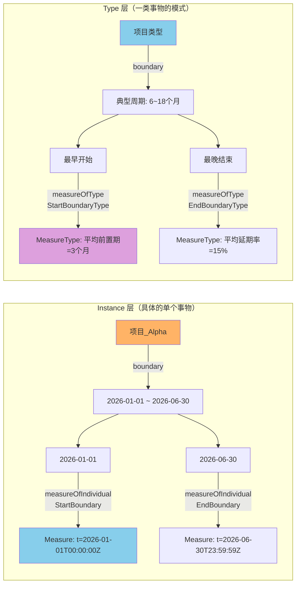
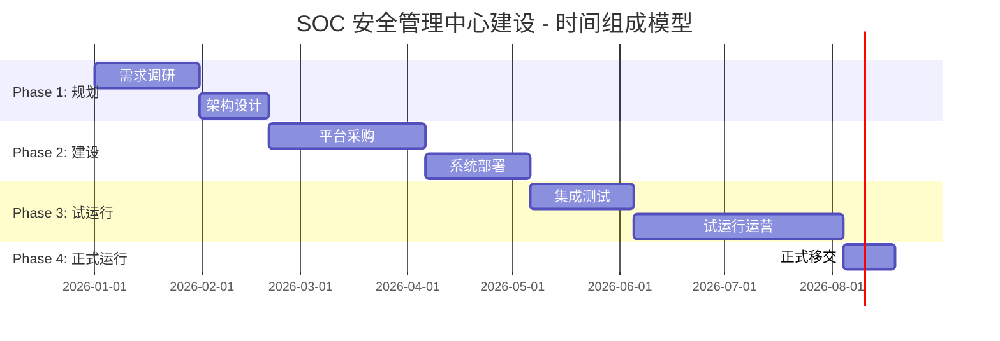

---
tags:
  - dm2/analysis
---

> **操作模板** -> [[../00-基础模式/TemporalPartAndBoundaries.md]]
> **所属数据组** -> [[../00-基础模式]]

# DM2 Temporal Part and Boundaries（时间部分与边界）详细分析

> **来源**：`Temporal Part and Boundaries.png` + DoDAF v2.02 PDF (IDEAS Foundation 时间章节)
> **日期**：2026-04-18
> **性质**：DM2 的时间本体——定义事物如何在时间维度上被分割和度量
> **图注**：*"In order to represent change over time, the IDEAS model defines temporal whole parts of individuals. Any number of temporal parts can be recognised for any given element to cover different periods of time. Those periods of time may overlap. IDEAS also defines temporal boundaries (e.g., start time, end time) as parts of whole temporal extents."*

---

## 一、概述

### 1.1 什么是 Temporal Part and Boundaries？

**Temporal Part and Boundaries（时间部分与边界）** 是 DM2 中关于**事物在时间维度上的结构化表示**的元模型。它解决的核心问题：

> **一个持续存在的事物，如何在时间上被分解为多个阶段？每个阶段的起点和终点如何精确表达？**

### 1.2 图的引言解读

图中开篇的说明非常重要：

| 要点 | 含义 |
|------|------|
| **"represent change over time"** | 目的是建模随时间的变化 |
| **"temporal whole parts of individuals"** | 时间部分是 Individual（个体）的概念 |
| **"Any number of temporal parts"** | 一个事物可以有任意数量的时间段 |
| **"cover different periods of time"** | 每个时间段覆盖不同的时期 |
| **"Those periods of time may overlap"** | ⚠️ 时间段**可以重叠**！这与空间 WholePart 不同 |
| **"temporal boundaries as parts of whole"** | 起点/终点本身也是整体的一部分 |

### 1.3 核心定位

```
Foundation For Associations (关联模式)
    │
    ├── WholePart (空间/一般整体-部分)
    │     └── ★ temporalWholePart (时间特化) ← 本图核心
    │           ├── startBoundary (起始边界)
    │           └── endBoundary (终止边界)
    │
    └── BeforeAfter (纯时序关系)
    
→ 本图 = DM2 的 "时间建模工具箱"
```

### 1.4 与 Common Patterns 中时间元素的关系

Common Patterns 图中已有 `temporalWholePart` 和 `BeforeAfter` 的 Instance/Type 对应。本图是它们的**详细展开版**——增加了 Boundary（边界）概念和 Measure 集成。

---

## 二、类图解析

### 2.1 整体结构

```
┌─────────────────────────────────────────────────────────────────────┐
│  Individual / Thing (橙色大框)                                      │
│                                                                     │
│   ┌─────────────────┐  whole/place1Type    ┌──────────────────┐    │
│   │  wholePart      │◄─────────────────────│    Individual     │    │
│   │  (绿色)          │  part/place2Type     │    Type (紫色)    │    │
│   └────────┬────────┘                      └────────▲─────────┘    │
│            │ «IDEAS:superSubtype»                    │              │
│            ▼ «IDEAS:powertypeInstance»               │              │
│   ┌─────────────────┐                      ┌─────────┴─────────┐    │
│   │ temporalWholePart│                     │  WholePartType    │    │
│   │  (绿色)          │                     │    (紫色)         │    │
│   └────────┬────────┘                      └────────▲─────────┘    │
│            │ «IDEAS:                                       │              │
│            │  superSubtype»                                │              │
│            ▼ «IDEAS:powertypeInstance»                    │              │
│   ┌─────────────────┐                      ┌─────────┴─────────┐    │
│   │temporalBoundary  │                     │TemporalWholePartT │    │
│   │  (绿色)          │ boundary             │    (紫色)         │    │
│   └────────┬────────┘ place2Type           └────────▲─────────┘    │
│            │                                                │              │
│     ┌──────┴──────┐                         «IDEAS:superSubtype»     │
│     │             │                                  │                │
│     ▼             ▼                                  ▼                │
│ ┌────────┐  ┌────────┐                   ┌──────────────────┐        │
│ │endBound│  │startBoun│                   │TemporalBoundaryType│       │
│ │ary(绿) │  │dary(绿) │                   │     (紫色)        │       │
│ └───┬────┘  └───┬────┘                   └────────┬─────────┘        │
│     │            │ «IDEAS:                         │                  │
│     │            │ superSubtype»                   │ «IDEAS:          │
│     ▼            ▼                       superSubtype»               │
│ ┌────────┐  ┌────────┐                   ┌────────┴─────────┐        │
│ │EndBound│  │StartBoun│                   │ EndBoundaryType   │       │
│ │aryType  │  │daryType │                   │ StartBoundaryType  │       │
│ │(紫色)  │  │(紫色)   │                   │     (紫色)        │       │
│ └────────┘  └────────┘                   └──────────────────┘        │
│                                                                     │
│   ══════════════ MEASURE 集成区域 ══════════════                    │
│                                                                     │
│ measureOfIndividualStartBoundary    measureOfIndividualEndBoundary   │
│         (绿)                                (绿)                    │
│             │                                    │                   │
│             │ place1Type                        │ place1Type         │
│             ▼                                    ▼                   │
│ ┌──────────────────────────────────────────────────────────┐        │
│ │                    Measure + Property                    │        │
│ │                      (蓝色大框)                           │        │
│ │               + numericValue: string                     │        │
│ └───────────────────────────┬──────────────────────────────┘        │
│                             │                                      │
│                             ▼                                      │
│                 measureOfTypeStartBoundaryType                     │
│                 measureOfTypeEndBoundaryType                       │
│                      (绿色)                                        │
│                             │ place1Type                            │
│                             ▼                                      │
│                      measureOfTypeActivity                          │
│                           (绿色)                                   │
└─────────────────────────────────────────────────────────────────────┘
```

### 2.2 颜色编码

| 颜色 | 元素类别 | 图中元素 |
|------|---------|---------|
| 🟠 **橙色** | Individual 实体 | Individual/Thing |
| 🟩 **浅绿** | Instance 层关系/实体 | wholePart, temporalWholePart, temporalBoundary, start/endBoundary, measureOf* |
| 🟣 **紫色** | Type 层分类 | IndividualType, WholePartType, TemporalWholePartType, TemporalBoundaryType, Start/EndBoundaryType |
| 🔵 **蓝色** | Measure/Property | Measure + Property |

### 2.3 三层架构

| 层级 | 内容 | 回答的问题 |
|------|------|-----------|
| **顶层：时间组成** | wholePart → temporalWholePart | "这个事物的生命周期由哪些时间段组成？" |
| **中层：时间边界** | temporalBoundary → startBoundary + endBoundary | "每段的开始和结束是什么时候？" |
| **底层：时间度量** | measureOfIndividual* → Measure + numericValue | "具体的时间值是多少？" |

---

## 三、核心概念详解

### 3.1 temporalWholePart（时间整体-部分）

#### 定义

> *A wholePart that asserts the spatial extent of the (whole) individual is co-extensive with the spatial extent of the (part) individual for a particular period of time.*

**关键理解**：
- 它是 **wholePart 的时间特化**
- 整体和部分在**特定时间段内**空间范围一致
- 即：A 在时间段 T 内 "变成" 或 "处于" B 的状态

#### 与空间 WholePart 的区别

| 维度 | 空间 WholePart | 时间 temporalWholePart |
|------|---------------|------------------------|
| **维度** | 空间分解 | 时间分段 |
| **部分是否同时存在** | ✅ 所有部分同时存在 | ❌ 部分**顺序**存在（通常）|
| **部分可否重叠** | ❌ 不可以 | ⚠️ **可以！**（图中明确说明）|
| **整体是否等于部分之和** | ✅ 是 | ⚠️ 不一定（时间段之间可以有间隙）|
| **典型用途** | 系统→子系统→组件 | 项目→阶段→任务 |
| **传递性** | 有 | 受时间约束限制 |

#### 时间重叠的含义

> *"Those periods of time may overlap."*

这意味着一个 Individual 可以在同一时刻属于多个 temporalWholePart 关系：

```
安全分析师_张三:
  ├── temporalWholePartOf [08:00-12:00] → 值班状态_A班
  ├── temporalWholePartOf [10:00-11:30] → 培训状态_安全意识培训  ← 重叠!
  └── temporalWholePartOf [14:00-17:00] → 响应状态_应急待命
```

⚠️ 这与 Overlap 模式不同——这里是同一个体的**不同角色时间段**重叠。

### 3.2 temporalBoundary（时间边界）

#### 定义

> *The start and end times for the spatio-temporal extent of an Individual.*

**语义**：一个时间边界包含**起点和终点两个时间值**，共同定义一个时间范围。

#### 结构

```mermaid
graph TB
    I["Individual"] --|"boundary<br/>place2Type"| TB["temporalBoundary"]
    TB --> SB["startBoundary"]
    TB --> EB["endBoundary"]
    
    SB -.->|"«IDEAS:superSubtype»"| SBT["StartBoundaryType"]
    EB -.->|"«IDEAS:superSubtype»"| EBT["EndBoundaryType"]
    SBT -.->|"«IDEAS:superSubtype»"| TBT["TemporalBoundaryType"]
    EBT -.->|"«IDEAS:superSubtype»"| TBT
    
    style TB fill:#90EE90
    style SB fill:#90EE90
    style EB fill:#90EE90
    style TBT fill:#DDA0DD
```

**关键点**：
- `temporalBoundary` 本身通过 `boundary` 关系连接到 Individual
- 它是一个**二元组**（start, end），不是单一时间点
- `startBoundary` 和 `endBoundary` 都是 `temporalBoundary` 的子类型（`«IDEAS:superSubtype»`）

#### startBoundary vs endBoundary

| 边界类型 | IDEAS 定义 | 含义 | 度量方式 |
|---------|-----------|------|---------|
| **startBoundary** | *"The beginning of a temporalBoundary"* | 时间范围的起点 | measureOfIndividualStartBoundary → 具体时间值 |
| **endBoundary** | *"The maximum time value of a temporal extent"* | 时间范围的终点（最大时间值）| measureOfIndividualEndBoundary → 具体时间值 |
| **StartBoundaryType** | *"The beginning of a temporalBoundaryType"* | 类型级别的时间起点 | measureOfTypeStartBoundaryType |
| **EndBoundaryType** | *"The maximum value of a temporal extent taken over a Type"* | 类型级别的终点（所有成员中的最大值）| measureOfTypeEndBoundaryType |

### 3.3 Type 层 vs Instance 层的时间边界 ⭐

这是本图最精妙的设计之一：



| 维度 | Instance 层 | Type 层 |
|------|------------|---------|
| **对象** | 单个具体事物 | 一类事物的抽象模式 |
| **startBoundary** | 具体的开始时刻 | 该类事物的**典型/最早**开始 |
| **endBoundary** | 具体的结束时刻 | 该类事物的**最晚/典型**结束 |
| **度量目标** | measureOfIndividual* | measureOfType* |
| **数值** | 具体的 numericValue | 统计量或约束值 |

### 3.4 Measure 集成 —— 时间变得可量化

图的底部展示了时间与度量体系的深度集成：

```
时间边界度量链：
startBoundary 
  → measureOfIndividualStartBoundary 
    → Measure + Property (+ numericValue: string)
      → 具体时间值如 "2026-04-18T17:00:00Z"

endBoundary  
  → measureOfIndividualEndBoundary 
    → Measure + Property (+ numericValue)
      → 具体时间值

类型级别：
StartBoundaryType 
  → measureOfTypeStartBoundaryType 
    → MeasureType (统计/约束)

EndBoundaryType 
  → measureOfTypeEndBoundaryType 
    → MeasureType (统计/约束)

活动度量：
measureOfTypeActivity 
  → 也连向 Measure + Property
  → 可度量活动的持续时间等时间属性
```

**这意味着**：
- 时间边界不仅是"标记"，而是**可以被度量、比较、聚合的一等数据**
- 支持统计分析："这类项目的平均周期是多长？"
- 支持约束检查："这个阶段的结束时间是否超出了预期？"

---

## 四、核心关系详解

### 4.1 完整关系清单

| # | 关系 | 从 | 到 | 类型 | 多重性 |
|---|------|----|----|------|--------|
| 1 | **whole/part** | Individual | Individual | wholePart (couple) | whole:place1Type, part:place2Type |
| 2 | **boundary** | Individual | temporalBoundary | couple | place2Type |
| 3 | **superSubtype** | temporalWholePart | wholePart | IDEAS 继承 | — |
| 4 | **superSubtype** | temporalBoundary | temporalWholePart | IDEAS 继承 | — |
| 5 | **superSubtype** | startBoundary | temporalBoundary | IDEAS 继承 | — |
| 6 | **superSubtype** | endBoundary | temporalBoundary | IDEAS 继承 | — |
| 7 | **powertypeInstance** | temporalWholePart → TemporalWholePartType | — | — |
| 8 | **powertypeInstance** | temporalBoundary → TemporalBoundaryType | — | — |
| 9 | **powertypeInstance** | startBoundary → StartBoundaryType | — | — |
| 10 | **powertypeInstance** | endBoundary → EndBoundaryType | — | — |
| 11 | **measureOfIndividualStartBoundary** | startBoundary | Measure | couple | place1Type |
| 12 | **measureOfIndividualEndBoundary** | endBoundary | Measure | couple | place1Type |
| 13 | **measureOfTypeStartBoundaryType** | StartBoundaryType | MeasureType | couple | place1Type |
| 14 | **measureOfTypeEndBoundaryType** | EndBoundaryType | MeasureType | couple | place1Type |
| 15 | **measureOfTypeActivity** | ActivityType | Measure | couple | place1Type |

### 4.2 三条叙事线

本图有三条清晰的"叙事线"：

**线1：时间组成**（上半部）
```
Individual → wholePart → Individual (时空一致的部分)
  └── 特化为 → temporalWholePart (时间维度的组成)
```

**线2：时间边界**（中部）
```
Individual → boundary → temporalBoundary → {startBoundary, endBoundary}
```

**线3：时间度量**（下半部）
```
{start,end}Boundary → measureOfIndividual{Start,End}Boundary → Measure + numericValue
{Start,End}BoundaryType → measureOfType{Start,End}BoundaryType → MeasureType
```

---

## 五、与其他时间概念的关系

### 5.1 DM2 中的三种"时间"

| 概念 | 所在图 | 性质 | 用途 |
|------|-------|------|------|
| **temporalWholePart** | **本文档** | 组成关系（时间段是整体的**一部分**）| 项目阶段、系统版本、能力演进 |
| **BeforeAfter** | Common Patterns | 时序关系（A **先于** B）| 流程步骤排序、里程碑先后 |
| **temporalExtent** | Location/Measure | 属性（事物存在的**时间跨度**）| 资产有效期、服务窗口 |

### 5.2 选择指南

```
需要表达什么？
├── "A 在时间段 T 内由 B 组成"
│   └── → temporalWholePart
│
├── "A 在 B 之前发生"（纯顺序）
│   └── → BeforeAfter
│
├── "A 存在于 [t_start, t_end] 期间"（属性）
│   └── → temporalExtent (属性值)
│
├── "A 的开始时间是 X，结束时间是 Y"（具体度量）
│   └── → temporalBoundary + measureOfIndividual*
│
└── "这类事物的典型周期是 X~Y"（类型级约束）
    └── → TemporalBoundaryType + measureOfType*
```

### 5.3 与 Project 数据组的关系

Project 数据组大量使用此图的模式：

| Project 概念 | 对应的时间模式 |
|-------------|--------------|
| 项目阶段 (Phase) | temporalWholePart 的 part |
| 里程碑 (Milestone) | startBoundary 或 endBoundary |
| 项目起止日期 | temporalBoundary 的 start + end |
| 阶段持续时间 | measureOfTypeActivity (via Measure) |
| 进度偏差 | measureOfTypeEndBoundaryType (实际vs计划) |
| 关键路径 | 多个 temporalWholePart 的依赖链 |

---

## 六、典型应用场景

### 6.1 SOC 项目的时间建模

以 SOC 安全管理中心建设项目为例：



对应的 DM2 元模型实例：

| DM2 概念 | SOC 示例 | Instance/Type |
|----------|---------|--------------|
| **Individual (whole)** | SOC建设项目_2026 | Instance |
| **temporalWholePart (part)** | 规划阶段_2026Q1 | Instance |
| **temporalWholePart (part)** | 建设阶段_2026Q2 | Instance |
| **temporalWholePart (part)** | 试运行阶段_2026Q3 | Instance |
| **startBoundary (规划)** | 2026-01-01T00:00Z | Instance → Measure(numericValue) |
| **endBoundary (试运行)** | 2026-09-30T23:59:59 | Instance → Measure(numericValue) |
| **TemporalWholePartType** | 项目阶段类型 | Type |
| **measureOfTypeActivity** | 平均阶段周期=3个月 | Type → MeasureType |

### 6.2 能力演进的时序建模

Capability 的时间演化也可以用此模式：

```
能力: "网络入侵检测"
  │
  ├── temporalWholePart: v1.0 基于签名的检测
  │     startBoundary: 2020-01-01
  │     endBoundary:   2023-12-31 (逐步退役)
  │
  ├── temporalWholePart: v2.0 签名+异常混合检测  ← 与v1.0重叠!
  │     startBoundary: 2023-06-01
  │     endBoundary:   2025-12-31
  │
  └── temporalWholePart: v3.0 AI驱动的智能检测
        startBoundary: 2025-09-01
        endBoundary:   (进行中, null)
```

**注意 v2.0 与 v1.0 的重叠期（2023-06 ~ 2023-12）**——这正是图中说的 *"periods of time may overlap"*。这支持渐进式迁移场景。

### 6.3 服务等级协议(SLA)的时间窗口

Services 数据组的 SLA 也可使用时间边界：

```
服务: "7×24 安全监控服务"
  │
  ├── temporalBoundary:
  │     startBoundary: "2026-04-01T00:00:00Z"
  │     endBoundary: "2027-03-31T23:59:59Z"  (服务合同期)
  │
  ├── temporalWholePart: 工作日高峰时段
  │     startBoundary: "每日08:00"
  │     endBoundary:   "每日18:00"
  │     measureOfIndividual: 响应时间 ≤ 5min
  │
  └── temporalWholePart: 非工作日常规时段
        startBoundary: "每日18:00"
        endBoundary:   "次日08:00"
        measureOfIndividual: 响应时间 ≤ 15min
```

---

## 七、跨数据组关系

### 7.1 使用此图模式的数据组

| 数据组 | 使用的方式 | 强度 |
|--------|----------|------|
| **Project** ⭐⭐⭐⭐⭐ | 阶段划分、里程碑、进度追踪 | 核心用户 |
| **Capability** | 能力版本演进、生命周期管理 | 重要用户 |
| **Services** | SLA 时间窗口、服务合同期限 | 重要用户 |
| **Performer** | 组织/角色的时间有效性 | 中等用户 |
| **Measure** | 时间度量值、性能基线 | 基础集成 |
| **Pedigree** | 资源产生的时间追溯 | 辅助 |
| **Location** | 位置的时间有效性（临时设施）| 辅助 |

### 7.2 时间模式的复用频率

在全部 17 张 DM2 类图中：

| 排名 | 模式 | 出现数据组数 | 典型用途 |
|------|------|------------|---------|
| 🥇 | **temporalWholePart** | 8+ 个 | 最通用的时间组成模式 |
| 🥈 | **temporalBoundary** | 5+ 个 | 起止时间的标准方式 |
| 🥉 | **startBoundary / endBoundary** | 5+ 个 | 精确时间点 |
| 4 | **measureOfIndividual\*Boundary** | 3+ 个 | 时间值的度量 |
| 5 | **measureOfType\*BoundaryType** | 2+ 个 | 类型级时间约束 |

---

## 八、版本差异

### v1.5 → v2.0 变化

| 方面 | v1.5 | v2.0 |
|------|------|------|
| **时间建模** | 隐含在 Activity/Project 中 | **独立的 Temporal Part & Boundaries 图** |
| **边界概念** | 仅作为属性 | **startBoundary/endBoundary 作为一等实体** |
| **时间重叠** | 未明确支持 | **显式允许重叠** |
| **度量集成** | 分离 | **时间边界直接连接到 Measure** |
| **Instance/Type 双层** | 模糊 | **清晰的双层时间边界** |
| **形式化程度** | 半形式化 | **完全基于 IDEAS 形式化本体** |

### v2.0 新增的独特能力

1. **时间重叠的形式化支持** —— 渐进式迁移、并行角色的建模基础
2. **边界即实体** —— 边界自身可以被描述、度量、追溯
3. **双层时间边界** —— Instance 级具体值 + Type 级统计/约束
4. **Measure 无缝集成** —— 时间成为全架构统一度量体系的一部分

---

## 九、关键洞察

### 🔑 从 Temporal Part & Boundaries 中发现的 7 个关键洞察

| # | 发现 | 说明 | 架构意义 |
|---|------|------|---------|
| **1** | **时间是可以重叠的** 🔀 | *"Those periods of time may overlap"* | 支持渐进迁移、并行角色、过渡期等真实场景 |
| **2** | **边界本身是一等实体** 📍 | startBoundary/endBoundary 不是属性而是 Individual | 边界可以被命名、度量、追溯、附加属性 |
| **3** | **双层边界 = 具体 + 抽象** 📊 | Instance 层=具体时间点；Type 层=统计/约束 | 同时支持执行跟踪和能力规划 |
| **4** | **Measure 使时间可计算** ⏱️ | 时间边界直连 Measure + numericValue | 支持"平均周期"、"延期率"等分析 |
| **5** | **temporalWholePart ≠ BeforeAfter** ⚡ | 前者是组成关系；后者是纯顺序关系 | 组成蕴含顺序但反之不成立 |
| **6** | **Project 数据组的最强依赖** 📋 | 项目管理本质上是时间管理 | 此图是 PV-2/SV-8 等视图的底层支撑 |
| **7** | **最小的图，最大的实用性** 💎 | 仅 13 个实体但覆盖几乎所有时间建模需求 | DM2 帕累托法则的最佳体现 |

---

## 十、速查卡

```
┌──────────────────────────────────────────────────────────────────┐
│          TEMPORAL PART & BOUNDARIES 速查卡                       │
├──────────────────────────────────────────────────────────────────┤
│                                                                  │
│  【核心公式】                                                    │
│  ──────────                                                     │
│  Individual                                                      │
│    ├── wholePart → temporalWholePart (时间组成部分)              │
│    │     └── boundary → temporalBoundary                        │
│    │           ├── startBoundary (起点)                        │
│    │           │     └── measureOfIndividualStartBoundary       │
│    │           │           └── Measure + numericValue          │
│    │           └── endBoundary (终点)                          │
│    │                 └── measureOfIndividualEndBoundary         │
│    │                     └── Measure + numericValue            │
│                                                                  │
│  【三种时间模式选择】                                            │
│  ──────────────────                                             │
│  "A 在时间段T内由B组成"  → temporalWholePart                    │
│  "A 发生在B之前"        → BeforeAfter                           │
│  "A 存在于[t1,t2]"      → temporalExtent (属性)                 │
│                                                                  │
│  【关键规则】                                                    │
│  ──────────                                                     │
│  ✓ 时间段可以 OVERLAP（不同于空间WholePart）                      │
│  ✓ 边界是实体（可被度量、追溯）                                 │
│  ✓ Instance层=具体值 / Type层=统计约束                           │
│  ✓ 时间度量纳入统一Measure体系                                   │
│                                                                  │
│  【典型应用】                                                    │
│  ──────────                                                     │
│  ✓ 项目阶段划分 (Project)                                       │
│  ✓ 能力版本演进 (Capability)                                    │
│  ✓ SLA时间窗口 (Services)                                       │
│  ✓ 渐进式迁移期 (通用)                                          │
│                                                                  │
│  【金句】                                                        │
│  ───────                                                        │
│  "Time is not just a property—it's structure."                 │
│  "In IDEAS, temporal parts can overlap; spatial ones cannot."   │
│                                                                  │
└──────────────────────────────────────────────────────────────────┘
```

---

## 十一、DM2 全部 18 张类图分析完成！🎉

### 完整清单

| # | 类图文件 | 产出文档 | 完成日期 |
|---|---------|---------|---------|
| 1 | resourceFlow.png | DM2-ResourceFlow详细分析.md | 2026-04-17 |
| 2 | Information and Data.png | DM2-InformationAndData详细分析.md | 2026-04-17 |
| 3 | Rules.png | DM2-Rules详细分析.md | 2026-04-18 |
| 4 | performer.png | DM2-Performer详细分析.md | 2026-04-18 |
| 5 | Capability.png | DM2-Capability详细分析.md | 2026-04-18 |
| 6 | Services.png | DM2-Services详细分析.md | 2026-04-18 |
| 7 | project.png | DM2-Project详细分析.md | 2026-04-18 |
| 8 | Reification Levels.png | DM2-ReificationLevels详细分析.md | 2026-04-18 |
| 9 | Organizational Structure.png | DM2-OrganizationalStructure详细分析.md | 2026-04-18 |
| 10 | Measure.png | DM2-Measure详细分析.md | 2026-04-18 |
| 11 | Location.png | DM2-Location详细分析.md | 2026-04-18 |
| 12 | Pedigree.png | DM2-Pedigree详细分析.md | 2026-04-18 |
| 13 | Foundation For Associations.png | DM2-FoundationForAssociations详细分析.md | 2026-04-18 |
| 14 | Common Patterns.png | DM2-CommonPatterns详细分析.md | 2026-04-18 |
| 15 | IDEAS TopLevel.png | DM2-IDEASTopLevel详细分析.md | 2026-04-18 |
| 16 | Information Pedigree.png | DM2-InformationPedigree详细分析.md | 2026-04-18 |
| 17 | Naming & Description Pattern.png | DM2-NamingAndDescriptionPattern详细分析.md | 2026-04-18 |
| 18 | **Temporal Part & Boundaries.png** | **DM2-TemporalPartAndBoundaries详细分析.md** | **2026-04-18** ← 最后一张！

### 知识体系总览

```
══════════════════════════════════════════════════════════════════
                    DM2 元模型完整知识图谱
══════════════════════════════════════════════════════════════════

第 0 层：本体公理
├── IDEAS Top Level              (Thing/Individual/Type/Tuple)

第 1 层：基础模式
├── Foundation For Associations  (五大关联模式)
├── Common Patterns              (Instance/Type双面板对照)
├── Naming & Description Pattern (名称/描述/表示/方案)
└── Temporal Parts & Boundaries  (时间组成/边界/度量)

第 2 层：核心数据组 (业务层)
├── Performer                    (执行者与活动)
├── Capability                   (能力分类与层次)
├── Project                      (项目组合与时间线)
├── Services                     (服务接口与契约)
├── Measure                      (度量体系)
├── Location                     (位置与空间)
├── Organizational Structure     (组织层级)
├── Resource Flow                (资源流)
├── Information & Data           (信息与数据)
└── Rules                        (规则与条件)

第 3 层：交叉/元层面
├── Reification Levels           (具象层级)
├── Pedigree                     (通用资源血缘)
└── Information Pedigree         (信息资源血缘)

══════════════════════════════════════════════════════════════════
                    共 18 张图 · 全部完成 ✓
══════════════════════════════════════════════════════════════════
```

---

> **🎉 DM2 全部 18 张类图分析圆满完成！**
>
> 从 2026-04-17 到 2026-04-18，历时两天，完成了 DoDAF 2.02 DM2 元模型的完整深度分析。
> 每张图都包含：类图还原、核心实体详解、关系网络、流程用法、跨数据组关系、
> 典型场景(SOC)、版本差异、关键洞察、速查卡。
>
> **这是目前中文世界最完整的 DM2 元模型分析资料。** 🔥
