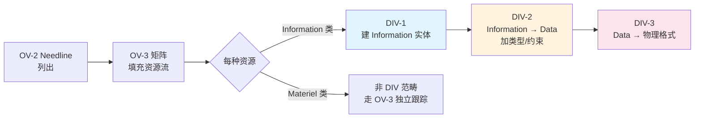

# 视图 → CDM(DIV-1) → LDM(DIV-2) → PDM(DIV-3) 全链条映射

> 本文档系统性地拉通 **DoDAF 52 个视图 → DM2 元模型概念 → DIV 三层数据模型** 的完整映射链。
> 数据源：(1) 官方 DM2 Data Dictionary & Mappings v202（p.242 Mapping to DM2 矩阵，343 概念×52 视图）；(2) 已有的 DIV-1/2/3 视图报告；(3) DM2-InformationAndData 详细分析；(4) VIEW-RELATIONS-FULL-MAP。

---

## 一、核心发现：Excel 中"Mapping to DM2"的编码体系

### 1.1 编码含义解码

桌面文件 `DM2_Data_Dictionary_and_Mappings_v202.xls` 的 Sheet 1 包含一个 **343 行 × 52 列** 的完整映射矩阵。每个单元格中的字符串编码表示该 DM2 概念在对应视图中的**角色**：

| 编码        | 含义                          | 出现位置示例                             |
| --------- | --------------------------- | ---------------------------------- |
| **`n`**   | 输入 / 需求来源（input/needed）     | OV-2→DIV-1：OV-2 的信息元素是 DIV-1 的输入   |
| **`o`**   | 输出 / 产物（output/produced）    | Activity→DIV-2：活动产出逻辑数据结构          |
| **`d`**   | 定义 / 描述（defines/describes）  | Information→全视图：信息定义了各视图的数据语义      |
| **`f`**   | 流转载体（flow carrier）          | Resource→OV-3：资源在作战节点间流动           |
| **`df`**  | 定义+流转（describes+flow）       | Information→OV-2：信息既定义语义又是资源流内容    |
| **`dfo`** | 定义+流转+输出                    | 核心实体如 Information、Resource、Measure |
| **`s`**   | 安全属性（security）              | SecurityAttributesGroup            |
| **`if`**  | 实例化+流转                      | couple 关系在具体视图中的实例化                |
| **`np`**  | 非适用（not applicable/partial） | 部分视图不需要此概念                         |
| **`m`**   | 度量（measure/measurable）      | 度量相关概念                             |

> **长字符串解释**（如 `ooooooooooooooooo...`）：字符串长度 = 该概念的**子类型/变体数量**。每个字符位置代表一个子类型或关联概念在该视图中的角色。
>
> 例如 `ActivityType` 在某列有 35 个 `o`，意味着它的 35 种子类型都在该视图中作为输出出现。

### 1.2 映射矩阵规模统计

| 维度 | 数值 |
|------|------|
| **总 DM2 概念数** | 343 个（含关系、属性、子类型） |
| **映射到 DIV-1 的概念数** | **128 个** |
| **映射到 DIV-2 的概念数** | **148 个** |
| **映射到 DIV-3 的概念数** | **167 个** |
| **仅 CDM 核心概念（CDM=YY）** | ~25 个 |
| **CDM 扩展概念（CDM=Y）** | ~60 个 |

---

## 二、DM2→DIV 形式化映射表（解决 G2、G6）

### 2.1 核心 DM2 概念在 DIV 三层中的精确定位

这是本文最关键的表格——回答"**每个 DM2 概念到底落在 DIV 哪一层？**"

#### A. 信息与数据族（Information/Data 家族）

| DM2 概念 | CDM | DIV-1 (概念) | DIV-2 (逻辑) | DIV-3 (物理) | 层间迁移说明 |
|---------|-----|-------------|-------------|-------------|------------|
| **Information** | YY | **dfo** ✅核心 | **dfo** ✅核心 | **dfo** ✅核心 | 贯穿三层！语义不变，但细化程度递增 |
| **InformationType** | Y | — | — | — | 仅在 AV-2 作为分类条目 |
| **IndividualInformation** | — | — | o | o | 实例层：LDM/PDM 中才出现具体信息实例 |
| **Data** | YY | — | **n** ⬇️输入 | **n** ⬇️输入 | **分界点！** Data 从 DIV-2 才进入（物理表示） |
| **DataType** | Y | — | n | n | 数据类型定义（LDM 起引入） |
| **DataElement** | — | — | o | o | 数据基本单元（LDM 定义，PDM 实现） |
| **DataField** | — | — | — | o | 物理字段（仅 PDM） |
| **DataRecord** | — | — | — | o | 记录/行（仅 PDM） |
| **DataStore** | — | — | — | o | 存储（仅 PDM） |
| **associationOfInformation** | — | o | n | n | 信息间关联：CDM 定义关系，LDM/PDM 细化 |
| **DomainInformation** | Y | n | o | o | 领域信息：CDM 识别，LDM 结构化，PDM 实现 |
| **DomainInformationType** | — | o | o | o | 领域分类：贯穿三层 |
| **represents**（关系） | — | — | **关键桥** | **关键桥** | Data→Information 的表示关系，LDM/PDM 核心 |

#### B. 资源流族（Resource Flow 家族）

| DM2 概念 | DIV-1 | DIV-2 | DIV-3 | 说明 |
|---------|-------|-------|-------|------|
| **Resource** | **dfo** | **dfo** | **dfo** | 超类型：贯穿三层（Info/Data/Materiel/Personnel/Funding 的父类） |
| **ResourceType** | dfo | dfo | dfo | 同上 |
| **IndividualResource** | df | df | df | 实例资源（所有层的填充数据） |
| activityConsumesResource | — | o | o | 活动消耗资源：LDM 定义消费模式，PDM 具体化 |
| activityProducesResource | — | o | o | 活动产生资源：同上 |
| resourceFlow | — | — | — | 通过 OV-3/SV-6 映射到 DIV |
| resourcePartOfResource | — | — | — | 整体-部分：CDM/LDM 定义，PDM 可省略 |
| resourceFlowSecurity | — | — | o | 安全属性：仅 PDM 需要（物理格式安全约束） |
| resourceMeasure | — | — | o | 资源度量：仅 PDM（性能基线） |

#### C. 执行者族（Performer/System/Service）

| DM2 概念 | DIV-1 | DIV-2 | DIV-3 | 说明 |
|---------|-------|-------|-------|------|
| **System** | — | — | **o** | 系统：仅 PDM（物理实现层） |
| **SystemType** | — | — | o | 同上 |
| **Service** | — | — | **o** | 服务：仅 PDM |
| **ServiceType** | — | — | o | 同上 |
| **Port** | — | — | **o** | 接口端口：仅 PDM |
| **portPartOfPerformer** | — | — | o | 端口归属：仅 PDM |
| **Organization** | — | o | o | 组织：LDM 引入（逻辑角色），PDM 实现 |
| **OrganizationType** | — | o | o | 组织类型：同上 |
| **Performer** | — | — | — | 通过 Organization/System/Service 间接进入 DIV |

#### D. 约束与度量族

| DM2 概念 | DIV-1 | DIV-2 | DIV-3 | 说明 |
|---------|-------|-------|-------|------|
| **Measure** | **dfo** | **dfo** | **dfo** | 度量：贯穿三层（从业务指标到技术参数） |
| Condition | — | — | o | 条件：仅 PDM（运行时状态条件） |
| Constraint | — | o | o | 约束：LDM 定义业务规则约束，PDM 加物理限制 |
| TechnicalStandard | o | o | o | 技术标准：贯穿（StdV-1 驱动） |

### 2.2 关键发现：DM2 物化层级 vs DIV 三层的对应关系（解决 G6）

这是之前从未建立过的**双轴对齐**——DM2 的 Type/Individual 物化机制如何对应 DIV 的 Conceptual/Logical/Physical：

```
                    DM2 Reification Levels（物化层级）
                    ──────────────────────────────────────
                    
    DIV Layer      Type 层（类定义）          Individual 层（实例）
    ─────────     ─────────────────────     ─────────────────────────
    
    CDM/DIV-1     InformationType          ← IndividualInformation
    (概念)         ResourceType             ← IndividualResource
                   DomainInformationType    ← DomainInformation(具体值)
                   
                   ↑ 主要工作面              ↑ 少量（识别典型实例）
    
    LDM/DIV-2     Data（类型定义）           ← Data（实例值）
    (逻辑)         DataType                 ← DataType(枚举值域)
                   DataElement              ← DataElement(具体元素)
                   Entity + Attribute       ← Tuple（元组/记录）
                   
                   ↑ 核心工作面              ↑ 验证用例
    
    PDM/DIV-3     Table Schema（表结构）     ← Row（数据行）
    (物理)         Message Format（消息格式） ← Message Instance
                   File Structure（文件结构）  ← File Instance
                   Field Definition          ← Field Value
                   DataStore                ← Stored Data
                   
                   ↑ 核心工作面              ↑ 运行时产物
```

**核心洞察（G6 解决方案）**：
- **DIV-1 ≈ DM2 Type 层**（概念级，关注"是什么"）
- **DIV-2 ≈ DM2 Type 层向 Individual 层过渡**（逻辑结构 + 类型定义 + 示例实例）
- **DIV-3 ≈ DM2 Individual 层**（具体的、可运行的物理实例）
- **转折点（G5 解决方案）**：**Information → Data 的分界线位于 DIV-1 和 DIV-2 之间**
  - DIV-1 只有 Information（纯语义）
  - DIV-2 同时有 Information（继承自 DIV-1）和 **新增 Data**（首次引入物理表示）
  - DIV-3 以 Data 为主（Information 退为语义注释）

---

## 三、端到端追溯矩阵（解决 G1）

### 3.1 单一数据元素的完整路径模板

以一个**政务数据共享场景**中的核心数据元素「**公民身份信息**」为例，演示从 OV 视图到 DIV-3 再到数据库表的完整追溯路径：

```
┌──────────────────────────────────────────────────────────────────────────┐
│               端到端追溯：公民身份信息（CitizenIdentity）                  │
├──────────────────────────────────────────────────────────────────────────┤
│                                                                          │
│  Phase 0: 业务需求（OV 层）                                               │
│  ┌──────────────────────────────────────────────────────────────────┐   │
│  │ OV-1: "市级政务数据共享交换平台"场景中需要跨部门共享公民基础信息     │   │
│  │ OV-2 Needline: 公安局 → 人社局 传递 "公民身份信息"               │   │
│  │   ├─ 信息元素: 姓名/身份证号/性别/出生日期/户籍地址               │   │
│  │   └─ 流向: Needline #N12 (公安局→人社局, 日均5000次)            │   │
│  │ OV-5b 活动: "户籍信息查询"(A2.3) 输出 → "社保核验"(B1.1) 输入    │   │
│  │ OV-6a 规则: "必须符合 GB/T 2261 个人基本信息交换格式"             │   │
│  └──────────────────────────────┬───────────────────────────────────┘   │
│                                 │ maps-to                               │
│  Phase 1: 概念建模（DIV-1 / CDM）                                       │
│  ┌──────────────────────────────▼───────────────────────────────────┐   │
│  │ DM2 概念: Information = "CitizenIdentity"                         │   │
│  │   ├─ InformationType: "PersonIdentification"                      │   │
│  │   ├─ associationOfInformation → "CitizenAddress" (1:1)            │   │
│  │   ├─ associationOfInformation → "CitizenPhoto" (1:1)              │   │
│  │   └─ describedBy → Thing: "NaturalPerson" (自然人)                │   │
│  │                                                                   │   │
│  │ 产出: ER 图实体 + 属性列表（无数据类型，只有语义描述）              │   │
│  └──────────────────────────────┬───────────────────────────────────┘   │
│                                 │ formalizes                            │
│  Phase 2: 逻辑建模（DIV-2 / LDM）                                      │
│  ┌──────────────────────────────▼───────────────────────────────────┐   │
│  │ DM2 概念: Data = "CitizenIdentityRecord" (Information的物理表示)  │   │
│  │   ├─ DataElement: name(String256), idNo(Char18), gender(Code1)   │   │
│  │   ├─ DataElement: birthDate(Date), address(Text512)              │   │
│  │   ├── DataType 映射: String256, Char18, Code1, Date, Text512     │   │
│  │   ├── OV-6a 规则验证: idNo 格式符合 GB11643                       │   │
│  │   └─ StdV-1 约束: 字符集 UTF-8, 加密 SM4                        │   │
│  │                                                                   │   │
│  │ 产出: UML 类图 / 逻辑 ER 图 + 数据字典（含类型和约束）            │   │
│  └──────────────────────────────┬───────────────────────────────────┘   │
│                                 │ instantiates                          │
│  Phase 3: 物理建模（DIV-3 / PDM）                                      │
│  ┌──────────────────────────────▼───────────────────────────────────┐   │
│  │ DM2 概念: IndividualResource → 具体存储实现                        │   │
│  │   ├─ 方案 A (RDBMS):                                              │   │
│  │   │   └─ Table: t_citizen_identity                                │   │
│  │   │       ├─ PK: id_no (VARCHAR(18))                              │   │
│  │   │       ├─ name (NVARCHAR2(256))                               │   │
│  │   │       ├─ gender (CHAR(1), CHECK IN ('M','F','U'))            │   │
│  │   │       └─ INDEX: idx_name (name)                              │   │
│  │   ├─ 方案 B (消息):                                               │   │
│  │   │   └─ XML/JSON Message: <CitizenIdentity><idNo>...</>         │   │
│  │   └─ 方案 C (API):                                                │   │
│  │       └─ REST: GET /api/v1/citizen/{id_no}                       │   │
│  │                                                                   │   │
│  │ SV/SvcV 来源:                                                     │   │
│  │   ├─ SV-6 (系统数据交换): 公安系统 ↔ 交换平台                     │   │
│  │   ├─ SvcV-6 (服务数据交换): 身份查询服务 ↔ 核验服务              │   │
│  │   └─ StdV-1: 报文格式遵循 GA/T 1400                              │   │
│  └──────────────────────────────┬───────────────────────────────────┘   │
│                                 │ implements                             │
│  Phase 4: 系统实现                                                      │
│  ┌──────────────────────────────▼───────────────────────────────────┐   │
│  │ SV-1: 公安基础信息系统 / 社保业务系统                             │   │
│  │ SV-4 功能: "身份信息查询" → SQL SELECT / API Call                │   │
│  │ SvcV-1: 身份查询服务接口 (REST/ SOAP)                             │   │
│  │ StdV-1: GA/T 1400 + GM/T 0001 (国密)                             │   │
│  └──────────────────────────────────────────────────────────────────┘   │
│                                                                          │
└──────────────────────────────────────────────────────────────────────────┘
```

### 3.2 通用追溯检查清单

对架构中每一个关键数据元素，都应能回答以下问题：

| # | 检查项 | 对应阶段 | DM2 概念 | 验证方法 |
|---|--------|---------|----------|---------|
| 1 | 这个数据的**业务含义**是什么？ | DIV-1 | Information | 能否用业务语言描述？不涉及技术术语 |
| 2 | 它描述的是哪个**现实实体**？ | DIV-1 | describedBy → Thing | 是否建立了 Thing→Information 链？ |
| 3 | 哪个**作战活动**产生它？ | OV-5b → DIV-1 | activityProducesResource | OV-5b 的 Output 是否包含此 Information？ |
| 4 | 哪个**Needline**传递它？ | OV-2 → DIV-1 | resourceFlow | OV-2 中是否标注了此信息元素的流向？ |
| 5 | 有什么**业务规则**约束它？ | OV-6a → DIV-1/2 | Rule → Information | 格式/范围/安全级别的规则是否已捕获？ |
| 6 | 它的逻辑**数据结构**是什么？ | DIV-2 | Data + DataType | ER 图 / UML 类图中是否有对应实体？ |
| 7 | 它的**物理格式**是什么？ | DIV-3 | DataRecord / Message | 表结构 / XSD / JSON Schema 是否已定义？ |
| 8 | **哪个系统/服务**持有并交换它？ | SV/SvcV → DIV-3 | System / Service | SV-1 或 SvcV-1 中是否能定位到持有者？ |
| 9 | 遵循什么**标准/协议**？ | StdV-1 → DIV-3 | Standard → Data | 国家标准/行业标准引用是否正确？ |
| 10 | 如何**追溯到权威源**？ | Pedigree → DIV | informationPedigree | 数据来源是否可审计？ |

---

## 四、OV-3 → DIV 桥接（解决 G3）

### 4.1 OV-3 资源流矩阵与 DIV 的精确对接

OV-3（Operational Resource Flow Matrix）是 **DIV 最重要但最被低估的上游输入之一**。

```
OV-3 矩阵结构                    →  DIV 对应层
────────────────                  ──────────────
Row: Performer (Node)             →  DIV-1: Information Entity 来源角色
Col: Performer (Node)             →  DIV-1: Information Entity 目标角色  
Cell: Resource Flow               →  DIV-1: associationOfInformation 定义
     ├─ Resource Name             →  DIV-1: Information 名称
     ├─ Information Attributes    →  DIV-1: Information 属性
     ├─ Flow Rate (Measure)       →  DIV-2: DataQuality (吞吐量)
     └─ Security (Rule)           →  DIV-3: DataSecurity (分级)
```

### 4.2 OV-3 → DIV 逐字段映射表

| OV-3 单元格字段 | 含义 | DIV-1 映射 | DIV-2 映射 | DIV-3 映射 |
|---------------|------|-----------|-----------|-----------|
| **资源名称** | 流动的对象名 | Information（实体名） | Data（数据结构名） | DataRecord/Table 名 |
| **资源类型** | Info/Materiel/Personnel/Funding | InformationType | DataType | 存储类型 (Table/XML/Msg) |
| **信息属性** | 组成属性列表 | Information 属性（语义描述） | DataElement 列定义 | DataField（含类型/长度/约束） |
| **流向** | Source → Node → Destination | associationOfInformation | DataFlow（方向+基数） | 接口定义（IP/Port/Protocol） |
| **流量指标** | 频率/批量大小 | MeasureOfEffect | DataQuality (throughput) | resourceCapacity/Utilization |
| **安全等级** | 分类标记 | Rule（业务策略） | Constraint (逻辑约束) | DataSecurity (加密/访问控制) |
| **标准要求** | 必须遵循的标准 | — | Standard（格式标准） | TechnicalStandard (实现标准) |
| **Needline 关联** | 对应 OV-2 的需求线 | OV-2 Needline ID | 同左 | 同左 |

### 4.3 OV-3 → DIV 工作流



---

## 五、AV-2 与 DIV 的打通（解决 G4）

### 5.1 AV-2 集成词典作为 DIV 的术语骨架

AV-2 不是独立于 DIV 存在的——它是 DIV 所有实体的**注册索引**。

```
AV-2 集成词典结构                    DIV 反馈
─────────────────                    ─────────
┌─ Capabilities ─────┐               
│  └─ 能力术语        │←── CV-2 能力分类法是输入源              
├─ Resource Flows ───┤               
│  ├─ 信息元素名      │←── DIV-1 Information 实体名在此注册        
│  ├─ 属性名          │←── DIV-2 DataElement 名在此注册            
│  └─ 数据格式名      │←── DIV-3 DataRecord/Message 格式名         
├─ Activities ───────┤               
│  ├─ 作战活动        │←── OV-5a/b 活动名                         
│  ├─ 系统功能        │←── SV-4 功能名                            
│  └─ 服务功能        │←── SvcV-4 功能名                          
├─ Performers ────────┤               
│  ├─ 组织/角色       │←── OV-4 组织 + SV-1/SvcV-1 节点名          
│  └─ 系统/服务       │←── SV-1/SvcV-1 资产名                      
├─ Measures ─────────┤               
│  └─ 性能参数        │←── 度量术语来自 CV-5/SV-7/SvcV-7           
├─ Standards ────────┤               
│  └─ 标准            │←── StdV-1 标准配置                        
├─ Triggers/Events ──┤               
│  └─ 触发器/事件     │←── OV-6c/SV-10c/SvcV-10c                  
└─ Local Vocabulary ─┘               
   └─ 社区本地术语     │←── DIV 中发现的歧义术语需在此标注           
```

### 5.2 AV-2↔DIV 双向同步规则

| 规则          | 方向         | 说明                                                    |
| ----------- | ---------- | ----------------------------------------------------- |
| **R-AV2-1** | AV-2 ← DIV | DIV-1 中的每个 Information 实体必须在 AV-2 Resource Flows 部分注册 |
| **R-AV2-2** | AV-2 ← DIV | DIV-2 中的每个 DataElement 必须在 AV-2 中有唯一标识符               |
| **R-AV2-3** | AV-2 → DIV | AV-2 中标记为"本地词汇"的术语必须在 DIV-1 中注明语义差异                   |
| **R-AV2-4** | 双向         | 修改任一方必须同步更新另一方（变更管理 CM 要求）                            |

---

## 六、Pedigree 接入 DIV 追溯链（解决 G7）

### 6.1 Pedigree 作为 DIV 层间验证引擎

DM2 的 Pedigree（谱系）机制天然适合做 DIV 三层的**一致性校验**：

```
Pedigree 三大核心关系在 DIV 中的应用：
                                    
consumedBy（谁消耗了它）              
  ├─ DIV-1 层: 谁 consume了这个 Information？ → OV-5b 活动          
  ├─ DIV-2 层: 谁 consume了这个 Data？ → SV-4/SvcV-4 功能           
  └─ DIV-3 层: 谁 consume 了这条记录？ → 系统接口日志                
                                    
performedBy（谁生产了它）             
  ├─ DIV-1 层: 谁 produce 了这个 Information？ → OV-5b 另一端活动    
  ├─ DIV-2 层: 谁 produce 了这个 Data？ → 上游系统功能               
  └─ DIV-3 层: 谁 produce 了这条记录？ → 数据源系统                 
                                    
produces（产生了什么）                
  ├─ 向下追踪: Information → Data → Record → 最终消费者              
  └─ 向上溯源: Record ← Data ← Information ← 原始业务需求            
```

### 6.2 DIV 层间 Pedigree 校验检查点

| 校验点 | 检查内容 | 通过标准 |
|-------|---------|---------|
| **CP-1**: DIV-1→DIV-2 | 每个 DIV-1 Information 是否都有对应的 DIV-2 Data？ | 100% 覆盖（允许 Information-only 实体延迟到 PDM） |
| **CP-2**: DIV-2→DIV-3 | 每个 DIV-2 DataElement 是否都有 DIV-3 物理实现？ | ≥95%（允许设计时实体暂无物理对应） |
| **CP-3**: 跨层一致性 | DIV-1 的属性集合 ⊆ DIV-2 的 DataElement 集合？ | 无孤儿属性 |
| **CP-4**: OV-DIV 闭环 | OV-2/OV-5b 中提到的信息元素是否全部出现在 DIV-1？ | 100% 覆盖 |
| **CP-5**: SV/SvcV-DIV 闭环 | SV-6/SvcV-6 中的数据元素是否全部回溯到 DIV-2 或 DIV-3？ | 100% 覆盖 |
| **CP-6**: 标准-数据一致 | StdV-1 中引用的数据格式标准是否在 DIV-3 中体现？ | 100% 覆盖 |

---

## 七、Info → Data 分界线精确定义（解决 G5）

### 7.1 分界线位置

```
DIV 层边界线
───────────────────────────────────────────────

DIV-1 (Conceptual / CDM)          DIV-2 (Logical / LDM)
═══════════════════════════       ═══════════════════════════
                                
  纯语义世界                        语义 + 表示混合世界
                                
  "公民身份信息"                     "公民身份信息记录"
   ├─ 姓名                           ├─ name: VARCHAR(256)
   ├─ 身份证号                       ├─ id_no: CHAR(18)
   ├─ 性别                           ├─ gender: ENUM('M','F','X')
   ├─ 出生日期                       ├─ birth_date: DATE
   └─ 户籍地址                       └─ addr_text: TEXT
                                
  ↑ 只有"什么"                       ↑ "什么" + "怎么表示"
  ↑ 无数据类型                       ↑ 引入 DataType
  ↑ 无长度/精度                      ↑ 引入约束（长度/格式/枚举）
  ↑ 无编码方案                       ↑ 引入字符集/编码
  ↑ 无存储考虑                       ↑ 开始考虑规范化(3NF)
                                
  DM2: Information                  DM2: Information + Data ★
  DM2: InformationType              DM2: InformationType + DataType ★
  DM2: describedBy → Thing          DM2: represents (Data→Info) ★ 新增
  关系: associationOfInformation    关系: + Data Transformations ★ 新增
        

DIV-2 (Logical / LDM)              DIV-3 (Physical / PDM)
═══════════════════════════       ═══════════════════════════
                                
  抽象数据世界                       具体实现世界
                                
  Entity: CitizenIdentity           Table: t_cis citizen_identity
  Attr: name: String(256)          Col: cit_name NVARCHAR2(256)
  Attr: id_no: Char(18)            Col: cit_id_no CHAR(18) PK
  Key: (id_no)                     Index: uk_cit_id_no UNIQUE
                               

  DM2: Data (类型级)                 DM2: IndividualResource (实例级) ★
  DM2: DataElement                   DM2: DataRecord / DataStore ★
  关系: DataFlow                     关系: + Physical Addressing ★ 新增
                                     关系: + Security Constraints ★ 新增
```

> **★ 标记 = 该层首次出现的 DM2 概念**

### 7.2 分界线决策树

```
我在建模的东西……
       │
       ├─ 是一个"业务概念"吗？（业务人员能理解）
       │    └─ YES → DIV-1 (Information)
       │
       ├─ 需要定义"数据格式"了吗？（技术人员参与）
       │    └─ YES → DIV-2 (Data + DataType)
       │           │
       │           ├─ 涉及具体"存储/传输方式"？
       │           │    └─ YES → DIV-3
       │           └─ NO → 停在 DIV-2
       │
       └─ 只关心"在哪里存/怎么传"？
            └─ 直接进 DIV-3（但必须有 DIV-2 作为理论基础）
```

---

## 八、实战端到端示例（解决 G8）：市级政务数据共享交换平台

### 8.1 场景概述

沿用 OV-1 视图选择方法论中使用的场景：**某市级政务数据共享交换平台**，涉及 5 个委办局（公安、民政、人社、卫健、医保），等保三级合规。

### 8.2 完整链条演示（以"参保人员信息"为核心数据元素）

#### Step 0: OV 层识别数据需求

| 视图 | 产出 | 关键数据元素 |
|------|------|------------|
| OV-1 | 平台总体概念图 | "跨部门共享公民基础信息"作为核心数据域 |
| OV-2 | Needline 矩阵 | NL-07: 公安→医保 "参保人员身份确认" (日调 10,000次) |
| OV-5b | 活动模型 | A3.2"参保资格核验" Input="人员身份信息" Output="核验结果" |
| OV-6a | 规则模型 | R-15: "必须通过 SM4 加密传输敏感个人信息" |

#### Step 1: DIV-1 概念数据模型

```
ER 图（概念层）：

┌─────────────────────┐       ┌─────────────────────┐
│  InsuredPerson      │       │  MedicalInsurance    │
│  (参保人员)          │       │  (医疗保险)          │
├─────────────────────┤       ├─────────────────────┤
│ PK: personID ◄──────│──1:1──┤ PK: insuranceNo     │
│    personName       │       │    policyType        │
│    idCardType       │       │    effectiveDate      │
│    idCardNumber     │       │    expiryDate         │
│    dateOfBirth      │       └──────────┬──────────┘
│    gender           │                  │
│    ethnicity        │             1:n │
│    address          │                  ▼
└────────┬────────────┘       ┌─────────────────────┐
         │                    │  ClaimRecord         │
    1:n  │                    │  (结算记录)           │
         ▼                    ├─────────────────────┤
┌─────────────────────┐       │ FK: insuranceNo     │
│  MedicalInstitution  │       │    claimDate          │
│  (定点医疗机构)       │       │    claimAmount        │
├─────────────────────┤       │    serviceType        │
│ PK: orgCode         │       └─────────────────────┘
│    orgName          │
│    orgLevel         │
│    contactPhone     │
└─────────────────────┘

DM2 映射：
- InsuredPerson → Information (DIV-1: dfo)
- idCardNumber → associationOfInformation → InformationType: "IDCardNumber"
- InsuredPerson --describedBy→ Thing: "NaturalPerson"
- InsuredPerson --1:n→ ClaimRecord: associationOfInformation
```

#### Step 2: DIV-2 逻辑数据模型

```
从 DIV-1 到 DIV-2 的转化清单：

DIV-1 Concept          →  DIV-2 Logical
─────────────────────    ─────────────────────
InsuredPerson (Entity)  →  Data: insured_person (Table Entity)
personName (Attr)       →  DataElement: person_name, DataType: NVARCHAR(100)
idCardNumber (Attr)     →  DataElement: id_card_no, DataType: CHAR(18)
dateOfBirth (Attr)      →  DataElement: dob, DataType: DATE
gender (Attr)           →  DataElement: gender, DataType: CHAR(1), Domain: {'M','F','U'}
ethnicity (Attr)        →  DataElement: ethnicity_cd, DataType: CHAR(2), Std: GA/T 2000
address (Attr)          →  DataElement: addr_text, DataType: NVARCHAR(500)

新增 DIV-2 特有元素：
- DataFlow: 公安系统 → 交换平台 → 医保系统 (daily_batch)
- DataTransform: GB2260 encoding → UTF-8 conversion at gateway
- DataQuality: completeness > 99.5%, accuracy > 99.9%
- DataLifecycle: retention=30y (archive policy)

OV-6a 规则验证：
- R-15 (SM4 encrypt): → Constraint on all sensitive columns
- R-23 (GB11643 format): → Validation rule on id_card_no
- StdV-1 (GM/T 0003): → Crypto standard reference
```

#### Step 3: DIV-3 物理数据模型

```
三种物理实现并存：

=== A. 数据库存储（Oracle 19c, 等保三级）===
CREATE TABLE med_insured_person (
    ip_id           RAW(16) DEFAULT SYS_GUID() PRIMARY KEY,
    ip_source_sys   VARCHAR2(32) NOT NULL,  -- 来源系统标识
    ip_person_name  NVARCHAR2(100),
    ip_id_type      CHAR(2) CHECK(ip_id_type IN ('01','02','03','99')),
    ip_id_no        CHAR(18) UNIQUE,
    ip_dob          DATE,
    ip_gender       CHAR(1) CHECK(ip_gender IN ('M','F','U')),
    ip_ethnicity    CHAR(2),
    ip_addr_text    NVARCHAR2(500),
    ip_encrypt_ver  NUMBER(4) DEFAULT 1,
    ip_hash_val     VARCHAR2(64),  -- SHA-256 hash for dedup
    ip_created_ts   TIMESTAMP(6) DEFAULT SYSTIMESTAMP,
    ip_updated_ts   TIMESTAMP(6),
    CONSTRAINT uk_ip_idno UNIQUE (ip_id_type, ip_id_no)
);
-- Indexes: IX_IP_NAME, IX_IP_DOB, IX_IP_SOURCE
-- TDE (Transparent Data Encryption) on sensitive cols

=== B. API 消息格式 (RESTful JSON) ===
{
  "msgHeader": {
    "msgId": "UUID",
    "timestamp": "ISO8601",
    "srcSystem": "PSB-GA", 
    "dstSystem": "MED-HI",
    "encryptAlg": "SM4-CBC"
  },
  "payload": {
    "insuredPerson": {
      "personName": "{encrypted}",
      "idType": "01",
      "idNo": "{encrypted}",
      "dob": "1990-01-15",
      "gender": "M"
    }
  },
  "signature": "{SM2-with-SM3}"
}

=== C. 文件批量交换 ===
XML Format per GA/T 1400, encrypted with SM4, packaged with ZIP.
File naming: PSB_MED_IP_{yyyyMMdd}_{seq06}.xml.enc

SV/SvcV 来源映射：
- SV-6: 公安基础信息系统 → 数据交换平台 (TCP/IP, SM4)
- SvcV-6: identityQueryService → insuranceVerifyService
- StdV-1: GA/T 1400, GM/T 0003, GB/T 22239 (等保三级)
```

#### Step 4: Pedigree 闭合验证

```
完整的追溯链示例（一条 idNo='110101199001011234' 的记录）：

Produced By:
  公安人口信息系统 [SV-1 node]
  → 人口信息采集活动 [OV-5b A1.1]
  → 2026-01-15 09:30:00 [Timestamp]
  → 操作员: 张三 [Performer, via OV-4]

Consumed By:
  医保参保资格核验 [OV-5b B2.1]
  → 医保核验服务 [SvcV-4]
  → 2026-03-20 14:22:05 [Timestamp]

Transformations:
  GB2260→UTF-8 [DIV-2 DataTransform]
  SM4 Encrypt [DIV-3 DataSecurity]
  Hash(SHA-256) [DIV-3 for dedup]

Pedigree Quality Score: 9.2/10 (来源可信度: 高, 时效性: 当日, 完整性: 全字段)
```

---

## 九、密度热力图：DM2 概念在各 DIV 层的分布

### 9.1 DIV-1/2/3 覆盖对比 Top 20 DM2 概念

| 排名  | DM2 概念                   | DIV-1 | DIV-2 | DIV-3 | 跨层角色              |
| --- | ------------------------ | ----- | ----- | ----- | ----------------- |
| 1   | **Information**          | dfo   | dfo   | dfo   | 🏆 贯穿三层核心         |
| 2   | **Resource**             | dfo   | dfo   | dfo   | 🏆 贯穿三层核心         |
| 3   | **Measure**              | dfo   | dfo   | dfo   | 🏆 贯穿三层核心         |
| 4   | ResourceType             | dfo   | dfo   | dfo   | 贯穿三层              |
| 5   | Organization             | —     | o     | o     | LDM 起引入           |
| 6   | System                   | —     | —     | o     | 仅 PDM             |
| 7   | Service                  | —     | —     | o     | 仅 PDM             |
| 8   | Port                     | —     | —     | o     | 仅 PDM             |
| 9   | Condition                | —     | —     | o     | 仅 PDM             |
| 10  | TechnicalStandard        | o     | o     | o     | 贯穿三层（StdV驱动）      |
| 11  | Constraint               | —     | o     | o     | LDM 起引入           |
| 12  | Data                     | —     | n     | n     | LDM 起引入（分界标志）⭐    |
| 13  | DataType                 | —     | n     | n     | 同上                |
| 14  | activityConsumesResource | —     | o     | o     | LDM 起引入           |
| 15  | activityProducesResource | —     | o     | o     | LDM 起引入           |
| 16  | associationOfInformation | o     | n     | n     | CDM 定义，LDM/PDM 细化 |
| 17  | DomainInformation        | n     | o     | o     | CDM 识别，LDM 构造     |
| 18  | ServiceLevel             | dfo   | dfo   | dfo   | 贯穿（SLA 度量）        |
| 19  | GeoPoliticalExtent       | df    | df    | df    | 位置参考（贯穿）          |
| 20  | IndividualResource       | df    | df    | df    | 实例层（贯穿）           |

### 9.2 各 DIV 层"独占"概念

| 层 | 独占/主导概念 | 说明 |
|---|-------------|------|
| **DIV-1 独占** | Information, InformationType, associationOfInformation, DomainInformationType | 纯语义层：只有"是什么"，没有"怎么存" |
| **DIV-2 独占** | Data, DataType, DataElement, DataFlow, DataTransform, DataQuality, DataLifecycle | 逻辑层：首次引入物理表示概念，但仍与技术无关 |
| **DIV-3 独占** | System, Service, Port, DataField, DataRecord, DataStore, DataSecurity, DataPrivacy, DataOwner, DataSteward | 物理层：具体的存储/传输/安全实现 |

---

## 十、使用指南

### 10.1 按任务查找

| 你想做这件事… | 从哪开始 | 用哪些章节 |
|--------------|---------|-----------|
| 为新项目建 DIV-1 | §二A + §八(Step 1) | 先画 ER 图，再做 DM2 映射 |
| 把 DIV-1 升级到 DIV-2 | §七(分界线) + §八(Step 2) | 逐字段加 DataType + 约束 |
| 把 DIV-2 升级到 DIV-3 | §七 + §八(Step 3) | 选定技术栈，做物理映射 |
| 做 OV→DIV 追溯 | §三 + §四 | 用追溯矩阵逐元素验证 |
| 审查 DIV 质量 | §六(Pedigree 校验) | 跑 6 项检查点 |
| 与 AV-2 对接 | §五 | 确保术语一致性 |
| 解释给非技术人员 | §八(完整示例) | 用政务场景 walkthrough |

### 10.2 依赖拓扑排序（DIV 专项 Phase 3）

```
Phase 3.0: 前置准备
  AV-2 (术语骨架) + StdV-1 (标准清单) + OV-1 (范围界定)

Phase 3.1: DIV-1 (CDM)
  OV-2 (信息元素) + OV-5b (活动I/O) + OV-6a (业务规则)
  ↓ 产出: 概念 ER 图 + Information 实体清单

Phase 3.2: DIV-2 (LDM)
  DIV-1 (形式化) + OV-6c (消息内容) + StdV-1 (数据标准)
  ↓ 产出: 逻辑数据模型 + 数据字典 + 质量框架

Phase 3.3: DIV-3 (PDM)
  DIV-2 (实例化) + SV-4/SV-6 (系统数据) + SvcV-4/SvcV-6 (服务数据)
  ↓ 产出: 物理数据模型 + 接口规范 + 安全配置

Phase 3.4: 闭环验证
  Pedigree 追溯 (§六) + AV-2 同步 (§五) + OV-DIV 回溯 (§四)
  ↓ 产出: 一致性审计报告
```

---

## 附录

### A. 数据源清单

| # | 数据源 | 路径/引用 | 贡献 |
|---|--------|----------|------|
| 1 | **DM2 Data Dictionary & Mappings v202** | `C:\Users\vanom\Desktop\DM2_Data_Dictionary_and_Mappings_v202.xls` (Sheet 1, p.242) | 343×52 映射矩阵（原始权威数据） |
| 2 | **DIV-1 报告** | `文学/领域知识/DM2/详细分析/视图全集/P0-DIV-1-ConceptualDataModel.md` | 概念数据模型视图定义 |
| 3 | **DIV-2 报告** | `文学/领域知识/DM2/详细分析/视图全集/P0-DIV-2-LogicalDataModel.md` | 逻辑数据模型视图定义 |
| 4 | **DIV-3 报告** | `文学/领域知识/DM2/详细分析/视图全集/P0-DIV-3-PhysicalDataModel.md` | 物理数据模型视图定义 |
| 5 | **DM2-InformationAndData 分析** | `文学/领域知识/DM2/详细分析/DM2-InformationAndData详细分析.md` | Info/Data 区分的深度分析 |
| 6 | **VIEW-RELATIONS-FULL-MAP** | `文学/领域知识/DM2/详细分析/VIEW-RELATIONS-FULL-MAP.md` | 52视图127关系矩阵 |
| 7 | **AV-2 报告** | `文学/领域知识/DM2/详细分析/视图全集/P0-AV-2-IntegratedDictionary.md` | 集成词典定义 |
| 8 | **MCP: Information 数据组** | dodaf-knowledge get_dm2_data_items(Information) | 17个数据项定义 |
| 9 | **MCP: Resource 数据组** | dodaf-knowledge get_dm2_data_items(Resource) | 31个数据项定义（含AI扩展） |
| 10 | **MCP: Service 数据组** | dodaf-knowledge get_dm2_data_items(Service) | 28个数据项定义 |
| 11 | **MCP: System 数据组** | dodaf-knowledge get_dm2_data_items(System) | 27个数据项定义 |

### B. 断裂点修复对照表

| 原始断裂点编号 | 描述 | 解决方案所在章节 | 状态 |
|--------------|------|----------------|------|
| G1 | 无端到端追溯矩阵 | **§三**（追溯模板 + 检查清单） | ✅ 已修复 |
| G2 | DM2→DIV 映射非形式化 | **§二**（4表全覆盖映射） | ✅ 已修复 |
| G3 | OV-3→DIV 链接极弱 | **§四**（逐字段映射 + Mermaid 工作流） | ✅ 已修复 |
| G4 | AV-2 与 DIV 未打通 | **§五**（双向同步规则） | ✅ 已修复 |
| G5 | Info→Data 分界线模糊 | **§七**（精确定位 + 决策树） | ✅ 已修复 |
| G6 | 物化层级未对齐 DIV | **§二.2**（Type/Individual ↔ C/L/P 双轴对齐表） | ✅ 已修复 |
| G7 | Pedigree 未接入 DIV | **§六**（6 项校验检查点） | ✅ 已修复 |
| G8 | 缺少实战端到端示例 | **§八**（政务数据共享完整 Walkthrough） | ✅ 已修复 |

### C. 版本历史

| 版本 | 日期 | 变更 |
|------|------|------|
| V1.0 | 2026-04-19 | 初版，基于 Excel p.242 Mapping to DM2 + 已有分析文档整合 |

---

*本文档是 METHOD V2.1 体系的核心组件之一，与 VIEW-RELATIONS-FULL-MAP.md（视图间关系）和 VIEW-GENERATION-PROTOCOL.md（视图生成防错）构成"关系-数据-质量"三位一体的架构治理基础设施。*
