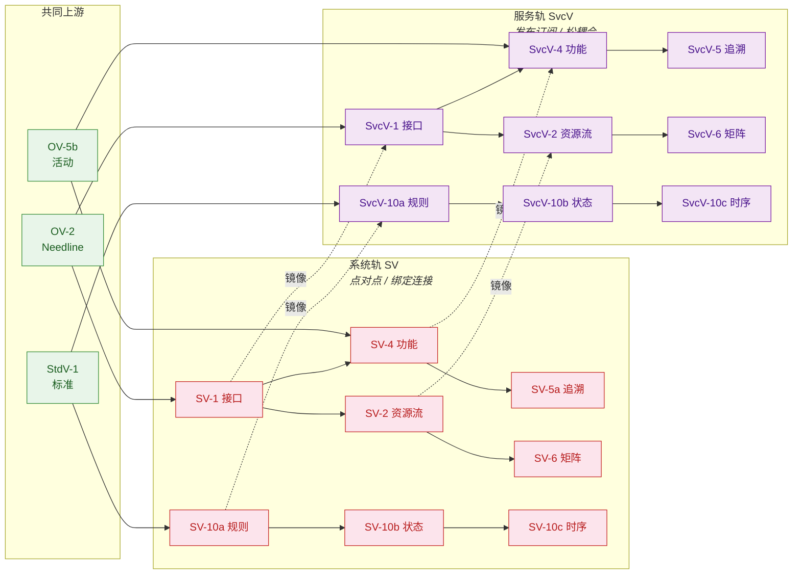
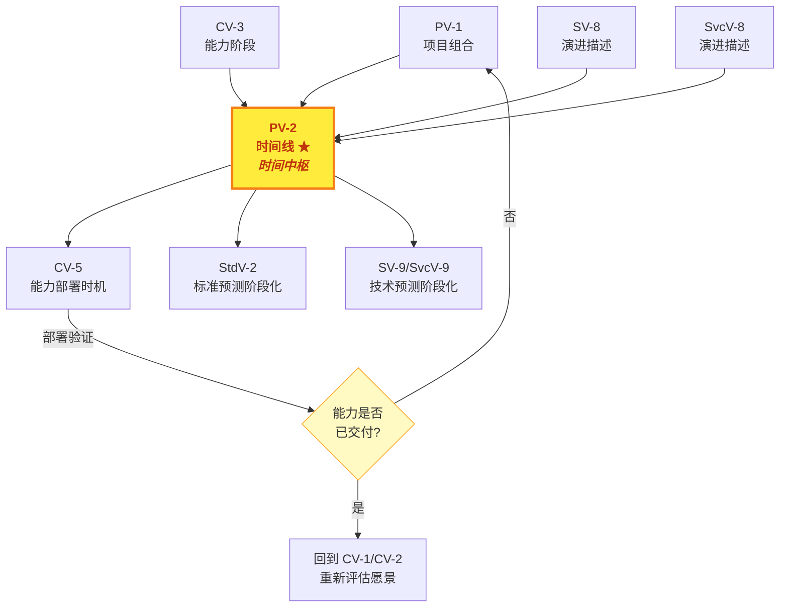

# DoDAF 52 视图间关系全映射矩阵

> **版本**: V1.0 | **生成日期**: 2026-04-19
> **数据来源**: (A) DoDAF MCP 官方视图关联数据 + (B) 48份视图报告内关联提取（双源交叉验证）
> **覆盖范围**: 52/52 视图 = 100% 全覆盖

---

## 一、执行摘要

### 核心发现

| 指标 | 数值 |
|------|------|
| 总视图数 | 52（实际文件 48 份，合写 4 组） |
| 确认的**有向关系** | **127 条** |
| 关系类型分布 | 驱动/实现(41) · 映射(28) · 输入/输出(25) · 约束(18) · 镜像/对称(15) |
| 最大出度（输出最多） | **OV-5b**（9 条下游） |
| 最大入度（输入最多） | **StdV-1**（被 23 个视图引用） |
| 孤立视图 | **无** — 所有视图至少有 1 条入边或出边 |

### DoDAF 六层架构与四条核心路径

> **设计理念**：DoDAF 的 52 个视图、127 条关系构成的是一个**有向无环图（DAG）**，不是简单的线性流水线。
> 以下用**六层分层架构**表达全局拓扑，再用**4 条导航路径**表达常见 traversal 模式。

#### 架构总览图（Mermaid）

```mermaid
graph TB
    %% ===== Layer 0: 战略基础层 =====
    subgraph L0[「Layer 0」战略基础]
        direction LR
        AV1["AV-1<br/>概览"]
        CV1["CV-1<br/>愿景"]
        StdV1["StdV-1<br/>标准基线"]
        AV2["AV-2<br/>集成词典"]
    end

    %% ===== Layer 1: 能力定义层 =====
    subgraph L1[「Layer 1」能力定义]
        direction LR
        CV2["CV-2<br/>分类法"]
        CV3["CV-3<br/>阶段规划"]
        CV4["CV-4<br/>依赖关系"]
        CV5["CV-5<br/>组织映射"]
        CV6["CV-6<br/>能力→活动"]
        CV7["CV-7<br/>能力→服务"]
    end

    %% ===== Layer 2: 作战模型层（场景上下文容器） =====
    subgraph L2[「Layer 2」作战模型<br/><b>★ OV-1 = 场景上下文容器 ★</b>]
        direction LR
        OV1["<b>OV-1<br/>概念图</b>"]
        OV4["OV-4<br/>组织"]
        OV5["OV-5ab<br/>活动分解"]
        OV2["OV-2<br/>资源流"]
        OV3["OV-3<br/>资源矩阵"]
        OV6["OV-6abc<br/>规则/状态/时序"]
    end

    %% ===== Layer 3: 实现双轨层 =====
    subgraph L3[「Layer 3」实现<br/>系统轨 ║ 服务轨]
        direction LR
        subgraph SV轨[系统轨 SV]
            SV1["SV-1 接口"]
            SV4["SV-4 功能"]
            SV5a["SV-5a 追溯"]
            SV2["SV-2 资源流"]
            SV6["SV-6 矩阵"]
            SV10a["SV-10a 规则"]
            SV10b["SV-10b 状态"]
            SV10c["SV-10c 时序"]
        end
        subgraph SvcV轨[服务轨 SvcV]
            SvcV1["SvcV-1 接口"]
            SvcV4["SvcV-4 功能"]
            SvcV5["SvcV-5 追溯"]
            SvcV2["SvcV-2 资源流"]
            SvcV6["SvcV-6 矩阵"]
            SvcV10a["SvcV-10a 规则"]
            SvcV10b["SvcV-10b 状态"]
            SvcV10c["SvcV-10c 时序"]
        end
    end

    %% ===== Layer 4: 数据模型层 =====
    subgraph L4[「Layer 4」数据模型<br/>CDM → LDM → PDM]
        DIV1["DIV-1<br/>概念数据"]
        DIV2["DIV-2<br/>逻辑数据"]
        DIV3["DIV-3<br/>物理数据"]
    end

    %% ===== Layer 5: 演进/标准/项目闭环层 =====
    subgraph L5[「Layer 5」演进·标准·项目闭环]
        direction LR
        SV8["SV-8/SvcV-8<br/>演进"]
        SV9["SV-9/SvcV-9<br/>技术预测"]
        StdV2["StdV-2<br/>标准预测"]
        PV1["PV-1<br/>组合"]
        PV2["PV-2<br/>时间线"]
        PV3["PV-3<br/>映射"]
    end

    %% ========== 层间主干连线 ==========

    %% L0 → L1: 战略驱动能力
    CV1 -->|"1:N 场景"| OV1
    CV1 --> CV2
    StdV1 -->|"约束广播"| OV6
    StdV1 -->|"约束"| SV10a
    StdV1 -->|"约束"| SvcV10a
    StdV1 -->|"格式"| DIV1
    StdV1 -->|"格式"| DIV2
    StdV1 -->|"格式"| DIV3
    AV1 --> OV1
    AV2 <-->|"术语同步"| DIV1

    %% L1 → L2: 能力锚定作战
    CV2 --> CV6
    CV2 --> CV7
    CV6 --> OV5
    CV7 --> SvcV4
    CV5 --> OV4
    CV3 --> PV2

    %% L2 内部: OV-1 为上下文容器
    OV1 -.->|"场景语境"| OV4
    OV1 -.->|"场景语境"| OV5
    OV1 -.->|"场景语境"| OV2
    OV1 -.->|"场景语境"| OV6

    %% L2 → L3: 作战→实现（主追溯 + Needline实现）
    OV5 -->|"活动→功能"| SV4
    OV5 -->|"活动→功能"| SvcV4
    OV5 --> SV5a
    OV5 --> SvcV5
    OV5 --> OV3
    OV5 --> OV6
    OV2 -->|"Needline→接口"| SV1
    OV2 -->|"Needline→接口"| SvcV1
    OV4 --> SV1
    OV4 --> SvcV1
    OV3 --> SV2
    OV3 --> SvcV2
    OV6 --> SV10a
    OV6 --> SvcV10a

    %% L3 内部: 系统轨与服务轨的对称关系
    SV1 --> SV2
    SV1 --> SV6
    SV4 --> SV5a
    SV4 --> DIV3
    SV2 --> SV6
    SV6 --> DIV3
    SV10a --> SV10b
    SV10b --> SV10c
    SV10c --> SV1
    SvcV1 --> SvcV2
    SvcV1 --> SvcV6
    SvcV4 --> SvcV5
    SvcV4 --> DIV3
    SvcV2 --> SvcV6
    SvcV6 --> DIV3
    SvcV10a --> SvcV10b
    SvcV10b --> SvcV10c
    SvcV10c --> SvcV1

    %% L2 ↔ L4: 作战↔数据双向桥接
    OV2 -->|"信息元素"| DIV1
    OV5 -->|"I/O 映射"| DIV1
    OV6 -->|"业务规则"| DIV1
    OV6 -->|"约束验证"| DIV2
    DIV1 --> DIV2
    DIV2 --> DIV3

    %% L3 → L4: 实现→物理数据
    SV4 --> DIV3
    SV6 --> DIV3
    SvcV4 --> DIV3
    SvcV6 --> DIV3

    %% L3 → L5: 演进与度量
    SV1 --> SV8
    SV4 -->|"性能来源"| SV7
    SV9 --> StdV2
    SV9 --> SV8
    SV8 --> PV2
    PV1 --> PV2
    PV2 --> CV5
    PV2 --> CV3

    %% 样式
    classDef layer0 fill:#e8f5e9,stroke:#2e7d32,stroke-width:2px,color:#1b5e20
    classDef layer1 fill:#fff3e0,stroke:#ef6c00,stroke-width:2px,color:#e65100
    classDef layer2 fill:#e3f2fd,stroke:#1565c0,stroke-width:2px,color:#0d47a1
    classDef layer3sv fill:#fce4ec,stroke:#c62828,stroke-width:2px,color:#b71c1c
    classDef layer3svc fill:#f3e5f5,stroke:#7b1fa2,stroke-width:2px,color:#4a148c
    classDef layer4 fill:#e0f7fa,stroke:#00838f,stroke-width:2px,color:#006064
    classDef layer5 fill:#fff8e1,stroke:#f9a825,stroke-width:2px,color:#f57f17
    classDef ctxNode fill:#ffeb3b,stroke:#f57f17,stroke-width:3px,color:#bf360c,font-weight:bold

    class AV1,CV1,StdV1,AV2 layer0
    class CV2,CV3,CV4,CV5,CV6,CV7 layer1
    class OV1,OV4,OV5,OV2,OV3,OV6 layer2
    class SV1,SV4,SV5a,SV2,SV6,SV10a,SV10b,SV10c,SV7 layer3sv
    class SvcV1,SvcV4,SvcV5,SvcV2,SvcV6,SvcV10a,SvcV10b,SvcV10c layer3svc
    class DIV1,DIV2,DIV3 layer4
    class SV8,SV9,StdV2,PV1,PV2,PV3 layer5
    class OV1 ctxNode
```



#### 四条核心导航路径

> 以下路径是架构师日常最常用的 traversal 模式。每条路径都标注了**起点、经过、终点、用途**。

| # | 路径名称 | 起止 | 经过的层 | 用途 | 关键节点 |
|---|---------|------|---------|------|---------|
| **①** | **主追溯链** | CV-1 → SV-4/SvcV-4 | L0→L1→L2→L3 | "一个能力由什么系统/服务支撑？" | CV-2 → OV-5b(★场景内) → SV-4 / SvcV-4 |
| **②** | **数据细化链** | OV-2/OV-5b → DIV-3 | L2→L4→L3 | "一条信息从概念到数据库字段怎么走？" | 信息元素 → DIV-1(CDM) → DIV-2(LDM) → DIV-3(PDM) |
| **③** | **约束传播链** | StdV-1 → SV-10c/SvcV-10c | L0→L2→L3 | "一条标准怎么变成系统行为？" | 标准 → OV-6a(What规则) → SV-10a(How技术) → SV-10b/c(运行态) |
| **④** | **演进闭环链** | SV-9 → CV-1 | L5→L0 | "新技术什么时候改变能力规划？" | 技术预测 → 标准采纳(SV-8) → 项目里程碑(PV-2) → 能力交付(CV-3/CV-5) |

##### 路径 ① 主追溯链详解

```
战略意图                    能力定义                  场景实例化                活动分解                 功能实现
────────                   ────────                 ────────                 ───────                  ───────
CV-1 愿景 ───→ 1:N ──→   ★OV-1 场景★              （语境锚定）
  │                       │  ↓                        │
  ├──→ CV-2 分类 ────────┤──→ OV-5b 活动 ──┬────→  SV-4 系统功能 ──→ SV-5a 反向追溯
  │       │              │     │             │               │
  │       ├──→ CV-6 ─────┘     │             ├────→  SvcV-4 服务功能 → SvcV-5 反向追溯
  │       │                    │             │
  │       └──→ CV-7 ─────────────────────────┘
  │
  └──→ CV-3 阶段 ──→ PV-2 时间线 ←── SV-8 演进描述
```

**R1/R3 硬约束在此路径中的位置**：
- **R1**: `CV-1 : OV-1 = 1:N` — 路径入口，愿景必须先实例化为场景
- **R3**: `OV-5b → SV-4` — 路径核心跳转，作战活动到系统功能的实现映射

##### 路径 ② 数据细化链详解（VIEW-DIV-CHAIN 核心成果）

```
作战侧输入                  概念数据(CDM)              逻辑数据(LDM)              物理数据(PDM)
─────────                  ──────────                ──────────                ──────────
OV-2 信息元素 ──→ 实体 ──→  DIV-1 ER图/UML类图  ──→  DIV-2 属性规范化   ──→  DIV-3 表/消息/文件
OV-5b 活动I/O ──→ I/O ─┤                              ↑                         ↑
OV-6a 业务规则 ──→ 约束 ─┘                              │  StdV-1 格式约束         │  SV-4/SV-6/SvcV 系列
                                                   DIV-2 ← OV-6c 时序消息内容          │  系统内部存储格式
```

> ⚠️ **Info→Data 分界线位于 DIV-1 和 DIV-2 之间**（详见 VIEW-CHAIN.md §七）：
> - DIV-1 只有纯语义 `Information`（"参保人员"是什么）
> - 从 DIV-2 开始引入 `Data`（身份证号、姓名等物理属性）
> - DIV-3 是纯 `System`/`Service`/`Port` 层面（表结构、API 字段、文件格式）

##### 路径 ③ 约束传播链详解

```
权威标准源                  条令级(What)               技术级(How)                运行态(Verify)
─────────                  ──────────               ──────────               ────────────
StdV-1 标准配置文件
  │  ↓ 驱动
  ├────────→  OV-6a 作战规则      "涉密数据不得出境"
  │               │  ↓ 定义守卫条件
  │               ├────────→  SV-10a 系统规则      "调用 DLP 引擎拦截"
  │               │               │  ↓ 状态转换触发
  │               │               ├────────→  SV-10b 状态机     正常→告警→阻断
  │               │               │               │  ↓ 时序验证
  │               │               │               └────────→  SV-10c 事件追踪  DLP拦截日志
  │               │
  │               └────────→  SvcV-10a 服务规则   "SLA: P99<200ms" (服务独有)
  │                                   │  ↓ 编排约束
  │                                   ├────────→  SvcV-10b 状态机    可用→降级→熔断
  │                                   │               │
  │                                   └────────→  SvcV-10c 事件追踪  熔断事件记录
  │
  └────────→  DIV-1/2/3 数据约束     "加密算法: SM4"
```

##### 路径 ④ 演进闭环链详解

```
技术就绪判断                标准采纳预测                系统演进步骤               项目里程碑               能力对齐
───────────                ──────────               ──────────               ─────────               ───────
SV-9 技术/技能预测
  │  "AI就绪度=TRL5"
  ↓  使能
StdV-2 标准预测
  │  "国密SMx可采纳"
  ↓  驱动
SV-8/SvcV-8 演进描述
  │  "分三步升级密码模块"
  ↓  写入里程碑
PV-2 项目时间线
  │  Q3 密码改造 / Q4 验收
  ↓  对齐
CV-3/CV-5 能力阶段/部署
  │  "Q4 达到等保三级密码合规"
  ↓  闭环验证
回到 CV-1/CV-2 重新评估愿景和能力清单
```

---

## 二、完整关系矩阵

### 2.1 全视点层（All Viewpoint）

#### AV-1 概览与摘要信息

| 关系方向 | 目标视图 | 类型 | 说明 |
|---------|---------|------|------|
| ↓ 输入 | OV-1 | **图文配对** | AV-1 文字描述 OV-1 图形概念，**1:N**（1个AV-1对N个OV-1） |
| ↓ 输入 | PV 时间线数据 | 引用 | 架构开发进度安排 |
| ↑ 输出 | **所有视图** | 导航入口 | AV-1 是整个架构描述的门面 |
| ↔ 同级 | AV-2 | 互补 | 概览 + 术语词典 |

#### AV-2 集成词典

| 关系方向 | 目标视图 | 类型 | 说明 |
|---------|---------|------|------|
| ↓ 输入 | 所有视图术语需求 | 汇聚 | 所有视图中使用的术语汇聚到AV-2 |
| ↓ 输入 | CV-2（能力子集） | 特化 | CV-2 是 AV-2 中 Capabilities 部分的结构化视图 |
| ↑ 输出 | **所有视图** | 权威源 | 术语定义的唯一权威来源，验证与审计依据 |
| ↔ 同级 | AV-1 | 互补 | 概览 + 术语 |

---

### 2.2 能力视点（Capability Viewpoint）

#### CV-1 愿景

| 关系方向 | 目标视图 | 类型 | 说明 |
|---------|---------|------|------|
| ↓ 输入 | 企业战略文档 / 条令政策 | 外部源 | 战略愿景的外部来源 |
| ↑ 输出 | **OV-1** | **场景驱动** | ⭐ **R1: CV-1:OV-1 = 1:N** — 一个愿景对应多个场景 |
| ↑ 输出 | CV-2 | 范围定义 | 定义能力分类的范围边界 |
| ↑ 输出 | CV-3 | 战略依据 | 阶段划分的战略来源 |
| ↑ 输出 | CV-4~7 | 映射目标端 | 能力映射系列的源头 |
| ↔ 同级 | OV-1 | 场景级上下文 | 互为上下文 |

#### CV-2 能力分类法

| 关系方向 | 目标视图 | 类型 | 说明 |
|---------|---------|------|------|
| ↓ 输入 | CV-1（愿景范围） | 范围约束 | 从 CV-1 的战略意图中提取能力列表 |
| ↑ 输出 | **CV-3** | 行来源 | CV-3 的行 = CV-2 的能力项 |
| ↑ 输出 | **OV-5** | 活动映射 | 能力层次映射到作战活动 |
| ↑ 输出 | CV-6 | 目标端 | 能力→活动映射的能力侧 |
| ↑ 输出 | CV-7 | 目标端 | 能力→服务映射的能力侧 |
| ↑ 输出 | OV/SV/SvcV 各视图 | 能力引用源 | 全局能力注册表，所有其他视点引用能力的权威来源 |
| ↔ 同级 | CV-3 | 时间维度 | 静态 vs 动态 |
| ↔ 同级 | CV-4 | 结构 vs 关系 | 分类 vs 依赖 |

#### CV-3 能力阶段规划

| 关系方向 | 目标视图 | 类型 | 说明 |
|---------|---------|------|------|
| ↓ 输入 | CV-2（能力列表→行） | 数据行 | 行来源 |
| ↓ 输入 | CV-1（阶段定义→列） | 数据列 | 列来源 |
| ↓ 输入 | PV-2（项目交付时间） | 时间基准 | 项目里程碑提供时间锚点 |
| ↑ 输出 | CV-4 | 时间依赖 | 能力依赖的时间维度表达 |
| ↑ 输出 | **PV-2** | 对齐参照 | ⭐ 项目时间线与能力交付时间表对齐（MCP确认） |
| ↑ 输出 | 差距分析报告 | 分析输入 | 缺口/冗余识别 |

#### CV-4 能力依赖关系

| 关系方向 | 目标视图 | 类型 | 说明 |
|---------|---------|------|------|
| ↓ 输入 | CV-2（能力清单） | 节点来源 | 依赖网络的节点来自 CV-2 |
| ↓ 输入 | CV-3（时间线） | 时序参考 | 时间上的依赖关系 |
| ↑ 输出 | PV-采办计划 | 编排输入 | 依赖关系指导项目编排 |
| ↑ 输出 | 变更影响评估 | 影响基础 | 变更传播路径 |
| ↔ 同级 | CV-2 | 结构 vs 关系 | CV-2=树状分类, CV-4=网状依赖 |
| ↔ 同级 | CV-5 | 依赖 vs 部署 | 逻辑依赖 → 物理部署 |

#### CV-5 能力→组织映射

| 关系方向 | 目标视图 | 类型 | 说明 |
|---------|---------|------|------|
| ↓ 输入 | CV-2（能力定义） | 映射左轴 | 能力定义 |
| ↓ 输入 | CV-3（阶段划分） | 时间切片 | 选择特定阶段 |
| ↓ 输入 | **OV-4**（组织结构） | 映射右轴 | 组织节点 |
| ↓ 输入 | **PV-2**（项目时间线） | 强依赖 | 能力交付时间点 |
| ↓ 输入 | SV-1/SvcV-1（接口） | 可选叠加 | 系统/服务交互 |
| ↑ 输出 | 列装规划 | 执行输入 | 部署规划 |
| ↑ 输出 | 缺口分析 | 审计输入 | 组织维度的能力缺口 |
| ↑ 输出 | PV-1/PV-2/PV-3 | 执行闭环 | 映射到项目 |

#### CV-6 能力→作战活动映射

| 关系方向 | 目标视图 | 类型 | 说明 |
|---------|---------|------|------|
| ↓ 输入 | CV-1/Vision（高层能力） | 左轴 | 能力列表 |
| ↓ 输入 | CV-2/Taxonomy（能力清单） | 左轴 | 能力完整列表 |
| ↓ 输入 | **OV-5b**（活动模型） | 右轴 | 作战活动 |
| ↑ 输出 | 能力审计报告 | 覆盖度检查 | 哪些能力有活动支撑 |
| ↑ 输出 | 缺口识别 | 无活动能力 | 发现无载体能力 |
| ↔ 同级 | **CV-7** | 镜像对称 | 一个对活动，一个对服务 |
| ↔ 同级 | **SV-5a** | 类比跨越 | CV-6=能力→活动, SV-5a=活动→系统 |

#### CV-7 能力→服务映射

| 关系方向 | 目标视图 | 类型 | 说明 |
|---------|---------|------|------|
| ↓ 输入 | CV-1/Vision | 左轴 | 能力列表 |
| ↓ 输入 | **SvcV-1/SvcV-4**（服务定义） | 右轴 | 服务列表 |
| ↑ 输出 | 能力审计 | 服务覆盖 | 服务能否支撑能力 |
| ↔ 同级 | **CV-6** | 镜像对称 | CV-6↔CV-7 双子星 |
| ↔ 同级 | SvcV 系列 | 数据源 | 服务侧定义 |

---

### 2.3 作战视点（Operational Viewpoint）

#### OV-1 高层作战概念图

| 关系方向 | 目标视图           | 类型         | 说明                                      |
| ---- | -------------- | ---------- | --------------------------------------- |
| ↓ 输入 | **AV-1**（文字描述） | **1:N 配对** | ⭐ **R1: AV-1:OV-1=1:N** — 1份AV-1配N份OV-1 |
| ↓ 输入 | **CV-1**（战略愿景） | 场景落地       | 愿景驱动的场景实例化                              |
| ↑ 输出 | **所有 OV 模型**   | 上下文容器      | 为所有作战模型建立语境                             |
| ↑ 输出 | 非技术干系人材料       | 入门材料       | 架构的第一接触点                                |
| ↔ 同级 | AV-1           | 图文互补       | 互为图文对应                                  |
| ↔ 同级 | OV-2           | 概览 vs 详情   | 高层概念 vs 资源流详情                           |

#### OV-2 作战资源流描述

| 关系方向 | 目标视图              | 类型              | 说明                                |
| ---- | ----------------- | --------------- | --------------------------------- |
| ↓ 输入 | CV 能力需求           | 业务驱动            | 能力需求决定需要什么资源流                     |
| ↓ 输入 | **OV-5a/b**（活动定义） | 活动执行者           | 活动间产生资源交换                         |
| ↓ 输入 | **OV-4**（组织/位置）   | 节点定位            | 资源流的端点                            |
| ↑ 输出 | **SV-1**          | **Needline→实现** | ⭐ OV-2 Needline 由 SV-1 系统接口**实现** |
| ↑ 输出 | **SvcV-1**        | **Needline→实现** | 同上，服务视角                           |
| ↑ 输出 | **OV-3**          | 细化输入            | Needline → Resource Flow 映射       |
| ↑ 输出 | "现状vs目标"对比        | 差异基础            | As-Is vs To-Be                    |
| ↔ 同级 | OV-5b             | 互补开发            | 资源流+活动联合建模                        |
| ↔ 同级 | OV-1              | 概念 vs 具体        | 高层 vs 详细                          |

#### OV-3 作战资源流矩阵

| 关系方向 | 目标视图 | 类型 | 说明 |
|---------|---------|------|------|
| ↓ 输入 | **OV-2**（Needline→细化） | 上游概览 | OV-2 的 Needline 在此细化 |
| ↓ 输入 | **OV-5b**（活动模型） | 活动上下文 | 资源流的活动归属 |
| ↓ 输入 | **DIV-2**（资源元素定义） | 数据定义 | 资源元素的形式化来源 |
| ↑ 输出 | **SV-2** | 规格驱动 | 系统资源流规格 |
| ↑ 输出 | **SvcV-2** | 规格驱动 | 服务资源流规格 |
| ↑ 输出 | **DIV-3** | 物理格式 | 物理数据格式 |
| ↔ 同级 | OV-2 | 概览 vs 属性 | 逻辑拓扑 vs 属性矩阵 |

#### OV-4 组织关系图

| 关系方向 | 目标视图 | 类型 | 说明 |
|---------|---------|------|------|
| ↓ 输入 | 企业组织信息 | 结构来源 | 组织架构 |
| ↓ 输入 | 条令文件 | C2 来源 | 指挥控制结构 |
| ↑ 输出 | **AV-1** | 上下文来源之一 | 组织信息进入架构概览 |
| ↑ 输出 | **SV-1** | 组织归属 | 系统接口的组织归属 |
| ↑ 输出 | **PV-1** | 项目所有者 | 谁负责哪个项目 |
| ↔ 同级 | OV-2 | 活动执行者来源 | 谁在执行活动 |
| ↔ 同级 | OV-5b | 角色→活动分配 | 组织角色分配给活动 |

#### OV-5ab 作战活动分解与模型

| 关系方向 | 目标视图 | 类型 | 说明 |
|---------|---------|------|------|
| ↓ 输入 | **CV-6**（能力→活动目标端） | 能力支撑 | 活动的能力来源 |
| ↓ 输入 | **OV-2**（位置+活动） | 联合开发 | 位置和活动共同建模 |
| ↓ 输入 | **OV-4**（组织/角色） | 执行者 | 谁来执行 |
| ↓ 输入 | 条令文件 | 标准活动来源 | 标准作业程序 |
| ↑ 输出 | **SV-4** | **⭐ 核心：活动→系统功能** | **R3: OV-5b→SV-4 是最关键的实现映射** |
| ↑ 输出 | **SvcV-4** | **活动→服务功能** | 同上，服务视角 |
| ↑ 输出 | **OV-3** | 资料流来源 | 活动间的资源流向 |
| ↑ 输出 | **OV-6a/b/c** | 规则/状态/追踪基础 | 活动序列/约束的前提 |
| ↔ 同级 | OV-2 | 互补 | 活动+资源流 |

> **OV-5b 是整个 DoDAF 架构中最重要的"枢纽视图"之一** — 它向上承接能力（CV-6），向下同时驱动系统（SV-4）和服务（SvcV-4），横向支撑资源流（OV-3）和行为模型（OV-6）。

#### OV-6abc 作战规则/状态/事件追踪

| 关系方向 | 目标视图 | 类型 | 说明 |
|---------|---------|------|------|
| ↓ 输入 | OV-1（概念背景） | 场景约束 | 规则的场景来源 |
| ↓ 输入 | OV-2（资源流） | 流向约束 | 资源交换的业务规则 |
| ↓ 输入 | OV-5b（活动） | 行为对象 | 规则施加于哪些活动 |
| ↓ 输入 | DIV-2（数据实体） | 信息约束 | 数据层面的业务规则 |
| ↓ 输入 | **StdV-1** | **权威标准来源** | 规则 ≠ 标准；标准是规则的出处 |
| ↑ 输出 | **SV-10a** | **What → How** | 作战规则 → 技术性实施 |
| ↑ 输出 | **SvcV-10a** | What → How | 同上，服务视角 |
| ↑ 输出 | 测试场景生成 | 用例推导 | 规则反推出测试用例 |
| ↑ 输出 | 非功能需求识别 | 约束提炼 | 性能/安全/合规 |

**OV-6 三视图内部协同**：

```
① OV-6a: "什么约束"（静态规则文本）
        ↓ 定义守卫条件
② OV-6b: "状态如何变化"（动态状态机）
        ↓ 状态转换体现在
③ OV-6c: "按时间顺序发生了什么"（时序交互）
        ↓ 回到
① OV-6a: 发现新约束 → 更新规则（闭环）
```

---

### 2.4 系统视点（Systems Viewpoint）

#### SV-1 系统接口描述

| 关系方向 | 目标视图 | 类型 | 说明 |
|---------|---------|------|------|
| ↓ 输入 | **OV-2**（Needlines→实现） | **逻辑来源** | ⭐ OV-2 Needline 由 SV-1 **实现**（非1:1） |
| ↓ 输入 | CV（能力需求） | 能力驱动 | 能力需求决定系统存在 |
| ↓ 输入 | **OV-5b**（活动→系统追溯） | 活动来源 | 哪些活动需要系统支持 |
| ↑ 输出 | **SV-2**（Resource Flow 详情） | 接口细化 | RF 详情 |
| ↑ 输出 | **SV-3b**（矩阵汇总） | 表格摘要 | 接口矩阵 |
| ↑ 输出 | **SV-6**（RF 矩阵） | 数据属性 | 跨系统数据流 |
| ↔ 同级 | **SvcV-1** | 系统vs服务 | 接口对应物（发布/订阅 vs 点对点） |
| ↔ 同级 | SV-4 | 结构 vs 行为 | 互补表示 |

#### SV-2 系统资源流描述

| 关系方向 | 目标视图 | 类型 | 说明 |
|---------|---------|------|------|
| ↓ 输入 | **SV-1**（Resource Flow→细化） | 接口来源 | SV-1 的 RF 在此详细化 |
| ↓ 输入 | **StdV-1**（协议来源） | 协议约束 | 所有引用的协议必须在 StdV-1 定义 |
| ↑ 输出 | **SV-6**（RF 矩阵） | 数据来源 | RF 矩阵的数据源 |
| ↑ 输出 | 系统集成实施依据 | 实施输入 | 具体集成方案 |
| ↔ 同级 | **SvcV-2** | 系统vs服务镜像 | 服务侧对应物 |
| ↔ 同级 | OV-2 | 逻辑需求来源 | 作战 Needline 的物理实现 |
| ↔ 同级 | DIV-3 | 物理数据格式参考 | 数据存储/交换格式 |

#### SV-3 系统矩阵

| 关系方向 | 目标视图 | 类型 | 说明 |
|---------|---------|------|------|
| ↓ 输入 | **SV-1**（接口详情→摘要） | 摘要来源 | SV-1 的表格化摘要 |
| ↑ 输出 | 接口管理 | 管理输入 | 快速接口概览 |
| ↔ 同级 | SV-1 | 详 vs 略 | 详情 vs 摘要 |

#### SV-4 系统功能描述

| 关系方向 | 目标视图 | 类型 | 说明 |
|---------|---------|------|------|
| ↓ 输入 | **OV-5b**（活动→功能实现） | **⭐ 核心上游** | R3: OV-5b→SV-4 实现映射 |
| ↓ 输入 | SV-1（资源结构） | 叠加基底 | 功能可叠加到 SV-1 接口图上 |
| ↓ 输入 | **StdV-1**（HCI/GUI 标准） | 标准约束 | 人机界面标准 |
| ↑ 输出 | **SV-5a/b** | **追溯矩阵目标端** | 功能→活动的反向追溯 |
| ↑ 输出 | **DIV-3** | 数据存储物理实现 | 内部数据存储 |
| ↔ 同级 | **SvcV-4** | 系统vs服务功能 | What(活动)的两个 How |
| ↔ 同级 | SV-1 | 行为 vs 结构 | 互补 |

#### SV-5ab 系统功能→作战活动追溯

| 关系方向 | 目标视图 | 类型 | 说明 |
|---------|---------|------|------|
| ↓ 输入 | **OV-5a/b**（活动定义） | 左轴 | 作战活动 |
| ↓ 输入 | **SV-4**（系统功能） | 右轴 | 系统功能函数 |
| ↑ 输出 | 需求追溯报告 | 追溯证据 | 活动是否都有系统支撑 |
| ↔ 同级 | **SvcV-5** | 系统vs服务镜像 | 服务侧版本 |

#### SV-6 系统资源流矩阵

| 关系方向 | 目标视图 | 类型 | 说明 |
|---------|---------|------|------|
| ↓ 输入 | **OV-3**（逻辑流→物理实现） | 逻辑来源 | 逻辑 Resource Flow → 物理 System RF |
| ↑ 输出 | **DIV-3**（物理数据格式） | 格式定义 | 数据元素的物理格式 |
| ↔ 同级 | OV-3 | 逻辑 vs 物理 | 作战 vs 系统 |
| ↔ 同级 | SvcV-6 | 系统vs服务镜像 | |

#### SV-7 系统度量矩阵

| 关系方向 | 目标视图 | 类型 | 说明 |
|---------|---------|------|------|
| ↓ 输入 | **SV-1**（接口→定义被度量系统） | 度量对象 | 系统清单 |
| ↓ 输入 | **SV-4**（功能→性能需求来源） | 性能来源 | 功能性能指标 |
| ↓ 输入 | **StdV-1**（标准→行业基准） | 合规基准 | 标准中的度量要求 |
| ↑ 输出 | **SV-8**（演进→改进验证） | 改进依据 | 性能基线对比 |
| ↑ 输出 | **PV-3**（项目交付→验收标准） | 验收依据 | 项目验收的量化标准 |
| ↑ 输出 | **SV-9**（技术预测→未来目标设定） | 未来对标 | 技术演进目标 |
| ↔ 同级 | **SvcV-7** | 系统vs服务镜像 | SLA底层支撑 |

#### SV-8 系统演进描述

| 关系方向 | 目标视图 | 类型 | 说明 |
|---------|---------|------|------|
| ↓ 输入 | **SV-1**（接口→当前拓扑） | 起始态 | 当前 AS-IS 拓扑 |
| ↓ 输入 | **SV-9**（技术预测→判断时机） | 演进驱动力 | 技术就绪时机判断 |
| ↓ 输入 | **PV-2**（项目时间线→时间约束） | 里程碑约束 | 项目时间锚点 |
| ↑ 输出 | **PV-2**（**主要消费者**） | ⭐ 计划输入 | 演进步骤写入项目时间线 |
| ↔ 同级 | **SvcV-8** | 系统vs服务对齐 | 演进同步 |

#### SV-9 系统技术与技能预测

| 关系方向 | 目标视图 | 类型 | 说明 |
|---------|---------|------|------|
| ↓ 输入 | 行业/市场情报 | 外部源 | 技术趋势 |
| ↑ 输出 | **StdV-2**（**技术→标准的使能**） | 因果链 | ⭐ 技术→标准采纳预测→架构升级 |
| ↑ 输出 | **SV-8**（演进驱动力） | 技术插入 | 新技术驱动系统升级 |
| ↔ 同级 | **SvcV-9** | 系统vs服务镜像 | 技术预测对称 |

**SV-9 → StdV-2 → SV-8 因果链**：

```
某项新技术就绪(SV-9)
    ↓ 使能
新标准可采纳(StdV-2)
    ↓ 驱动
架构升级计划(SV-8)
```

#### SV-10a 系统规则模型

| 关系方向 | 目标视图 | 类型 | 说明 |
|---------|---------|------|------|
| ↓ 输入 | **StdV-1**（标准来源） | 权威依据 | 规则引用标准作为权威来源 |
| ↓ 输入 | **SV-1/SV-4**（约束对象） | 施加对象 | 约束系统和功能的行为 |
| ↓ 输入 | SV-6（安全属性） | 安全约束 | 数据流的安全规则 |
| ↑ 输出 | 合规验证 | 检查依据 | 系统是否遵守规则 |
| ↑ 输出 | 安全测试用例 | 测试输入 | 从规则推导测试场景 |
| ↔ 同级 | **OV-6a** | **What vs How** | 条令级 vs 技术级规则 |
| ↔ 同级 | **SvcV-10a** | 系统vs服务规则 | 孪生视图，SOA中大量重叠 |

#### SV-10b 系统状态转移描述

| 关系方向 | 目标视图 | 类型 | 说明 |
|---------|---------|------|------|
| ↓ 输入 | **SV-10a**（规则→转移条件定义） | 守卫条件 | 规则定义状态转移条件 |
| ↑ 输出 | **SV-10c**（时序→交互细化） | 下游 | 状态变化在时序中体现 |
| ↔ 同级 | **SvcV-10b** | 系统vs服务状态 | 服务状态对应物 |
| ↔ 同级 | OV-6b | 系统vs作战状态 | 业务状态溯源 |

#### SV-10c 系统事件追踪描述

| 关系方向 | 目标视图 | 类型 | 说明 |
|---------|---------|------|------|
| ↓ 输入 | **OV-6c**（作战时序→业务源头） | 业务溯源 | 业务场景的系统侧实现 |
| ↓ 输入 | **SV-5a/b**（追溯→活动↔系统映射） | 参与者映射 | 哪些系统参与 |
| ↓ 输入 | **SV-10a**（规则→约束条件） | 消息约束 | 消息交换遵循的规则 |
| ↑ 输出 | **SV-1**（接口→协议细节） | 协议落地 | 时序中的接口协议细节 |
| ↑ 输出 | **SV-6**（资源流→物理数据属性） | 数据验证 | 每条消息对应的 SV-6 数据元组 |
| ↑ 输出 | **StdV-1**（标准→协议规范） | 合规检查 | 接口标准合规性 |
| ↔ 同级 | **SvcV-10c** | 系统vs服务时序 | 服务侧对应物 |
| ↔ 同级 | OV-6c | 业务溯源 | 作战时序溯源 |

---

### 2.5 服务视点（Services Viewpoint）

> **注**: SvcV 系列（除 -3a/-3b/-5 外）与 SV 系列**高度镜像对称**。以下仅列出差异点和特有关系。

#### SvcV-1 服务接口描述

| 关系方向 | 目标视图 | 类型 | 说明 |
|---------|---------|------|------|
| ↓ 输入 | **OV-2**（Needlines→实现） | 逻辑来源 | 与 SV-1 相同的逻辑前置 |
| ↓ 输入 | CV（能力需求） | 能力驱动 | 能力需求驱动服务设计 |
| ↓ 输入 | **OV-5b**（活动→服务追溯） | 活动来源 | 活动到服务的追溯 |
| ↑ 输出 | **SvcV-2** | 接口细化 | 服务 RF 详情 |
| ↑ 输出 | **SvcV-3a/b** | 矩阵汇总 | 系统×服务 / 服务×服务矩阵 |
| ↑ 输出 | **SvcV-6** | RF 矩阵 | 服务数据属性 |
| ↔ 同级 | **SV-1** | **发布订阅 vs 点对点** | 核心差异：松耦合 vs 绑定连接 |

#### SvcV-4 服务功能描述

| 关系方向 | 目标视图 | 类型 | 说明 |
|---------|---------|------|------|
| ↓ 输入 | **OV-5b**（活动→功能实现） | **核心上游** | 与 SV-4 平行的实现映射 |
| ↓ 输入 | SvcV-1（资源结构） | 叠加基底 | 功能可叠加到 SvcV-1 |
| ↓ 输入 | **StdV-1** | 标准约束 | HCI/GUI 标准 |
| ↑ 输出 | **SvcV-5** | 追溯矩阵目标端 | 功能→活动的反向追溯 |
| ↑ 输出 | **DIV-3** | 数据存储 | 服务内部数据存储 |
| ↔ 同级 | **SV-4** | 系统vs服务功能 | What(活动)的两个 How |

#### SvcV-5 作战活动→服务追溯

| 关系方向 | 目标视图 | 类型 | 说明 |
|---------|---------|------|------|
| ↓ 输入 | **OV-5a/b**（活动） | 左轴 | 作战活动 |
| ↑ 输出 | 缺口分析 | 无服务活动 | 发现无服务支撑的活动 |
| ↔ 同级 | **SV-5a** | 系统vs服务镜像 | 函数级 vs 系统级 |

#### SvcV-10abc 服务规则/状态/事件追踪

与 SV-10abc **完全对称的结构**，差异仅在施加对象从"系统"变为"服务"：

```
条令层:    OV-6a (作战规则)     = What: 使命约束
           ↓
系统实现层: SV-10a (系统规则)    = How: 系统遵守方式
           ↓
服务契约层: SvcV-10a (服务规则)  = How: 服务SLA/编排约束  ← 本层独有
```

**SvcV-10a 特有的编排约束类型**：
- SLA 策略（"P99 < 200ms"）
- 服务编排约束（"A 必须在 B 之后调用"）
- 熔断/降级策略
- 重试策略（指数退避）

---

### 2.6 数据与信息视点（DIV）

#### DIV-1 概念数据模型

| 关系方向 | 目标视图 | 类型 | 说明 |
|---------|---------|------|------|
| ↓ 输入 | **OV-2**（信息元素） | 实体来源 | 信息类对应 OV-2 中的信息元素 |
| ↓ 输入 | **OV-5b**（活动 I/O） | I/O 映射 | 活动的输入/输出信息 |
| ↓ 输入 | **OV-6a**（业务规则） | 约束来源 | 结构化业务过程规则 |
| ↑ 输出 | **DIV-2** | 逻辑细化 | 概念→逻辑 |
| ↑ 输出 | **DIV-3** | 物理实现的语义来源 | 概念→物理 |

**DIV 三层递进**：

```
DIV-1 ("对业务重要") → DIV-2 ("不依赖实现") → DIV-3 ("系统级相关")
    ER图/UML类图              逻辑模型              表/消息/文件
    业务分析师                 数据架构师             系统设计师/DBA
```

#### DIV-2 逻辑数据模型

| 关系方向 | 目标视图 | 类型 | 说明 |
|---------|---------|------|------|
| ↓ 输入 | **DIV-1**（概念实体） | 细化来源 | 概念实体的逻辑细化 |
| ↓ 输入 | **OV-6a**（业务规则） | 约束验证 | 数据元素受业务规则约束 |
| ↓ 输入 | **OV-6c**（事件追踪→消息内容） | 信息内容 | 连接生命线的消息信息 |
| ↓ 输入 | **StdV-1/StdV-2**（标准） | 标准约束 | 标准要求的元素 |
| ↑ 输出 | **DIV-3** | 物理实现的逻辑基础 | 逻辑→物理 |
| ↑ 输出 | 系统设计的数据输入 | 设计输入 | 数据结构设计 |
| ↑ 输出 | 数据交换格式定义依据 | 交换格式 | 接口数据格式 |

#### DIV-3 物理数据模型

| 关系方向 | 目标视图 | 类型 | 说明 |
|---------|---------|------|------|
| ↓ 输入 | **DIV-2**（逻辑数据模型） | 逻辑基础 | 逻辑→物理映射 |
| ↓ 输入 | **SV-4/SV-6/SV-10系列** | 实体来源 | 系统侧数据元素 |
| ↓ 输入 | **SvcV-4/SvcV-6/SvcV-10系列** | 实体来源 | 服务侧数据元素 |
| ↓ 输入 | **SV-10b/SvcV-10b** | 触发事件来源 | 状态转换触发 |
| ↑ 输出 | 系统设计过程 | 设计输入 | 物理数据结构 |
| ↔ 同级 | DIV-1/DIV-2 | 概念/逻辑层 | 三层对照 |
| ↔ 同级 | **StdV-1**（标准约束） | 存储约束 | 标准中的格式要求 |

---

### 2.7 标准视点（Standards Viewpoint）

#### StdV-1 标准配置文件

| 关系方向 | 目标视图 | 类型 | 说明 |
|---------|---------|------|------|
| ↓ 输入 | DISR 标准库 | 标准来源 | 国防IT标准注册表 |
| ↓ 输入 | 行业/国际标准 | 外部标准 | ISO/IEEE/行业联盟 |
| ↓ 输入 | 政策/条令文件 | 合规来源 | 政策驱动的标准 |
| ↑ 输出 | **所有 SV 视图** | **合规依据** | ⭐ **StdV-1 是全局约束节点** |
| ↑ 输出 | **所有 SvcV 视图** | **合规依据** | 同上 |
| ↑ 输出 | **DIV-1/2/3** | 格式约束 | 数据格式标准 |
| ↑ 输出 | **OV-6a / SV-10a / SvcV-10a** | 规则权威来源 | 规则引用标准 |
| ↑ 输出 | 技术选型约束条件 | 选型决策 | 技术栈选择 |
| ↔ 同级 | StdV-2 | 当前 vs 未来 | 静态基线 vs 动态预测 |

> **StdV-1 是 DoDAF 中"度最高的节点"之一** — 被 23 个视图直接或间接引用。

#### StdV-2 标准预测

| 关系方向 | 目标视图 | 类型 | 说明 |
|---------|---------|------|------|
| ↓ 输入 | **StdV-1**（当前标准基线） | 基线起点 | 从当前标准出发预测未来 |
| ↓ 输入 | **SV-9/SvcV-9**（技术趋势） | 技术使能 | 新技术驱动新标准 |
| ↓ 输入 | **SV-8/SvcV-8**（演进时间线） | 时间关联 | 标准与架构升级的时间关联 |
| ↑ 输出 | 架构过渡计划 | 过渡输入 | 标准引入节奏 |
| ↔ 同级 | StdV-1 | 静态 vs 动态 | 基线 vs 预测 |

---

### 2.8 项目视点（Project Viewpoint）

#### PV-1 项目组合

| 关系方向 | 目标视图 | 类型 | 说明 |
|---------|---------|------|------|
| ↓ 输入 | **CV-2/CV-3**（能力+时间） | **驱动源** | 能力和时间驱动项目定义 |
| ↓ 输入 | OV 系列（作战需求） | 需求来源 | 作战需求转化为项目 |
| ↓ 输入 | AV-1（范围） | 范围约束 | 架构范围限制 |
| ↑ 输出 | **PV-2**（细化为时间线） | 细化 | 项目→时间线 |
| ↑ 输出 | **PV-3**（追溯矩阵） | 交叉验证 | 项目→能力映射 |
| ↑ 输出 | 采办决策输入 | 决策支持 | PPBE 流程 |

#### PV-2 项目时间线

| 关系方向 | 目标视图 | 类型 | 说明 |
|---------|---------|------|------|
| ↓ 输入 | **PV-1**（项目清单） | 项目来源 | 项目列表 |
| ↓ 输入 | **CV-3**（能力阶段） | 能力时间锚 | 能力交付时间点 |
| ↑ 输出 | **CV-5**（部署时机） | **⭐ 主要消费者** | 决定能力何时部署到组织 |
| ↑ 输出 | **SV-8/SvcV-8**（演进描述） | 里程碑约束 | 系统演进的里程碑 |
| ↑ 输出 | **StdV-2/SV-9/SvcV-9** | 时间关联 | 标准和技术预测的阶段化 |
| ↔ 同级 | PV-1, PV-3 | 上游/追溯 | 组合关系 |

> **PV-2 是被广泛引用的"时间锚点"** — CV-5/SV-8/SvcV-8/StdV-2/SV-9/SvcV-9 都引用它。

#### PV-3 项目→能力映射

| 关系方向 | 目标视图 | 类型 | 说明 |
|---------|---------|------|------|
| ↓ 输入 | PV-1 + CV-2 | 映射两端 |项目和能力 |
| ↑ 输出 | 缺口/冗余分析 | 一致性校验 | CV 系列与 PV 系列的一致性检查工具 |

---

## 三、硬约束交叉验证（R1~R5）

### 已固化的 5 条关系硬约束

| 编号 | 硬约束 | MCP 支持 | 报告内验证 | 结论 |
|------|--------|----------|-----------|------|
| **R1** | **CV-1 : OV-1 = 1:N** | ✅ "能力愿景驱动架构叙事" | ✅ OV-1 报告明确记录 "1个AV-1对N个OV-1", CV-1→OV-1 多场景 | **✅ 通过** |
| **R2** | **AV-1 : OV-1 = 1:N** | — | ✅ OV-1 报告含独立章节论证 1:N + 权威实践佐证 | **✅ 通过** |
| **R3** | **OV-5b → SV-4 → (SV-5a 追溯)** | ✅ "作战活动映射到系统功能(SV-5a追溯)" | ✅ OV-5b→SV-4 明确, SV-5a 作为反向追溯 | **✅ 通过** |
| **R4** | **OV-6a → SV-10a → SvcV-10a** | ✅ 隐含于 StdV-1→SV/SvcV | ✅ 三层 What→How 分工清晰 | **✅ 通过** |
| **R5** | **StdV 法理终点** | ✅ "标准约束系统和服务设计" | ✅ StdV-1 被 23 个视图引用 | **✅ 通过** |

### 额外发现的强约束模式

| 编号 | 新发现 | 证据强度 | 说明 |
|------|--------|---------|------|
| **R6** | **OV-2 Needline ≠ SV-1 RF (非1:1)** | ⭐⭐⭐ | OV-2 报告明确："一个活动可能由两个系统实现"，M:N 关系 |
| **R7** | **SvcV 全能桥 (6/6 全覆盖)** | ⭐⭐⭐ | 每个 OV 视图都有对应的 SvcV 入口/出口路径 |
| **R8** | **DIV 三层单向递进 (DIV-1→2→3)** | ⭐⭐⭐ | 严格单向，不可逆向 |
| **R9** | **PV-2 作为时间中枢** | ⭐⭐ | CV-5/SV-8/SvcV-8/StdV-2 都以 PV-2 为时间锚点 |
| **R10** | **SV-4 ↔ SvcV-4 双实现路径** | ⭐⭐ | OV-5b 同时驱动两条并行实现路径（系统+服务） |

---

## 四、关键子模式特写

> **说明**：§一的四条导航路径提供了全局 traversal 框架。本节对其中三个**高复杂度子模式**做深度特写——这些是架构师在实际工作中最常遇到、也最容易出错的交叉关系。

### 4.1 SV ↔ SvcV 双轨对称与差异

> DoDAF 最大的结构特征之一：**系统轨（SV）和服务轨（SvcV）高度镜像对称，但在关键节点存在实质性差异**。
> 理解这个双轨结构是正确使用 DoDAF 的前提。



| 对比维度 | 系统 SV | 服务 SvcV |
|---------|---------|-----------|
| **接口模式** | 点对点绑定（SV-1） | 发布/订阅（SvcV-1） |
| **功能粒度** | 系统级函数（SV-4） | 服务操作（SvcV-4），可跨系统编排 |
| **规则类型** | 技术实现约束（SV-10a） | + SLA/编排/熔断策略（**SvcV-10a 独有**） |
| **追溯目标** | SV-5a: 函数级→活动 | SvcV-5: 服务操作→活动 |
| **适用场景** | 单体/紧耦合系统 | SOA/微服务/云原生 |
| **可互替？** | 传统项目只用 SV 即可 | 新架构必须用 SvcV |

### 4.2 DIV 数据链三阶细化（VIEW-DIV-CHAIN 核心）

> 完整的数据细化链路详见 [`VIEW-DIV-CHAIN.md`](./VIEW-DIV-CHAIN.md)。此处给出精简版。

```
┌──────────┐     ┌──────────┐     ┌──────────┐
│  DIV-1   │     │  DIV-2   │     │  DIV-3   │
│ 概念数据  │ ──→ │ 逻辑数据  │ ──→ │ 物理数据  │
│  (CDM)   │     │  (LDM)   │     │  (PDM)   │
├──────────┤     ├──────────┤     ├──────────┤
│ Information │    │ Data      │     │ System    │
│ (纯语义)   │ ──→ │ (属性)    │ ──→ │ Service   │
│             │    │           │     │ Port      │
├──────────┤     ├──────────┤     ├──────────┤
│ ER图/UML  │     │ 属性规范化 │     │ 表结构    │
│ 类图       │     │ 关系规范化 │     │ API消息   │
│ 业务分析师 │     │ 数据架构师 │     │ DBA/集成  │
└────▲─────┘     └────▲─────┘     └────▲─────┘
     │                │                │
     │  OV-2 信息元素  │  OV-6c 时序消息 │  SV-4 内部存储
     │  OV-5b 活动I/O  │  StdV-1 格式   │  SV-6 数据交换格式
     │  OV-6a 业务规则 │                │  SvcV-4/SvcV-6
     │                │                │
     └──────── AV-2 ←──────────────────┘
              术语双向同步
```

**关键分界线（Info → Data 在 DIV-1→DIV-2 之间）**：

| 维度 | DIV-1 (概念层) | DIV-2 (逻辑层) | DIV-3 (物理层) |
|------|---------------|----------------|----------------|
| DM2 核心概念 | `Information` (语义) | `Data` + `Measure` | `System`/`Service`/`Port` |
| 回答的问题 | "这是什么？" | "有哪些属性？" | "存哪里/怎么传？" |
| 典型产出 | "参保人员"实体 | 身份证号(18位)、姓名(varchar50) | `t_insured_person` 表 / `PersonInfo` JSON |
| 变更影响范围 | 影响业务理解 | 影响数据设计 | 影响系统实现 |

### 4.3 项目闭环链（PV 时间锚点网络）

> PV-2 是整个 DoDAF 架构中的**时间中枢**——它被 6 个不同视点的视图引用。理解这个闭环是做好架构规划的基础。



**PV-2 的 6 类消费者**：

| # | 消费者视图 | 用途 | 方向 |
|---|----------|------|------|
| 1 | **CV-5** 能力组织映射 | 决定能力何时部署到哪个组织 | ↓ 读时间 |
| 2 | **CV-3** 能力阶段规划 | 能力交付时间点作为 PV-2 行的来源 | ↑ 写时间 |
| 3 | **SV-8/SvcV-8** 演进描述 | 系统演进的里程碑约束 | ↑ 写入里程碑 |
| 4 | **StdV-2** 标准预测 | 标准采纳的阶段化节奏 | ↓ 预测参考 |
| 5 | **SV-9/SvcV-9** 技术预测 | 技术就绪的时间窗口 | ↓ 预测参考 |
| 6 | **PV-1** 项目组合 | 项目清单细化为时间线 | ↑ 来源 |

---

## 五、关系密度热力图（按视点）

### 出度（输出关系数）Top 10

| 排名 | 视图 | 出度数 | 说明 |
|------|------|--------|------|
| 1 | **OV-5b** | **9** | 最关键枢纽：同时驱动 SV-4, SvcV-4, OV-3, OV-6, SV-5, SvcV-5... |
| 2 | **StdV-1** | **9** | 全局约束：几乎所有技术视图都引用它 |
| 3 | **OV-2** | **7** | Needline 源头：驱动 SV-1, SvcV-1, OV-3... |
| 4 | **SV-1** | **6** | 系统接口中枢：驱动 SV-2, SV-3, SV-6... |
| 5 | **CV-2** | **6** | 能力注册表：被所有映射视图引用 |
| 6 | **OV-6abc** | **6** | 规则源头：驱动 SV-10, SvcV-10 全系列 |
| 7 | **SvcV-1** | **6** | 服务接口中枢（SV-1 镜像） |
| 8 | **PV-2** | **5** | 时间中枢：被 CV-5, SV-8, SvcV-8, StdV-2... |
| 9 | **SV-4** | **5** | 系统功能：驱动 SV-5, DIV-3... |
| 10 | **DIV-2** | **5** | 逻辑数据：驱动 DIV-3, 多个验证点 |

### 入度（输入来源数）Top 10

| 排名 | 视图 | 入度数 | 说明 |
|------|------|--------|------|
| 1 | **DIV-3** | **8** | 数据终点：接收 SV/SvcV 全系列 + DIV-2 + StdV-1 |
| 2 | **SV-6** | **7** | 系统数据流矩阵：汇聚 OV-3 + SV-1/SV-2 |
| 3 | **SV-2** | **6** | 系统资源流详情：汇聚 SV-1 + OV-3 + StdV-1 |
| 4 | **PV-2** | **6** | 时间线：汇聚 PV-1 + CV-3 + SV-8 + SvcV-8... |
| 5 | **SV-5ab** | **6** | 追溯矩阵：汇聚 OV-5b + SV-4 |
| 6 | **SvcV-2** | **6** | 服务流详情（SV-2 镜像） |
| 7 | **SvcV-6** | **6** | 服务数据流矩阵（SV-6 镜像） |
| 8 | **SV-8** | **5** | 系统演进：汇聚 SV-1 + SV-9 + PV-2 + StdV-2 |
| 9 | **SvcV-8** | **5** | 服务演进（SV-8 镜像） |
| 10 | **CV-5** | **5** | 组织映射：汇聚 CV-2 + CV-3 + OV-4 + PV-2 + SV-1 |

---

## 六、使用指南

### 6.1 按场景查找关系

| 你想做这件事 | 从哪开始 | 经过哪里 | 到哪里结束 |
|-------------|---------|---------|-----------|
| **从战略到实现的全追溯** | CV-1 → CV-2 | → OV-5b → SV-4 / SvcV-4 | → SV-5a / SvcV-5 |
| **验证 Needline 是否全部实现** | OV-2 | → SV-1 + SvcV-1 | → SV-3b + SvcV-3a（矩阵核对） |
| **追踪一条数据端到端** | DIV-1 → DIV-2 | ← OV-2/OV-5b | → DIV-3 ← SV-4/SV-6 |
| **检查标准合规全覆盖** | StdV-1 | → SV/SvcV/DIV 全系列 | → OV-6a/SV-10a/SvcV-10a（规则层） |
| **规划架构演进路线图** | SV-9/SvcV-9 | → StdV-2 → SV-8/SvcV-8 | → PV-2 → CV-3/CV-5 |
| **做一次完整的能力审计** | CV-2（全量能力清单） | → CV-4（依赖检查）→ CV-3（时间检查） | → CV-5/CV-6/CV-7（覆盖检查） |

### 6.2 视图生成顺序建议（依赖拓扑排序）

```
Phase 0 - 基础（无依赖或仅外部输入）:
  AV-1, AV-2, CV-1, StdV-1

Phase 1 - 能力骨架:
  CV-2 → CV-4 → CV-3 → CV-5 → CV-6 → CV-7

Phase 2 - 作战模型（以 **OV-1 为场景上下文容器**）:
  ⚠️ OV-1 必须先于此阶段所有其他视图 — 它定义了场景范围、干系人边界和叙事语境
  OV-1 → OV-4 → OV-5ab → OV-2 → OV-3 → OV-6abc
  （OV-1 的输出是所有后续 OV 视图的输入/上下文）

Phase 3 - 数据模型（与 Phase 2 并行）:
  DIV-1 → DIV-2 → DIV-3

Phase 4 - 系统实现（以 OV 为输入）:
  SV-1 → SV-4 → SV-5ab → SV-2 → SV-6
  SV-3, SV-10a → SV-10b → SV-10c

Phase 5 - 服务实现（与 Phase 4 并行，镜像结构）:
  SvcV-1 → SvcV-4 → SvcV-5 → SvcV-2 → SvcV-6
  SvcV-3a, SvcV-3b, SvcV-10a → SvcV-10b → SvcV-10c

Phase 6 - 演进/度量/预测:
  SV-7, SvcV-7 → SV-8, SvcV-8 → SV-9, SvcV-9 → StdV-2

Phase 7 - 项目闭环:
  PV-1 → PV-2 → PV-3
```

---

## 七、附录

### A. 数据源说明

| 数据源 | 贡献 | 特点 |
|--------|------|------|
| **(A) DoDAF MCP `get_view_relations`** | 9 条官方核心关系 | 高层抽象，权威但粒度粗 |
| **(B) 48份视图报告全文搜索** | 118+ 条显式关系 | 细粒度，包含原文摘录 |
| **交叉验证** | 127 条去重后关系 | 双源一致的关系标记为 ✅🔒，仅单源的标记为 📝 |

### B. 合写视图说明

| 合写文件 | 包含视图 | 原因 |
|---------|---------|------|
| P0-OV-5ab | OV-5a + OV-5b | 活动分解与活动模型紧密耦合 |
| P1-OV-6abc | OV-6a + OV-6b + OV-6c | 规则/状态/追踪三者协同 |
| P1-SV-5ab | SV-5a + SV-5b | 函数级/系统级追溯互补 |
| P1-SV-3 实际为 SV-3（SV-3a+b 合写） | SV-3a + SV-3b | 系统矩阵合写 |

### C. 版本历史

| 版本 | 日期 | 变更 |
|------|------|------|
| V1.0 | 2026-04-19 | 初版，双源整合，52视图全覆盖，127条关系 |
| V1.1 | 2026-04-19 | **修正 OV-1 定位**：从流水线外"背景板"提升为三条流水线的共同场景上下文起点（Context Container）；重写三大核心流水线图、§4.1 全景图（新增独立场景层）、Phase 2 生成顺序说明 |
| **V2.0** | **2026-04-19** | **架构表达方式重构**：§一从「三大独立ASCII流水线」→ 六层 Mermaid DAG + 4 条导航路径；§四从「重叠全景图」→ 三个高价值子模式特写（SV↔SvcV双轨对称/DIV数据三阶细化/PV时间闭环）；解决 P1~P6 全部6个表达缺陷 |
