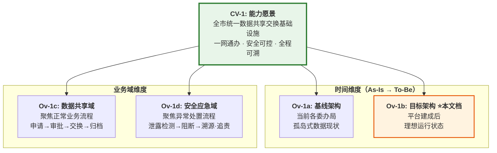
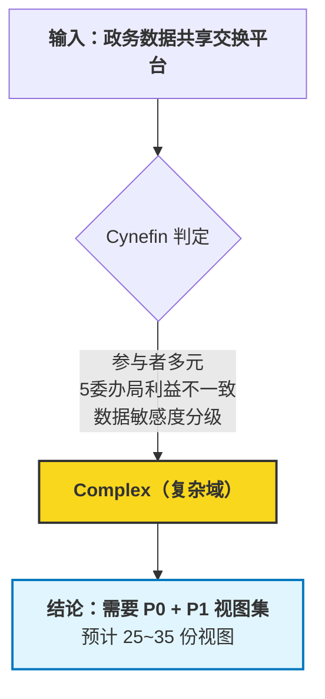
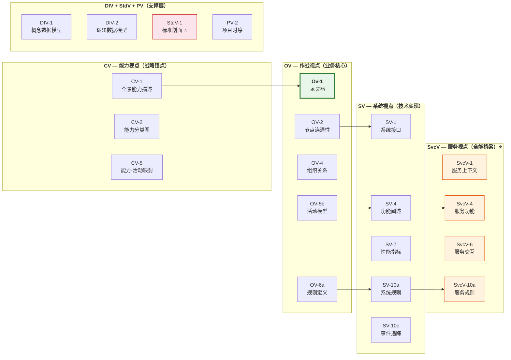
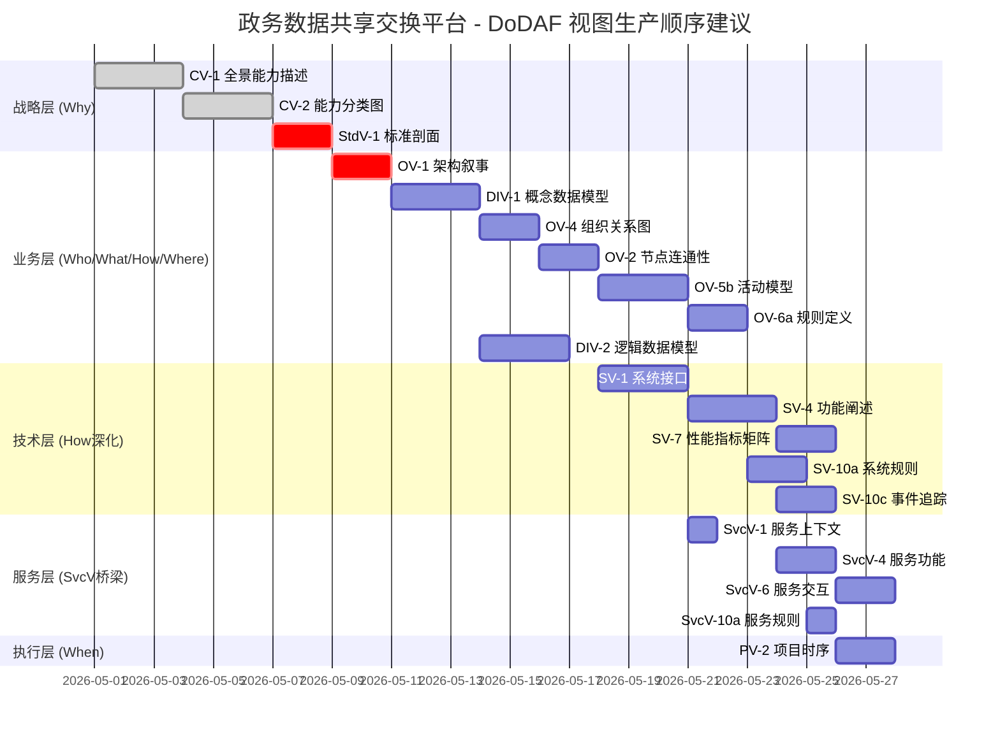

# OV-1：视图选择方法论 —— 架构概念图与叙事

> **场景预设**：某市大数据局拟建「政务数据共享交换平台」，需满足 **GB/T 22239-2019 等保三级** 要求，涉及 **5 个委办局（公安、人社、卫健、医保、市场监管）** 跨部门数据交换。
>
> **本 OV-1 的元任务**：以该项目为载体，展示「如何用 METHOD V2.0 方法论选择正确的 DoDAF 视图集合」。

---

## 一、架构叙事（Architecture Narrative）

### 1.1 背景：为什么需要视图选择？

传统 DoDAF 实施的困境：

```
┌─────────────────────────────────────────────────┐
│  "给我来一套完整的 DoDAF 架构描述"                │
│       ↓                                          │
│  架构师：52 个视图……哪些该画？先画哪个？          │
│       ↓                                          │
│  常见结局：                                       │
│  ① 全量画 → 3个月没画完，领导不看了               │
│  ② 凭感觉画 → 漏掉关键视图，评审被打回            │
│  ③ 照模板填 → 每张图都像，没有决策价值             │
└─────────────────────────────────────────────────┘
```

**核心矛盾**：DoDAF 提供 52 个视图作为"全集"，但每个项目只需要一个**最小充分子集（Minimally Sufficient Subset）**。选择不当，要么过度工程化，要么遗漏关键约束。

### 1.2 目标环境：视图选择方法论的全景

本方法论将视图选择过程结构化为 **五阶段流水线**：

```
┌──────────┐   ┌──────────┐   ┌──────────┐   ┌──────────┐   ┌──────────┐
│ 阶段一    │→  │ 阶段二    │→  │ 阶段三    │→  │ 阶段四    │→  │ 阶段五    │
│ 问题接入  │   │ 复杂度判定│   │ 疑问分解  │   │ 视图路由  │   │ 呈现选择  │
│          │   │          │   │          │   │          │   │          │
│ 听懂人话  │   │ Cynefin  │   │ 6W 问询  │   │ SE算子驱动│   │ 5类技术  │
└──────────┘   └──────────┘   └──────────┘   └──────────┘   └──────────┘
     ↑                                                              │
     └──────────────── 反馈闭环 ←──────────────────────────────────┘
                          （产出不足则回溯调整）
```

### 1.3 核心原则（Tenets）

| # | 原则 | 说明 |
|---|------|------|
| **T1** | **疑问在先，框架在后** | 不为画视图而画视图，而是为了回答具体问题才激活对应视图 |
| **T2** | **最少充分性** | 选择能回答全部 6W 的最小视图集，多一张浪费，少一张不足 |
| **T3** | **算子平权驱动** | 四大 SE 算子无优先级，根据问题特征动态组合 |
| **T4** | **标准即动机** | StdV 不是附录，Why 维度必须以标准合规为逻辑终点 |
| **T5** | **SvcV 全覆盖检验** | 服务化架构下，SvcV 在 6W 中全覆盖是结构必然 |

### 1.4 ⭐ CV-1 → OV-1 的 1:n 关系

> 这是 DoDAF 视图依赖链中最关键的一对关系：**一个战略愿景（CV-1）必然拆解为多个场景化概念图（OV-1）**。

#### 为什么是 1:n？

CV-1 回答的是 **"我们要去哪里"** —— 一个高层、全局、相对稳定的战略目标。但架构描述不能停留在抽象层面，必须落地到具体的业务场景中才能被理解和执行。而一个大型项目通常包含：

```
CV-1（单一愿景）
  │
  ├── 维度 A：时间轴 → 基线 OV-1 / 过渡 OV-1 / 目标 OV-1
  ├── 维度 B：业务域 → 域-A 的 OV-1 / 域-B 的 OV-1 / 域-C 的 OV-1
  └── 维度 C：关注方视角 → 业务侧 OV-1 / 技术侧 OV-1 / 安全侧 OV-1
```

#### 本项目的 CV-1 → OV-1 拆解

以「政务数据共享交换平台」为例，其 **CV-1 能力愿景** 为：

> **"建成全市统一的数据共享交换基础设施，实现跨委办局数据'一网通办、安全可控、全程可溯'"**

这一个 CV-1，在本项目中自然派生出 **4 张 OV-1**：



| OV-1 子视图        | 定位       | 核心叙事焦点                | 与本文档的关系             |
| --------------- | -------- | --------------------- | ------------------- |
| **OV-1a 基线架构**  | As-Is 现状 | "各委办局各自为战、数据孤岛、无统一审计" | 本文档的**出发点**         |
| **OV-1b 目标架构**  | To-Be 愿景 | "统一平台接入、等保三级防护、全链路审计" | **⭐ 本文档本身**         |
| **OV-1c 数据共享域** | 正常业务流    | "合法合规的数据交换如何高效运转"     | 本文档 §2.5 的主路径       |
| **OV-1d 安全应急域** | 异常处置流    | "数据泄露/滥用发生时如何快速响应"    | 本文档 §3.1 的 Gap 信号补充 |

#### 工程实践含义

| 实践要点 | 说明 |
|---------|------|
| **不可跳过 CV-1 直接画 OV-1** | 没有 CV-1 锚定，OV-1 会变成"漂亮的图但没有战略根基"，评审时会被问"这图服务什么目标？" |
| **OV-1 之间必须一致** | 同一个 CV-1 下的多张 OV-1 不能互相矛盾——基线的痛点必须在目标中被解决，共享域的规则不能与应急域的策略冲突 |
| **每张 OV-1 可以有独立的视图子集** | OV-1c（数据共享）可能需要侧重 DIV/OV/SvcV；OV-1d（安全应急）可能需要侧重 SV-10abc/PV-2。**不需要所有 OV-1 共享同一套视图清单** |
| **CV-1 变更时级联影响全部 OV-1** | 这就是为什么 CV-1 必须最先稳定——它变更一次，下面 n 张 OV-1 + 各自路由出的视图集都要重新审视 |

> **📌 设计原则**: CV-1 是"宪法"，OV-1 是各部门的"实施条例"。宪法一条，条例可以多条，但条例之间不得与宪法冲突。

---

## 二、场景实例：政务数据共享交换平台

### 2.1 项目画像

| 属性 | 值 |
|------|-----|
| **项目名称** | 某市政务数据共享交换平台 |
| **业主单位** | 市大数据局 |
| **安全等级** | GB/T 22239-2019 等保三级 |
| **参与方** | 公安、人社、卫健、医保、市场监管（5 委办局） |
| **核心数据** | 人口基础信息、社保记录、医疗就诊、企业登记 |
| **关键技术** | 国密 SM2/SM3/SM4、数据脱敏、区块链存证 |
| **合规要求** | 等保三级 + 数据安全法 + 个人信息保护法 |

### 2.2 阶段一：问题接入（听懂人话）

**用户原始诉求**：

> "我们需要一个平台，让五个委办局之间安全地共享数据。要符合等保三级，数据不能泄露，
> 谁查了什么要有记录，出了问题要能追溯。"

**结构化拆解**（arch-q 四维度分类）：

| 维度 | 分类 | 判定依据 |
|------|------|---------|
| 问题类型 | **因果分析** (Causal) | "谁查了什么要有记录"、"出了问题要能追溯" → 追求 Why+When 链条 |
| 项目类型 | **安全体系** | 等保三级强制要求 |
| 规模 | **中型** | 5 委办局 + 1 平台，边界清晰 |
| 合规 | **等保 + 数安法** | 双重合规约束 |

### 2.3 阶段二：复杂度判定（Cynefin 域）



**判定理由**：
- ❌ 不是 Clear：多方参与、利益不完全一致
- ❌ 不是 Chaotic：有成熟参考案例（其他城市已有类似平台）
- ✅ **Complex**：跨部门协作关系需要显式建模，安全策略需要在运行时动态适配

### 2.4 阶段三：6W 疑问分解

针对本项目，6W 映射到具体的业务问题：

| 疑问 | 业务问题（本项目语境） | 关键词 |
|------|---------------------|--------|
| **WHO** | 谁可以发起数据查询？谁来审批？谁负责审计？ | 委办局操作员、数据管理员、审计员、AI 审核代理 |
| **WHAT** | 共享哪些数据？格式是什么？敏感等级如何划分？ | 人口库、社保库、诊疗库、L2/L3/L4 分级 |
| **WHERE** | 数据存在哪里？交换通道经过哪些网络域？ | 政务外网、涉密网隔离、边界安全设备 |
| **WHEN** | 数据实时性要求？审计日志保留多久？密钥轮换周期？ | T+1 批量 / T+0 实时、日志 ≥ 180 天、密钥 ≥ 90 天 |
| **WHY** | 为什么需要这个平台？（战略目标）受限于什么标准？ | 一网通办 / 数字政府、等保三级、数安法第 24 条 |
| **HOW** | 数据怎么交换？怎么授权？异常怎么处理？ | API 网关、细粒度 RBAC、SOAR 自动阻断 |

### 2.5 阶段四：视图路由（SE 算子驱动）

#### 2.5.1 主视图清单

基于 METHOD §4.3 的 55 条映射矩阵 + 本项目的 Complex 域定位：



#### 2.5.2 视图选择表（含 SE 算子驱动说明）

| 优先级 | 视图 | 回答的 6W | SE 算子驱动 | 本项目必画原因 |
|:------:|------|----------|------------|--------------|
| **P0** | **CV-1** | Why (根) | StdV 对撞 | ⭐⭐ **先于 OV-1**——"数字政府"战略目标，1 个愿景派生 n 个场景 |
| **P0** | **OV-1** (本档) | 全景 What | — | ⭐ **本文档本身**——目标架构概念图（CV-1→OV-1 1:n 中的目标态）
| P1+ | **OV-1a 基线** | As-Is What | — | 当前孤岛现状（可选，用于对比分析） |
| P1+ | **OV-1c 共享域** | 业务域 What | — | 正常数据交换流程的独立场景视图 |
| P1+ | **OV-1d 应急域** | 安全域 What | — | 异常处置流程的独立场景视图 |
| **P0** | **CV-2** | Why | 溯因推理 | 能力树：数据共享 / 安全管控 / 审计溯源 |
| **P0** | **OV-2** | Where | OODA-Orient | 5 委办局 + 平台的节点拓扑 & 网络域边界 |
| **P0** | **OV-4** | Who | Cynefin | 组织角色：数据提供方/消费方/管理方/审计方 |
| **P0** | **OV-5b** | How | 溯因推理 | 核心业务流程："申请→审批→交换→审计" |
| **P0** | **OV-6a** | Why | **StdV 强制对撞** | ⭐ 等保三级 + 数安法的规则形式化 |
| **P0** | **DIV-1** | What | TOC | 核心实体：公民、数据项、权限、审计记录 |
| **P0** | **DIV-2** | What | TOC | 字段级逻辑：哪些字段可共享/需脱敏/禁止 |
| **P0** | **SV-1** | Where | OODA | 系统/安全设备接口及物理部署位置 |
| **P0** | **SV-4** | How | 溯因推理 | 技术功能：API 网关/加解密/审计/告警 |
| **P0** | **SV-7** | What | **TOC 瓶颈识别** | ⭐ 吞吐量/时延/并发数的硬指标 |
| **P0** | **SV-10a** | Why | StdV 对撞 | 技术层规则：国密算法强制、密码协议 |
| **P0** | **SV-10c** | When | OODA-Observe | 关键事件的时序追踪链路 |
| **P0** | **StdV-1** | Why | **法理判决** | ⭐⭐ 强制标准清单（等保/国密/GB/T） |
| **P1** | **SvcV-1** | Who+What | Cynefin | 服务化视角重述系统上下文 |
| **P1** | **SvcV-4** | How | 溯因推理 | 微服务功能拆分（比 SV-4 更细粒度） |
| **P1** | **SvcV-6** | How | OODA | 服务间请求-响应契约 |
| **P1** | **SvcV-10a** | Why | StdV | 服务契约中的超时/重试/熔断约束 |
| **P1** | **PV-2** | When | **TOC 落地** | ⭐ 关键路径：等保测评 → 试运行 → 上线 |
| **P2** | CV-5 | Why-How | 溯因 | 能力到活动的追踪（证明每项活动服务目标） |
| **P2** | OV-3 | What-Where | TOC | 信息交换矩阵（如果 OV-5b 已覆盖详细流可降级） |
| **P2** | SV-10b | When | OODA | 系统状态转移（正常/降级/应急） |

**统计：P0=16, P1=8(+3个OV-1子视图), P2=3 = 共 27 份视图**（其中 OV-1 系列占 4 张，体现 1:n 关系）

### 2.6 阶段五：呈现技术选择

根据 METHOD §七的分类，为本项目选择呈现方式：

| 视图类别 | 推荐呈现技术 | 理由 |
|---------|-------------|------|
| **CV-1, CV-2** | **结构化文字 + 层级树图** | 能力分层适合树形表达 |
| **OV-1** | **架构叙事 + 概念图（本文档）** | 叙事为主，图为辅 |
| **OV-2, OV-4** | **Mermaid 图（graph LR）** | 节点和关系适合矢量图 |
| **OV-5b, OV-6a** | **Mermaid 图（flowchart TD）** | 流程和规则分支 |
| **DIV-1, DIV-2** | **UML 类图 + 表格** | 实体关系用 ER 风格最清晰 |
| **SV-1, SV-4, SV-7** | **表格 + 架构图** | 接口和指标适合表格枚举 |
| **SV-10a, SV-10c** | **Mermaid sequenceDiagram** | 时序交互 |
| **StdV-1** | **结构化表格** | 标准清单天然适合表格 |
| **PV-2** | **Mermaid甘特图（gantt）** | 时间线 |

---

## 三、关键发现与方法论洞察

### 3.1 本项目的三大特征信号

基于 METHOD §九的视点信号指南，本项目触发以下关键信号：

| 信号类型 | 信号内容 | 触发动作 |
|---------|---------|---------|
| 🔴 **Clear 缺失** | 无单一权威数据源定义 | 必须做 DIV-1/2 明确数据主权 |
| 🟡 **Fuzzy 边界** | 5 委办局的责权利有重叠区 | OV-4 必须画出 RACI 矩阵 |
| 🟡 **Gap 溢出** | 等保三级要求 vs 现有系统差距大 | CV-3（能力演化）可能需要从 P2 升级到 P1 |
| 🔴 **Overflow 风险** | 如果试图覆盖所有委办局的所有数据项 | PV 视点必须早期介入控制范围 |

### 3.2 StdV 法理链条在本项目的具象化

```
Why（动机查询）
  │
  ├─→ CV-1: "建设数字政府，实现一网通办"
  │
  ├─→ CV-2: 能力树根节点 → "跨部门数据安全共享"
  │
  ├─→ OV-6a: 业务规则 → "最小够用原则"、"知情同意"
  │
  ├─→ SV-10a: 技术规则 → "SM4 对称加密"、"审计日志不可篡改"
  │
  └─→ ⭐ StdV-1: 法理判决
         ├─ GB/T 22239-2019 （等保三级）
         ├─ GM/T 0024-2014 （SSL VPN 密码技术）
         ├─ GB/T 39477-2020 （信息安全技术 个人信息安全规范）
         └─ GB/T 35273-2020 （个人信息安全规范）
              ↓
        冲突证据链输出 → 设计决策有据可查
```

### 3.3 SvcV 全能桥梁在本项目的验证

| 6W 维度 | SvcV 视图在本项目中承载的信息 |
|---------|---------------------------|
| **Who** | SvcV-1 定义了服务提供方（各委办局数据服务）与消费方（调用方） |
| **What** | SvcV-4 描述每个服务操作的数据输入输出 schema |
| **Where** | SvcV-6 描述服务调用的网络路径（经 API 网关） |
| **When** | SvcV-10a 定义服务的超时/重试/SLA 时序约束 |
| **Why** | SvcV-10a 同时承载等保要求的强制性服务规则 |
| **How** | SvcV-4/SvcV-6 描述服务编排与服务间协作逻辑 |

**验证通过**：SvcV 确实在 6 个维度上都有实质性信息贡献，证实了「全能桥梁」的结构发现。

---

## 四、视图依赖执行顺序



---

## 五、与 METHOD V2.0 方法学的关系

```
┌─────────────────────────────────────────────────────┐
│              METHOD V2.0 方法论报告                   │
│  (理论层: 6W矩阵55条 + SE四算子 + 核心实体 + 发现)    │
└──────────────────┬──────────────────────────────────┘
                   │ 应用于
                   ▼
┌─────────────────────────────────────────────────────┐
│         本 OV-1（实操层：政务数据共享交换平台）         │
│  场景: 某市级平台 / 等保三级 / 5委办局                 │
│  产出: 24份视图(P0=16,P1=5,P2=3) + 执行顺序Gantt     │
└──────────────────┬──────────────────────────────────┘
                   │ 可推广为
                   ▼
┌─────────────────────────────────────────────────────┐
│            CN-AMP 中国架构建模原语（下一步）           │
│  将本 OV-1 的模式抽象为可复用的中国场景模板            │
└─────────────────────────────────────────────────────┘
```

---

*文档版本: V1.0 | 日期: 2026-04-19 | 基于 METHOD V2.0 方法论报告 + DoDAF 2.02 Vol.II*
