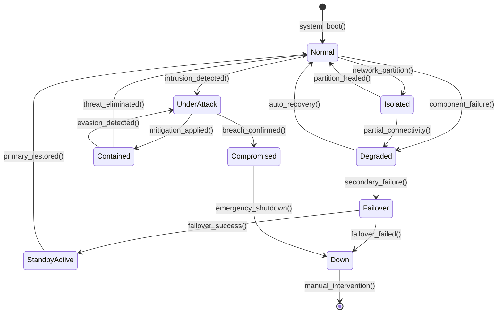

# SV-10b: 系统状态转换描述 (Systems State Transition Description)

> **视图编号**: SV-10b | **视点**: Systems Viewpoint
> **DoDAF v2.02 Vol.II** | **表达等级**: E3 (Behavioral)
> **方法**: 状态图 (State Diagram)
> **对应物**: SvcV-10b (服务状态转移) + OV-6b (作战状态转换) 的系统侧版本

---

## 一、视图概述

### 1.1 定义与目的

```
┌──────────────────────────────────────────────────┐
│        SV-10b: 系统状态转换描述                    │
│      (系统对事件的动态行为响应模型)                 │
├──────────────────────────────────────────────────┤
│                                                  │
│  核心问题: "系统有哪些运行状态？事件触发时如何变化？"│
│                                                  │
│  ┌──────┐  boot()  ┌────────┐  shutdown() ┌──────┐│
│  │ Off  │ ────────→ │ Running│ ─────────→ │ Off  ││
│  └──────┘          └───┬────┘            └──────┘│
│                        │ fault()                 │
│                        ↓                         │
│                   ┌──────────┐                   │
│                   │Degraded  │                   │
│                   └────┬─────┘                   │
│              recover()  │ failover()             │
│                        ↓    ↓                    │
│                   ┌──────┐ ┌────────┐            │
│                   │Running│ │Failover│            │
│                   └──────┘ └────────┘            │
│                                                  │
│  用途:                                            │
│  ├─ 故障切换(Failover)逻辑建模                    │
│  ├─ 高可用(HA)集群状态管理                        │
│  ├─ 启停/重启流程文档化                            │
│  └─ 安全状态机设计                                │
│                                                  │
└──────────────────────────────────────────────────┘
```

**目的**: 描述系统响应事件时的状态变化行为。回答"系统在正常运行、故障、维护等各种条件下如何行为？"

### 1.2 三层状态模型对照

| 维度 | OV-6b (作战) | SV-10b (系统) | SvcV-10b (服务) |
|------|------------|--------------|-----------------|
| **抽象层次** | 组织/流程状态 | **系统组件状态** | 服务实例状态 |
| **状态示例** | 待命→执勤→撤收 | **Running→Degraded→Down** | Idle→Processing→Done |
| **事件类型** | 作战指令 | **硬件/软件信号** | API调用/消息 |
| **典型用途** | 态势感知 | **HA/DR/容错** | 编排器/Saga |
| **安全关切** | 威胁等级变化 | **入侵检测状态** | 会话/令牌生命周期 |

---

## 二、核心内容要素

### 2.1 通用系统状态模板

```
                    ┌─────────────┐
                    │ Initialized │ ← 初始化完成
                    └──────┬──────┘
                           │ start()
                           ↓
                    ┌─────────────┐
              ┌─────→│   Running   │←──────────┐
              │     └──────┬──────┘           │
              │ fault()   │ maintenance()     │ restart()
              │     ↓     ↓                   │
              │ ┌────────┐ ┌──────────┐        │
              │ │Degraded│ │Maintaining│        │
              │ │(降级)  │ │(维护中)   │        │
              │ └───┬────┴────┬─────┘        │
              │     │ repair() │ complete()   │
              │     ↓         │               │
              │  [回Running]  │               │
              │              │ shutdown()     │
              │              ↓                │
              │       ┌──────────┐            │
              └──────→│Stopped   │────────────┘
                     └──────────┘
```

### 2.2 特殊状态模式

#### 2.2.1 降级状态机（高可用系统）



#### 2.2.2 AI 系统四态模型（AI 增强）

| 状态 | 条件 | 行为 | 恢复方式 |
|------|------|------|---------|
| **正常推理态** | 置信度 ≥ 阈值 | 正常输出 | - |
| **低置信度态** | 置信度 < 阈值但非异常 | 标注不确定性 + 建议 | 补充上下文重试 |
| **人工接管态** | 触发安全护栏或置信度过低 | 转交人工审核 | 人工确认后恢复 |
| **安全熔断态** | 检测到注入攻击/越权请求 | 拒绝输出 + 告警 | 安全部确认后解锁 |

---

## 三、呈现方式

### 3.1 UML 状态图 (推荐)

见 2.2 节 Mermaid 示例。

### 3.2 状态转移矩阵 (补充)

| 当前状态 | 事件 | 守卫条件 | 目标状态 | 动作 | 副作用 |
|---------|------|---------|---------|------|-------|
| Running | 组件故障 | 可自动修复 | Degraded | 切离故障组件 | 性能下降 30% |
| Running | 组件故障 | 无法自动修复 | Failover | 启动备实例 | 数据可能丢失 |
| Degraded | 修复成功 | - | Normal | 回切主实例 | - |
| UnderAttack | 缓解措施生效 | - | Contained | 封锁攻击 IP | 合法用户可能误伤 |
| Contained | 威胁消除 | - | Normal | 解封 | - |
| Compromised | - | - | Down | 停止服务 | 数据需取证 |

---

## 四、关联视图

| 上游依赖 | 下游支撑 | 同级互补 |
|---------|---------|---------|
| **SV-10a**(规则)→转移条件定义 | → **SV-10c**(时序)→交互细化 | **SvcV-10b**(服务状态映射) |
| **SV-4**(功能)→状态范围 | → **StdV-1**(标准)→HA标准引用 | **OV-6b**(业务状态溯源) |
| **SV-1**(接口)→组件识别 | | **SV-7**(度量)→状态下的性能表现 |

### 4.1 行为模型链路

```
SV-10a (规则)                    SV-10b (状态)                    SV-10c (时序)
"What constraints?"              "What states?"                  "In what order?"
    │                                 │                               │
    │ 定义[守护条件]                    │ 定义(状态)                     │ 定义(消息序列)
    │ 定义{动作}                       │ 定义→(转移)                    │ 定义--(生命线)
    ↓                                 ↓                               ↓
┌─────────────────────────────────────────────────────────────────────────┐
│                        系统行为语义模型                                    │
│  SV-10a 的规则控制 SV-10b 的状态转移                                      │
│  SV-10b 的状态变化体现在 SV-10c 的生命线激活条上                           │
│  SV-10c 的消息交换遵循 SV-10a 定义的约束条件                               │
└─────────────────────────────────────────────────────────────────────────┘
```

---

## 五、实践指南

### 5.1 适用场景

✅ **强烈推荐**：
- **高可用/容错系统设计**（主备/集群/多活）
- **安全关键系统**（入侵检测→隔离→恢复的状态链）
- **AI/ML 推理系统**（降级/熔断/人工接管状态机）
- **工业控制系统 OT**（PLC 状态：Auto/Manual/Emergency Stop）
- **分布式数据库**（Primary/Replica/Split-Brain）

❌ **可简化**：
- 无状态 Web 服务（只有 Up/Down 两个状态）
- 纯批处理任务（没有持续运行的"状态"概念）

### 5.2 制作要点

1. **状态数量控制在 5~9 个**
2. **异常路径至少覆盖：单点故障/级联故障/网络分区/人为错误/恶意攻击**
3. **每个状态必须有明确的进入条件和退出条件**
4. **区分"瞬态"和"稳态"**——稳态需要持久化
5. **与 SV-10a 规则交叉引用**——守卫条件追溯到具体规则
6. **考虑"不可逆状态"**（如 Compromised → Down 通常不可逆）

---

## 六、中国适配要点

| 中国场景 | SV-10b 重点状态 |
|---------|----------------|
| **等保 2.0 三级系统** | 正常→告警→应急处置→恢复（安全状态机） |
| **密评合规(KMS)** | 密钥: Active → Expired → Revoked → Destroyed → Archived |
| **关基保护** | 正常→监测预警→应急处置→整改→复核（GB/T 39833 流程） |
| **工控安全** | PLC: Auto → Manual → E-Stop → Maintenance（IEC 62443） |
| **电子印章** | 印章: 待审→启用→冻结→注销→归档（《电子签章法》） |

⚠️ **安全架构特殊要求**:

1. **每个状态转移都必须记录审计日志**（不可篡改）
2. **"Compromised/被入侵"状态的退出必须经过人工审批**（不能自动恢复到 Normal）
3. **密钥状态机必须符合 GM/T 标准**——销毁操作不可逆且需多方见证

---

*报告生成: 2026-04-19 | 基于 DoDAF v2.02 Vol.II + MCP 知识库*
