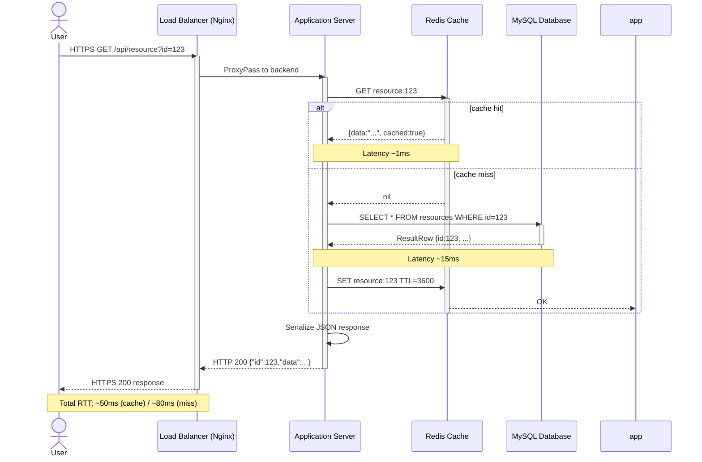

# SV-10c: 系统活动序列描述 (Systems Event-Trace Description)

> **视图编号**: SV-10c | **视点**: Systems Viewpoint
> **DoDAF v2.02 Vol.II** | **表达等级**: E4 (Timeline + Behavioral)
> **方法**: 序列图 (Sequence Diagram)
> **对应物**: SvcV-10c (服务事件追踪) + OV-6c (作战活动序列) 的系统侧版本

---

## 一、视图概述

### 1.1 定义与目的

```
┌──────────────────────────────────────────────────────┐
│        SV-10c: 系统活动序列描述                        │
│      (系统间交互时序 / 场景物理实现细节)                │
├──────────────────────────────────────────────────────┤
│                                                      │
│  核心问题: "各系统之间按什么顺序交互来完成某个场景？"   │
│                                                      │
│  ┌──Client──┐ ┌─LB/Nginx─┐ ┌─AppServer─┐ ┌─Redis─┐  │
│  │         │ │          │ │           │ │       │  │
│  │ HTTP GET│→│ Route    │→│ Handle    │→│Get    │  │
│  │         │ │          │ │ Request   │ │Cache  │  │
│  │         │←│ Response │←│           │←│Hit    │  │
│  │ HTML    │ │ 200 OK   │ │ Render    │ │       │  │
│  │         │ │          │ │ Template  │ │       │  │
│  └─────────┘ └──────────┘ └─────┬─────┘ └───────┘  │
│                                  │                   │
│                           ┌──────┴───────┐           │
│                           │   MySQL DB   │           │
│                           │  Query Data  │           │
│                           └──────────────┘           │
│                                                      │
│  用途:                                              │
│  ├─ 系统接口规格设计                                 │
│  ├─ 排障/调试分析                                    │
│  ├─ 性能瓶颈定位                                     │
│  └─ 安全渗透测试路径建模                              │
│                                                      │
└──────────────────────────────────────────────────────┘
```

**目的**: 描述系统在执行特定场景时的交互时序，识别作战视角(OV-6c)中描述的关键事件的**系统特定细化**。回答"为实现这个业务流程，各系统组件之间如何交互？"

### 1.2 三层时序模型深度对照

| 维度 | OV-6c (作战层) | SvcV-10c (服务层) | SV-10c (系统层) |
|------|---------------|-------------------|----------------|
| **参与者** | 角色/岗位 | **服务端口** | **系统/进程/设备** |
| **消息** | 信息/文件 | **API调用/事件** | **数据包/RPC/信号** |
| **协议** | (未指定) | **HTTP/gRPC/MQ** | **TCP/IP/DLL/驱动** |
| **抽象度** | 业务流程 | **逻辑接口** | **物理实现** |
| **用途** | SOP/培训 | **API契约** | **排障/调优** |

### 1.3 追溯链条

```
OV-6c: "用户提交申请 → 主管审批 → 执行"
    ↓ 细化为服务调用
SvcV-10c: "前端 → API网关 → 申请服务 → 审批服务"
    ↓ 进一步细化为系统交互
SV-10c: "浏览器 → Nginx → Java App → MySQL → Redis"
    ↓ 最底层实现
实际: TCP握手 → HTTP请求 → JDBC查询 → TCP响应...
```

---

## 二、核心内容要素

### 2.1 序列图元素（系统级特有）

| 元素 | 说明 | 系统级示例 |
|------|------|-----------|
| **参与者** | 硬件/软件实体 | Load Balancer, App Server, DB, Cache, MQ |
| **同步消息 (→)** | 阻塞式调用 | REST API, gRPC, JDBC, Redis GET |
| **异步消息 (-->)** | 非阻塞通信 | Kafka publish, RabbitMQ send, Event emit |
| **返回消息 (←)** | 响应/回调 | HTTP 200, gRPC status, DB result set |
| **自身消息 (→)** | 内部调用 | 内部函数、本地缓存检查 |
| **超时/丢失** | 异常情况 | Connection timeout, Packet loss |

### 2.2 系统级消息分类

```
┌────────────────────────────────────────────────┐
│              SV-10c 消息类型                    │
├──────────────┬───────────────┬────────────────┤
│  同步请求/响应  │  异步消息       │  基础设施信号    │
│  ·HTTP/HTTPS  │  ·Kafka/RocketMQ│  ·TCP SYN/ACK │
│  ·gRPC        │  ·RabbitMQ     │  ·DNS 查询     │
│  ·JDBC/ODBC   │  ·Redis PubSub │  ·健康检查      │
│  ·Redis GET   │  ·EventBridge  │  ·心跳/KeepAlive│
│  ·内部IPC     │  ·回调通知      │  ·信号(Signal)  │
└──────────────┴───────────────┴────────────────┘
```

---

## 三、呈现方式

### 3.1 UML 序列图 (核心)



### 3.2 安全场景序列图（安全架构专用）

```mermaid
sequenceDiagram
    actor Client
    participant GW as API Gateway
    participant WAF as WAF Engine
    participant Auth as Auth Service(IDaaS)
    participant KMS as Key Management Service
    participant Biz as Business Service
    
    Client->>GW: POST /api/sensitive-data
    activate GW
    
    GW->>WAF: Inspect request payload
    activate WAF
    alt SQL Injection detected
        WAF-->>GW: BLOCK (403)
        GW-->>Client: 403 Forbidden
        deactivate all
    else XSS detected
        WAF-->>GW: Sanitize payload
    else Clean request
        WAF-->>GW: PASS
    end
    deactivate WAF
    
    GW->>Auth: Validate JWT signature
    activate Auth
    Auth->>KMS: Verify with public key
    activate KMS
    KMS-->>Auth: Signature valid
    deactivate KMS
    Auth-->>GW: {userId:"u456", roles:["admin"]}
    deactivate Auth
    
    GW->>Biz: Forward authenticated request
    activate Biz
    Biz->>KMS: DECRYPT field using DEK
    activate KMS
    KMS-->>Biz: plaintext_data
    deactivate KMS
    Biz->>Biz: Process business logic
    Biz->>KMS: ENCRYPT response
    KMS-->>Biz: ciphertext
    deactivate KMS
    Biz-->>GW: Encrypted response
    deactivate Biz
    
    GW-->>Client: 200 OK (encrypted payload)
    deactivate GW
```

---

## 四、关联视图

| 上游依赖 | 下游支撑 | 同级互补 |
|---------|---------|---------|
| **OV-6c**(作战时序)→业务源头 | → **SV-1**(接口)→协议细节 | **SvcV-10c**(服务层对应) |
| **SV-5a/b**(追溯)→活动↔系统映射 | → **SV-6**(资源流)→物理数据属性 | **OV-6c**(业务溯源) |
| **SV-10a**(规则)→约束条件 | → **StdV-1**(标准)→协议规范 | |

### 4.1 完整追溯链路

```
OV-5b: 作战活动模型              OV-6c: 作战时序              SV-10c: 系统时序
"业务分解"                      "业务顺序"                  "系统交互"
    │                               │                           │
    │ 关键活动提取                   │ 关键事件提取               │ 系统分配
    ↓                               ↓                           ↓
CV-6: 能力↔活动               SV-5a: 活动↔系统函数          SV-1: 系统接口定义
                                                            │
SV-6: 系统资源流 ◄──────────────────────────────────────────┘
 (提供物理数据属性)
```

---

## 五、实践指南

### 5.1 适用场景

✅ **强烈推荐**：
- **分布式系统**——微服务/多系统集成的调用链复杂
- **系统集成测试**——作为测试用例的设计输入
- **性能分析**——识别串行瓶颈和并行机会
- **安全渗透测试**——模拟攻击路径的数据流
- **排障手册**——常见问题的交互时序参考

❌ **可简化**：
- 单体应用（内部函数调用无需此层级）
- 静态网站（无后端交互）

### 5.2 制作要点

1. **每个关键场景一张图**——不要画"万能序列图"
2. **正常路径 + 至少 2~3 条异常路径**（超时/拒绝/竞态）
3. **标注消息的大致耗时**——用于性能分析
4. **明确同步/异步语义**——实心箭头 vs 虚线箭头
5. **与 SV-6 数据流交叉验证**——序列图的每条消息应有对应的 SV-6 数据元组
6. **安全场景单独成图**——认证/加密/审计的完整时序链

---

## 六、中国适配要点

| 中国场景 | SV-10c 应用重点 |
|---------|----------------|
| **等保 2.0 三级通信网络安全** | 身份认证→加密通道→访问控制→审计记录的完整时序 |
| **密评合规** | 调用国密密码服务(SM2签名/SM4加密/SM3哈希)的标准调用序列 |
| **政务数据共享** | 跨部门系统间数据交换的鉴权→加密→传输→验签→解密全过程 |
| **金融支付清算** | 发起行→网联/银联→收款行的四方交互时序（资金流+信息流对齐） |
| **工控 OT/IT 融合** | SCADA ↔ Historian ↔ MES ↔ ERP 的南北向+东西向数据流 |

⚠️ **安全架构特殊要求**:

1. **TLS/SSL 握手过程必须显式建模**——包括证书验证链
2. **每次涉及敏感数据的调用必须标注安全措施**（字段级加密、脱敏）
3. **审计日志写入点必须显式标注**——哪些系统交互产生了不可篡改日志
4. **异常路径的安全处置**——超时时不能泄露内部信息；失败时不暴露堆栈

---

## 七、OV-6c / SvcV-10c / SV-10c 时序三件套总结

| | OV-6c (作战) | SvcV-10c (服务) | SV-10c (系统) |
|---|-------------|-----------------|---------------|
| **参与者** | 角色/组织单元 | 服务/接口 | **进程/设备/数据库** |
| **消息** | 信息/文档 | **API 调用/事件** | **TCP/数据包/RPC** |
| **协议** | 未指定 | **HTTP/gRPC/MQ** | **底层传输/驱动** |
| **粒度** | 业务级 | **逻辑接口级** | **物理实现级** |
| **受众** | 业务分析师 | **开发者/架构师** | **SRE/DBA/运维** |
| **安全价值** | 业务流程合规 | **接口安全设计** | **漏洞利用路径分析** |

**三者构成从"业务流程"到"代码实现"的完整追溯链。**

---

*报告生成: 2026-04-19 | 基于 DoDAF v2.02 Vol.II + MCP 知识库*
