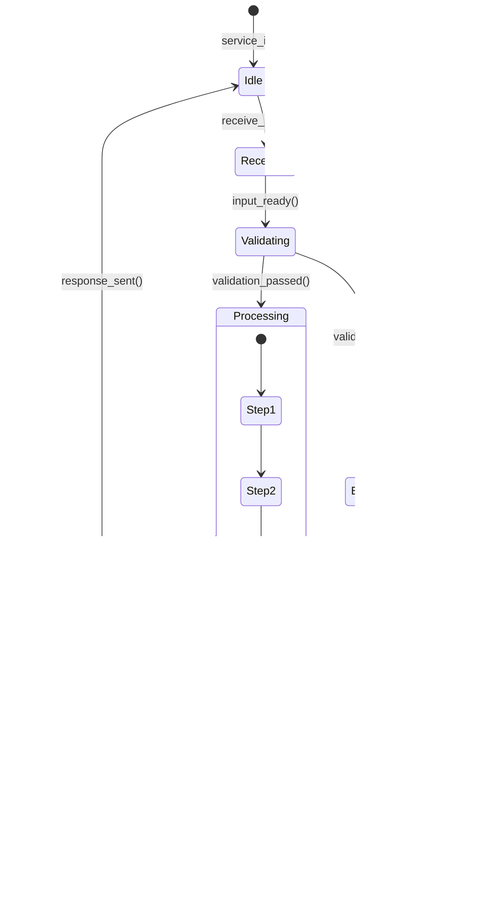

# SvcV-10b: 服务状态转移描述 (Services State Transition Description)

> **视图编号**: SvcV-10b | **视点**: Services Viewpoint
> **DoDAF v2.02 Vol.II** | **表达等级**: E3 (Behavioral)
> **方法**: 状态机图 (State Machine Diagram)
> **对应物**: SV-10b + OV-6b 的服务侧版本

---

## 一、视图概述

### 1.1 定义与目的

```
┌──────────────────────────────────────────────────┐
│        SvcV-10b: 服务状态转移描述                  │
│      (服务对事件的动态行为响应模型)                 │
├──────────────────────────────────────────────────┤
│                                                  │
│  核心问题: "服务在事件触发下如何改变状态？"          │
│                                                  │
│  ┌─────┐  start()  ┌──────┐  complete() ┌─────┐ │
│  │Idle │ ────────→ │Active│ ─────────→ │ Done │ │
│  └──┬──┘           └──┬───┘            └─────┘ │
│     │ error()         │ error()                  │
│     ↓                 ↓                          │
│  ┌─────┐           ┌──────┐                     │
│  │Error│           │Failed│                     │
│  └─────┘           └──────┘                     │
│                                                  │
│  用途:                                            │
│  ├─ 服务故障恢复逻辑建模                          │
│  ├─ 服务编排的状态管理                            │
│  ├─ 事务一致性保证设计                            │
│  └─ 异常处理流程文档化                            │
│                                                  │
└──────────────────────────────────────────────────┘
```

**目的**: 识别服务对事件的响应，描述服务在事件触发下的状态变化行为。回答"服务有哪些状态？在什么条件下从一个状态转移到另一个？"

### 1.2 三层状态模型对照

| 维度 | OV-6b (作战) | SV-10b (系统) | SvcV-10b (服务) |
|------|------------|--------------|-----------------|
| **抽象层次** | 业务流程状态 | 系统组件状态 | **服务实例状态** |
| **状态示例** | 待审核→已批准 | 运行中→停机 | **Idle→Processing→Completed** |
| **事件来源** | 业务触发 | 硬件/软件事件 | **API调用/消息/超时** |
| **典型用途** | 业务规则引擎 | 故障切换(Failover) | **编排器状态机/ Saga** |
| **UML 图形** | 状态图 | 状态图 | **状态图 + 编排逻辑** |

### 1.3 在行为模型家族中的位置

```
OV-6a / SV-10a / SvcV-10a     ← 规则 (What must be true)
    │
OV-6b / SV-10b / SvcV-10b     ← 状态 (What states exist) ⭐ 本视图
    │
OV-6c / SV-10c / SvcV-10c     ← 时序 (In what order things happen)
```

---

## 二、核心内容要素

### 2.1 状态模型基本元素

| 元素 | 符号 | 说明 |
|------|------|------|
| **状态 (State)** | 圆角矩形 | 服务在某个时刻的条件/模式 |
| **初始状态** | 实心黑圆 | 服务启动时的入口状态 |
| **终止状态** | 圆环 | 服务结束的目标状态 |
| **转移 (Transition)** | 箭头 | 状态之间的变化方向 |
| **事件/触发器 (Event)** | 箭头上的标签 | 引起状态变化的刺激 |
| **守护条件 (Guard)** | [方括号] | 转移发生的布尔条件 |
| **动作 (Action)** | {花括号} | 转移时执行的原子操作 |

### 2.2 服务状态通用模板

```
                    ┌─────────────┐
                    │  Initialized│ ← 初始
                    └──────┬──────┘
                           │ start()
                           ↓
                    ┌─────────────┐
              ┌────→│   Active    │←────────┐
              │     └──────┬──────┘         │
              │ pause()   │ process()      │ resume()
              │     ↓     ↓                │
              │ ┌────────┐ ┌────────┐      │
              │ │Paused  │ │Busy    │      │
              │ └────────┘ └───┬────┘      │
              │                │ done/error │
              │                ↓            │
              │         ┌────────────┐      │
              │         │ Completed/  │      │
              └─────────│  Failed     │──────┘
                    └─────┴───────┘
                           │ destroy()
                           ↓
                    ┌─────────────┐
                    │ Terminated  │ ← 终止
                    └─────────────┘
```

### 2.3 特殊状态模式

| 模式 | 应用场景 | 说明 |
|------|---------|------|
| **Saga 模式** | 分布式事务 | Compensating Transaction（补偿事务）状态链 |
| **Circuit Breaker** | 微服务容错 | Closed → Open → Half-Open → Closed |
| **幂等性状态** | 重试机制 | Processing → DedupCheck → Committed |
| **租约/过期** | 无状态服务 | Leased → Active → Expired → Released |

---

## 三、呈现方式

### 3.1 UML 状态机图 (推荐)



### 3.2 状态转移矩阵 (补充)

| 当前状态 | 事件 | 条件 | 目标状态 | 动作 |
|---------|------|------|---------|------|
| Idle | 收到请求 | - | Receiving | 创建上下文 |
| Receiving | 输入就绪 | - | Validating | 校验请求 |
| Validating | 校验通过 | - | Processing | 开始业务逻辑 |
| Validating | 校验失败 | 可恢复 | ErrorHandling | 记录错误 |
| Processing | 逻辑完成 | - | Persisting | 持久化结果 |
| Processing | 超时 | 重试次数<3 | Retry | 重试 |
| Processing | 超时 | 重试次数≥3 | Failed | 标记失败 |

---

## 四、关联视图

| 上游依赖 | 下游支撑 | 同级互补 |
|---------|---------|---------|
| **SvcV-10a**(规则)→转移条件来源 | → **SvcV-10c**(时序)→细化交互序列 | **SV-10b**(系统状态对应) |
| **SvcV-4**(功能)→状态范围界定 | → **StdV-1**(标准)→状态命名约定 | **OV-6b**(业务状态溯源) |
| **SvcV-2**(资源流)→事件触发源 | | |

### 4.1 行为模型完整链路

```
SvcV-10a (规则)                    SvcV-10b (状态)                    SvcV-10c (时序)
"What constraints?"              "What states?"                    "In what order?"
    │                                 │                                 │
    │ 定义守卫条件[ ]                  │ 定义状态节点()                   │ 定义消息顺序→
    │ 定义动作{ }                      │ 定义转移箭头→                    │ 定义生命线--
    ↓                                 ↓                                 ↓
┌─────────────────────────────────────────────────────────────────────────────┐
│                        服务行为完整语义模型                                   │
│  规则约束状态转移 → 状态转移体现在时序交互 → 时序交互遵循业务规则              │
└─────────────────────────────────────────────────────────────────────────────┘
```

---

## 五、实践指南

### 5.1 适用场景

✅ **强烈推荐**：
- **服务编排/Orchestrator 设计**（如 Camunda、Temporal）
- **分布式事务/Saga 模式实现**
- **高可用服务**（故障检测→切换→恢复的全状态链）
- **有状态服务**（会话管理、工作流引擎）
- **安全关键服务**（认证/授权状态机的正确性验证）

❌ **可简化**：
- 无状态 CRUD 服务（只有一个 Active 状态）
- 纯函数式服务（无副作用）

### 5.2 制作要点

1. **状态数控制在 5~9 个**（符合认知负荷理论）
2. **每个状态必须有明确的进入/退出条件**
3. **考虑异常路径不少于正常路径**（安全架构尤其重要）
4. **区分"瞬时状态"和"持久状态"**（持久状态需要落库）
5. **与 SvcV-10a 规则交叉引用**——守卫条件应能追溯到具体规则

---

## 六、中国适配要点

| 中国场景 | SvcV-10b 应用 |
|---------|--------------|
| **电子印章/签章服务** | 印章状态：待审→启用→挂吊销→注销（审计追踪） |
| **统一身份认证** | 令牌状态：有效→即将过期→已刷新→已撤销→黑名单 |
| **支付/结算服务** | 交易状态：待付→处理中→已结算→退款中→已退款 |
| **密钥管理系统(KMS)** | 密钥状态：预激活→Active→禁用→销毁→归档(密评要求) |

⚠️ **安全架构特殊要求**: 
- **密评合规**: 密钥生命周期状态机必须覆盖 GB/T 39786 全部状态
- **等保 2.0**: 认证会话的超时/锁定状态转移必须明确建模
- **审计需求**: 每次状态转移都必须记录不可篡改的审计日志

---

*报告生成: 2026-04-19 | 基于 DoDAF v2.02 Vol.II + MCP 知识库*
