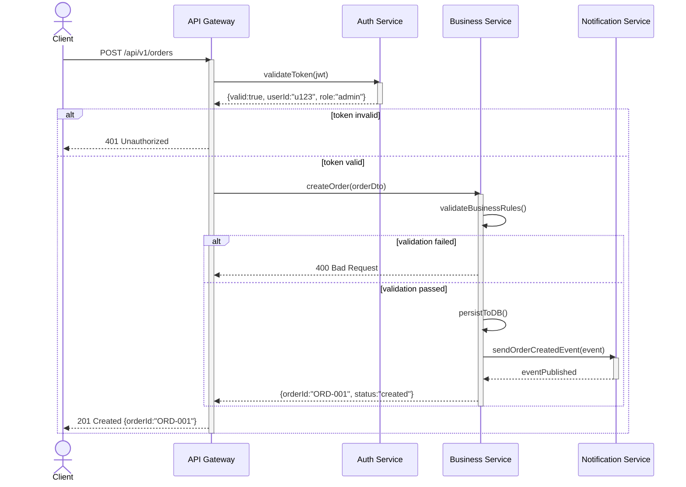

# SvcV-10c: 服务事件追踪描述 (Services Event-Trace Description)

> **视图编号**: SvcV-10c | **视点**: Services Viewpoint
> **DoDAF v2.02 Vol.II** | **表达等级**: E4 (Timeline + Behavioral)
> **方法**: 序列图 (Sequence Diagram)
> **对应物**: SV-10c + OV-6c 的服务侧版本

---

## 一、视图概述

### 1.1 定义与目的

```
┌──────────────────────────────────────────────────────┐
│        SvcV-10c: 服务事件追踪描述                      │
│      (服务间交互时序 / 关键场景细化)                    │
├──────────────────────────────────────────────────────┤
│                                                      │
│  核心问题: "服务之间按什么顺序交换消息来完成某个场景？"  │
│                                                      │
│  ┌──Client──┐   ┌─Gateway─┐   ┌─AuthSvc─┐  ┌─BizSvc─┐│
│  │         │   │         │   │         │  │        ││
│  │ Request │──→│ Route   │──→│ Validate│  │        ││
│  │         │   │         │   │         │  │        ││
│  │         │←──│ TokenOK │←──│         │  │        ││
│  │         │   │         │   │         │  │        ││
│  │         │──→│ Forward │───────────→│ Process ││
│  │         │   │         │   │         │  │        ││
│  │ Response│←──│ Result  │←───────────│        ││
│  │         │   │         │   │         │  │        ││
│  └─────────┘   └─────────┘   └─────────┘  └────────┘│
│                                                      │
│  用途:                                              │
│  ├─ 服务接口契约设计                                 │
│  ├─ API 调用时序分析                                 │
│  ├─ 性能瓶颈定位                                     │
│  └─ 异常场景推演                                     │
│                                                      │
└──────────────────────────────────────────────────────┘
```

**目的**: 识别作战视角(OV-6c)中描述的关键事件序列的**服务特定细化**。回答"为实现这个业务流程，各服务之间按什么顺序交互？"

### 1.2 三层时序模型对照

| 维度 | OV-6c (作战) | SV-10c (系统) | SvcV-10c (服务) |
|------|------------|--------------|-----------------|
| **参与者** | 角色/岗位 | 系统/子系统 | **服务实例/端口** |
| **消息类型** | 信息/资源 | 数据/信号 | **API 请求/响应/事件** |
| **抽象层级** | 业务流程 | 系统交互 | **接口级调用链** |
| **关注点** | 谁做什么 | 系统怎么连 | **服务怎么调** |
| **典型用途** | SOP 文档 | 接口规格 | **API 契约/调试** |

### 1.3 与 OV-6c 的追溯关系

```
OV-6c: 作战活动序列图 ("业务层面")
    │
    │ "用户提交申请 → 主管审批 → 执行部门办理"
    │
    ↓ 细化为服务调用
    │
SvcV-10c: 服务事件追踪图 ("实现层面")
    │
    │ "前端 → API网关 → 认证服务 → 申请服务 → 通知服务"
    │
    ↓ 每个调用进一步细化
    │
SV-10c: 系统活动序列图 ("物理层面")
    │
    │ "HTTP请求 → Nginx → Java进程A → DB存储 → MQ推送"
```

---

## 二、核心内容要素

### 2.1 序列图基本元素

| 元素 | UML 符号 | 说明 |
|------|---------|------|
| **参与者 (Participant)** | 顶部矩形框 | 服务/服务端口/外部角色 |
| **生命线 (Lifeline)** | 虚纵线 | 参与者的时间存在 |
| **执行条 (Activation Bar)** | 生命线上的细长矩形 | 服务正在处理 |
| **消息 (Message)** | 水平箭头 | 同步调用/异步消息/返回 |
| **组合片段 (Combined Fragment)** | 框 + opt/alt/loop/par | 条件/选择/循环/并行 |
| **门 (Gate)** | 边界点 | 输入/输出接口锚点 |

### 2.2 消息类型分类

```
┌────────────────────────────────────────────┐
│              消息类型                        │
├──────────────────┬─────────────────────────┤
│ 同步消息 (→)      │ 异步消息 (-->)           │
│ ·REST API 调用    │ ·消息队列(MQ/Kafka)     │
│ ·gRPC 调用       │ ·事件总线(EventBus)      │
│ ·等待返回         │ ·发布/订阅(Pub/Sub)     │
├──────────────────┼─────────────────────────┤
│ 返回消息 (←)      │ 自身消息 (→自身)         │
│ ·API 响应         │ ·内部状态变更           │
│ ·错误/异常        │ ·回调(CallBack)         │
└──────────────────┴─────────────────────────┘
```

### 2.3 组合片段常用模式

| 片段类型 | 含义 | 典型用途 |
|---------|------|---------|
| **alt** | if-else 条件分支 | 成功/失败的两种处理路径 |
| **opt** | 可选执行 | 缓存命中/未命中的不同处理 |
| **loop** | 循环 | 批量处理多个项目 |
| **par** | 并行 | 同时调用多个无关服务 |
| **break** | 中断循环 | 发现错误时提前退出 |
| **neg** | 否定(不应该发生) | 异常/攻击场景 |

---

## 三、呈现方式

### 3.1 UML 序列图 (核心)



### 3.2 场景覆盖矩阵 (辅助)

| 场景 | 正常路径 | 异常路径 | 超时处理 | 并发冲突 |
|------|---------|---------|---------|---------|
| 下单创建 | ✅ 有图 | 参数非法/库存不足 | DB超时 | 重复下单 |
| 支付确认 | ✅ 有图 | 余额不足/渠道异常 | 第三方超时 | 重复扣款 |
| 取消订单 | ✅ 有图 | 已发货无法取消 | 状态同步延迟 | 并发取消+支付 |

---

## 四、关联视图

| 上游依赖 | 下游支撑 | 同级互补 |
|---------|---------|---------|
| **OV-6c**(作战时序)→业务源头 | → **SvcV-2**(资源流)→协议细节 | **SV-10c**(系统时序对应) |
| **SvcV-3b**(服务协作)→参与服务列表 | → **SvcV-10b**(状态)→状态变化标注 | **OV-6c**(业务溯源) |
| **SvcV-10a**(规则)→约束条件 | → **StdV-1**(标准)→协议规范 | |

### 4.1 完整追溯链

```
OV-5b: 作战活动模型              OV-6c: 作战时序              SvcV-10c: 服务时序
"做什么活动"                     "按什么顺序"                "服务怎么调"
    │                               │                           │
    │ 活动分解                      │ 关键路径提取               │ 服务分配
    ↓                               ↓                           ↓
CV-6: 能力↔活动映射              SV-5a: 活动↔系统函数         SvcV-5: 活动↔服务
                                                       (追溯桥梁)
                                                            │
SvcV-2: 服务资源流描述 ◄──────────────────────────────────┘
  (提供协议/端口细节)
```

---

## 五、实践指南

### 5.1 适用场景

✅ **强烈推荐**：
- **微服务架构**——服务间调用链复杂，必须用序列图梳理
- **API 设计评审**——前后端/上下游对齐接口约定
- **异步消息系统**——MQ/EventBridge 的事件流转难以口头说清
- **排障/调试**——复现问题时需要精确的调用时序
- **安全渗透测试**——模拟攻击场景的消息注入路径

❌ **可简化**：
- 单体应用（内部函数调用无需此视图）
- 纯 CRUD API（一个请求一个响应）

### 5.2 制作要点

1. **每个关键业务场景至少一张序列图**——不要试图画"万能图"
2. **正常路径 + 至少 2~3 条异常路径**——异常比正常更重要（安全架构铁律）
3. **标注消息的数据摘要**（不只是方法名，还要标注关键字段）
4. **明确同步/异步**——实心箭头=同步等待，虚线箭头=异步非阻塞
5. **超时和重试策略必须在图中体现**——这是生产环境最常见的问题
6. **与 SvcV-2 协议栈对照**——序列图的每条消息应在 SvcV-2 中找到对应的端口和协议

---

## 六、中国适配要点

| 中国场景 | SvcV-10c 应用重点 |
|---------|-------------------|
| **政务一网通办** | 多部门服务间的跨系统调用链（公安↔民政↔医保↔税务） |
| **金融支付清算** | 银联/网联/银行的四方对账时序（资金流和信息流的对齐） |
| **等保 2.0 安全通信** | 加密通道建立→身份认证→业务数据传输→审计日志写入的完整序列 |
| **密评合规** | 调用密码服务(加解密/签名/验证)的标准时序（GM/T 标准） |

⚠️ **安全架构特殊要求**:
- **每次涉及敏感数据的调用必须标注安全措施**（TLS、字段级加密、脱敏）
- **审计点必须显式标注**——哪些调用产生了不可篡改的日志
- **失败路径的安全处置**——异常时不能泄露敏感信息（如错误消息中的堆栈信息）

---

## 七、SvcV-10abc 行为三件套总结

| | SvcV-10a (规则) | SvcV-10b (状态) | SvcV-10c (时序) |
|---|----------------|----------------|-----------------|
| **问题** | What must be true? | What states exist? | In what order? |
| **方法** | 自然语言/形式化 | **状态机图** | **序列图** |
| **焦点** | 约束/断言/导出 | 状态/事件/转移 | 参与者/消息/顺序 |
| **安全价值** | 访问控制策略 | 会话/令牌生命周期 | 攻击路径分析 |
| **三者关系** | 10a 定义 10b 的守卫条件 | 10b 的状态变化体现在 10c 的生命线上 | 10c 的消息受 10a 的规则约束 |

---

*报告生成: 2026-04-19 | 基于 DoDAF v2.02 Vol.II + MCP 知识库*
